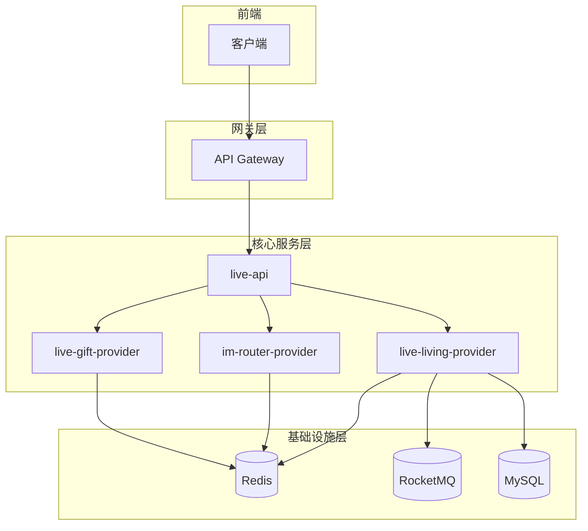
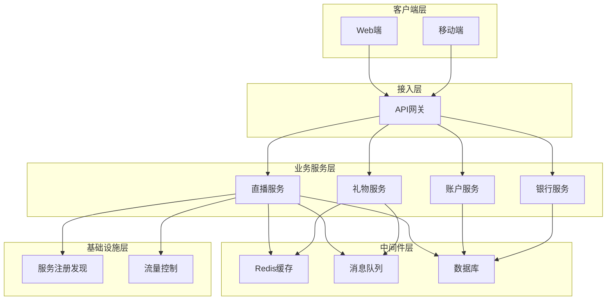
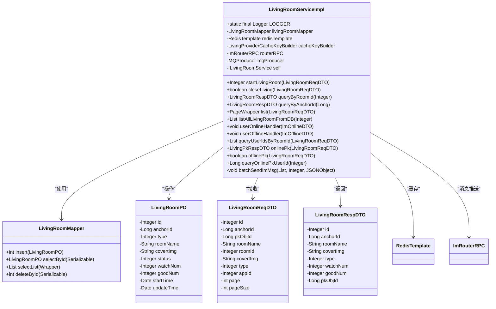
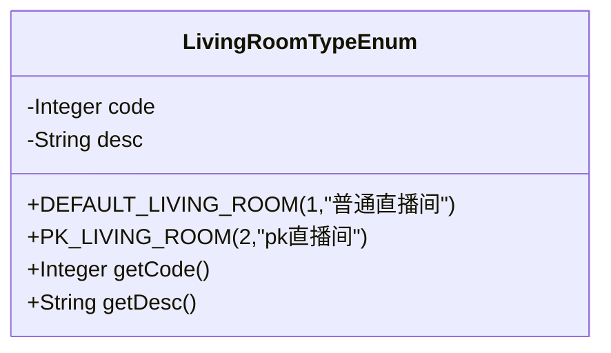
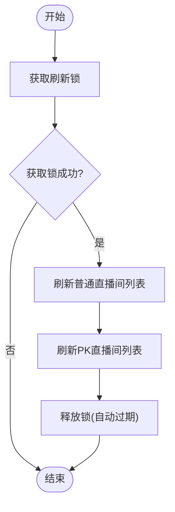
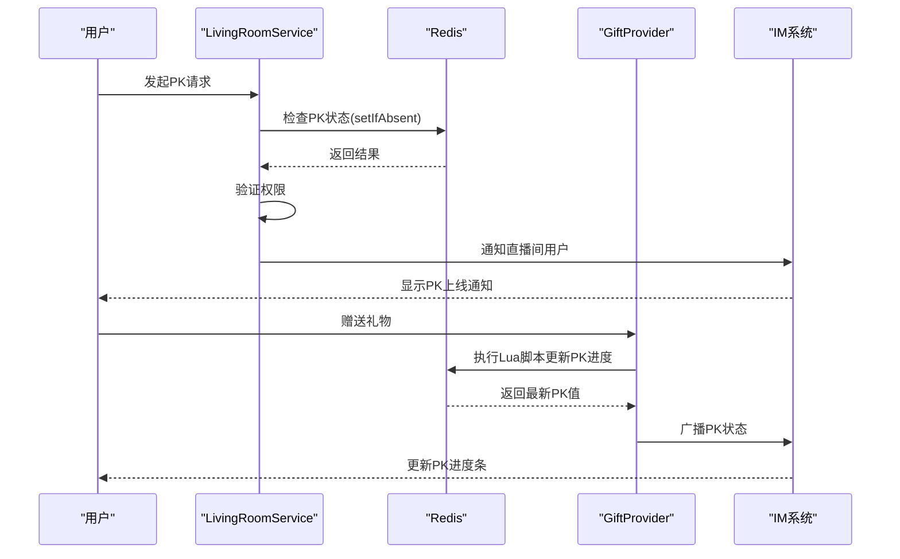
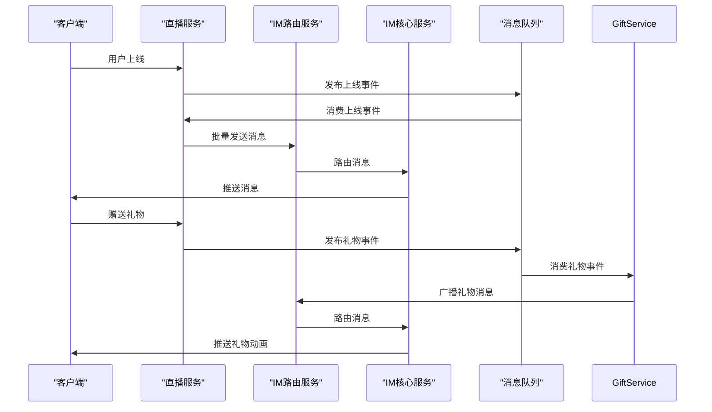
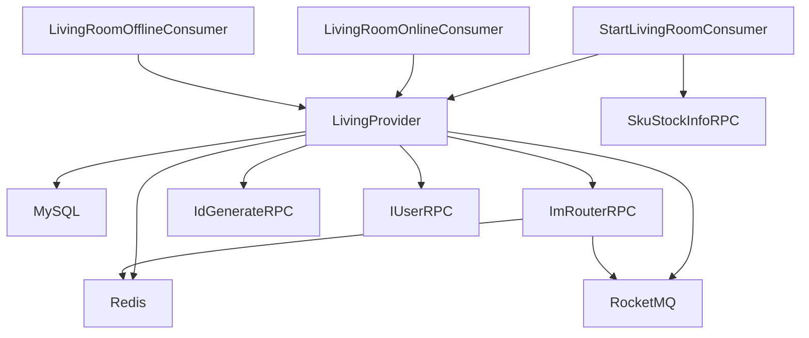
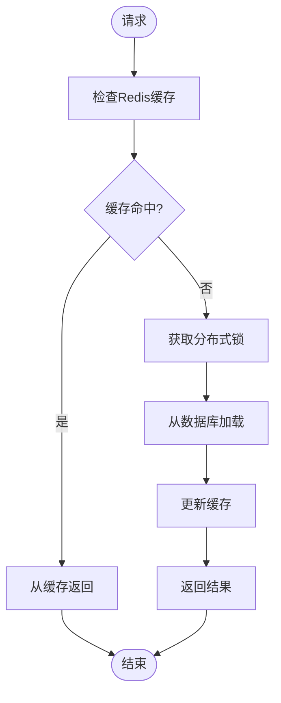

# 直播系统

<cite>
**本文档引用的文件**
- [LivingRoomServiceImpl.java](file://live-living-provider\src\main\java\com\logilong\live\living\provider\service\impl\LivingRoomServiceImpl.java)
- [LivingRoomTypeEnum.java](file://live-living-interface\src\main\java\com\logilong\live\living\interfaces\constants\LivingRoomTypeEnum.java)
- [RefreshLivingRoomListJob.java](file://live-living-provider\src\main\java\com\logilong\live\living\provider\config\RefreshLivingRoomListJob.java)
- [StartLivingRoomConsumer.java](file://live-living-provider\src\main\java\com\logilong\live\living\provider\consumer\StartLivingRoomConsumer.java)
- [LivingRoomOnlineConsumer.java](file://live-living-provider\src\main\java\com\logilong\live\living\provider\consumer\LivingRoomOnlineConsumer.java)
- [LivingRoomOfflineConsumer.java](file://live-living-provider\src\main\java\com\logilong\live\living\provider\consumer\LivingRoomOfflineConsumer.java)
- [LivingRoomMapper.java](file://live-living-provider\src\main\java\com\logilong\live\living\provider\dao\mapper\LivingRoomMapper.java)
- [LivingRoomPO.java](file://live-living-provider\src\main\java\com\logilong\live\living\provider\dao\po\LivingRoomPO.java)
- [LivingRoomReqDTO.java](file://live-living-interface\src\main\java\com\logilong\live\living\interfaces\dto\LivingRoomReqDTO.java)
- [LivingRoomRespDTO.java](file://live-living-interface\src\main\java\com\logilong\live\living\interfaces\dto\LivingRoomRespDTO.java)
- [LivingRoomController.java](file://live-api\src\main\java\com\logilong\live\api\controller\LivingRoomController.java)
- [LivingRoomServiceImpl.java](file://live-api\src\main\java\com\logilong\live\api\service\impl\LivingRoomServiceImpl.java)
- [ImRouterRPC.java](file://live-im-router-interface\src\main\java\com\logilong\live\im\router\interfaces\ImRouterRPC.java)
- [ImCoreServerProviderTopicNames.java](file://live-common-interface\src\main\java\com\logilong\live\common\interfaces\topic\ImCoreServerProviderTopicNames.java)
- [LivingProviderCacheKeyBuilder.java](file://live-framework\live-framework-redis-starter\src\main\java\com\logilong\live\framework\redis\starter\key\LivingProviderCacheKeyBuilder.java)
- [getPkNumAndSeqId.lua](file://live-gift-provider\src\main\resources\getPkNumAndSeqId.lua)
</cite>

## 目录
1. [简介](#简介)
2. [项目结构](#项目结构)
3. [核心组件](#核心组件)
4. [架构概述](#架构概述)
5. [详细组件分析](#详细组件分析)
6. [依赖分析](#依赖分析)
7. [性能考虑](#性能考虑)
8. [故障排除指南](#故障排除指南)
9. [结论](#结论)

## 简介
本文档深入解析直播服务的核心功能实现，包括直播间创建、开播/关播流程、直播间列表维护等关键业务。详细说明LivingRoomService中房间状态管理、主播权限控制、房间类型(LivingRoomTypeEnum)处理逻辑。分析通过定时任务(RefreshLivingRoomListJob)维护热门直播间列表的技术方案。阐述直播间PK机制的实现原理，包括PK匹配算法、状态同步、结果结算。说明与IM系统的集成方式，实现直播间内的实时消息互动。提供高并发场景下直播间状态一致性保障方案。

## 项目结构
直播平台项目采用微服务架构，各模块职责分明。核心直播功能由live-living-provider模块实现，通过Dubbo提供RPC服务。系统包含账户、银行、礼物、IM等多个独立服务模块，通过RocketMQ进行异步消息通信。Redis被广泛用于缓存和分布式锁，确保高并发场景下的性能和一致性。

**图源**
- [LivingRoomServiceImpl.java](file://live-living-provider\src\main\java\com\logilong\live\living\provider\service\impl\LivingRoomServiceImpl.java)
- [RefreshLivingRoomListJob.java](file://live-living-provider\src\main\java\com\logilong\live\living\provider\config\RefreshLivingRoomListJob.java)

**节源**
- [LivingRoomServiceImpl.java](file://live-living-provider\src\main\java\com\logilong\live\living\provider\service\impl\LivingRoomServiceImpl.java)
- [project_structure](file://project_structure)

## 核心组件
直播系统的核心组件包括直播间服务(LivingRoomService)、IM路由服务(ImRouterRPC)和礼物服务(GiftProvider)。LivingRoomService负责直播间生命周期管理，包括创建、查询、关闭等操作。系统通过Redis缓存直播间信息，提高查询性能。PK机制通过Lua脚本保证原子性操作，确保高并发下的数据一致性。

**节源**
- [LivingRoomServiceImpl.java](file://live-living-provider\src\main\java\com\logilong\live\living\provider\service\impl\LivingRoomServiceImpl.java)
- [LivingRoomTypeEnum.java](file://live-living-interface\src\main\java\com\logilong\live\living\interfaces\constants\LivingRoomTypeEnum.java)

## 架构概述
系统采用分层架构设计，前端通过API网关访问后端服务。核心业务逻辑由多个微服务组成，各服务间通过Dubbo进行RPC调用，通过RocketMQ进行异步消息通信。Redis作为缓存层和分布式状态存储，MySQL作为持久化存储。IM系统独立部署，通过消息队列与业务系统解耦。

**图源**
- [LivingRoomServiceImpl.java](file://live-living-provider\src\main\java\com\logilong\live\living\provider\service\impl\LivingRoomServiceImpl.java)
- [ImRouterRPC.java](file://live-im-router-interface\src\main\java\com\logilong\live\im\router\interfaces\ImRouterRPC.java)

## 详细组件分析

### 直播间服务分析
LivingRoomService是直播系统的核心服务，负责管理直播间的全生命周期。服务通过Redis缓存优化读取性能，使用分布式锁防止并发问题。

#### 直播间服务类图

**图源**
- [LivingRoomServiceImpl.java](file://live-living-provider\src\main\java\com\logilong\live\living\provider\service\impl\LivingRoomServiceImpl.java)
- [LivingRoomMapper.java](file://live-living-provider\src\main\java\com\logilong\live\living\provider\dao\mapper\LivingRoomMapper.java)
- [LivingRoomPO.java](file://live-living-provider\src\main\java\com\logilong\live\living\provider\dao\po\LivingRoomPO.java)

**节源**
- [LivingRoomServiceImpl.java](file://live-living-provider\src\main\java\com\logilong\live\living\provider\service\impl\LivingRoomServiceImpl.java)
- [LivingRoomReqDTO.java](file://live-living-interface\src\main\java\com\logilong\live\living\interfaces\dto\LivingRoomReqDTO.java)
- [LivingRoomRespDTO.java](file://live-living-interface\src\main\java\com\logilong\live\living\interfaces\dto\LivingRoomRespDTO.java)

### 房间类型处理
系统定义了两种直播间类型：普通直播间和PK直播间。通过枚举类LivingRoomTypeEnum进行管理，便于类型扩展和维护。

**图源**
- [LivingRoomTypeEnum.java](file://live-living-interface\src\main\java\com\logilong\live\living\interfaces\constants\LivingRoomTypeEnum.java)

**节源**
- [LivingRoomTypeEnum.java](file://live-living-interface\src\main\java\com\logilong\live\living\interfaces\constants\LivingRoomTypeEnum.java)

### 定时任务分析
RefreshLivingRoomListJob定时任务负责维护直播间列表缓存，确保Redis中的数据与数据库保持同步。

#### 定时任务流程图

**图源**
- [RefreshLivingRoomListJob.java](file://live-living-provider\src\main\java\com\logilong\live\living\provider\config\RefreshLivingRoomListJob.java)

**节源**
- [RefreshLivingRoomListJob.java](file://live-living-provider\src\main\java\com\logilong\live\living\provider\config\RefreshLivingRoomListJob.java)

### PK机制分析
直播间PK机制通过Redis和Lua脚本实现，确保高并发场景下的数据一致性。PK状态通过Redis缓存管理，礼物赠送触发PK进度更新。

#### PK机制序列图

**图源**
- [LivingRoomServiceImpl.java](file://live-living-provider\src\main\java\com\logilong\live\living\provider\service\impl\LivingRoomServiceImpl.java)
- [getPkNumAndSeqId.lua](file://live-gift-provider\src\main\resources\getPkNumAndSeqId.lua)

**节源**
- [LivingRoomServiceImpl.java](file://live-living-provider\src\main\java\com\logilong\live\living\provider\service\impl\LivingRoomServiceImpl.java)
- [getPkNumAndSeqId.lua](file://live-gift-provider\src\main\resources\getPkNumAndSeqId.lua)

### IM系统集成
系统通过ImRouterRPC与IM系统集成，实现直播间内的实时消息互动。消息通过RocketMQ异步传递，确保系统解耦和高可用性。

#### IM集成序列图

**图源**
- [LivingRoomOnlineConsumer.java](file://live-living-provider\src\main\java\com\logilong\live\living\provider\consumer\LivingRoomOnlineConsumer.java)
- [ImRouterRPC.java](file://live-im-router-interface\src\main\java\com\logilong\live\im\router\interfaces\ImRouterRPC.java)

**节源**
- [LivingRoomOnlineConsumer.java](file://live-living-provider\src\main\java\com\logilong\live\living\provider\consumer\LivingRoomOnlineConsumer.java)
- [ImRouterRPC.java](file://live-im-router-interface\src\main\java\com\logilong\live\im\router\interfaces\ImRouterRPC.java)

## 依赖分析
系统各模块间通过清晰的依赖关系进行交互。核心直播服务依赖于Redis缓存、RocketMQ消息队列和IM路由服务。通过Dubbo RPC实现服务间调用，确保接口的稳定性和可维护性。

**图源**
- [LivingRoomServiceImpl.java](file://live-living-provider\src\main\java\com\logilong\live\living\provider\service\impl\LivingRoomServiceImpl.java)
- [StartLivingRoomConsumer.java](file://live-living-provider\src\main\java\com\logilong\live\living\provider\consumer\StartLivingRoomConsumer.java)

**节源**
- [LivingRoomServiceImpl.java](file://live-living-provider\src\main\java\com\logilong\live\living\provider\service\impl\LivingRoomServiceImpl.java)
- [StartLivingRoomConsumer.java](file://live-living-provider\src\main\java\com\logilong\live\living\provider\consumer\StartLivingRoomConsumer.java)

## 性能考虑
系统在设计时充分考虑了高并发场景下的性能需求。通过Redis缓存热点数据，减少数据库访问压力。使用消息队列进行异步处理，提高系统响应速度。采用分布式锁和Lua脚本保证关键操作的原子性。

### 高并发状态一致性保障

**图源**
- [LivingRoomServiceImpl.java](file://live-living-provider\src\main\java\com\logilong\live\living\provider\service\impl\LivingRoomServiceImpl.java)
- [RefreshLivingRoomListJob.java](file://live-living-provider\src\main\java\com\logilong\live\living\provider\config\RefreshLivingRoomListJob.java)

## 故障排除指南
### 常见问题及解决方案
| 问题现象 | 可能原因 | 解决方案 |
|--------|--------|--------|
| 无法创建直播间 | Redis连接失败 | 检查Redis服务状态和连接配置 |
| PK功能异常 | Lua脚本执行失败 | 检查Redis中PK相关key的状态 |
| 消息无法推送 | IM路由服务不可用 | 检查IM系统健康状态和网络连接 |
| 列表数据不一致 | 定时任务未执行 | 检查定时任务线程池状态 |

**节源**
- [LivingRoomServiceImpl.java](file://live-living-provider\src\main\java\com\logilong\live\living\provider\service\impl\LivingRoomServiceImpl.java)
- [RefreshLivingRoomListJob.java](file://live-living-provider\src\main\java\com\logilong\live\living\provider\config\RefreshLivingRoomListJob.java)

## 结论
直播系统通过合理的架构设计和技术创新，实现了高可用、高性能的直播服务。系统采用微服务架构，各模块职责分明，便于维护和扩展。通过Redis缓存、消息队列和分布式锁等技术，有效解决了高并发场景下的性能和一致性问题。IM系统的集成实现了丰富的互动功能，提升了用户体验。