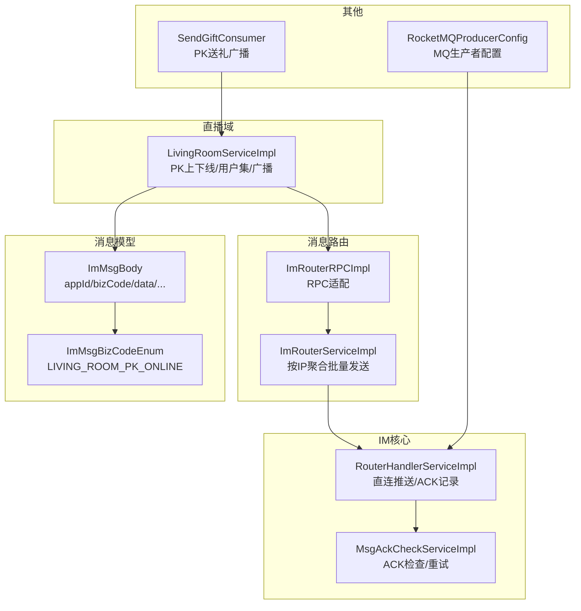
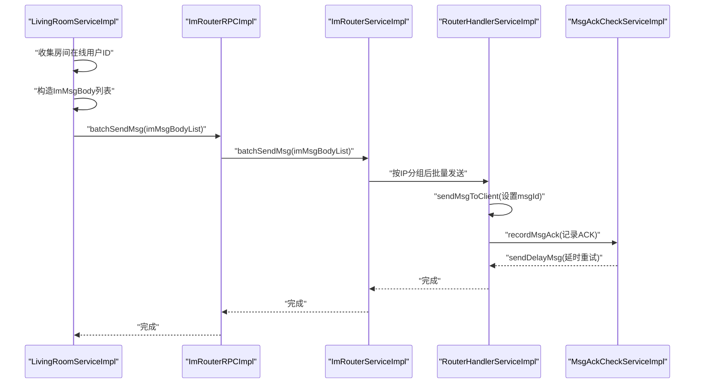
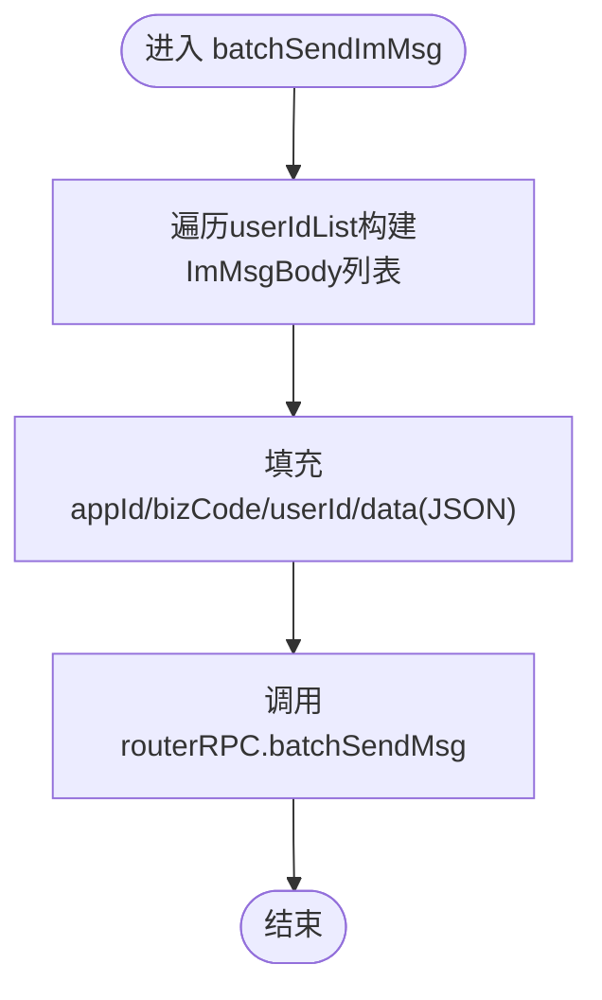
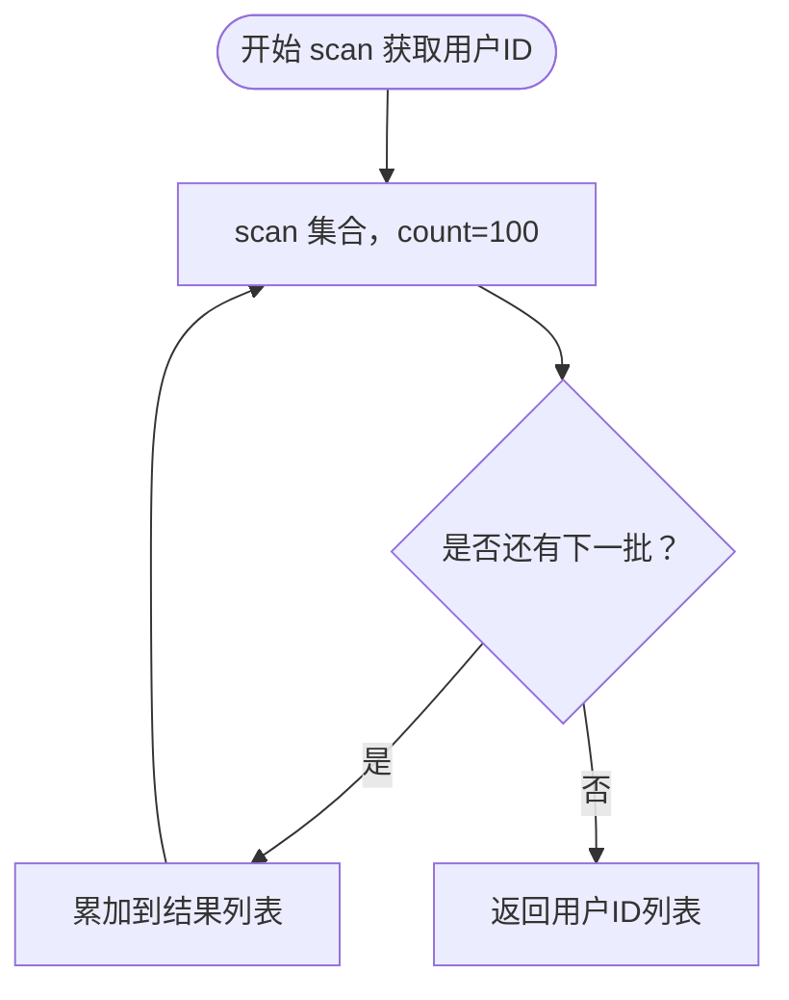
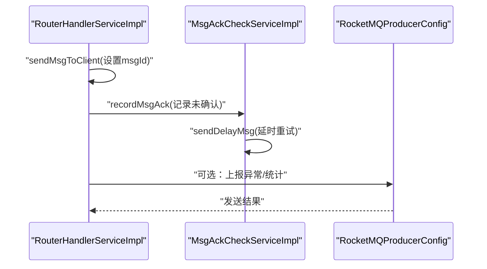
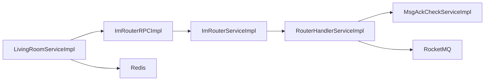

# PK消息广播

<cite>
**本文引用的文件列表**
- [ImMsgBizCodeEnum.java](file://live-im-router-interface/src/main/java/com/logilong/live/im/router/constants/ImMsgBizCodeEnum.java)
- [ImMsgBody.java](file://live-im-interface/src/main/java/com/logilong/live/im/dto/ImMsgBody.java)
- [ImRouterRPC.java](file://live-im-router-interface/src/main/java/com/logilong/live/im/router/interfaces/ImRouterRPC.java)
- [IRouterHandlerRPC.java](file://live-im-core-server-interfaces/src/main/java/com/logilong/live/im/core/server/interfaces/rpc/IRouterHandlerRPC.java)
- [ImRouterRPCImpl.java](file://live-im-router-provider/src/main/java/com/logilong/live/im/router/provider/rpc/ImRouterRPCImpl.java)
- [ImRouterServiceImpl.java](file://live-im-router-provider/src/main/java/com/logilong/live/im/router/provider/service/impl/ImRouterServiceImpl.java)
- [RouterHandlerServiceImpl.java](file://live-im-core-server/src/main/java/com/logilong/live/im/core\server/service/impl/RouterHandlerServiceImpl.java)
- [LivingRoomServiceImpl.java](file://live-living-provider/src/main/java/com/logilong/live/living/provider/service/impl/LivingRoomServiceImpl.java)
- [SendGiftConsumer.java](file://live-gift-provider/src/main/java/com/logilong/live/gift/provider/consumer/SendGiftConsumer.java)
- [MsgAckCheckServiceImpl.java](file://live-im-core-server/src/main/java/com/logilong/live/im/core/server/service/impl/MsgAckCheckServiceImpl.java)
- [RocketMQProducerConfig.java](file://live-framework/live-framework-mq-starter/src/main/java/com/logilong/live/framework/mq/starter/producer/RocketMQProducerConfig.java)
</cite>

## 目录
1. [引言](#引言)
2. [项目结构](#项目结构)
3. [核心组件](#核心组件)
4. [架构总览](#架构总览)
5. [详细组件分析](#详细组件分析)
6. [依赖关系分析](#依赖关系分析)
7. [性能考量](#性能考量)
8. [故障排查指南](#故障排查指南)
9. [结论](#结论)

## 引言
本文件围绕“PK事件的消息广播”展开，重点解析以下内容：
- batchSendImMsg私有方法如何构造ImMsgBody消息体，并通过ImRouterRPC.batchSendMsg向直播间所有用户推送实时通知；
- 业务码ImMsgBizCodeEnum.LIVING_ROOM_PK_ONLINE的定义与作用；
- JSON数据结构（包含pkObjId和pkObjAvatar）的设计规范；
- queryUserIdsByRoomId方法使用Redis SCAN命令分批获取用户ID的性能优化策略；
- 消息可靠性投递与异常监控方案。

## 项目结构
本次分析涉及的模块与文件如下：
- 直播间服务（PK上下线与用户集管理）：live-living-provider
- 消息路由接口与枚举：live-im-router-interface
- 消息路由实现（RPC与服务）：live-im-router-provider
- IM核心服务接口与实现：live-im-core-server
- IM消息模型：live-im-interface
- 礼物消费侧（PK送礼广播）：live-gift-provider
- RocketMQ配置：live-framework

图表来源
- [LivingRoomServiceImpl.java](file://live-living-provider/src/main/java/com/logilong/live/living/provider/service/impl/LivingRoomServiceImpl.java#L282-L293)
- [ImRouterRPCImpl.java](file://live-im-router-provider/src/main/java/com/logilong/live/im/router/provider/rpc/ImRouterRPCImpl.java#L1-L29)
- [ImRouterServiceImpl.java](file://live-im-router-provider/src/main/java/com/logilong/live/im/router/provider/service/impl/ImRouterServiceImpl.java#L1-L78)
- [RouterHandlerServiceImpl.java](file://live-im-core-server/src/main/java/com/logilong/live/im/core/server/service/impl/RouterHandlerServiceImpl.java#L1-L46)
- [MsgAckCheckServiceImpl.java](file://live-im-core-server/src/main/java/com/logilong/live/im/core/server/service/impl/MsgAckCheckServiceImpl.java#L1-L35)
- [ImMsgBody.java](file://live-im-interface/src/main/java/com/logilong/live/im/dto/ImMsgBody.java#L1-L40)
- [ImMsgBizCodeEnum.java](file://live-im-router-interface/src/main/java/com/logilong/live/im/router/constants/ImMsgBizCodeEnum.java#L1-L23)
- [SendGiftConsumer.java](file://live-gift-provider/src/main/java/com/logilong/live/gift/provider/consumer/SendGiftConsumer.java#L119-L211)
- [RocketMQProducerConfig.java](file://live-framework/live-framework-mq-starter/src/main/java/com/logilong/live/framework/mq/starter/producer/RocketMQProducerConfig.java#L32-L52)

章节来源
- [ImMsgBizCodeEnum.java](file://live-im-router-interface/src/main/java/com/logilong/live/im/router/constants/ImMsgBizCodeEnum.java#L1-L23)
- [ImMsgBody.java](file://live-im-interface/src/main/java/com/logilong/live/im/dto/ImMsgBody.java#L1-L40)
- [ImRouterRPC.java](file://live-im-router-interface/src/main/java/com/logilong/live/im/router/interfaces/ImRouterRPC.java#L1-L19)
- [IRouterHandlerRPC.java](file://live-im-core-server-interfaces/src/main/java/com/logilong/live/im/core/server/interfaces/rpc/IRouterHandlerRPC.java#L1-L22)
- [ImRouterRPCImpl.java](file://live-im-router-provider/src/main/java/com/logilong/live/im/router/provider/rpc/ImRouterRPCImpl.java#L1-L29)
- [ImRouterServiceImpl.java](file://live-im-router-provider/src/main/java/com/logilong/live/im/router/provider/service/impl/ImRouterServiceImpl.java#L1-L78)
- [RouterHandlerServiceImpl.java](file://live-im-core-server/src/main/java/com/logilong/live/im/core/server/service/impl/RouterHandlerServiceImpl.java#L1-L46)
- [LivingRoomServiceImpl.java](file://live-living-provider/src/main/java/com/logilong/live/living/provider/service/impl/LivingRoomServiceImpl.java#L210-L293)
- [SendGiftConsumer.java](file://live-gift-provider/src/main/java/com/logilong/live/gift/provider/consumer/SendGiftConsumer.java#L119-L211)
- [MsgAckCheckServiceImpl.java](file://live-im-core-server/src/main/java/com/logilong/live/im/core/server/service/impl/MsgAckCheckServiceImpl.java#L1-L35)
- [RocketMQProducerConfig.java](file://live-framework/live-framework-mq-starter/src/main/java/com/logilong/live/framework/mq/starter/producer/RocketMQProducerConfig.java#L32-L52)

## 核心组件
- ImMsgBizCodeEnum：定义业务码，其中LIVING_ROOM_PK_ONLINE用于PK连线广播。
- ImMsgBody：消息载体，包含appId、bizCode、userId、data等字段。
- ImRouterRPC/ImRouterRPCImpl：对外暴露批量发送接口，内部委派至路由服务。
- ImRouterServiceImpl：按用户绑定的IM节点IP进行分组，批量转发至IM核心。
- RouterHandlerServiceImpl：将消息写入对应用户通道，生成msgId并记录ACK。
- LivingRoomServiceImpl：维护直播房间用户集合，负责PK连线广播与用户ID扫描。
- SendGiftConsumer：在PK送礼场景触发全房间广播（非本文主流程，但体现广播模式）。
- MsgAckCheckServiceImpl：ACK检查与重试机制支撑。
- RocketMQProducerConfig：MQ生产者配置，保障消息可靠投递。

章节来源
- [ImMsgBizCodeEnum.java](file://live-im-router-interface/src/main/java/com/logilong/live/im/router/constants/ImMsgBizCodeEnum.java#L1-L23)
- [ImMsgBody.java](file://live-im-interface/src/main/java/com/logilong/live/im/dto/ImMsgBody.java#L1-L40)
- [ImRouterRPC.java](file://live-im-router-interface/src/main/java/com/logilong/live/im/router/interfaces/ImRouterRPC.java#L1-L19)
- [ImRouterRPCImpl.java](file://live-im-router-provider/src/main/java/com/logilong/live/im/router/provider/rpc/ImRouterRPCImpl.java#L1-L29)
- [ImRouterServiceImpl.java](file://live-im-router-provider/src/main/java/com/logilong/live/im/router/provider/service/impl/ImRouterServiceImpl.java#L1-L78)
- [RouterHandlerServiceImpl.java](file://live-im-core-server/src/main/java/com/logilong/live/im/core/server/service/impl/RouterHandlerServiceImpl.java#L1-L46)
- [LivingRoomServiceImpl.java](file://live-living-provider/src/main/java/com/logilong/live/living/provider/service/impl/LivingRoomServiceImpl.java#L210-L293)
- [SendGiftConsumer.java](file://live-gift-provider/src/main/java/com/logilong/live/gift/provider/consumer/SendGiftConsumer.java#L119-L211)
- [MsgAckCheckServiceImpl.java](file://live-im-core-server/src/main/java/com/logilong/live/im/core/server/service/impl/MsgAckCheckServiceImpl.java#L1-L35)
- [RocketMQProducerConfig.java](file://live-framework/live-framework-mq-starter/src/main/java/com/logilong/live/framework/mq/starter/producer/RocketMQProducerConfig.java#L32-L52)

## 架构总览
PK消息广播从“直播房间服务”发起，经“消息路由RPC/服务”，最终由“IM核心服务”推送到各在线用户。关键路径如下：
- LivingRoomServiceImpl在线PK时，收集房间内所有在线用户ID；
- 构造ImMsgBody列表并通过ImRouterRPC.batchSendMsg批量发送；
- ImRouterRPCImpl委派至ImRouterServiceImpl；
- ImRouterServiceImpl按用户绑定的IM节点IP分组，调用IRouterHandlerRPC.batchSendMsg；
- RouterHandlerServiceImpl将消息写入用户通道，生成msgId并记录ACK；
- MsgAckCheckServiceImpl负责ACK检查与重试。

图表来源
- [LivingRoomServiceImpl.java](file://live-living-provider/src/main/java/com/logilong/live/living/provider/service/impl/LivingRoomServiceImpl.java#L282-L293)
- [ImRouterRPCImpl.java](file://live-im-router-provider/src/main/java/com/logilong/live/im/router/provider/rpc/ImRouterRPCImpl.java#L1-L29)
- [ImRouterServiceImpl.java](file://live-im-router-provider/src/main/java/com/logilong/live/im/router/provider/service/impl/ImRouterServiceImpl.java#L1-L78)
- [RouterHandlerServiceImpl.java](file://live-im-core-server/src/main/java/com/logilong/live/im/core/server/service/impl/RouterHandlerServiceImpl.java#L1-L46)
- [MsgAckCheckServiceImpl.java](file://live-im-core-server/src/main/java/com/logilong/live/im/core/server/service/impl/MsgAckCheckServiceImpl.java#L1-L35)

## 详细组件分析

### batchSendImMsg私有方法与ImMsgBody构造
- 方法位置：LivingRoomServiceImpl中的batchSendImMsg（私有方法）
- 功能：遍历用户ID列表，为每个用户创建ImMsgBody，填充appId、bizCode、userId、data（JSON字符串），最后调用routerRPC.batchSendMsg批量发送。
- 关键点：
  - appId固定为直播业务线；
  - bizCode来自业务枚举（如LIVING_ROOM_PK_ONLINE）；
  - data为JSON字符串，包含pkObjId、pkObjAvatar等字段。

图表来源
- [LivingRoomServiceImpl.java](file://live-living-provider/src/main/java/com/logilong/live/living/provider/service/impl/LivingRoomServiceImpl.java#L282-L293)
- [ImMsgBody.java](file://live-im-interface/src/main/java/com/logilong/live/im/dto/ImMsgBody.java#L1-L40)
- [ImRouterRPC.java](file://live-im-router-interface/src/main/java/com/logilong/live/im/router/interfaces/ImRouterRPC.java#L1-L19)

章节来源
- [LivingRoomServiceImpl.java](file://live-living-provider/src/main/java/com/logilong/live/living/provider/service/impl/LivingRoomServiceImpl.java#L282-L293)
- [ImMsgBody.java](file://live-im-interface/src/main/java/com/logilong/live/im/dto/ImMsgBody.java#L1-L40)
- [ImRouterRPC.java](file://live-im-router-interface/src/main/java/com/logilong/live/im/router/interfaces/ImRouterRPC.java#L1-L19)

### 业务码ImMsgBizCodeEnum.LIVING_ROOM_PK_ONLINE
- 定义：ImMsgBizCodeEnum中包含LIVING_ROOM_PK_ONLINE（业务码5559），用于标识“PK连线”场景的消息。
- 作用：在PK连线成功后，系统向房间内所有在线用户广播该业务码，前端据此渲染连线状态或提示。

章节来源
- [ImMsgBizCodeEnum.java](file://live-im-router-interface/src/main/java/com/logilong/live/im/router/constants/ImMsgBizCodeEnum.java#L1-L23)
- [LivingRoomServiceImpl.java](file://live-living-provider/src/main/java/com/logilong/live/living/provider/service/impl/LivingRoomServiceImpl.java#L236-L241)

### JSON数据结构设计规范（pkObjId/pkObjAvatar）
- 数据来源：在线PK成功后，系统构造JSONObject，包含pkObjId与pkObjAvatar两个字段。
- 设计要点：
  - pkObjId：连线用户的唯一标识；
  - pkObjAvatar：连线用户头像或图标资源路径；
- 传输方式：作为ImMsgBody.data字段的JSON字符串，随bizCode一起下发。

章节来源
- [LivingRoomServiceImpl.java](file://live-living-provider/src/main/java/com/logilong/live/living/provider/service/impl/LivingRoomServiceImpl.java#L236-L241)
- [ImMsgBody.java](file://live-im-interface/src/main/java/com/logilong/live/im/dto/ImMsgBody.java#L1-L40)

### queryUserIdsByRoomId使用Redis SCAN分批获取用户ID
- 实现位置：LivingRoomServiceImpl.queryUserIdsByRoomId
- 优化策略：
  - 使用RedisTemplate.opsForSet().scan，配合ScanOptions.match("*").count(100)，以每批100条的速度迭代集合；
  - 避免一次性返回大量数据导致Redis与网络阻塞；
  - 返回List<Long>用户ID列表供批量广播使用。

图表来源
- [LivingRoomServiceImpl.java](file://live-living-provider/src/main/java/com/logilong/live/living/provider/service/impl/LivingRoomServiceImpl.java#L210-L221)

章节来源
- [LivingRoomServiceImpl.java](file://live-living-provider/src/main/java/com/logilong/live/living/provider/service/impl/LivingRoomServiceImpl.java#L210-L221)

### 消息可靠性投递与异常监控
- 可靠性链路：
  - RouterHandlerServiceImpl在成功写入用户通道后，生成msgId并调用MsgAckCheckService.recordMsgAck记录ACK；
  - MsgAckCheckServiceImpl通过Redis哈希记录未确认消息，结合延时任务进行重试；
  - RocketMQProducerConfig配置了重试次数与异步发送参数，提升整体投递稳定性。
- 异常监控：
  - RouterHandlerServiceImpl在写入失败时返回false，便于上层感知；
  - BizImMsgHandler对非法消息包进行日志记录并关闭连接，避免异常传播；
  - MQ生产者异常被捕获并记录，确保不中断业务主流程。

图表来源
- [RouterHandlerServiceImpl.java](file://live-im-core-server/src/main/java/com/logilong/live/im/core/server/service/impl/RouterHandlerServiceImpl.java#L1-L46)
- [MsgAckCheckServiceImpl.java](file://live-im-core-server/src/main/java/com/logilong/live/im/core/server/service/impl/MsgAckCheckServiceImpl.java#L1-L35)
- [RocketMQProducerConfig.java](file://live-framework/live-framework-mq-starter/src/main/java/com/logilong/live/framework/mq/starter/producer/RocketMQProducerConfig.java#L32-L52)

章节来源
- [RouterHandlerServiceImpl.java](file://live-im-core-server/src/main/java/com/logilong/live/im/core/server/service/impl/RouterHandlerServiceImpl.java#L1-L46)
- [MsgAckCheckServiceImpl.java](file://live-im-core-server/src/main/java/com/logilong/live/im/core/server/service/impl/MsgAckCheckServiceImpl.java#L1-L35)
- [RocketMQProducerConfig.java](file://live-framework/live-framework-mq-starter/src/main/java/com/logilong/live/framework/mq/starter/producer/RocketMQProducerConfig.java#L32-L52)

## 依赖关系分析
- 组件耦合：
  - LivingRoomServiceImpl依赖Redis维护房间用户集合，并依赖ImRouterRPC进行批量广播；
  - ImRouterRPCImpl委派至ImRouterServiceImpl，后者再调用IRouterHandlerRPC；
  - RouterHandlerServiceImpl负责直连推送与ACK记录，与MsgAckCheckServiceImpl协作完成重试。
- 外部依赖：
  - Redis用于用户集合与绑定IP缓存；
  - RocketMQ用于消息投递与异常处理。

图表来源
- [LivingRoomServiceImpl.java](file://live-living-provider/src/main/java/com/logilong/live/living/provider/service/impl/LivingRoomServiceImpl.java#L210-L293)
- [ImRouterRPCImpl.java](file://live-im-router-provider/src/main/java/com/logilong/live/im/router/provider/rpc/ImRouterRPCImpl.java#L1-L29)
- [ImRouterServiceImpl.java](file://live-im-router-provider/src/main/java/com/logilong/live/im/router/provider/service/impl/ImRouterServiceImpl.java#L1-L78)
- [RouterHandlerServiceImpl.java](file://live-im-core-server/src/main/java/com/logilong/live/im/core/server/service/impl/RouterHandlerServiceImpl.java#L1-L46)
- [MsgAckCheckServiceImpl.java](file://live-im-core-server/src/main/java/com/logilong/live/im/core/server/service/impl/MsgAckCheckServiceImpl.java#L1-L35)

章节来源
- [ImRouterRPC.java](file://live-im-router-interface/src/main/java/com/logilong/live/im/router/interfaces/ImRouterRPC.java#L1-L19)
- [IRouterHandlerRPC.java](file://live-im-core-server-interfaces/src/main/java/com/logilong/live/im/core/server/interfaces/rpc/IRouterHandlerRPC.java#L1-L22)
- [ImRouterRPCImpl.java](file://live-im-router-provider/src/main/java/com/logilong/live/im/router/provider/rpc/ImRouterRPCImpl.java#L1-L29)
- [ImRouterServiceImpl.java](file://live-im-router-provider/src/main/java/com/logilong/live/im/router/provider/service/impl/ImRouterServiceImpl.java#L1-L78)
- [RouterHandlerServiceImpl.java](file://live-im-core-server/src/main/java/com/logilong/live/im/core/server/service/impl/RouterHandlerServiceImpl.java#L1-L46)
- [MsgAckCheckServiceImpl.java](file://live-im-core-server/src/main/java/com/logilong/live/im/core/server/service/impl/MsgAckCheckServiceImpl.java#L1-L35)

## 性能考量
- Redis SCAN分批读取：queryUserIdsByRoomId采用count(100)分批scan，避免单次返回大量数据导致阻塞；
- 批量发送聚合：ImRouterServiceImpl按用户绑定的IM节点IP进行分组，减少跨节点RPC调用次数；
- ACK重试与延时：MsgAckCheckServiceImpl记录未确认消息并延时重试，降低丢消息风险；
- MQ重试配置：RocketMQProducerConfig设置了重试次数与异步发送参数，提升投递稳定性。

章节来源
- [LivingRoomServiceImpl.java](file://live-living-provider/src/main/java/com/logilong/live/living/provider/service/impl/LivingRoomServiceImpl.java#L210-L221)
- [ImRouterServiceImpl.java](file://live-im-router-provider/src/main/java/com/logilong/live/im/router/provider/service/impl/ImRouterServiceImpl.java#L1-L78)
- [MsgAckCheckServiceImpl.java](file://live-im-core-server/src/main/java/com/logilong/live/im/core/server/service/impl/MsgAckCheckServiceImpl.java#L1-L35)
- [RocketMQProducerConfig.java](file://live-framework/live-framework-mq-starter/src/main/java/com/logilong/live/framework/mq/starter/producer/RocketMQProducerConfig.java#L32-L52)

## 故障排查指南
- 在线用户ID为空或过少：
  - 检查Redis房间用户集合键是否存在且未过期；
  - 确认用户上下线事件是否正确写入/移除。
- 广播失败或延迟：
  - 检查RouterHandlerServiceImpl是否成功写入用户通道；
  - 查看MsgAckCheckServiceImpl的ACK记录与重试队列；
  - 观察RocketMQ生产者发送结果与异常日志。
- 业务码识别问题：
  - 确认bizCode是否为LIVING_ROOM_PK_ONLINE；
  - 检查ImMsgBody.data是否为合法JSON字符串。

章节来源
- [LivingRoomServiceImpl.java](file://live-living-provider/src/main/java/com/logilong/live/living/provider/service/impl/LivingRoomServiceImpl.java#L181-L207)
- [RouterHandlerServiceImpl.java](file://live-im-core-server/src/main/java/com/logilong/live/im/core/server/service/impl/RouterHandlerServiceImpl.java#L1-L46)
- [MsgAckCheckServiceImpl.java](file://live-im-core-server/src/main/java/com/logilong/live/im/core/server/service/impl/MsgAckCheckServiceImpl.java#L1-L35)
- [RocketMQProducerConfig.java](file://live-framework/live-framework-mq-starter/src/main/java/com/logilong/live/framework/mq/starter/producer/RocketMQProducerConfig.java#L32-L52)

## 结论
本文系统梳理了PK消息广播的完整链路：从房间服务收集在线用户、构造ImMsgBody、通过路由RPC/服务聚合分发，再到IM核心直连推送与ACK重试。业务码LIVING_ROOM_PK_ONLINE用于标识PK连线广播；JSON数据结构包含pkObjId与pkObjAvatar，满足前端渲染需求。通过Redis SCAN分批读取与批量聚合发送，有效规避大数据量下的阻塞问题；结合ACK重试与MQ配置，形成可靠的消息投递与异常监控体系。