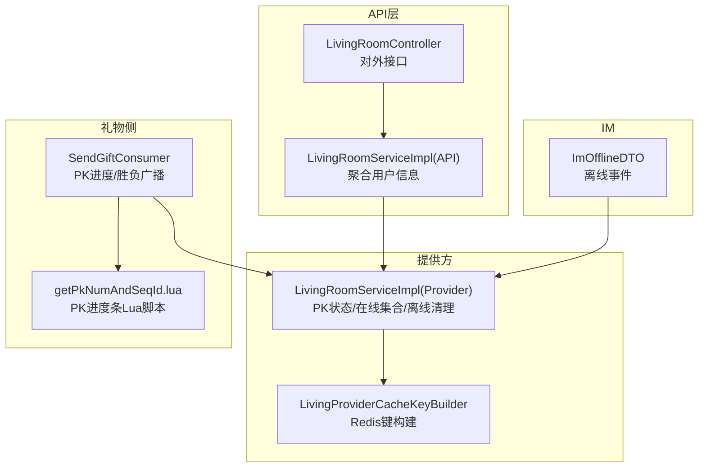
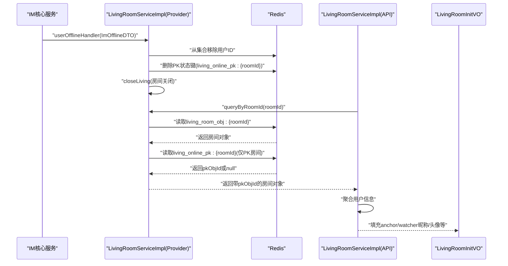
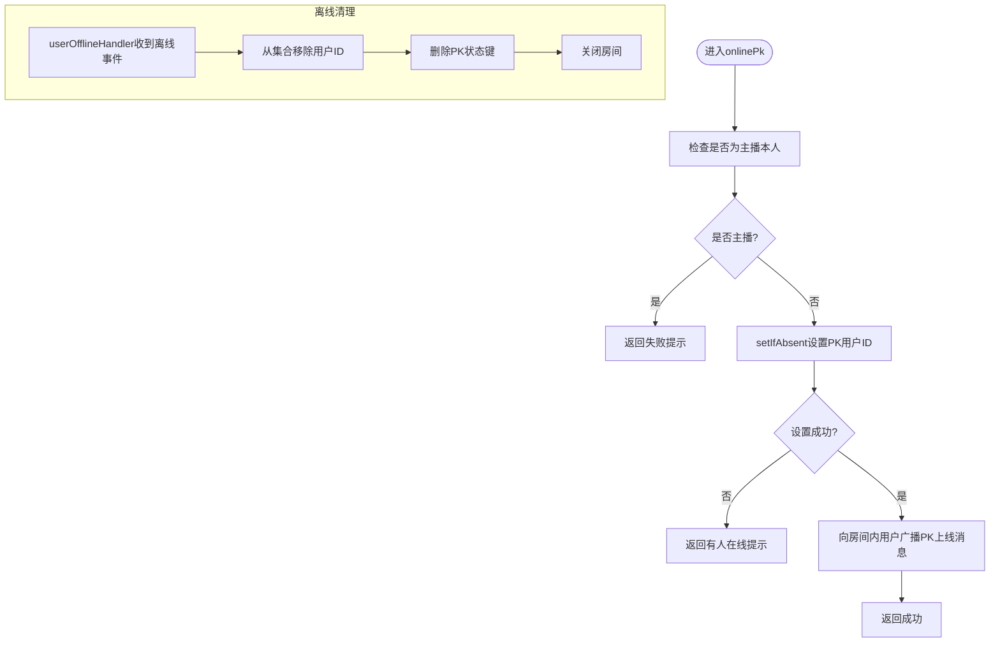
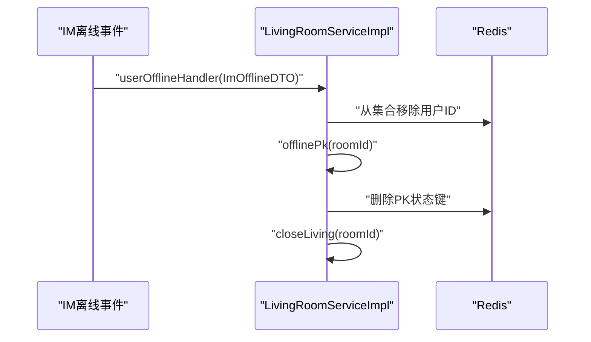
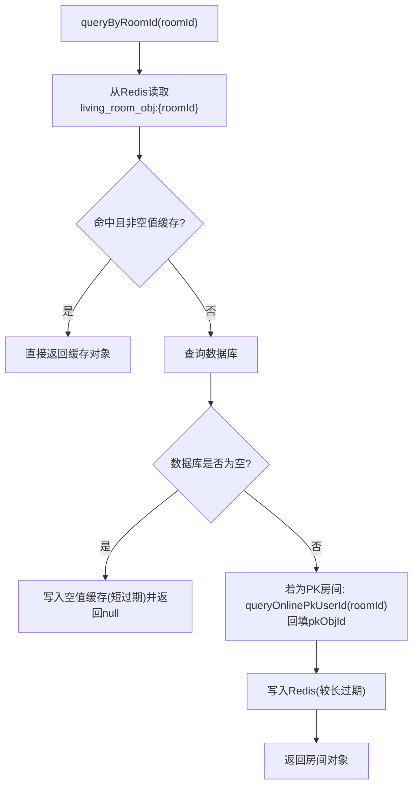
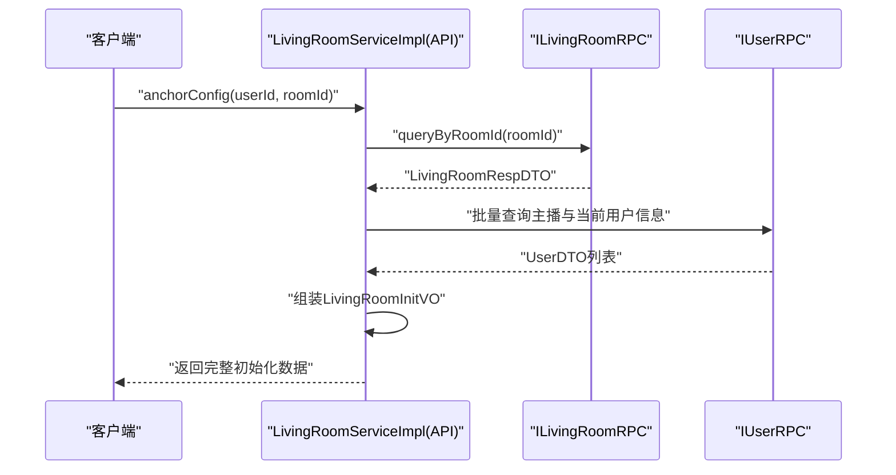
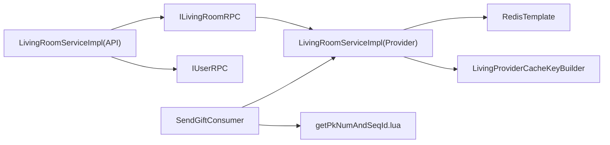

# PK状态同步

<cite>
**本文引用的文件**
- [LivingRoomServiceImpl.java](file://live-living-provider/src/main/java/com/logilong/live/living/provider/service/impl/LivingRoomServiceImpl.java)
- [ILivingRoomService.java](file://live-living-provider/src/main/java/com/logilong/live/living/provider/service/ILivingRoomService.java)
- [LivingProviderCacheKeyBuilder.java](file://live-framework/live-framework-redis-starter/src/main/java/com/logilong/live/framework/redis/starter/key/LivingProviderCacheKeyBuilder.java)
- [LivingRoomRespDTO.java](file://live-living-interface/src/main/java/com/logilong/live/living/interfaces/dto/LivingRoomRespDTO.java)
- [LivingRoomReqDTO.java](file://live-living-interface/src/main/java/com/logilong/live/living/interfaces/dto/LivingRoomReqDTO.java)
- [LivingPkRespDTO.java](file://live-living-interface/src/main/java/com/logilong/live/living/interfaces/dto/LivingPkRespDTO.java)
- [ImOfflineDTO.java](file://live-im-core-server-interfaces/src/main/java/com/logilong/live/im/core/server/interfaces/dto/ImOfflineDTO.java)
- [LivingRoomController.java](file://live-api/src/main/java/com/logilong/live/api/controller/LivingRoomController.java)
- [LivingRoomServiceImpl.java（API层）](file://live-api/src/main/java/com/logilong/live/api/service/impl/LivingRoomServiceImpl.java)
- [LivingRoomInitVO.java](file://live-api/src/main/java/com/logilong/live/api/vo/LivingRoomInitVO.java)
- [SendGiftConsumer.java](file://live-gift-provider/src/main/java/com/logilong/live/gift/provider/consumer/SendGiftConsumer.java)
- [getPkNumAndSeqId.lua](file://live-gift-provider/src/main/resources/getPkNumAndSeqId.lua)
</cite>

## 目录
1. [引言](#引言)
2. [项目结构](#项目结构)
3. [核心组件](#核心组件)
4. [架构总览](#架构总览)
5. [详细组件分析](#详细组件分析)
6. [依赖关系分析](#依赖关系分析)
7. [性能考量](#性能考量)
8. [故障排查指南](#故障排查指南)
9. [结论](#结论)

## 引言
本文件聚焦于直播系统中的PK状态实时同步机制，围绕以下目标展开：
- 解析queryOnlinePkUserId如何通过Redis缓存快速查询当前PK用户ID
- 说明offlinePk如何安全地解除PK状态
- 分析用户离线（userOfflineHandler）时自动触发PK状态清理的事件驱动设计
- 解释LivingRoomRespDTO数据模型中pkObjId字段的填充逻辑
- 描述API层如何聚合用户信息返回完整的直播间初始化数据
- 阐述Redis缓存一致性保障策略与空值缓存防护措施

## 项目结构
围绕PK状态同步的关键模块与文件如下：
- 提供方服务：LivingRoomServiceImpl负责直播房间、PK状态与IM在线集合的维护
- 缓存键构建：LivingProviderCacheKeyBuilder统一管理Redis键前缀与命名规范
- 接口DTO：LivingRoomRespDTO、LivingRoomReqDTO、LivingPkRespDTO定义数据契约
- IM接口：ImOfflineDTO承载用户离线事件
- API层：LivingRoomController与LivingRoomServiceImpl负责对外提供接口与聚合用户信息
- 礼物侧：SendGiftConsumer与Lua脚本协同维护PK进度条与胜负判定

图表来源
- [LivingRoomController.java](file://live-api/src/main/java/com/logilong/live/api/controller/LivingRoomController.java#L1-L96)
- [LivingRoomServiceImpl.java（API层）](file://live-api/src/main/java/com/logilong/live/api/service/impl/LivingRoomServiceImpl.java#L1-L160)
- [LivingRoomServiceImpl.java](file://live-living-provider/src/main/java/com/logilong/live/living/provider/service/impl/LivingRoomServiceImpl.java#L1-L294)
- [LivingProviderCacheKeyBuilder.java](file://live-framework/live-framework-redis-starter/src/main/java/com/logilong/live/framework/redis/starter/key/LivingProviderCacheKeyBuilder.java#L1-L40)
- [ImOfflineDTO.java](file://live-im-core-server-interfaces/src/main/java/com/logilong/live/im/core/server/interfaces/dto/ImOfflineDTO.java#L1-L17)
- [SendGiftConsumer.java](file://live-gift-provider/src/main/java/com/logilong/live/gift/provider/consumer/SendGiftConsumer.java#L1-L212)
- [getPkNumAndSeqId.lua](file://live-gift-provider/src/main/resources/getPkNumAndSeqId.lua#L1-L17)

章节来源
- [LivingRoomServiceImpl.java](file://live-living-provider/src/main/java/com/logilong/live/living/provider/service/impl/LivingRoomServiceImpl.java#L1-L294)
- [LivingProviderCacheKeyBuilder.java](file://live-framework/live-framework-redis-starter/src/main/java/com/logilong/live/framework/redis/starter/key/LivingProviderCacheKeyBuilder.java#L1-L40)
- [LivingRoomController.java](file://live-api/src/main/java/com/logilong/live/api/controller/LivingRoomController.java#L1-L96)
- [LivingRoomServiceImpl.java（API层）](file://live-api/src/main/java/com/logilong/live/api/service/impl/LivingRoomServiceImpl.java#L1-L160)
- [SendGiftConsumer.java](file://live-gift-provider/src/main/java/com/logilong/live/gift/provider/consumer/SendGiftConsumer.java#L1-L212)
- [getPkNumAndSeqId.lua](file://live-gift-provider/src/main/resources/getPkNumAndSeqId.lua#L1-L17)

## 核心组件
- PK状态缓存键：living_online_pk:{roomId}，用于存放当前PK用户ID
- 在线用户集合：living_room_user_set:{appId}:{roomId}，用于维护房间内在线用户集合
- 直播间对象缓存：living_room_obj:{roomId}，用于缓存房间元信息，包含pkObjId字段
- PK进度条缓存：由礼物侧Lua脚本维护，键名由礼物侧键构建器提供

章节来源
- [LivingProviderCacheKeyBuilder.java](file://live-framework/live-framework-redis-starter/src/main/java/com/logilong/live/framework/redis/starter/key/LivingProviderCacheKeyBuilder.java#L1-L40)
- [LivingRoomServiceImpl.java](file://live-living-provider/src/main/java/com/logilong/live/living/provider/service/impl/LivingRoomServiceImpl.java#L110-L138)
- [SendGiftConsumer.java](file://live-gift-provider/src/main/java/com/logilong/live/gift/provider/consumer/SendGiftConsumer.java#L145-L191)

## 架构总览
PK状态同步采用“事件驱动 + Redis缓存”的架构模式：
- IM层产生用户离线事件，触发LivingRoomServiceImpl.userOfflineHandler清理在线集合，并主动调用offlinePk解除PK状态
- queryOnlinePkUserId通过Redis键直接读取当前PK用户ID，实现O(1)查询
- API层在返回直播间初始化数据时，若房间类型为PK类型，则从Redis读取pkObjId并回填到响应对象中

图表来源
- [LivingRoomServiceImpl.java](file://live-living-provider/src/main/java/com/logilong/live/living/provider/service/impl/LivingRoomServiceImpl.java#L182-L207)
- [LivingRoomServiceImpl.java](file://live-living-provider/src/main/java/com/logilong/live/living/provider/service/impl/LivingRoomServiceImpl.java#L110-L138)
- [LivingRoomServiceImpl.java（API层）](file://live-api/src/main/java/com/logilong/live/api/service/impl/LivingRoomServiceImpl.java#L87-L120)
- [LivingRoomInitVO.java](file://live-api/src/main/java/com/logilong/live/api/vo/LivingRoomInitVO.java#L1-L24)

## 详细组件分析

### 组件A：Redis缓存键与PK状态读写
- queryOnlinePkUserId：通过LivingProviderCacheKeyBuilder.buildLivingOnlinePk(roomId)构造键，从Redis读取当前PK用户ID
- onlinePk：在PK房间中尝试设置PK用户ID，使用setIfAbsent避免并发覆盖，超时时间12小时
- offlinePk：删除PK状态键，确保离线或异常情况下PK状态被及时清理

图表来源
- [LivingRoomServiceImpl.java](file://live-living-provider/src/main/java/com/logilong/live/living/provider/service/impl/LivingRoomServiceImpl.java#L224-L248)
- [LivingRoomServiceImpl.java](file://live-living-provider/src/main/java/com/logilong/live/living/provider/service/impl/LivingRoomServiceImpl.java#L182-L207)
- [LivingProviderCacheKeyBuilder.java](file://live-framework/live-framework-redis-starter/src/main/java/com/logilong/live/framework/redis/starter/key/LivingProviderCacheKeyBuilder.java#L1-L40)

章节来源
- [LivingRoomServiceImpl.java](file://live-living-provider/src/main/java/com/logilong/live/living/provider/service/impl/LivingRoomServiceImpl.java#L224-L248)
- [LivingRoomServiceImpl.java](file://live-living-provider/src/main/java/com/logilong/live/living/provider/service/impl/LivingRoomServiceImpl.java#L268-L277)
- [LivingRoomServiceImpl.java](file://live-living-provider/src/main/java/com/logilong/live/living/provider/service/impl/LivingRoomServiceImpl.java#L182-L207)

### 组件B：用户离线事件驱动的PK清理
- IM层产生离线事件，LivingRoomServiceImpl.userOfflineHandler负责：
  - 从房间在线集合中移除该用户
  - 主动调用offlinePk删除PK状态键
  - 触发closeLiving关闭房间

图表来源
- [LivingRoomServiceImpl.java](file://live-living-provider/src/main/java/com/logilong/live/living/provider/service/impl/LivingRoomServiceImpl.java#L182-L207)
- [ImOfflineDTO.java](file://live-im-core-server-interfaces/src/main/java/com/logilong/live/im/core/server/interfaces/dto/ImOfflineDTO.java#L1-L17)

章节来源
- [LivingRoomServiceImpl.java](file://live-living-provider/src/main/java/com/logilong/live/living/provider/service/impl/LivingRoomServiceImpl.java#L182-L207)
- [ImOfflineDTO.java](file://live-im-core-server-interfaces/src/main/java/com/logilong/live/im/core/server/interfaces/dto/ImOfflineDTO.java#L1-L17)

### 组件C：LivingRoomRespDTO中pkObjId的填充逻辑
- queryByRoomId优先从Redis读取房间对象；若命中且非空值缓存则直接返回
- 若房间类型为PK类型，则额外调用queryOnlinePkUserId读取当前PK用户ID并回填到pkObjId字段
- 当数据库查询为空时，写入空值缓存（带极短过期时间）以防止缓存穿透

图表来源
- [LivingRoomServiceImpl.java](file://live-living-provider/src/main/java/com/logilong/live/living/provider/service/impl/LivingRoomServiceImpl.java#L110-L138)
- [LivingRoomRespDTO.java](file://live-living-interface/src/main/java/com/logilong/live/living/interfaces/dto/LivingRoomRespDTO.java#L1-L23)

章节来源
- [LivingRoomServiceImpl.java](file://live-living-provider/src/main/java/com/logilong/live/living/provider/service/impl/LivingRoomServiceImpl.java#L110-L138)
- [LivingRoomRespDTO.java](file://live-living-interface/src/main/java/com/logilong/live/living/interfaces/dto/LivingRoomRespDTO.java#L1-L23)

### 组件D：API层聚合用户信息返回完整初始化数据
- API层在anchorConfig中调用RPC查询房间信息，随后批量拉取主播与当前用户的用户信息
- 将用户昵称、头像等信息回填至LivingRoomInitVO，作为完整的直播间初始化数据返回

图表来源
- [LivingRoomServiceImpl.java（API层）](file://live-api/src/main/java/com/logilong/live/api/service/impl/LivingRoomServiceImpl.java#L87-L120)
- [LivingRoomInitVO.java](file://live-api/src/main/java/com/logilong/live/api/vo/LivingRoomInitVO.java#L1-L24)

章节来源
- [LivingRoomServiceImpl.java（API层）](file://live-api/src/main/java/com/logilong/live/api/service/impl/LivingRoomServiceImpl.java#L87-L120)
- [LivingRoomInitVO.java](file://live-api/src/main/java/com/logilong/live/api/vo/LivingRoomInitVO.java#L1-L24)

### 组件E：Redis缓存一致性与空值缓存防护
- 空值缓存：当数据库查询为空时，写入一个“空对象”并设置短过期时间，后续请求命中该空值缓存直接返回null，避免重复查库
- 写入一致性：startLivingRoom/closeLiving等关键写操作会主动删除对应房间对象缓存，确保后续读取能命中最新数据
- PK进度条一致性：礼物侧通过Lua原子脚本维护PK进度条，避免竞态条件导致的计数偏差

章节来源
- [LivingRoomServiceImpl.java](file://live-living-provider/src/main/java/com/logilong/live/living/provider/service/impl/LivingRoomServiceImpl.java#L70-L87)
- [LivingRoomServiceImpl.java](file://live-living-provider/src/main/java/com/logilong/live/living/provider/service/impl/LivingRoomServiceImpl.java#L90-L108)
- [LivingRoomServiceImpl.java](file://live-living-provider/src/main/java/com/logilong/live/living/provider/service/impl/LivingRoomServiceImpl.java#L110-L138)
- [SendGiftConsumer.java](file://live-gift-provider/src/main/java/com/logilong/live/gift/provider/consumer/SendGiftConsumer.java#L145-L191)
- [getPkNumAndSeqId.lua](file://live-gift-provider/src/main/resources/getPkNumAndSeqId.lua#L1-L17)

## 依赖关系分析
- 提供方服务依赖RedisTemplate与LivingProviderCacheKeyBuilder进行缓存读写
- API层通过ILivingRoomRPC与IUserRPC聚合数据
- 礼物侧通过ILivingRoomRPC与RedisTemplate读取PK状态与进度条

图表来源
- [LivingRoomServiceImpl.java（API层）](file://live-api/src/main/java/com/logilong/live/api/service/impl/LivingRoomServiceImpl.java#L1-L160)
- [LivingRoomServiceImpl.java](file://live-living-provider/src/main/java/com/logilong/live/living/provider/service/impl/LivingRoomServiceImpl.java#L1-L294)
- [LivingProviderCacheKeyBuilder.java](file://live-framework/live-framework-redis-starter/src/main/java/com/logilong/live/framework/redis/starter/key/LivingProviderCacheKeyBuilder.java#L1-L40)
- [SendGiftConsumer.java](file://live-gift-provider/src/main/java/com/logilong/live/gift/provider/consumer/SendGiftConsumer.java#L1-L212)
- [getPkNumAndSeqId.lua](file://live-gift-provider/src/main/resources/getPkNumAndSeqId.lua#L1-L17)

章节来源
- [LivingRoomServiceImpl.java（API层）](file://live-api/src/main/java/com/logilong/live/api/service/impl/LivingRoomServiceImpl.java#L1-L160)
- [LivingRoomServiceImpl.java](file://live-living-provider/src/main/java/com/logilong/live/living/provider/service/impl/LivingRoomServiceImpl.java#L1-L294)

## 性能考量
- Redis键命名规范：通过LivingProviderCacheKeyBuilder集中管理，便于维护与扩展
- setIfAbsent原子性：onlinePk使用setIfAbsent避免并发覆盖，提升一致性
- scan分页查询：queryUserIdsByRoomId使用scan+游标分批读取，避免大集合阻塞
- 短过期空值缓存：防止缓存穿透的同时降低内存占用
- Lua原子脚本：礼物侧PK进度条通过Lua脚本保证原子性与高并发下的正确性

章节来源
- [LivingProviderCacheKeyBuilder.java](file://live-framework/live-framework-redis-starter/src/main/java/com/logilong/live/framework/redis/starter/key/LivingProviderCacheKeyBuilder.java#L1-L40)
- [LivingRoomServiceImpl.java](file://live-living-provider/src/main/java/com/logilong/live/living/provider/service/impl/LivingRoomServiceImpl.java#L224-L248)
- [LivingRoomServiceImpl.java](file://live-living-provider/src/main/java/com/logilong/live/living/provider/service/impl/LivingRoomServiceImpl.java#L210-L221)
- [LivingRoomServiceImpl.java](file://live-living-provider/src/main/java/com/logilong/live/living/provider/service/impl/LivingRoomServiceImpl.java#L110-L138)
- [SendGiftConsumer.java](file://live-gift-provider/src/main/java/com/logilong/live/gift/provider/consumer/SendGiftConsumer.java#L145-L191)
- [getPkNumAndSeqId.lua](file://live-gift-provider/src/main/resources/getPkNumAndSeqId.lua#L1-L17)

## 故障排查指南
- PK状态无法清除
  - 检查userOfflineHandler是否被触发（IM离线事件是否到达）
  - 确认offlinePk是否成功删除PK状态键
  - 关注Redis中是否存在残留键
- PK用户ID读取异常
  - 确认Redis中是否存在living_online_pk:{roomId}键
  - 检查onlinePk流程是否因setIfAbsent失败而未设置
- 直播间初始化数据缺少pkObjId
  - 确认房间类型为PK类型
  - 检查queryByRoomId是否正确回填pkObjId
  - 核对Redis中房间对象缓存是否过期或被清理
- PK进度条异常
  - 检查Lua脚本是否正确执行
  - 确认PK房间是否已标记结束（isOver标志）

章节来源
- [LivingRoomServiceImpl.java](file://live-living-provider/src/main/java/com/logilong/live/living/provider/service/impl/LivingRoomServiceImpl.java#L182-L207)
- [LivingRoomServiceImpl.java](file://live-living-provider/src/main/java/com/logilong/live/living/provider/service/impl/LivingRoomServiceImpl.java#L224-L248)
- [LivingRoomServiceImpl.java](file://live-living-provider/src/main/java/com/logilong/live/living/provider/service/impl/LivingRoomServiceImpl.java#L110-L138)
- [SendGiftConsumer.java](file://live-gift-provider/src/main/java/com/logilong/live/gift/provider/consumer/SendGiftConsumer.java#L145-L191)

## 结论
本系统通过Redis键规范、原子写入与事件驱动机制，实现了PK状态的高效、一致与可恢复：
- queryOnlinePkUserId提供O(1)读取能力
- offlinePk与userOfflineHandler确保离线清理的可靠性
- 空值缓存与写入一致性策略有效防止缓存穿透与脏读
- API层聚合用户信息，输出完整的直播间初始化数据