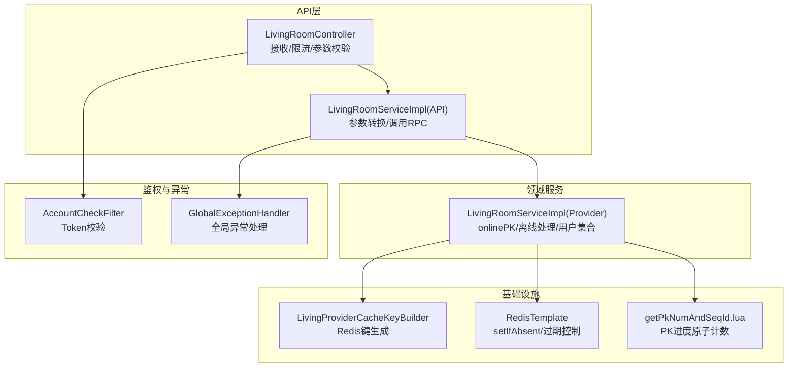
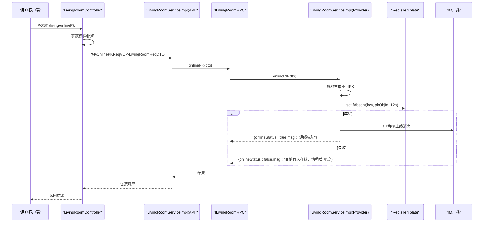
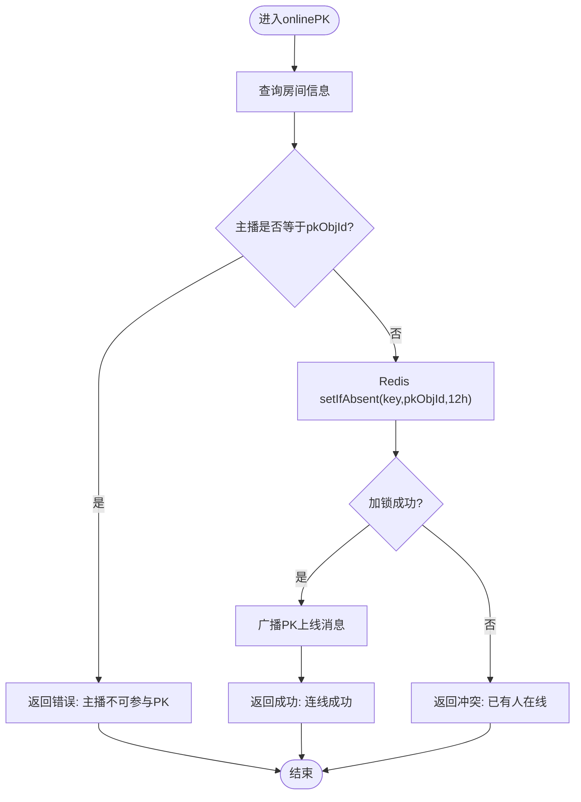
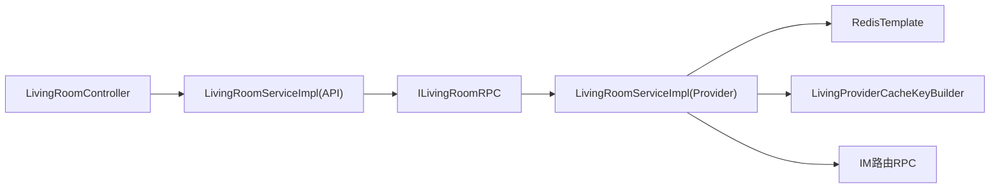

# PK连线机制

<cite>
**本文引用的文件**
- [LivingRoomServiceImpl.java](file://live-living-provider/src/main/java/com/logilong/live/living/provider/service/impl/LivingRoomServiceImpl.java)
- [LivingProviderCacheKeyBuilder.java](file://live-framework/live-framework-redis-starter/src/main/java/com/logilong/live/framework/redis/starter/key/LivingProviderCacheKeyBuilder.java)
- [LivingRoomReqDTO.java](file://live-living-interface/src/main/java/com/logilong/live/living/interfaces/dto/LivingRoomReqDTO.java)
- [LivingPkRespDTO.java](file://live-living-interface/src/main/java/com/logilong/live/living/interfaces/dto/LivingPkRespDTO.java)
- [ILivingRoomRPC.java](file://live-living-interface/src/main/java/com/logilong/live/living/interfaces/rpc/ILivingRoomRPC.java)
- [LivingRoomController.java](file://live-api/src/main/Java/com/logilong/live/api/controller/LivingRoomController.java)
- [LivingRoomServiceImpl.java（API层）](file://live-api/src/main/java/com/logilong/live/api/service/impl/LivingRoomServiceImpl.java)
- [OnlinePKReqVO.java](file://live-api/src/main/java/com/logilong/live/api/vo/req/OnlinePKReqVO.java)
- [getPkNumAndSeqId.lua](file://live-gift-provider/src/main/resources/getPkNumAndSeqId.lua)
- [AccountCheckFilter.java](file://live-gateway/src/main/java/com/logilong/live/gateway/filter/AccountCheckFilter.java)
- [GlobalExceptionHandler.java](file://live-framework/live-framework-web-starter/src/main/java/com/logilong/live/web/starter/error/GlobalExceptionHandler.java)
- [ErrorAssert.java](file://live-framework/live-framework-web-starter/src/main/java/com/logilong/live/web/starter/error/ErrorAssert.java)
</cite>

## 目录
1. [引言](#引言)
2. [项目结构](#项目结构)
3. [核心组件](#核心组件)
4. [架构总览](#架构总览)
5. [详细组件分析](#详细组件分析)
6. [依赖关系分析](#依赖关系分析)
7. [性能考虑](#性能考虑)
8. [故障排查指南](#故障排查指南)
9. [结论](#结论)

## 引言
本文件围绕直播平台的“PK连线”机制展开，重点解析以下内容：
- onlinePK方法如何通过Redis的setIfAbsent原子操作实现分布式锁，防止多个用户同时发起PK请求造成状态冲突
- 主播与PK用户的身份校验逻辑（禁止主播自己参与PK）
- 请求参数LivingRoomReqDTO的结构设计及其在服务间传递的序列化过程
- Redis缓存键生成策略（LivingProviderCacheKeyBuilder.buildLivingOnlinePk）及12小时过期时间的设计考量
- 高并发场景下的性能优化建议与异常处理机制

## 项目结构
PK连线涉及的模块与文件分布如下：
- API网关与控制器：负责接收前端请求、鉴权与转发
- API服务层：封装业务参数转换与调用RPC
- 生活间服务提供方：实现核心业务逻辑（含分布式锁、IM广播、用户集合管理）
- Redis键构建器：统一生成直播相关缓存键
- 接口定义：DTO与RPC接口契约
- Lua脚本：用于PK进度与序列号的原子计数

图表来源
- [LivingRoomController.java](file://live-api/src/main/Java/com/logilong/live/api/controller/LivingRoomController.java#L1-L96)
- [LivingRoomServiceImpl.java（API层）](file://live-api/src/main/java/com/logilong/live/api/service/impl/LivingRoomServiceImpl.java#L1-L160)
- [LivingRoomServiceImpl.java（Provider层）](file://live-living-provider/src/main/java/com/logilong/live/living/provider/service/impl/LivingRoomServiceImpl.java#L1-L294)
- [LivingProviderCacheKeyBuilder.java](file://live-framework/live-framework-redis-starter/src/main/java/com/logilong/live/framework/redis/starter/key/LivingProviderCacheKeyBuilder.java#L1-L40)
- [getPkNumAndSeqId.lua](file://live-gift-provider/src/main/resources/getPkNumAndSeqId.lua#L1-L17)
- [AccountCheckFilter.java](file://live-gateway/src/main/java/com/logilong/live/gateway/filter/AccountCheckFilter.java#L76-L100)
- [GlobalExceptionHandler.java](file://live-framework/live-framework-web-starter/src/main/java/com/logilong/live/web/starter/error/GlobalExceptionHandler.java#L1-L32)

章节来源
- [LivingRoomController.java](file://live-api/src/main/Java/com/logilong/live/api/controller/LivingRoomController.java#L1-L96)
- [LivingRoomServiceImpl.java（API层）](file://live-api/src/main/java/com/logilong/live/api/service/impl/LivingRoomServiceImpl.java#L1-L160)
- [LivingRoomServiceImpl.java（Provider层）](file://live-living-provider/src/main/java/com/logilong/live/living/provider/service/impl/LivingRoomServiceImpl.java#L1-L294)
- [LivingProviderCacheKeyBuilder.java](file://live-framework/live-framework-redis-starter/src/main/java/com/logilong/live/framework/redis/starter/key/LivingProviderCacheKeyBuilder.java#L1-L40)
- [getPkNumAndSeqId.lua](file://live-gift-provider/src/main/resources/getPkNumAndSeqId.lua#L1-L17)
- [AccountCheckFilter.java](file://live-gateway/src/main/java/com/logilong/live/gateway/filter/AccountCheckFilter.java#L76-L100)
- [GlobalExceptionHandler.java](file://live-framework/live-framework-web-starter/src/main/java/com/logilong/live/web/starter/error/GlobalExceptionHandler.java#L1-L32)

## 核心组件
- 在线PK服务实现：Provider侧的LivingRoomServiceImpl在线上PK流程中承担核心职责，包括身份校验、分布式锁、IM广播与用户集合维护
- Redis键构建器：LivingProviderCacheKeyBuilder统一生成直播相关缓存键，确保命名规范与可维护性
- DTO与RPC接口：LivingRoomReqDTO作为跨服务传递的核心载体；ILivingRoomRPC定义了在线PK、离线PK、查询在线PK用户等能力
- API层适配：API侧LivingRoomController负责限流与参数校验；LivingRoomServiceImpl(API)负责将VO转换为DTO并注入上下文用户信息后调用RPC

章节来源
- [LivingRoomServiceImpl.java（Provider层）](file://live-living-provider/src/main/java/com/logilong/live/living/provider/service/impl/LivingRoomServiceImpl.java#L223-L248)
- [LivingProviderCacheKeyBuilder.java](file://live-framework/live-framework-redis-starter/src/main/java/com/logilong/live/framework/redis/starter/key/LivingProviderCacheKeyBuilder.java#L1-L40)
- [ILivingRoomRPC.java](file://live-living-interface/src/main/java/com/logilong/live/living/interfaces/rpc/ILivingRoomRPC.java#L1-L59)
- [LivingRoomController.java](file://live-api/src/main/Java/com/logilong/live/api/controller/LivingRoomController.java#L42-L47)
- [LivingRoomServiceImpl.java（API层）](file://live-api/src/main/java/com/logilong/live/api/service/impl/LivingRoomServiceImpl.java#L69-L77)

## 架构总览
PK连线的整体调用链路如下：
- 前端通过API控制器提交在线PK请求
- API层进行参数校验与限流，并将OnlinePKReqVO转换为LivingRoomReqDTO，注入应用ID与当前用户ID
- 调用LivingRoomRPC的onlinePK方法
- Provider侧LivingRoomServiceImpl执行：
  - 校验主播不可参与PK
  - 基于Redis的setIfAbsent原子操作加分布式锁，12小时过期
  - 成功后向房间内所有用户广播PK上线消息
  - 返回结果

图表来源
- [LivingRoomController.java](file://live-api/src/main/Java/com/logilong/live/api/controller/LivingRoomController.java#L42-L47)
- [LivingRoomServiceImpl.java（API层）](file://live-api/src/main/java/com/logilong/live/api/service/impl/LivingRoomServiceImpl.java#L69-L77)
- [ILivingRoomRPC.java](file://live-living-interface/src/main/java/com/logilong/live/living/interfaces/rpc/ILivingRoomRPC.java#L44-L58)
- [LivingRoomServiceImpl.java（Provider层）](file://live-living-provider/src/main/java/com/logilong/live/living/provider/service/impl/LivingRoomServiceImpl.java#L223-L248)

## 详细组件分析

### onlinePK方法与分布式锁
- 身份校验：若请求中的pkObjId等于房间的anchorId，则拒绝连线，提示“主播不可以连线参与PK”
- 分布式锁：通过RedisTemplate的setIfAbsent(key, value, expireUnit)实现原子性加锁，value为pkObjId，过期时间为12小时
- 成功分支：向房间内所有在线用户广播PK上线消息；返回onlineStatus=true
- 失败分支：返回onlineStatus=false与提示语“目前有人在线，请稍后再试”

图表来源
- [LivingRoomServiceImpl.java（Provider层）](file://live-living-provider/src/main/java/com/logilong/live/living/provider/service/impl/LivingRoomServiceImpl.java#L223-L248)

章节来源
- [LivingRoomServiceImpl.java（Provider层）](file://live-living-provider/src/main/java/com/logilong/live/living/provider/service/impl/LivingRoomServiceImpl.java#L223-L248)

### Redis缓存键生成策略
- 键前缀与分隔符由基类统一管理，确保键名风格一致
- 在线PK键：buildLivingOnlinePk(roomId)生成“living_online_pk:roomId”形式的键
- 用户集合键：buildLivingRoomUserSet(roomId, appId)生成“living_room_user_set:appId:roomId”，用于存储房间内用户ID集合
- 列表与对象缓存键：buildLivingRoomList(type)、buildLivingRoomObj(roomId)等，用于房间列表与房间对象缓存

章节来源
- [LivingProviderCacheKeyBuilder.java](file://live-framework/live-framework-redis-starter/src/main/java/com/logilong/live/framework/redis/starter/key/LivingProviderCacheKeyBuilder.java#L1-L40)

### 请求参数LivingRoomReqDTO的结构与序列化
- 结构设计要点：
  - 包含roomId、anchorId、pkObjId、appId、type、分页参数等字段，满足在线PK与房间查询的需要
  - 作为跨服务传递的DTO，需具备序列化能力
- 序列化过程：
  - API层将OnlinePKReqVO转换为LivingRoomReqDTO，注入AppIdEnum与当前用户ID
  - 通过Dubbo RPC传输LivingRoomReqDTO至Provider侧
  - Provider侧再进行业务处理（身份校验、分布式锁、IM广播）

章节来源
- [LivingRoomReqDTO.java](file://live-living-interface/src/main/java/com/logilong/live/living/interfaces/dto/LivingRoomReqDTO.java#L1-L27)
- [LivingRoomServiceImpl.java（API层）](file://live-api/src/main/java/com/logilong/live/api/service/impl/LivingRoomServiceImpl.java#L69-L77)
- [ILivingRoomRPC.java](file://live-living-interface/src/main/java/com/logilong/live/living/interfaces/rpc/ILivingRoomRPC.java#L44-L58)

### PK进度与序列号的原子计数（Lua）
- Lua脚本用于PK进度与序列号的原子计数，包含初始化、范围判断与自增逻辑
- 12小时过期设置，确保长时间PK任务的持久性与资源回收平衡

章节来源
- [getPkNumAndSeqId.lua](file://live-gift-provider/src/main/resources/getPkNumAndSeqId.lua#L1-L17)

### 身份校验与鉴权
- 网关层：AccountCheckFilter从Cookie中提取token，调用RPC验证合法性，合法则将userId写入请求头
- API层：LivingRoomServiceImpl在onlinePk中将当前用户ID注入DTO，供Provider侧校验
- Provider侧：若pkObjId等于anchorId，直接拒绝

章节来源
- [AccountCheckFilter.java](file://live-gateway/src/main/java/com/logilong/live/gateway/filter/AccountCheckFilter.java#L76-L100)
- [LivingRoomServiceImpl.java（API层）](file://live-api/src/main/java/com/logilong/live/api/service/impl/LivingRoomServiceImpl.java#L69-L77)
- [LivingRoomServiceImpl.java（Provider层）](file://live-living-provider/src/main/java/com/logilong/live/living/provider/service/impl/LivingRoomServiceImpl.java#L223-L248)

## 依赖关系分析
- 控制器依赖API服务；API服务依赖RPC接口；Provider实现RPC接口
- Provider依赖RedisTemplate与IM路由RPC进行广播
- Redis键构建器为Provider提供统一的键生成策略
- DTO与RPC接口定义了清晰的契约边界

图表来源
- [LivingRoomController.java](file://live-api/src/main/Java/com/logilong/live/api/controller/LivingRoomController.java#L1-L96)
- [LivingRoomServiceImpl.java（API层）](file://live-api/src/main/java/com/logilong/live/api/service/impl/LivingRoomServiceImpl.java#L1-L160)
- [ILivingRoomRPC.java](file://live-living-interface/src/main/java/com/logilong/live/living/interfaces/rpc/ILivingRoomRPC.java#L1-L59)
- [LivingRoomServiceImpl.java（Provider层）](file://live-living-provider/src/main/java/com/logilong/live/living/provider/service/impl/LivingRoomServiceImpl.java#L1-L294)
- [LivingProviderCacheKeyBuilder.java](file://live-framework/live-framework-redis-starter/src/main/java/com/logilong/live/framework/redis/starter/key/LivingProviderCacheKeyBuilder.java#L1-L40)

## 性能考虑
- Redis setIfAbsent原子锁：避免竞态条件，减少重复广播与状态冲突
- 12小时过期策略：兼顾长时间PK任务的持续性与资源回收，建议结合业务峰值评估是否需要动态调整
- IM广播：Provider侧按房间用户集合批量广播，避免逐条发送带来的网络与CPU压力
- 用户集合扫描：使用SCAN分批遍历，避免一次性拉取大量SET元素导致阻塞
- API层限流：控制器对在线PK接口进行限流，降低瞬时并发冲击

章节来源
- [LivingRoomServiceImpl.java（Provider层）](file://live-living-provider/src/main/java/com/logilong/live/living/provider/service/impl/LivingRoomServiceImpl.java#L210-L221)
- [LivingRoomController.java](file://live-api/src/main/Java/com/logilong/live/api/controller/LivingRoomController.java#L42-L47)

## 故障排查指南
- 参数校验失败：API层使用ErrorAssert进行参数校验，若不满足条件抛出业务异常
- 全局异常处理：GlobalExceptionHandler捕获业务异常并返回标准化响应
- Token失效：网关层AccountCheckFilter拦截无效token请求
- 在线PK冲突：若Redis加锁失败，返回“目前有人在线，请稍后再试”，提示用户重试

章节来源
- [ErrorAssert.java](file://live-framework/live-framework-web-starter/src/main/java/com/logilong/live/web/starter/error/ErrorAssert.java#L1-L54)
- [GlobalExceptionHandler.java](file://live-framework/live-framework-web-starter/src/main/java/com/logilong/live/web/starter/error/GlobalExceptionHandler.java#L1-L32)
- [AccountCheckFilter.java](file://live-gateway/src/main/java/com/logilong/live/gateway/filter/AccountCheckFilter.java#L76-L100)
- [LivingRoomServiceImpl.java（Provider层）](file://live-living-provider/src/main/java/com/logilong/live/living/provider/service/impl/LivingRoomServiceImpl.java#L223-L248)

## 结论
本机制通过Redis原子锁与严格的用户身份校验，有效避免了多用户并发发起PK请求引发的状态冲突；通过IM广播与用户集合管理，实现了房间内实时通知；通过限流与Lua原子计数，保障了高并发场景下的稳定性与一致性。建议在高峰期结合业务特征对过期时间与限流阈值进行动态调整，以获得更优的用户体验与系统性能。