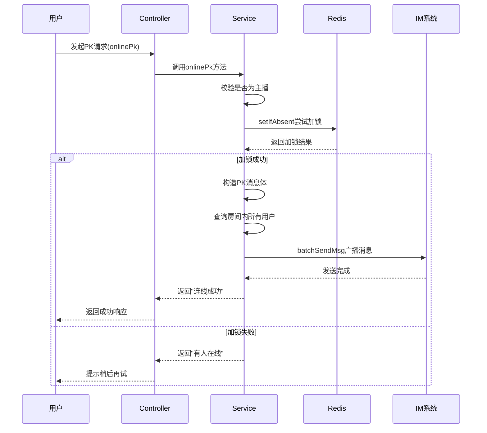
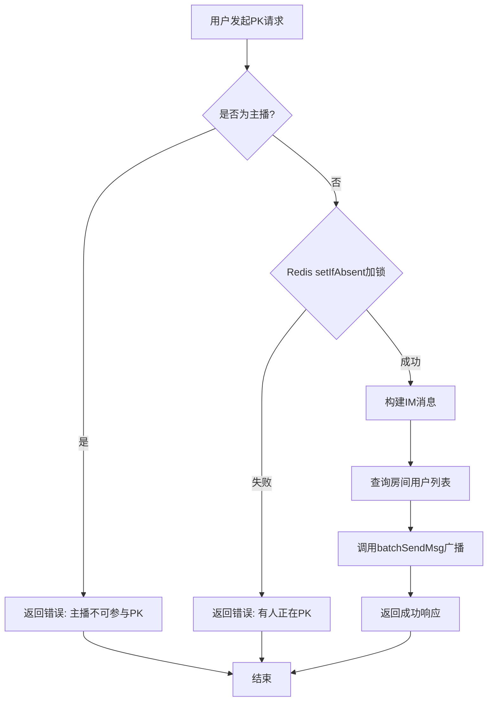

# 直播间PK功能

<cite>
**本文档引用文件**  
- [LivingRoomController.java](file://live-api/src/main/java/com/logilong/live/api/controller/LivingRoomController.java)
- [LivingRoomServiceImpl.java](file://live-living-provider/src/main/java/com/logilong/live/living/provider/service/impl/LivingRoomServiceImpl.java)
- [OnlinePKReqVO.java](file://live-api/src/main/java/com/logilong/live/api/vo/req/OnlinePKReqVO.java)
- [LivingPkRespDTO.java](file://live-living-interface/src/main/java/com/logilong/live/living/interfaces/dto/LivingPkRespDTO.java)
- [ImRouterRPC.java](file://live-im-router-interface/src/main/java/com/logilong/live/im/router/interfaces/ImRouterRPC.java)
- [ImMsgBizCodeEnum.java](file://live-im-router-interface/src/main/java/com/logilong/live/im/router/constants/ImMsgBizCodeEnum.java)
- [LivingProviderCacheKeyBuilder.java](file://live-framework/live-framework-redis-starter/src/main/java/com/logilong/live/framework/redis/starter/key/LivingProviderCacheKeyBuilder.java)
- [getPkNumAndSeqId.lua](file://live-gift-provider/src/main/resources/getPkNumAndSeqId.lua)
</cite>

## 目录
1. [简介](#简介)
2. [核心组件](#核心组件)
3. [PK连线机制](#pk连线机制)
4. [PK状态管理](#pk状态管理)
5. [实时消息通知](#实时消息通知)
6. [异常处理与高可用设计](#异常处理与高可用设计)
7. [流程图示](#流程图示)

## 简介
直播间PK功能是直播平台中的核心互动机制，支持主播与其他用户进行实时连线对战。本系统通过Redis实现分布式锁、状态维护和原子操作，确保PK过程的线程安全与数据一致性。同时，利用IM消息系统实现直播间内广播通知，提升用户体验。

## 核心组件

**Section sources**
- [LivingRoomController.java](file://live-api/src/main/java/com/logilong/live/api/controller/LivingRoomController.java#L42-L47)
- [LivingRoomServiceImpl.java](file://live-living-provider/src/main/java/com/logilong/live/living/provider/service/impl/LivingRoomServiceImpl.java#L224-L248)
- [OnlinePKReqVO.java](file://live-api/src/main/java/com/logilong/live/api/vo/req/OnlinePKReqVO.java#L6-L9)
- [LivingPkRespDTO.java](file://live-living-interface/src/main/java/com/logilong/live/living/interfaces/dto/LivingPkRespDTO.java#L8-L15)

## PK连线机制

### PK锁机制（基于Redis setIfAbsent）
PK连线的核心在于防止多人同时连线同一主播。系统通过`RedisTemplate.opsForValue().setIfAbsent()`实现原子性加锁操作：

- **缓存键构建**：使用`LivingProviderCacheKeyBuilder.buildLivingOnlinePk(roomId)`生成唯一键，格式为`{前缀}:living_online_pk:{roomId}`。
- **原子操作**：`setIfAbsent`确保只有第一个请求能成功设置值，后续请求将返回false，从而实现排他性。
- **过期策略**：设置12小时过期时间，避免死锁。

该机制有效防止了并发场景下的资源竞争问题。

### 主播身份校验
在执行PK连线前，系统会校验请求用户是否为主播本人：
```java
if (currentLivingRoom.getAnchorId().equals(livingRoomReqDTO.getPkObjId())) {
    respDTO.setMsg("主播不可以连线参与PK");
    return respDTO;
}
```
此逻辑防止主播自我连线，保障业务规则的正确执行。

**Section sources**
- [LivingRoomServiceImpl.java](file://live-living-provider/src/main/java/com/logilong/live/living/provider/service/impl/LivingRoomServiceImpl.java#L228-L230)
- [LivingProviderCacheKeyBuilder.java](file://live-framework/live-framework-redis-starter/src/main/java/com/logilong/live/framework/redis/starter/key/LivingProviderCacheKeyBuilder.java#L20-L22)

## PK状态管理

### 在线PK用户查询
通过`queryOnlinePkUserId(Integer roomId)`方法从Redis中获取当前正在PK的用户ID：
```java
return (Long) redisTemplate.opsForValue().get(cacheKey);
```
该方法用于判断当前是否有用户正在进行PK，支持前端展示状态。

### PK下线处理
`offlinePk(LivingRoomReqDTO)`方法用于清理PK状态：
```java
return Boolean.TRUE.equals(redisTemplate.delete(cacheKey));
```
直接删除Redis中的PK记录键，完成状态清除。

**Section sources**
- [LivingRoomServiceImpl.java](file://live-living-provider/src/main/java/com/logilong/live/living/provider/service/impl/LivingRoomServiceImpl.java#L274-L277)
- [LivingRoomServiceImpl.java](file://live-living-provider/src/main/java/com/logilong/live/living/provider/service/impl/LivingRoomServiceImpl.java#L268-L271)

## 实时消息通知

### 消息广播机制
PK成功后，系统调用`ImRouterRPC.batchSendMsg`向直播间所有用户发送通知：

1. **获取用户列表**：通过`queryUserIdsByRoomId()`从Redis Set中获取当前房间所有在线用户ID。
2. **构建消息体**：创建包含`pkObjId`和`pkObjAvatar`的JSON对象。
3. **批量发送**：封装为`ImMsgBody`列表，调用RPC批量发送。

### 消息体构造
消息体包含以下关键字段：
- **appId**：固定为`AppIdEnum.LIVE_BIZ.getCode()`
- **bizCode**：使用`ImMsgBizCodeEnum.LIVING_ROOM_PK_ONLINE.getCode()`（值为5559）
- **data**：JSON字符串，包含PK用户ID和头像信息
- **userId**：接收用户ID

### 业务码定义
`ImMsgBizCodeEnum.LIVING_ROOM_PK_ONLINE`用于标识PK上线事件，客户端据此解析并展示相应UI。

**Section sources**
- [LivingRoomServiceImpl.java](file://live-living-provider/src/main/java/com/logilong/live/living/provider/service/impl/LivingRoomServiceImpl.java#L237-L242)
- [ImRouterRPC.java](file://live-im-router-interface/src/main/java/com/logilong/live/im/router/interfaces/ImRouterRPC.java#L18)
- [ImMsgBizCodeEnum.java](file://live-im-router-interface/src/main/java/com/logilong/live/im/router/constants/ImMsgBizCodeEnum.java#L17)

## 异常处理与高可用设计

### 异常处理机制
- **重复连线**：当已有用户PK时，返回"目前有人在线，请稍后再试"
- **参数校验**：Controller层对`roomId`进行非空校验
- **身份校验**：禁止主播自己参与PK
- **事务控制**：关键操作使用`@Transactional`保证数据一致性

### 高可用设计
- **Redis缓存**：所有状态信息存储于Redis，支持高并发读写
- **过期机制**：设置12小时自动过期，防止状态滞留
- **分批扫描**：使用`scan`操作避免大数据集阻塞Redis
- **空值缓存**：防止缓存穿透
- **MQ异步处理**：解耦业务逻辑，提升响应速度

**Section sources**
- [LivingRoomServiceImpl.java](file://live-living-provider/src/main/java/com/logilong/live/living/provider/service/impl/LivingRoomServiceImpl.java#L246-L247)
- [LivingRoomController.java](file://live-api/src/main/java/com/logilong/live/api/controller/LivingRoomController.java#L45)
- [LivingRoomServiceImpl.java](file://live-living-provider/src/main/java/com/logilong/live/living/provider/service/impl/LivingRoomServiceImpl.java#L215-L220)

## 流程图示



**Diagram sources**
- [LivingRoomController.java](file://live-api/src/main/java/com/logilong/live/api/controller/LivingRoomController.java#L42-L47)
- [LivingRoomServiceImpl.java](file://live-living-provider/src/main/java/com/logilong/live/living/provider/service/impl/LivingRoomServiceImpl.java#L224-L248)
- [ImRouterRPC.java](file://live-im-router-interface/src/main/java/com/logilong/live/im/router/interfaces/ImRouterRPC.java#L18)



**Diagram sources**
- [LivingRoomServiceImpl.java](file://live-living-provider/src/main/java/com/logilong/live/living/provider/service/impl/LivingRoomServiceImpl.java#L228-L235)
- [LivingRoomServiceImpl.java](file://live-living-provider/src/main/java/com/logilong/live/living/provider/service/impl/LivingRoomServiceImpl.java#L237-L242)