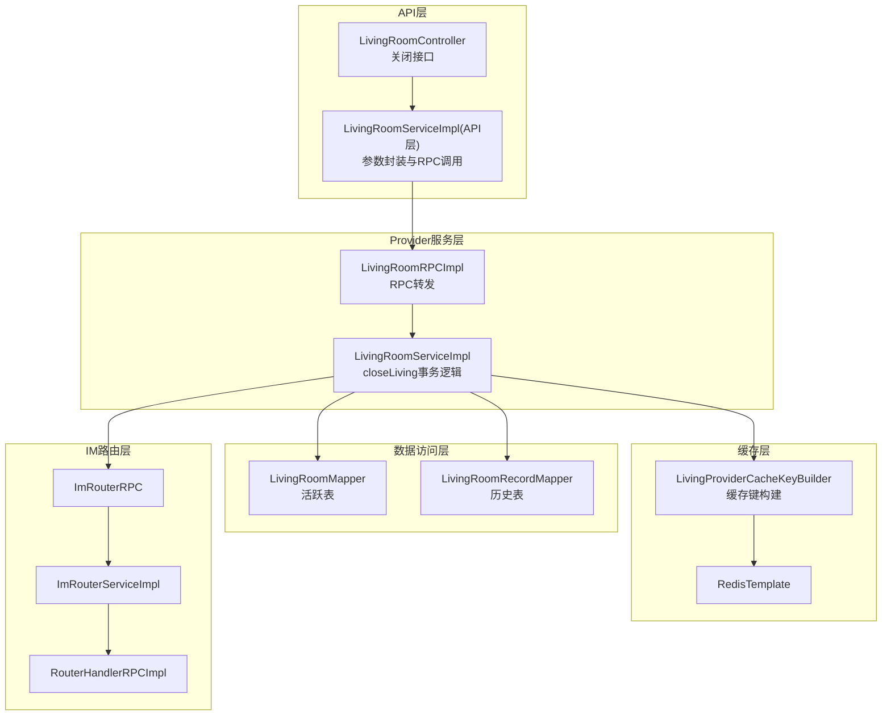
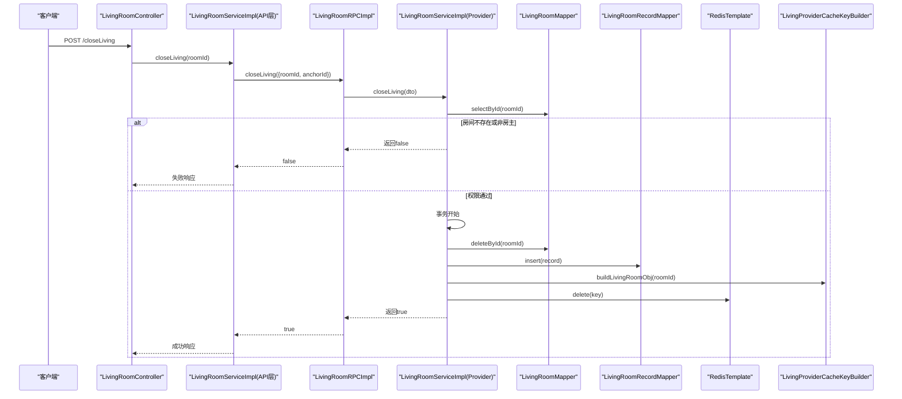
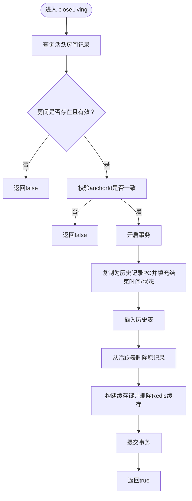
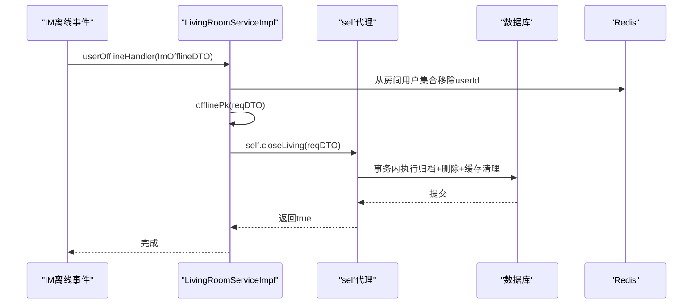
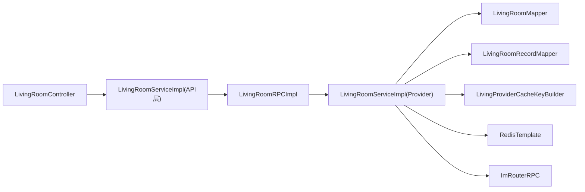

# 关播流程详解

<cite>
**本文引用的文件**
- [LivingRoomServiceImpl.java](file://live-living-provider/src/main/java/com/logilong/live/living/provider/service/impl/LivingRoomServiceImpl.java)
- [ILivingRoomService.java](file://live-living-provider/src/main/java/com/logilong/live/living/provider/service/ILivingRoomService.java)
- [LivingRoomRPCImpl.java](file://live-living-provider/src/main/java/com/logilong/live/living/provider/rpc/LivingRoomRPCImpl.java)
- [LivingRoomController.java](file://live-api/src/main/java/com/logilong/live/api/controller/LivingRoomController.java)
- [LivingRoomServiceImpl.java（API层）](file://live-api/src/main/java/com/logilong/live/api/service/impl/LivingRoomServiceImpl.java)
- [LivingRoomPO.java](file://live-living-provider/src/main/java/com/logilong/live/living/provider/dao/po/LivingRoomPO.java)
- [LivingRoomRecordPO.java](file://live-living-provider/src/main/java/com/logilong/live/living/provider/dao/po/LivingRoomRecordPO.java)
- [LivingRoomMapper.java](file://live-living-provider/src/main/java/com/logilong/live/living/provider/dao/mapper/LivingRoomMapper.java)
- [LivingRoomRecordMapper.java](file://live-living-provider/src/main/java/com/logilong/live/living/provider/dao/mapper/LivingRoomRecordMapper.java)
- [LivingProviderCacheKeyBuilder.java](file://live-framework/live-framework-redis-starter/src/main/java/com/logilong/live/framework/redis/starter/key/LivingProviderCacheKeyBuilder.java)
- [RedisKeyBuilder.java](file://live-framework/live-framework-redis-starter/src/main/java/com/logilong/live/framework/redis/starter/key/RedisKeyBuilder.java)
- [ImOfflineDTO.java](file://live-im-core-server-interfaces/src/main/java/com/logilong/live/im/core/server/interfaces/dto/ImOfflineDTO.java)
- [ImRouterRPC.java](file://live-im-router-interface/src/main/java/com/logilong/live/im/router/interfaces/ImRouterRPC.java)
- [ImRouterServiceImpl.java](file://live-im-router-provider/src/main/java/com/logilong/live/im/router/provider/service/impl/ImRouterServiceImpl.java)
- [RouterHandlerRPCImpl.java](file://live-im-core-server/src/main/java/com/logilong/live/im/core/server/rpc/RouterHandlerRPCImpl.java)
- [GlobalExceptionHandler.java](file://live-framework/live-framework-web-starter/src/main/java/com/logilong/live/web/starter/error/GlobalExceptionHandler.java)
</cite>

## 目录
1. [引言](#引言)
2. [项目结构](#项目结构)
3. [核心组件](#核心组件)
4. [架构总览](#架构总览)
5. [详细组件分析](#详细组件分析)
6. [依赖关系分析](#依赖关系分析)
7. [性能考虑](#性能考虑)
8. [故障排查指南](#故障排查指南)
9. [结论](#结论)

## 引言
本文件围绕“关播流程”的技术实现与事务管理展开，重点解析以下内容：
- closeLiving方法的事务性操作：包含房间存在性校验、主播身份权限校验、数据归档与活跃表删除、Redis缓存清理。
- 事务注解@Transactional(rollbackFor = Exception.class)的作用机制与异常回滚保障。
- 自动关播机制：当主播IM连接断开时，通过self代理调用closeLiving实现状态同步。
- 代理模式解决事务失效的设计考量与最佳实践建议。

## 项目结构
直播关播相关能力分布在多个模块：
- API网关层：对外暴露关闭接口，封装鉴权与参数校验。
- Provider服务层：实现业务逻辑，包含事务、缓存与消息发送。
- 数据访问层：MyBatis Mapper负责持久化。
- 缓存层：RedisKeyBuilder统一构建缓存键，提供缓存清理。
- IM路由层：负责消息路由与批量发送。

图表来源
- [LivingRoomController.java](file://live-api/src/main/java/com/logilong/live/api/controller/LivingRoomController.java#L48-L57)
- [LivingRoomServiceImpl.java（API层）](file://live-api/src/main/java/com/logilong/live/api/service/impl/LivingRoomServiceImpl.java#L79-L85)
- [LivingRoomRPCImpl.java](file://live-living-provider/src/main/java/com/logilong/live/living/provider/rpc/LivingRoomRPCImpl.java#L29-L33)
- [LivingRoomServiceImpl.java](file://live-living-provider/src/main/java/com/logilong/live/living/provider/service/impl/LivingRoomServiceImpl.java#L88-L107)
- [LivingRoomMapper.java](file://live-living-provider/src/main/java/com/logilong/live/living/provider/dao/mapper/LivingRoomMapper.java#L1-L10)
- [LivingRoomRecordMapper.java](file://live-living-provider/src/main/java/com/logilong/live/living/provider/dao/mapper/LivingRoomRecordMapper.java#L1-L12)
- [LivingProviderCacheKeyBuilder.java](file://live-framework/live-framework-redis-starter/src/main/java/com/logilong/live/framework/redis/starter/key/LivingProviderCacheKeyBuilder.java#L1-L39)
- [ImRouterRPC.java](file://live-im-router-interface/src/main/java/com/logilong/live/im/router/interfaces/ImRouterRPC.java#L1-L19)
- [ImRouterServiceImpl.java](file://live-im-router-provider/src/main/java/com/logilong/live/im/router/provider/service/impl/ImRouterServiceImpl.java#L39-L76)
- [RouterHandlerRPCImpl.java](file://live-im-core-server/src/main/java/com/logilong/live/im/core/server/rpc/RouterHandlerRPCImpl.java#L1-L28)

章节来源
- [LivingRoomController.java](file://live-api/src/main/java/com/logilong/live/api/controller/LivingRoomController.java#L48-L57)
- [LivingRoomServiceImpl.java（API层）](file://live-api/src/main/java/com/logilong/live/api/service/impl/LivingRoomServiceImpl.java#L79-L85)
- [LivingRoomRPCImpl.java](file://live-living-provider/src/main/java/com/logilong/live/living/provider/rpc/LivingRoomRPCImpl.java#L29-L33)
- [LivingRoomServiceImpl.java](file://live-living-provider/src/main/java/com/logilong/live/living/provider/service/impl/LivingRoomServiceImpl.java#L88-L107)

## 核心组件
- 关闭接口入口：API控制器接收关闭请求，参数校验后调用API服务层。
- API服务层：补充anchorId并调用RPC接口转发至Provider服务层。
- Provider服务层：实现closeLiving事务逻辑，包含权限校验、数据归档、活跃表删除、缓存清理。
- 数据访问层：LivingRoomMapper负责活跃表的查询与删除；LivingRoomRecordMapper负责历史表的插入。
- 缓存层：LivingProviderCacheKeyBuilder统一构建直播房间对象缓存键，RedisTemplate执行删除。
- IM路由层：用于向房间内用户广播消息（与关播流程无直接事务关系，但体现整体链路）。

章节来源
- [LivingRoomController.java](file://live-api/src/main/java/com/logilong/live/api/controller/LivingRoomController.java#L48-L57)
- [LivingRoomServiceImpl.java（API层）](file://live-api/src/main/java/com/logilong/live/api/service/impl/LivingRoomServiceImpl.java#L79-L85)
- [ILivingRoomService.java](file://live-living-provider/src/main/java/com/logilong/live/living/provider/service/ILivingRoomService.java#L13-L24)
- [LivingRoomServiceImpl.java](file://live-living-provider/src/main/java/com/logilong/live/living/provider/service/impl/LivingRoomServiceImpl.java#L88-L107)
- [LivingRoomMapper.java](file://live-living-provider/src/main/java/com/logilong/live/living/provider/dao/mapper/LivingRoomMapper.java#L1-L10)
- [LivingRoomRecordMapper.java](file://live-living-provider/src/main/java/com/logilong/live/living/provider/dao/mapper/LivingRoomRecordMapper.java#L1-L12)
- [LivingProviderCacheKeyBuilder.java](file://live-framework/live-framework-redis-starter/src/main/java/com/logilong/live/framework/redis/starter/key/LivingProviderCacheKeyBuilder.java#L1-L39)

## 架构总览
下面的序列图展示了从API到Provider再到数据库与缓存的整体调用链路，以及事务注解在Provider层的作用范围。

图表来源
- [LivingRoomController.java](file://live-api/src/main/java/com/logilong/live/api/controller/LivingRoomController.java#L48-L57)
- [LivingRoomServiceImpl.java（API层）](file://live-api/src/main/java/com/logilong/live/api/service/impl/LivingRoomServiceImpl.java#L79-L85)
- [LivingRoomRPCImpl.java](file://live-living-provider/src/main/java/com/logilong/live/living/provider/rpc/LivingRoomRPCImpl.java#L29-L33)
- [LivingRoomServiceImpl.java](file://live-living-provider/src/main/java/com/logilong/live/living/provider/service/impl/LivingRoomServiceImpl.java#L88-L107)
- [LivingRoomMapper.java](file://live-living-provider/src/main/java/com/logilong/live/living/provider/dao/mapper/LivingRoomMapper.java#L1-L10)
- [LivingRoomRecordMapper.java](file://live-living-provider/src/main/java/com/logilong/live/living/provider/dao/mapper/LivingRoomRecordMapper.java#L1-L12)
- [LivingProviderCacheKeyBuilder.java](file://live-framework/live-framework-redis-starter/src/main/java/com/logilong/live/framework/redis/starter/key/LivingProviderCacheKeyBuilder.java#L32-L34)

## 详细组件分析

### 关闭接口与参数封装
- API控制器对roomId进行必填校验，并调用API服务层的closeLiving方法。
- API服务层从上下文获取anchorId，构造LivingRoomReqDTO并调用RPC接口转发至Provider服务层。

章节来源
- [LivingRoomController.java](file://live-api/src/main/java/com/logilong/live/api/controller/LivingRoomController.java#L48-L57)
- [LivingRoomServiceImpl.java（API层）](file://live-api/src/main/java/com/logilong/live/api/service/impl/LivingRoomServiceImpl.java#L79-L85)

### Provider服务层：closeLiving事务逻辑
- 事务注解：@Transactional(rollbackFor = Exception.class)，确保发生异常时回滚。
- 权限校验：仅允许房间创建者（anchorId一致）执行关闭。
- 数据归档：将当前LivingRoomPO复制为LivingRoomRecordPO，设置结束时间与无效状态，插入历史表。
- 删除活跃记录：从活跃表LivingRoomMapper中按ID删除。
- 缓存清理：通过LivingProviderCacheKeyBuilder构建直播房间对象缓存键并删除Redis缓存。

图表来源
- [LivingRoomServiceImpl.java](file://live-living-provider/src/main/java/com/logilong/live/living/provider/service/impl/LivingRoomServiceImpl.java#L88-L107)
- [LivingRoomPO.java](file://live-living-provider/src/main/java/com/logilong/live/living/provider/dao/po/LivingRoomPO.java#L1-L26)
- [LivingRoomRecordPO.java](file://live-living-provider/src/main/java/com/logilong/live/living/provider/dao/po/LivingRoomRecordPO.java#L1-L27)
- [LivingRoomMapper.java](file://live-living-provider/src/main/java/com/logilong/live/living/provider/dao/mapper/LivingRoomMapper.java#L1-L10)
- [LivingRoomRecordMapper.java](file://live-living-provider/src/main/java/com/logilong/live/living/provider/dao/mapper/LivingRoomRecordMapper.java#L1-L12)
- [LivingProviderCacheKeyBuilder.java](file://live-framework/live-framework-redis-starter/src/main/java/com/logilong/live/framework/redis/starter/key/LivingProviderCacheKeyBuilder.java#L32-L34)

章节来源
- [LivingRoomServiceImpl.java](file://live-living-provider/src/main/java/com/logilong/live/living/provider/service/impl/LivingRoomServiceImpl.java#L88-L107)

### 事务注解与异常回滚保障
- 作用范围：closeLiving方法位于Provider服务层，事务边界覆盖数据归档与删除操作。
- 回滚条件：rollbackFor = Exception.class，任何运行时异常均触发回滚，保证数据一致性。
- 设计要点：即使在同进程内调用，若通过Spring代理调用（如self.closeLiving），也能正确织入事务切面，避免因自调用导致的事务失效。

章节来源
- [LivingRoomServiceImpl.java](file://live-living-provider/src/main/java/com/logilong/live/living/provider/service/impl/LivingRoomServiceImpl.java#L88-L107)

### 数据模型与归档逻辑
- 活跃表字段：LivingRoomPO包含房间ID、主播ID、类型、封面、状态、观看数、点赞数、开始时间等。
- 历史表字段：LivingRoomRecordPO在活跃表基础上新增结束时间、无效状态及更新时间，便于审计与统计。
- 归档流程：先插入历史记录，再删除活跃记录，确保历史可追溯。

章节来源
- [LivingRoomPO.java](file://live-living-provider/src/main/java/com/logilong/live/living/provider/dao/po/LivingRoomPO.java#L1-L26)
- [LivingRoomRecordPO.java](file://live-living-provider/src/main/java/com/logilong/live/living/provider/dao/po/LivingRoomRecordPO.java#L1-L27)

### Redis缓存清理策略
- 键构建：LivingProviderCacheKeyBuilder提供buildLivingRoomObj(roomId)生成直播房间对象缓存键。
- 清理时机：关播完成后立即删除该缓存键，避免脏读。
- 其他缓存：服务层还维护了房间用户集合、在线PK等缓存键，但关播流程主要清理房间对象缓存。

章节来源
- [LivingProviderCacheKeyBuilder.java](file://live-framework/live-framework-redis-starter/src/main/java/com/logilong/live/framework/redis/starter/key/LivingProviderCacheKeyBuilder.java#L1-L39)
- [RedisKeyBuilder.java](file://live-framework/live-framework-redis-starter/src/main/java/com/logilong/live/framework/redis/starter/key/RedisKeyBuilder.java#L1-L22)
- [LivingRoomServiceImpl.java](file://live-living-provider/src/main/java/com/logilong/live/living/provider/service/impl/LivingRoomServiceImpl.java#L104-L106)

### 自动关播机制：IM连接断开触发
- 触发点：IM离线事件（ImOfflineDTO）到达Provider服务层的userOfflineHandler。
- 处理流程：移除房间用户集合中的离线用户，尝试下线PK，随后通过self代理调用closeLiving，实现状态同步。
- 设计考量：使用self代理避免自调用绕过事务切面的问题，确保事务生效。

图表来源
- [ImOfflineDTO.java](file://live-im-core-server-interfaces/src/main/java/com/logilong/live/im/core/server/interfaces/dto/ImOfflineDTO.java#L1-L17)
- [LivingRoomServiceImpl.java](file://live-living-provider/src/main/java/com/logilong/live/living/provider/service/impl/LivingRoomServiceImpl.java#L192-L207)

章节来源
- [LivingRoomServiceImpl.java](file://live-living-provider/src/main/java/com/logilong/live/living/provider/service/impl/LivingRoomServiceImpl.java#L192-L207)
- [ImOfflineDTO.java](file://live-im-core-server-interfaces/src/main/java/com/logilong/live/im/core/server/interfaces/dto/ImOfflineDTO.java#L1-L17)

### 代理模式与事务失效规避
- 问题背景：同类内自调用不会经过Spring代理，事务切面无法生效。
- 解决方案：注入自身ILivingRoomService类型的代理引用self，在userOfflineHandler中通过self.closeLiving触发事务方法。
- 实践建议：所有涉及事务的关键路径均应通过代理调用，避免直接this.method()。

章节来源
- [LivingRoomServiceImpl.java](file://live-living-provider/src/main/java/com/logilong/live/living/provider/service/impl/LivingRoomServiceImpl.java#L63-L66)
- [LivingRoomServiceImpl.java](file://live-living-provider/src/main/java/com/logilong/live/living/provider/service/impl/LivingRoomServiceImpl.java#L192-L207)

### IM消息广播（与关播流程的关系）
- 虽然关播本身不直接广播消息，但服务层在PK流程中展示了批量发送IM消息的能力，体现整体链路的消息能力。
- 该能力由ImRouterRPC与ImRouterServiceImpl协作完成，RouterHandlerRPCImpl最终将消息投递至IM核心服务。

章节来源
- [ImRouterRPC.java](file://live-im-router-interface/src/main/java/com/logilong/live/im/router/interfaces/ImRouterRPC.java#L1-L19)
- [ImRouterServiceImpl.java](file://live-im-router-provider/src/main/java/com/logilong/live/im/router/provider/service/impl/ImRouterServiceImpl.java#L39-L76)
- [RouterHandlerRPCImpl.java](file://live-im-core-server/src/main/java/com/logilong/live/im/core/server/rpc/RouterHandlerRPCImpl.java#L1-L28)

## 依赖关系分析
- 控制器依赖API服务层，API服务层依赖RPC接口，RPC接口委托Provider服务层。
- Provider服务层依赖Mapper与RedisTemplate，使用LivingProviderCacheKeyBuilder统一构建缓存键。
- IM路由层通过RPC接口与核心服务交互，支持批量消息发送。

图表来源
- [LivingRoomController.java](file://live-api/src/main/java/com/logilong/live/api/controller/LivingRoomController.java#L48-L57)
- [LivingRoomServiceImpl.java（API层）](file://live-api/src/main/java/com/logilong/live/api/service/impl/LivingRoomServiceImpl.java#L79-L85)
- [LivingRoomRPCImpl.java](file://live-living-provider/src/main/java/com/logilong/live/living/provider/rpc/LivingRoomRPCImpl.java#L29-L33)
- [LivingRoomServiceImpl.java](file://live-living-provider/src/main/java/com/logilong/live/living/provider/service/impl/LivingRoomServiceImpl.java#L88-L107)
- [LivingRoomMapper.java](file://live-living-provider/src/main/java/com/logilong/live/living/provider/dao/mapper/LivingRoomMapper.java#L1-L10)
- [LivingRoomRecordMapper.java](file://live-living-provider/src/main/java/com/logilong/live/living/provider/dao/mapper/LivingRoomRecordMapper.java#L1-L12)
- [LivingProviderCacheKeyBuilder.java](file://live-framework/live-framework-redis-starter/src/main/java/com/logilong/live/framework/redis/starter/key/LivingProviderCacheKeyBuilder.java#L1-L39)

## 性能考虑
- 缓存命中优先：查询活跃房间时优先读取Redis缓存，减少数据库压力。
- 写多读少场景：直播房间列表采用Redis列表缓存，分页读取提升性能。
- 批量消息：IM路由层按IP聚合批量发送，降低跨节点调用次数。
- 事务粒度：closeLiving事务仅包含必要的归档与删除，避免长时间持有锁。

[本节为通用性能讨论，无需列出章节来源]

## 故障排查指南
- 参数校验失败：API层对roomId进行必填校验，若为空将返回业务错误。
- 权限校验失败：closeLiving会检查anchorId是否与房间创建者一致，不一致返回false。
- 事务回滚：若归档或删除过程中出现异常，事务将回滚，需检查数据库连接、幂等性与唯一约束。
- 缓存未清理：若关播后仍读到旧数据，检查RedisTemplate删除是否执行，确认缓存键构建是否一致。
- IM消息未达：若需广播，检查ImRouterRPC与RouterHandlerRPCImpl链路是否正常。

章节来源
- [LivingRoomController.java](file://live-api/src/main/java/com/logilong/live/api/controller/LivingRoomController.java#L48-L57)
- [LivingRoomServiceImpl.java（API层）](file://live-api/src/main/java/com/logilong/live/api/service/impl/LivingRoomServiceImpl.java#L79-L85)
- [LivingRoomServiceImpl.java](file://live-living-provider/src/main/java/com/logilong/live/living/provider/service/impl/LivingRoomServiceImpl.java#L88-L107)
- [GlobalExceptionHandler.java](file://live-framework/live-framework-web-starter/src/main/java/com/logilong/live/web/starter/error/GlobalExceptionHandler.java#L1-L32)

## 结论
- 关播流程通过严格的权限校验与事务保障，确保数据一致性与可追溯性。
- 数据归档与缓存清理形成闭环，避免脏读与历史缺失。
- 自动关播机制通过IM离线事件与self代理调用，实现状态同步与用户体验一致性。
- 建议在生产环境中配合完善的监控与告警，关注事务回滚率、缓存命中率与IM消息延迟指标。