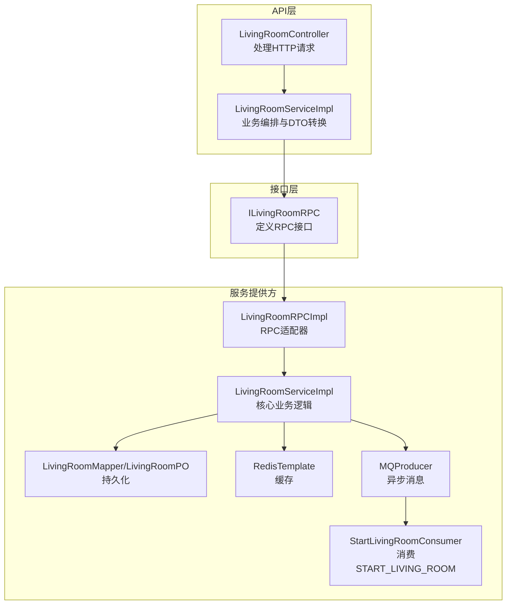
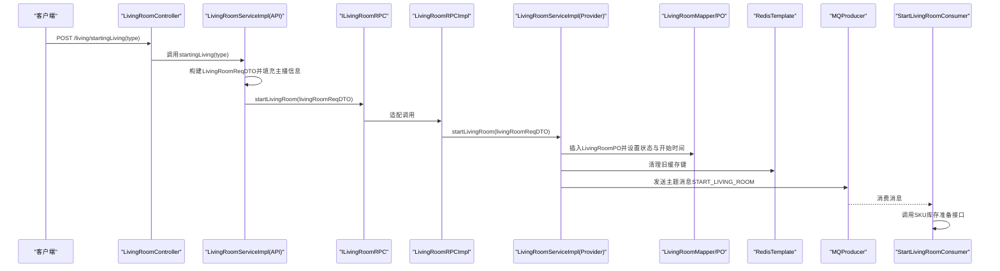
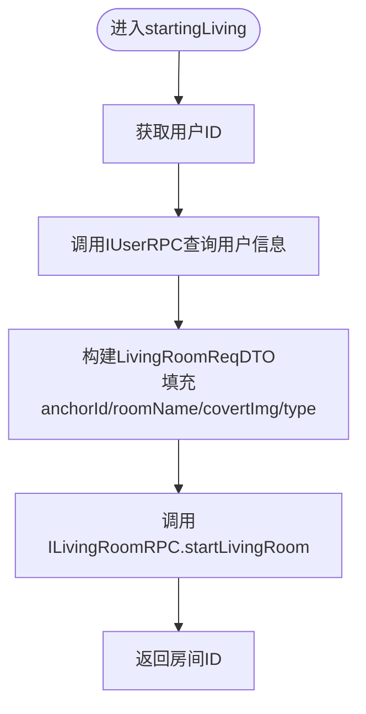
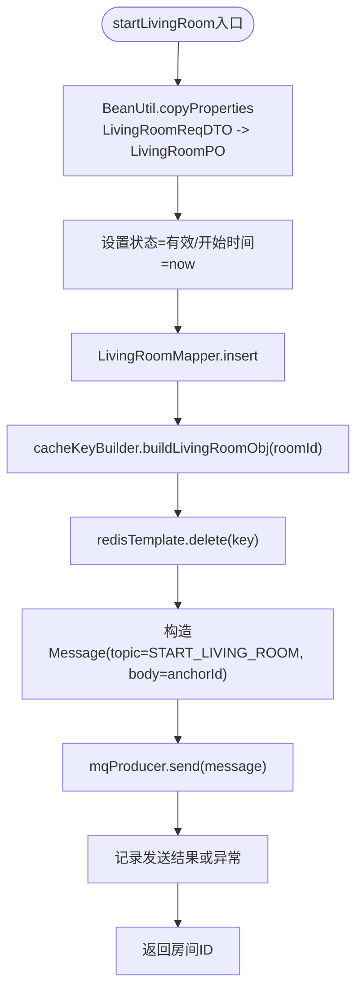
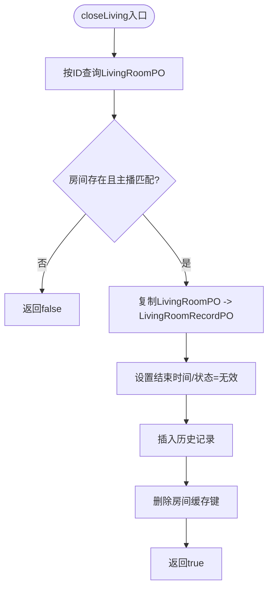
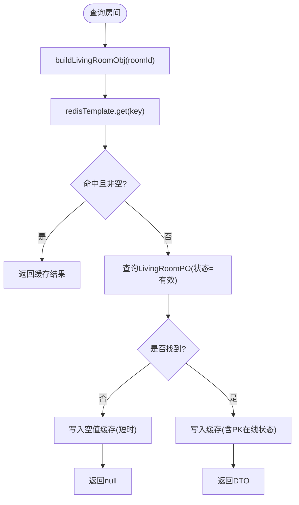
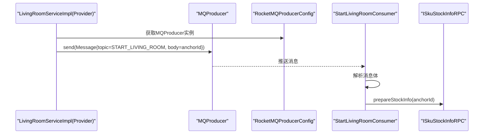
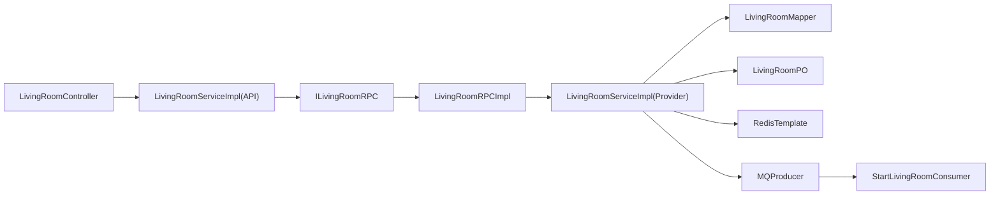

# 开播流程详解

<cite>
**本文引用的文件**
- [LivingRoomController.java](file://live-api/src/main/java/com/logilong/live/api/controller/LivingRoomController.java)
- [LivingRoomServiceImpl.java](file://live-api/src/main/java/com/logilong/live/api/service/impl/LivingRoomServiceImpl.java)
- [ILivingRoomRPC.java](file://live-living-interface/src/main/java/com/logilong/live/living/interfaces/rpc/ILivingRoomRPC.java)
- [LivingRoomRPCImpl.java](file://live-living-provider/src/main/java/com/logilong/live/living/provider/rpc/LivingRoomRPCImpl.java)
- [LivingRoomServiceImpl.java](file://live-living-provider/src/main/java/com/logilong/live/living/provider/service/impl/LivingRoomServiceImpl.java)
- [LivingRoomReqDTO.java](file://live-living-interface/src/main/java/com/logilong/live/living/interfaces/dto/LivingRoomReqDTO.java)
- [LivingRoomRespDTO.java](file://live-living-interface/src/main/java/com/logilong/live/living/interfaces/dto/LivingRoomRespDTO.java)
- [LivingProviderCacheKeyBuilder.java](file://live-framework/live-framework-redis-starter/src/main/java/com/logilong/live/framework/redis/starter/key/LivingProviderCacheKeyBuilder.java)
- [StartLivingRoomConsumer.java](file://live-living-provider/src/main/java/com/logilong/live/living/provider/consumer/StartLivingRoomConsumer.java)
- [LivingProviderTopicNames.java](file://live-common-interface/src/main/java/com/logilong/live/common/interfaces/topic/LivingProviderTopicNames.java)
- [RocketMQProducerConfig.java](file://live-framework/live-framework-mq-starter/src/main/java/com/logilong/live/framework/mq/starter/producer/RocketMQProducerConfig.java)
- [RocketMQProducerProperties.java](file://live-framework/live-framework-mq-starter/src/main/java/com/logilong/live/framework/mq/starter/properties/RocketMQProducerProperties.java)
- [LivingRoomPO.java](file://live-living-provider/src/main/java/com/logilong/live/living/provider/dao/po/LivingRoomPO.java)
- [LivingRoomMapper.java](file://live-living-provider/src/main/java/com/logilong/live/living/provider/dao/mapper/LivingRoomMapper.java)
- [ConvertBeanUtils.java](file://live-common-interface/src/main/java/com/logilong/live/common/interfaces/utils/ConvertBeanUtils.java)
</cite>

## 目录
1. [引言](#引言)
2. [项目结构](#项目结构)
3. [核心组件](#核心组件)
4. [架构总览](#架构总览)
5. [详细组件分析](#详细组件分析)
6. [依赖关系分析](#依赖关系分析)
7. [性能考量](#性能考量)
8. [故障排查指南](#故障排查指南)
9. [结论](#结论)

## 引言
本文件围绕“开播流程”的完整实现机制展开，系统性解析从API层到服务提供方的端到端链路，重点覆盖：
- API层startingLiving方法如何通过Dubbo RPC调用livingRoomRPC.startLivingRoom接口，并构建LivingRoomReqDTO请求对象传递主播信息
- 服务提供方startLivingRoom方法的核心逻辑：将LivingRoomReqDTO转换为LivingRoomPO实体并插入数据库，设置直播间状态为有效并记录开始时间
- Redis缓存处理策略：通过cacheKeyBuilder.buildLivingRoomObj生成缓存键并清除可能存在的旧缓存数据
- RocketMQ异步发送START_LIVING_ROOM主题消息以触发商品库存加载的解耦设计，分析MQProducer的使用方式与异常处理机制
- 结合代码示例展示事务边界、对象转换（BeanUtil.copyProperties）、日志记录的最佳实践
- 提供性能优化建议，如批量操作和缓存预热策略

## 项目结构
开播流程涉及三层：API网关/控制器层、服务接口层、服务提供方实现层；同时贯穿Redis缓存与RocketMQ消息中间件。

图表来源
- [LivingRoomController.java](file://live-api/src/main/java/com/logilong/live/api/controller/LivingRoomController.java#L32-L40)
- [LivingRoomServiceImpl.java](file://live-api/src/main/java/com/logilong/live/api/service/impl/LivingRoomServiceImpl.java#L58-L67)
- [ILivingRoomRPC.java](file://live-living-interface/src/main/java/com/logilong/live/living/interfaces/rpc/ILivingRoomRPC.java#L24-L33)
- [LivingRoomRPCImpl.java](file://live-living-provider/src/main/java/com/logilong/live/living/provider/rpc/LivingRoomRPCImpl.java#L21-L23)
- [LivingRoomServiceImpl.java](file://live-living-provider/src/main/java/com/logilong/live/living/provider/service/impl/LivingRoomServiceImpl.java#L68-L87)
- [LivingRoomMapper.java](file://live-living-provider/src/main/java/com/logilong/live/living/provider/dao/mapper/LivingRoomMapper.java#L1-L11)
- [LivingRoomPO.java](file://live-living-provider/src/main/java/com/logilong/live/living/provider/dao/po/LivingRoomPO.java#L1-L27)
- [LivingProviderCacheKeyBuilder.java](file://live-framework/live-framework-redis-starter/src/main/java/com/logilong/live/framework/redis/starter/key/LivingProviderCacheKeyBuilder.java#L32-L38)
- [RocketMQProducerConfig.java](file://live-framework/live-framework-mq-starter/src/main/java/com/logilong/live/framework/mq/starter/producer/RocketMQProducerConfig.java#L24-L51)
- [StartLivingRoomConsumer.java](file://live-living-provider/src/main/java/com/logilong/live/living/provider/consumer/StartLivingRoomConsumer.java#L31-L49)

章节来源
- [LivingRoomController.java](file://live-api/src/main/java/com/logilong/live/api/controller/LivingRoomController.java#L1-L96)
- [LivingRoomServiceImpl.java](file://live-api/src/main/java/com/logilong/live/api/service/impl/LivingRoomServiceImpl.java#L1-L160)
- [ILivingRoomRPC.java](file://live-living-interface/src/main/java/com/logilong/live/living/interfaces/rpc/ILivingRoomRPC.java#L1-L59)
- [LivingRoomRPCImpl.java](file://live-living-provider/src/main/java/com/logilong/live/living/provider/rpc/LivingRoomRPCImpl.java#L1-L65)
- [LivingRoomServiceImpl.java](file://live-living-provider/src/main/java/com/logilong/live/living/provider/service/impl/LivingRoomServiceImpl.java#L1-L294)

## 核心组件
- API控制器与服务：负责接收HTTP请求、参数校验、调用服务层并返回结果
- RPC接口与实现：作为服务层与提供方之间的契约与适配器
- 服务实现：包含数据库操作、Redis缓存、RocketMQ消息发送与消费
- DTO与PO：数据传输对象与持久化对象，承担对象转换职责
- 缓存键构建器：统一管理Redis键前缀与命名规范
- MQ生产者与消费者：异步解耦，触发商品库存加载

章节来源
- [LivingRoomController.java](file://live-api/src/main/java/com/logilong/live/api/controller/LivingRoomController.java#L32-L40)
- [LivingRoomServiceImpl.java](file://live-api/src/main/java/com/logilong/live/api/service/impl/LivingRoomServiceImpl.java#L58-L67)
- [ILivingRoomRPC.java](file://live-living-interface/src/main/java/com/logilong/live/living/interfaces/rpc/ILivingRoomRPC.java#L24-L33)
- [LivingRoomRPCImpl.java](file://live-living-provider/src/main/java/com/logilong/live/living/provider/rpc/LivingRoomRPCImpl.java#L21-L23)
- [LivingRoomServiceImpl.java](file://live-living-provider/src/main/java/com/logilong/live/living/provider/service/impl/LivingRoomServiceImpl.java#L68-L87)
- [LivingRoomReqDTO.java](file://live-living-interface/src/main/java/com/logilong/live/living/interfaces/dto/LivingRoomReqDTO.java#L1-L27)
- [LivingRoomRespDTO.java](file://live-living-interface/src/main/java/com/logilong/live/living/interfaces/dto/LivingRoomRespDTO.java#L1-L23)
- [LivingProviderCacheKeyBuilder.java](file://live-framework/live-framework-redis-starter/src/main/java/com/logilong/live/framework/redis/starter/key/LivingProviderCacheKeyBuilder.java#L32-L38)
- [RocketMQProducerConfig.java](file://live-framework/live-framework-mq-starter/src/main/java/com/logilong/live/framework/mq/starter/producer/RocketMQProducerConfig.java#L24-L51)
- [StartLivingRoomConsumer.java](file://live-living-provider/src/main/java/com/logilong/live/living/provider/consumer/StartLivingRoomConsumer.java#L31-L49)

## 架构总览
开播流程采用“同步+异步”双通道设计：
- 同步路径：API层构建LivingRoomReqDTO并通过Dubbo RPC调用服务提供方，完成数据库插入与缓存清理
- 异步路径：服务提供方通过RocketMQ发送START_LIVING_ROOM主题消息，触发SKU库存准备

图表来源
- [LivingRoomController.java](file://live-api/src/main/java/com/logilong/live/api/controller/LivingRoomController.java#L32-L40)
- [LivingRoomServiceImpl.java](file://live-api/src/main/java/com/logilong/live/api/service/impl/LivingRoomServiceImpl.java#L58-L67)
- [ILivingRoomRPC.java](file://live-living-interface/src/main/java/com/logilong/live/living/interfaces/rpc/ILivingRoomRPC.java#L24-L33)
- [LivingRoomRPCImpl.java](file://live-living-provider/src/main/java/com/logilong/live/living/provider/rpc/LivingRoomRPCImpl.java#L21-L23)
- [LivingRoomServiceImpl.java](file://live-living-provider/src/main/java/com/logilong/live/living/provider/service/impl/LivingRoomServiceImpl.java#L68-L87)
- [LivingRoomMapper.java](file://live-living-provider/src/main/java/com/logilong/live/living/provider/dao/mapper/LivingRoomMapper.java#L1-L11)
- [LivingRoomPO.java](file://live-living-provider/src/main/java/com/logilong/live/living/provider/dao/po/LivingRoomPO.java#L1-L27)
- [LivingProviderCacheKeyBuilder.java](file://live-framework/live-framework-redis-starter/src/main/java/com/logilong/live/framework/redis/starter/key/LivingProviderCacheKeyBuilder.java#L32-L38)
- [RocketMQProducerConfig.java](file://live-framework/live-framework-mq-starter/src/main/java/com/logilong/live/framework/mq/starter/producer/RocketMQProducerConfig.java#L24-L51)
- [StartLivingRoomConsumer.java](file://live-living-provider/src/main/java/com/logilong/live/living/provider/consumer/StartLivingRoomConsumer.java#L31-L49)

## 详细组件分析

### API层：startingLiving方法与LivingRoomReqDTO构建
- 控制器层接收type参数，进行参数校验后调用服务层startingLiving
- 服务层通过上下文获取当前用户ID，查询用户信息，构造LivingRoomReqDTO并填充主播信息（头像、房间名称等）
- 通过Dubbo RPC调用ILivingRoomRPC.startLivingRoom，返回房间ID

图表来源
- [LivingRoomController.java](file://live-api/src/main/java/com/logilong/live/api/controller/LivingRoomController.java#L32-L40)
- [LivingRoomServiceImpl.java](file://live-api/src/main/java/com/logilong/live/api/service/impl/LivingRoomServiceImpl.java#L58-L67)
- [LivingRoomReqDTO.java](file://live-living-interface/src/main/java/com/logilong/live/living/interfaces/dto/LivingRoomReqDTO.java#L1-L27)

章节来源
- [LivingRoomController.java](file://live-api/src/main/java/com/logilong/live/api/controller/LivingRoomController.java#L32-L40)
- [LivingRoomServiceImpl.java](file://live-api/src/main/java/com/logilong/live/api/service/impl/LivingRoomServiceImpl.java#L58-L67)
- [LivingRoomReqDTO.java](file://live-living-interface/src/main/java/com/logilong/live/living/interfaces/dto/LivingRoomReqDTO.java#L1-L27)

### 服务提供方：startLivingRoom核心逻辑
- 对象转换：将LivingRoomReqDTO复制为LivingRoomPO，设置状态为有效、开始时间为当前时间
- 数据库插入：通过LivingRoomMapper.insert完成持久化
- 缓存处理：使用LivingProviderCacheKeyBuilder生成房间对象缓存键，先删除旧缓存，再返回房间ID
- 异步消息：构造RocketMQ消息，主题为START_LIVING_ROOM，发送消息体为主播ID字符串
- 异常处理：捕获发送异常并记录日志，保证主流程不中断

图表来源
- [LivingRoomServiceImpl.java](file://live-living-provider/src/main/java/com/logilong/live/living/provider/service/impl/LivingRoomServiceImpl.java#L68-L87)
- [LivingRoomPO.java](file://live-living-provider/src/main/java/com/logilong/live/living/provider/dao/po/LivingRoomPO.java#L1-L27)
- [LivingRoomMapper.java](file://live-living-provider/src/main/java/com/logilong/live/living/provider/dao/mapper/LivingRoomMapper.java#L1-L11)
- [LivingProviderCacheKeyBuilder.java](file://live-framework/live-framework-redis-starter/src/main/java/com/logilong/live/framework/redis/starter/key/LivingProviderCacheKeyBuilder.java#L32-L38)
- [RocketMQProducerConfig.java](file://live-framework/live-framework-mq-starter/src/main/java/com/logilong/live/framework/mq/starter/producer/RocketMQProducerConfig.java#L24-L51)
- [LivingProviderTopicNames.java](file://live-common-interface/src/main/java/com/logilong/live/common/interfaces/topic/LivingProviderTopicNames.java#L6-L10)

章节来源
- [LivingRoomServiceImpl.java](file://live-living-provider/src/main/java/com/logilong/live/living/provider/service/impl/LivingRoomServiceImpl.java#L68-L87)

### 关闭直播：事务边界与回放记录
- 事务控制：closeLiving方法标注@Transactional，确保数据库一致性
- 业务校验：检查房间是否存在且主播ID匹配
- 回放记录：将LivingRoomPO复制为LivingRoomRecordPO，记录结束时间与状态，插入历史表
- 清理缓存：删除对应房间缓存键
- 返回结果：成功返回true

图表来源
- [LivingRoomServiceImpl.java](file://live-living-provider/src/main/java/com/logilong/live/living/provider/service/impl/LivingRoomServiceImpl.java#L90-L108)

章节来源
- [LivingRoomServiceImpl.java](file://live-living-provider/src/main/java/com/logilong/live/living/provider/service/impl/LivingRoomServiceImpl.java#L90-L108)

### Redis缓存策略
- 房间对象缓存：使用buildLivingRoomObj生成键，查询优先命中缓存；未命中则查库并写入缓存，同时对空值做短时缓存以避免缓存穿透
- 列表缓存：直播列表按类型缓存为Redis列表，分页直接从列表读取，减少数据库压力
- 在线PK与用户集合：使用独立键空间维护PK在线状态与用户集合，支持SCAN分批扫描，避免阻塞

图表来源
- [LivingRoomServiceImpl.java](file://live-living-provider/src/main/java/com/logilong/live/living/provider/service/impl/LivingRoomServiceImpl.java#L111-L138)
- [LivingProviderCacheKeyBuilder.java](file://live-framework/live-framework-redis-starter/src/main/java/com/logilong/live/framework/redis/starter/key/LivingProviderCacheKeyBuilder.java#L32-L38)

章节来源
- [LivingRoomServiceImpl.java](file://live-living-provider/src/main/java/com/logilong/live/living/provider/service/impl/LivingRoomServiceImpl.java#L111-L138)
- [LivingProviderCacheKeyBuilder.java](file://live-framework/live-framework-redis-starter/src/main/java/com/logilong/live/framework/redis/starter/key/LivingProviderCacheKeyBuilder.java#L14-L39)

### RocketMQ异步解耦：START_LIVING_ROOM主题
- 生产者配置：RocketMQProducerConfig创建DefaultMQProducer，设置NameServer、分组、重试策略与异步线程池
- 发送消息：服务提供方在startLivingRoom中构造消息，主题为START_LIVING_ROOM，消息体为主播ID
- 消费者：StartLivingRoomConsumer订阅主题，解析消息体并调用SKU库存准备接口，批量消费提升吞吐

图表来源
- [RocketMQProducerConfig.java](file://live-framework/live-framework-mq-starter/src/main/java/com/logilong/live/framework/mq/starter/producer/RocketMQProducerConfig.java#L24-L51)
- [RocketMQProducerProperties.java](file://live-framework/live-framework-mq-starter/src/main/java/com/logilong/live/framework/mq/starter/properties/RocketMQProducerProperties.java#L1-L18)
- [LivingRoomServiceImpl.java](file://live-living-provider/src/main/java/com/logilong/live/living/provider/service/impl/LivingRoomServiceImpl.java#L77-L86)
- [StartLivingRoomConsumer.java](file://live-living-provider/src/main/java/com/logilong/live/living/provider/consumer/StartLivingRoomConsumer.java#L31-L49)
- [LivingProviderTopicNames.java](file://live-common-interface/src/main/java/com/logilong/live/common/interfaces/topic/LivingProviderTopicNames.java#L6-L10)

章节来源
- [RocketMQProducerConfig.java](file://live-framework/live-framework-mq-starter/src/main/java/com/logilong/live/framework/mq/starter/producer/RocketMQProducerConfig.java#L24-L51)
- [RocketMQProducerProperties.java](file://live-framework/live-framework-mq-starter/src/main/java/com/logilong/live/framework/mq/starter/properties/RocketMQProducerProperties.java#L1-L18)
- [LivingRoomServiceImpl.java](file://live-living-provider/src/main/java/com/logilong/live/living/provider/service/impl/LivingRoomServiceImpl.java#L77-L86)
- [StartLivingRoomConsumer.java](file://live-living-provider/src/main/java/com/logilong/live/living/provider/consumer/StartLivingRoomConsumer.java#L31-L49)
- [LivingProviderTopicNames.java](file://live-common-interface/src/main/java/com/logilong/live/common/interfaces/topic/LivingProviderTopicNames.java#L6-L10)

### 对象转换与日志记录最佳实践
- 对象转换：使用BeanUtil.copyProperties进行DTO与PO之间的字段映射，避免手动setter/getter带来的冗余代码
- 列表转换：使用ConvertBeanUtils.convertList进行批量转换，提高可读性与性能
- 日志记录：在关键节点记录发送结果与异常，便于问题定位与审计

章节来源
- [LivingRoomServiceImpl.java](file://live-living-provider/src/main/java/com/logilong/live/living/provider/service/impl/LivingRoomServiceImpl.java#L68-L87)
- [ConvertBeanUtils.java](file://live-common-interface/src/main/java/com/logilong/live/common/interfaces/utils/ConvertBeanUtils.java#L1-L55)

## 依赖关系分析
- 控制器依赖服务层；服务层依赖RPC接口；RPC接口由提供方实现；提供方依赖DAO、Redis与MQ
- DTO与PO之间通过BeanUtil/ConvertBeanUtils进行转换，降低耦合度
- 缓存键构建器集中管理Redis键命名，避免散落的字符串拼接

图表来源
- [LivingRoomController.java](file://live-api/src/main/java/com/logilong/live/api/controller/LivingRoomController.java#L32-L40)
- [LivingRoomServiceImpl.java](file://live-api/src/main/java/com/logilong/live/api/service/impl/LivingRoomServiceImpl.java#L58-L67)
- [ILivingRoomRPC.java](file://live-living-interface/src/main/java/com/logilong/live/living/interfaces/rpc/ILivingRoomRPC.java#L24-L33)
- [LivingRoomRPCImpl.java](file://live-living-provider/src/main/java/com/logilong/live/living/provider/rpc/LivingRoomRPCImpl.java#L21-L23)
- [LivingRoomServiceImpl.java](file://live-living-provider/src/main/java/com/logilong/live/living/provider/service/impl/LivingRoomServiceImpl.java#L68-L87)
- [LivingRoomMapper.java](file://live-living-provider/src/main/java/com/logilong/live/living/provider/dao/mapper/LivingRoomMapper.java#L1-L11)
- [LivingRoomPO.java](file://live-living-provider/src/main/java/com/logilong/live/living/provider/dao/po/LivingRoomPO.java#L1-L27)
- [StartLivingRoomConsumer.java](file://live-living-provider/src/main/java/com/logilong/live/living/provider/consumer/StartLivingRoomConsumer.java#L31-L49)

章节来源
- [LivingRoomController.java](file://live-api/src/main/java/com/logilong/live/api/controller/LivingRoomController.java#L1-L96)
- [LivingRoomServiceImpl.java](file://live-api/src/main/java/com/logilong/live/api/service/impl/LivingRoomServiceImpl.java#L1-L160)
- [ILivingRoomRPC.java](file://live-living-interface/src/main/java/com/logilong/live/living/interfaces/rpc/ILivingRoomRPC.java#L1-L59)
- [LivingRoomRPCImpl.java](file://live-living-provider/src/main/java/com/logilong/live/living/provider/rpc/LivingRoomRPCImpl.java#L1-L65)
- [LivingRoomServiceImpl.java](file://live-living-provider/src/main/java/com/logilong/live/living/provider/service/impl/LivingRoomServiceImpl.java#L1-L294)
- [LivingRoomMapper.java](file://live-living-provider/src/main/java/com/logilong/live/living/provider/dao/mapper/LivingRoomMapper.java#L1-L11)
- [LivingRoomPO.java](file://live-living-provider/src/main/java/com/logilong/live/living/provider/dao/po/LivingRoomPO.java#L1-L27)
- [StartLivingRoomConsumer.java](file://live-living-provider/src/main/java/com/logilong/live/living/provider/consumer/StartLivingRoomConsumer.java#L1-L51)

## 性能考量
- 缓存预热：直播列表按类型缓存为Redis列表，启动或定时任务可将热点数据预热至缓存，降低首次访问延迟
- 分页与扫描：列表查询直接从Redis列表分页读取；用户集合使用SCAN分批扫描，避免大集合阻塞
- 异步解耦：开播后立即返回房间ID，库存准备通过MQ异步执行，缩短主流程耗时
- 批量消费：消息消费者设置批量消费大小，提升吞吐能力
- 事务边界：关闭直播使用事务，确保数据一致性；内部方法调用通过自引用代理保持事务生效

章节来源
- [LivingRoomServiceImpl.java](file://live-living-provider/src/main/java/com/logilong/live/living/provider/service/impl/LivingRoomServiceImpl.java#L149-L166)
- [StartLivingRoomConsumer.java](file://live-living-provider/src/main/java/com/logilong/live/living/provider/consumer/StartLivingRoomConsumer.java#L31-L49)
- [LivingRoomServiceImpl.java](file://live-living-provider/src/main/java/com/logilong/live/living/provider/service/impl/LivingRoomServiceImpl.java#L90-L108)

## 故障排查指南
- 开播无响应或异常
  - 检查RocketMQProducer配置与NameServer地址
  - 查看服务提供方日志中发送结果与异常
  - 确认Redis连接与键空间命名是否正确
- 商品库存未加载
  - 核对START_LIVING_ROOM主题是否被消费者订阅
  - 检查消费者是否正常启动并解析消息体
- 缓存穿透
  - 确认空值缓存策略是否生效（短时缓存）
  - 检查Redis键构建是否一致

章节来源
- [RocketMQProducerConfig.java](file://live-framework/live-framework-mq-starter/src/main/java/com/logilong/live/framework/mq/starter/producer/RocketMQProducerConfig.java#L24-L51)
- [StartLivingRoomConsumer.java](file://live-living-provider/src/main/java/com/logilong/live/living/provider/consumer/StartLivingRoomConsumer.java#L31-L49)
- [LivingRoomServiceImpl.java](file://live-living-provider/src/main/java/com/logilong/live/living/provider/service/impl/LivingRoomServiceImpl.java#L111-L138)

## 结论
开播流程通过清晰的分层与解耦设计，实现了高可用与高性能：
- API层仅负责编排与参数校验，降低复杂度
- 服务提供方承担核心业务：数据库插入、缓存治理与异步消息
- Redis与MQ分别解决“读取性能”和“业务解耦”，形成稳定可靠的开播链路
- 建议持续优化缓存预热与批量消费策略，进一步提升用户体验与系统吞吐