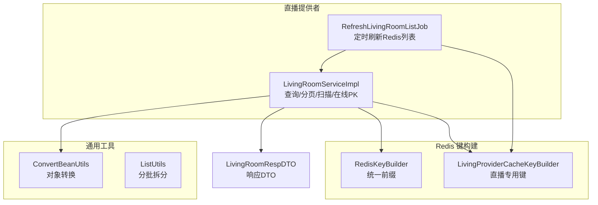
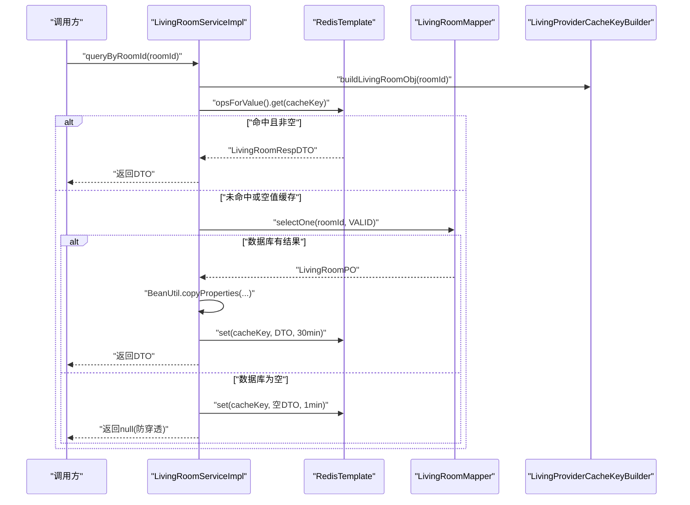
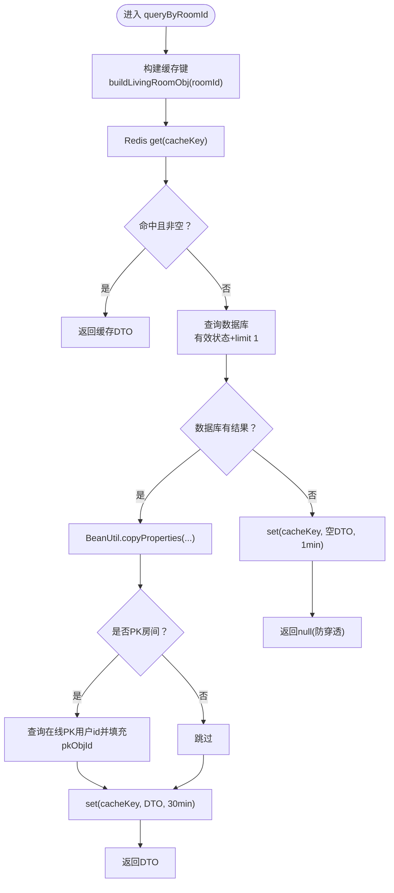
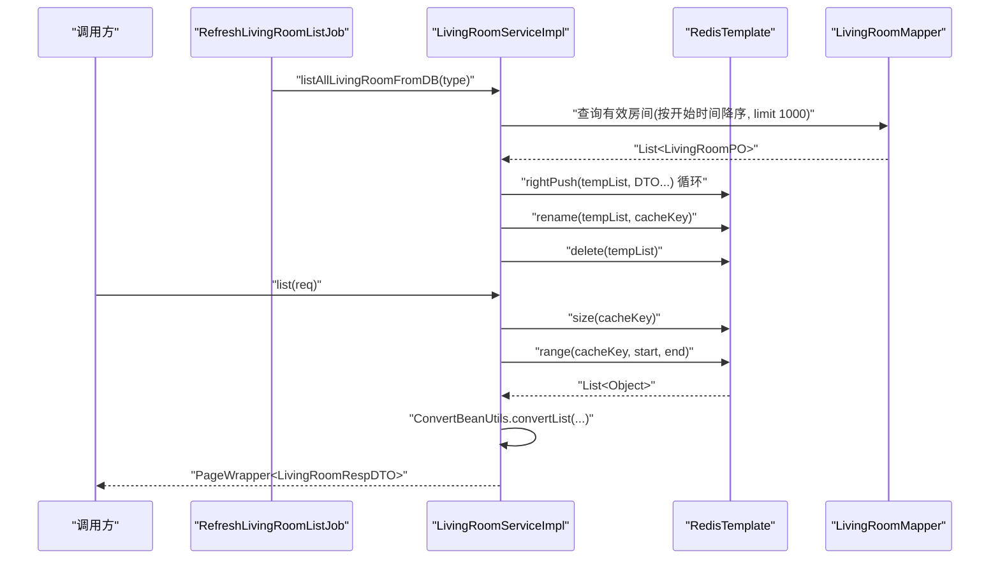
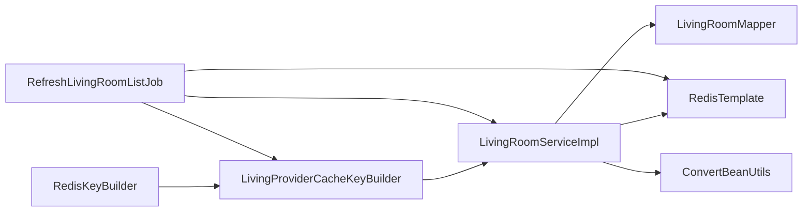

# 房间信息查询

<cite>
**本文引用的文件**
- [LivingRoomServiceImpl.java](file://live-living-provider/src/main/java/com/logilong/live/living/provider/service/impl/LivingRoomServiceImpl.java)
- [RefreshLivingRoomListJob.java](file://live-living-provider/src/main/java/com/logilong/live/living/provider/config/RefreshLivingRoomListJob.java)
- [LivingProviderCacheKeyBuilder.java](file://live-framework/live-framework-redis-starter/src/main/java/com/logilong/live/framework/redis/starter/key/LivingProviderCacheKeyBuilder.java)
- [RedisKeyBuilder.java](file://live-framework/live-framework-redis-starter/src/main/java/com/logilong/live/framework/redis/starter/key/RedisKeyBuilder.java)
- [ConvertBeanUtils.java](file://live-common-interface/src/main/java/com/logilong/live/common/interfaces/utils/ConvertBeanUtils.java)
- [ListUtils.java](file://live-common-interface/src/main/java/com/logilong/live/common/interfaces/utils/ListUtils.java)
- [LivingRoomRespDTO.java](file://live-living-interface/src/main/java/com/logilong/live/living/interfaces/dto/LivingRoomRespDTO.java)
</cite>

## 目录
1. [引言](#引言)
2. [项目结构](#项目结构)
3. [核心组件](#核心组件)
4. [架构总览](#架构总览)
5. [详细组件分析](#详细组件分析)
6. [依赖关系分析](#依赖关系分析)
7. [性能考量](#性能考量)
8. [故障排查指南](#故障排查指南)
9. [结论](#结论)
10. [附录](#附录)

## 引言
本文件系统性阐述直播间的多维度查询实现方案，重点围绕以下目标：
- 深入解析 queryByRoomId 的缓存优先策略：Redis 命中/未命中路径、空值缓存防穿透、对象转换与 PK 字段补全。
- 解析 list 分页查询的性能优化：Redis List 缓存全量有效直播间列表，range 实现高效分页，避免频繁访问数据库。
- 说明 queryByAnchorId 的数据库直查模式及其适用场景。
- 展示 ScanOptions 在大规模 Set 数据遍历中的应用，防止阻塞。
- 提供缓存一致性维护、热点 Key 处理与查询性能调优的专家级建议。

## 项目结构
- 直播间查询能力由 provider 层实现，使用 Redis 缓存与定时任务刷新全量列表；接口层提供 VO 映射与分页包装。
- 关键技术点：
  - RedisKeyBuilder 与 LivingProviderCacheKeyBuilder 统一构建缓存键前缀与命名规范。
  - ConvertBeanUtils 负责 PO/DTO 对象转换。
  - RefreshLivingRoomListJob 定时刷新 Redis 中的直播列表，采用“临时列表 + rename”的零拷贝替换策略。
  - ScanOptions 用于安全遍历大规模 Set，避免阻塞。

图表来源
- [LivingRoomServiceImpl.java](file://live-living-provider/src/main/java/com/logilong/live/living/provider/service/impl/LivingRoomServiceImpl.java#L111-L166)
- [RefreshLivingRoomListJob.java](file://live-living-provider/src/main/java/com/logilong/live/living/provider/config/RefreshLivingRoomListJob.java#L58-L75)
- [LivingProviderCacheKeyBuilder.java](file://live-framework/live-framework-redis-starter/src/main/java/com/logilong/live/framework/redis/starter/key/LivingProviderCacheKeyBuilder.java#L14-L39)
- [RedisKeyBuilder.java](file://live-framework/live-framework-redis-starter/src/main/java/com/logilong/live/framework/redis/starter/key/RedisKeyBuilder.java#L1-L22)
- [ConvertBeanUtils.java](file://live-common-interface/src/main/java/com/logilong/live/common/interfaces/utils/ConvertBeanUtils.java#L10-L55)
- [ListUtils.java](file://live-common-interface/src/main/java/com/logilong/live/common/interfaces/utils/ListUtils.java#L1-L34)
- [LivingRoomRespDTO.java](file://live-living-interface/src/main/java/com/logilong/live/living/interfaces/dto/LivingRoomRespDTO.java#L1-L23)

章节来源
- [LivingRoomServiceImpl.java](file://live-living-provider/src/main/java/com/logilong/live/living/provider/service/impl/LivingRoomServiceImpl.java#L111-L166)
- [RefreshLivingRoomListJob.java](file://live-living-provider/src/main/java/com/logilong/live/living/provider/config/RefreshLivingRoomListJob.java#L58-L75)
- [LivingProviderCacheKeyBuilder.java](file://live-framework/live-framework-redis-starter/src/main/java/com/logilong/live/framework/redis/starter/key/LivingProviderCacheKeyBuilder.java#L14-L39)
- [RedisKeyBuilder.java](file://live-framework/live-framework-redis-starter/src/main/java/com/logilong/live/framework/redis/starter/key/RedisKeyBuilder.java#L1-L22)
- [ConvertBeanUtils.java](file://live-common-interface/src/main/java/com/logilong/live/common/interfaces/utils/ConvertBeanUtils.java#L10-L55)
- [ListUtils.java](file://live-common-interface/src/main/java/com/logilong/live/common/interfaces/utils/ListUtils.java#L1-L34)
- [LivingRoomRespDTO.java](file://live-living-interface/src/main/java/com/logilong/live/living/interfaces/dto/LivingRoomRespDTO.java#L1-L23)

## 核心组件
- LivingRoomServiceImpl：实现房间查询、分页、Set 扫描、在线 PK、用户上下线处理等。
- RefreshLivingRoomListJob：定时从数据库拉取有效直播列表，写入 Redis List，并通过 rename 零拷贝切换。
- LivingProviderCacheKeyBuilder：基于 RedisKeyBuilder 构建直播模块专用键，包含房间对象、房间列表、在线 PK、用户集合等。
- ConvertBeanUtils：提供单对象与列表的 Bean 转换，配合 MyBatis Plus 结果映射。
- ListUtils：将大列表拆分为小批次，降低 Redis 输入输出缓冲与网络压力。
- LivingRoomRespDTO：房间查询响应模型，包含 PK 特殊字段 pkObjId。

章节来源
- [LivingRoomServiceImpl.java](file://live-living-provider/src/main/java/com/logilong/live/living/provider/service/impl/LivingRoomServiceImpl.java#L111-L166)
- [RefreshLivingRoomListJob.java](file://live-living-provider/src/main/java/com/logilong/live/living/provider/config/RefreshLivingRoomListJob.java#L58-L75)
- [LivingProviderCacheKeyBuilder.java](file://live-framework/live-framework-redis-starter/src/main/java/com/logilong/live/framework/redis/starter/key/LivingProviderCacheKeyBuilder.java#L14-L39)
- [ConvertBeanUtils.java](file://live-common-interface/src/main/java/com/logilong/live/common/interfaces/utils/ConvertBeanUtils.java#L10-L55)
- [ListUtils.java](file://live-common-interface/src/main/java/com/logilong/live/common/interfaces/utils/ListUtils.java#L1-L34)
- [LivingRoomRespDTO.java](file://live-living-interface/src/main/java/com/logilong/live/living/interfaces/dto/LivingRoomRespDTO.java#L1-L23)

## 架构总览
直播房间查询的整体流程如下：
- queryByRoomId：优先从 Redis 获取房间对象；未命中则查库并回填缓存；若为空则写入空值缓存并设置短期过期，防止缓存穿透；命中后对 PK 类型房间补充 pkObjId。
- list：从 Redis List 读取全量有效房间，使用 range 实现分页；若为空则返回空列表与 hasNext=false。
- queryByAnchorId：按主播最近一条有效房间直查数据库，适用于“仅需最近一条”的场景。
- ScanOptions：在用户集合遍历中使用 scan 分批迭代，避免阻塞。

图表来源
- [LivingRoomServiceImpl.java](file://live-living-provider/src/main/java/com/logilong/live/living/provider/service/impl/LivingRoomServiceImpl.java#L111-L138)
- [LivingProviderCacheKeyBuilder.java](file://live-framework/live-framework-redis-starter/src/main/java/com/logilong/live/framework/redis/starter/key/LivingProviderCacheKeyBuilder.java#L32-L34)

章节来源
- [LivingRoomServiceImpl.java](file://live-living-provider/src/main/java/com/logilong/live/living/provider/service/impl/LivingRoomServiceImpl.java#L111-L138)
- [LivingProviderCacheKeyBuilder.java](file://live-framework/live-framework-redis-starter/src/main/java/com/logilong/live/framework/redis/starter/key/LivingProviderCacheKeyBuilder.java#L32-L34)

## 详细组件分析

### queryByRoomId 缓存优先策略与防穿透
- 缓存键构建：使用 LivingProviderCacheKeyBuilder.buildLivingRoomObj(roomId)。
- 命中逻辑：
  - 若 Redis 返回 DTO 且 id 非空，直接返回。
  - 若 Redis 返回 DTO 且 id 为空，视为“空值缓存”，直接返回 null。
- 未命中逻辑：
  - 查询数据库，限定状态为有效且按主键限制一条。
  - 成功：使用 BeanUtil.copyProperties 进行对象转换，随后写入 Redis，有效期 30 分钟。
  - 失败：写入空值 DTO 并设置 1 分钟过期，防止缓存穿透。
- PK 类型房间补充：若房间类型为 PK，额外查询在线 PK 用户 id 并填充到 pkObjId 字段。

图表来源
- [LivingRoomServiceImpl.java](file://live-living-provider/src/main/java/com/logilong/live/living/provider/service/impl/LivingRoomServiceImpl.java#L111-L138)
- [ConvertBeanUtils.java](file://live-common-interface/src/main/java/com/logilong/live/common/interfaces/utils/ConvertBeanUtils.java#L10-L55)
- [LivingRoomRespDTO.java](file://live-living-interface/src/main/java/com/logilong/live/living/interfaces/dto/LivingRoomRespDTO.java#L1-L23)

章节来源
- [LivingRoomServiceImpl.java](file://live-living-provider/src/main/java/com/logilong/live/living/provider/service/impl/LivingRoomServiceImpl.java#L111-L138)
- [ConvertBeanUtils.java](file://live-common-interface/src/main/java/com/logilong/live/common/interfaces/utils/ConvertBeanUtils.java#L10-L55)
- [LivingRoomRespDTO.java](file://live-living-interface/src/main/java/com/logilong/live/living/interfaces/dto/LivingRoomRespDTO.java#L1-L23)

### list 分页查询的性能优化设计
- 全量列表缓存：RefreshLivingRoomListJob 定时从数据库拉取有效房间列表，写入 Redis List。
- 写入策略：先写入临时列表名，再通过 rename 原子替换，避免直接修改正在被访问的列表，减少阻塞。
- 分页读取：list 方法通过 RedisTemplate.opsForList().range 读取指定区间，使用 ConvertBeanUtils.convertList 进行 DTO 转换；计算 hasNext 以支持前端分页。
- 限制与兜底：数据库侧限制最多 1000 条，确保缓存规模可控。

图表来源
- [RefreshLivingRoomListJob.java](file://live-living-provider/src/main/java/com/logilong/live/living/provider/config/RefreshLivingRoomListJob.java#L58-L75)
- [LivingRoomServiceImpl.java](file://live-living-provider/src/main/java/com/logilong/live/living/provider/service/impl/LivingRoomServiceImpl.java#L150-L166)
- [ConvertBeanUtils.java](file://live-common-interface/src/main/java/com/logilong/live/common/interfaces/utils/ConvertBeanUtils.java#L10-L55)

章节来源
- [RefreshLivingRoomListJob.java](file://live-living-provider/src/main/java/com/logilong/live/living/provider/config/RefreshLivingRoomListJob.java#L58-L75)
- [LivingRoomServiceImpl.java](file://live-living-provider/src/main/java/com/logilong/live/living/provider/service/impl/LivingRoomServiceImpl.java#L150-L166)
- [ConvertBeanUtils.java](file://live-common-interface/src/main/java/com/logilong/live/common/interfaces/utils/ConvertBeanUtils.java#L10-L55)

### queryByAnchorId 数据库直查模式
- 场景定位：仅需获取某主播最近一条有效房间信息，适合“最近一次”而非全量列表。
- 查询逻辑：按主播 id 与有效状态过滤，按 id 倒序取第一条，直接返回 DTO。
- 适用性：低频、轻量查询，避免引入额外缓存与维护成本。

章节来源
- [LivingRoomServiceImpl.java](file://live-living-provider/src/main/java/com/logilong/live/living/provider/service/impl/LivingRoomServiceImpl.java#L140-L147)

### ScanOptions 在大规模 Set 遍历中的应用
- 使用场景：用户集合遍历（如房间内在线用户），避免一次性遍历导致阻塞。
- 实现要点：使用 redisTemplate.opsForSet().scan，设置匹配模式与 count 控制每次迭代数量，逐次收集结果。
- 优势：分批迭代，降低单次阻塞风险，提升整体稳定性。

章节来源
- [LivingRoomServiceImpl.java](file://live-living-provider/src/main/java/com/logilong/live/living/provider/service/impl/LivingRoomServiceImpl.java#L210-L221)

## 依赖关系分析
- 缓存键构建链路：RedisKeyBuilder 提供统一前缀；LivingProviderCacheKeyBuilder 在其基础上扩展直播模块键。
- 查询链路：LivingRoomServiceImpl 依赖 RedisTemplate、LivingProviderCacheKeyBuilder、LivingRoomMapper、ConvertBeanUtils。
- 列表刷新链路：RefreshLivingRoomListJob 依赖 RedisTemplate、LivingProviderCacheKeyBuilder、ILivingRoomService(listAllLivingRoomFromDB)。

图表来源
- [RedisKeyBuilder.java](file://live-framework/live-framework-redis-starter/src/main/java/com/logilong/live/framework/redis/starter/key/RedisKeyBuilder.java#L1-L22)
- [LivingProviderCacheKeyBuilder.java](file://live-framework/live-framework-redis-starter/src/main/java/com/logilong/live/framework/redis/starter/key/LivingProviderCacheKeyBuilder.java#L14-L39)
- [LivingRoomServiceImpl.java](file://live-living-provider/src/main/java/com/logilong/live/living/provider/service/impl/LivingRoomServiceImpl.java#L111-L166)
- [RefreshLivingRoomListJob.java](file://live-living-provider/src/main/java/com/logilong/live/living/provider/config/RefreshLivingRoomListJob.java#L58-L75)

章节来源
- [RedisKeyBuilder.java](file://live-framework/live-framework-redis-starter/src/main/java/com/logilong/live/framework/redis/starter/key/RedisKeyBuilder.java#L1-L22)
- [LivingProviderCacheKeyBuilder.java](file://live-framework/live-framework-redis-starter/src/main/java/com/logilong/live/framework/redis/starter/key/LivingProviderCacheKeyBuilder.java#L14-L39)
- [LivingRoomServiceImpl.java](file://live-living-provider/src/main/java/com/logilong/live/living/provider/service/impl/LivingRoomServiceImpl.java#L111-L166)
- [RefreshLivingRoomListJob.java](file://live-living-provider/src/main/java/com/logilong/live/living/provider/config/RefreshLivingRoomListJob.java#L58-L75)

## 性能考量
- 缓存穿透防护：数据库为空时写入短期空值缓存，降低重复查询压力。
- 列表分页零拷贝：通过临时列表 + rename 替换，避免直接修改正在访问的列表，减少阻塞。
- 分批写入与读取：ListUtils 将大列表拆分为小批次，降低 Redis 输入输出缓冲与网络压力。
- ScanOptions 分批遍历：Set 数据量大时使用 scan + count 控制每次迭代数量，避免阻塞。
- 对象转换：ConvertBeanUtils 负责 PO/DTO 转换，减少手动映射成本。
- 读多写少场景：list 接口采用 Redis List 缓存全量有效房间，显著降低数据库压力。

章节来源
- [LivingRoomServiceImpl.java](file://live-living-provider/src/main/java/com/logilong/live/living/provider/service/impl/LivingRoomServiceImpl.java#L111-L166)
- [RefreshLivingRoomListJob.java](file://live-living-provider/src/main/java/com/logilong/live/living/provider/config/RefreshLivingRoomListJob.java#L58-L75)
- [ListUtils.java](file://live-common-interface/src/main/java/com/logilong/live/common/interfaces/utils/ListUtils.java#L1-L34)
- [ConvertBeanUtils.java](file://live-common-interface/src/main/java/com/logilong/live/common/interfaces/utils/ConvertBeanUtils.java#L10-L55)

## 故障排查指南
- 缓存穿透现象：若频繁出现数据库为空但缓存未命中，检查是否正确写入短期空值缓存；确认过期时间与键构建是否一致。
- 列表分页异常：若 hasNext 计算错误或分页越界，检查 Redis List 是否已按期望顺序写入，以及 range 参数是否正确。
- ScanOptions 遍历缓慢：适当增大 count，或分批处理；确认匹配模式是否合理。
- 对象转换失败：检查 DTO 字段与 PO 字段映射关系，确保 BeanUtils 能正确复制。
- 列表刷新失败：确认定时任务是否运行，rename 是否成功，临时列表是否清理。

章节来源
- [LivingRoomServiceImpl.java](file://live-living-provider/src/main/java/com/logilong/live/living/provider/service/impl/LivingRoomServiceImpl.java#L111-L166)
- [RefreshLivingRoomListJob.java](file://live-living-provider/src/main/java/com/logilong/live/living/provider/config/RefreshLivingRoomListJob.java#L58-L75)
- [ConvertBeanUtils.java](file://live-common-interface/src/main/java/com/logilong/live/common/interfaces/utils/ConvertBeanUtils.java#L10-L55)

## 结论
本方案通过“缓存优先 + 防穿透 + 列表分页 + 直查兜底 + 安全遍历”的组合，实现了直播房间信息查询的高可用与高性能。queryByRoomId 保障了热点房间的快速返回与一致性；list 通过 Redis List 与 rename 零拷贝策略，显著降低了数据库压力；ScanOptions 保证了大规模集合的安全遍历；queryByAnchorId 则针对“最近一条”场景提供了简洁高效的直查路径。结合缓存键规范、对象转换与分批写入等工程实践，可进一步提升系统的稳定性与可维护性。

## 附录
- 缓存键构建建议：统一使用 RedisKeyBuilder 作为前缀，LivingProviderCacheKeyBuilder 扩展直播模块键，确保键空间清晰、可维护。
- 热点 Key 处理：对高频房间 id 可考虑多副本或分片存储，结合业务限流与降级策略。
- 性能调优：持续监控 Redis 命中率、CPU/内存与网络 IO；根据业务峰值调整 rename 刷新频率与 list 写入批次大小。