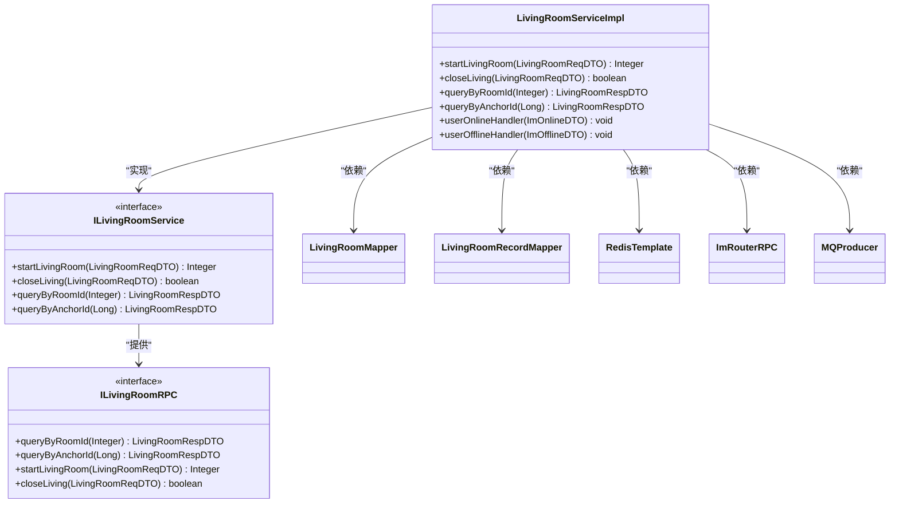
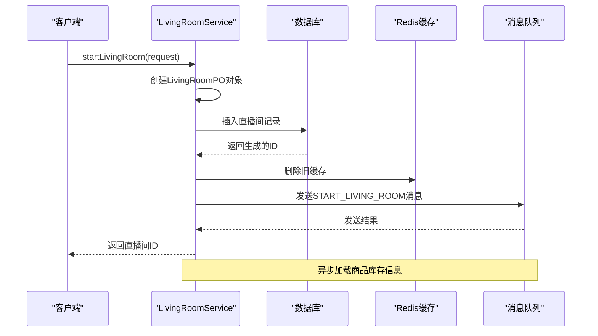
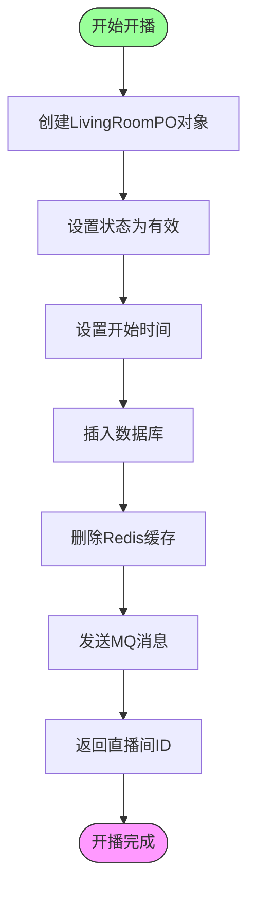
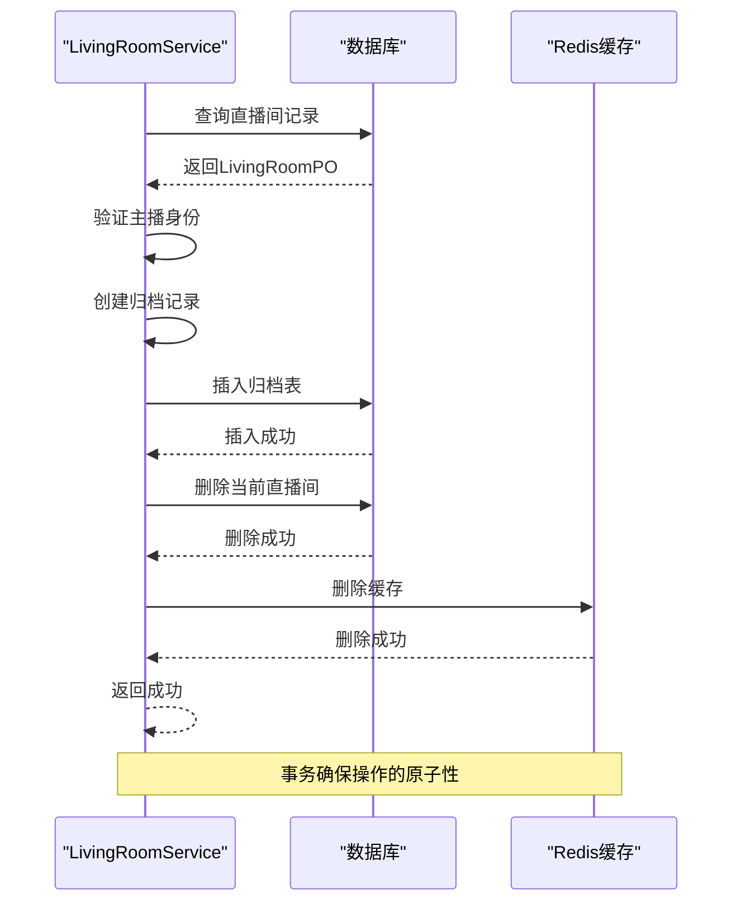
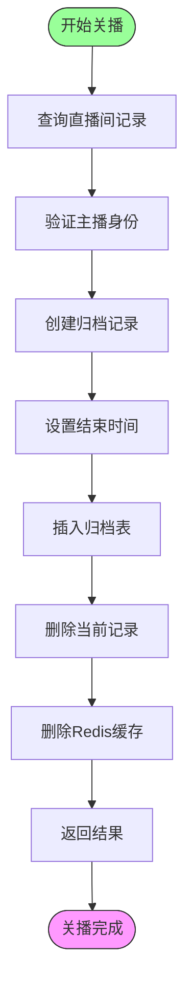
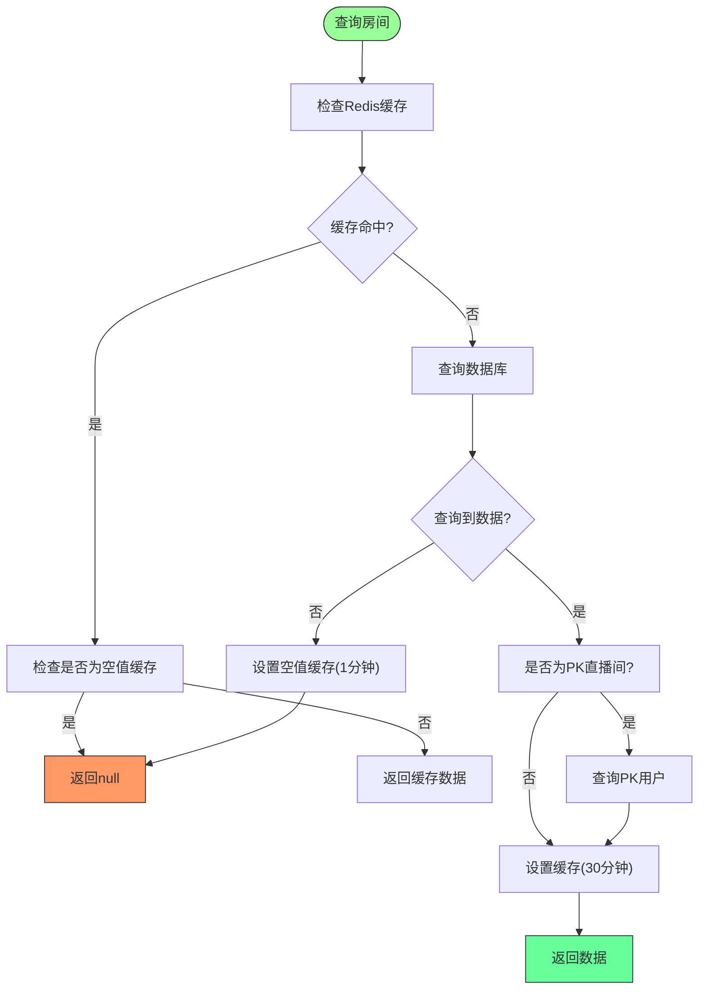
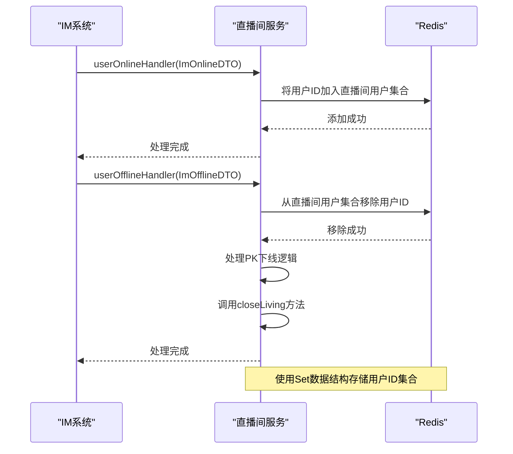
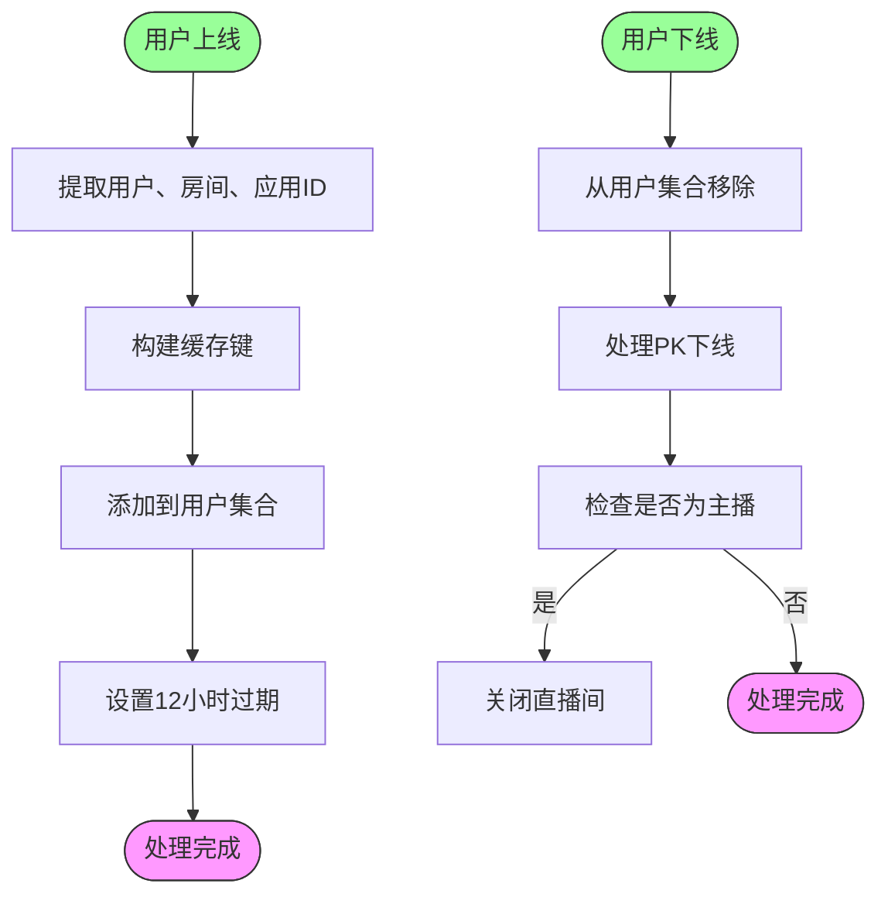
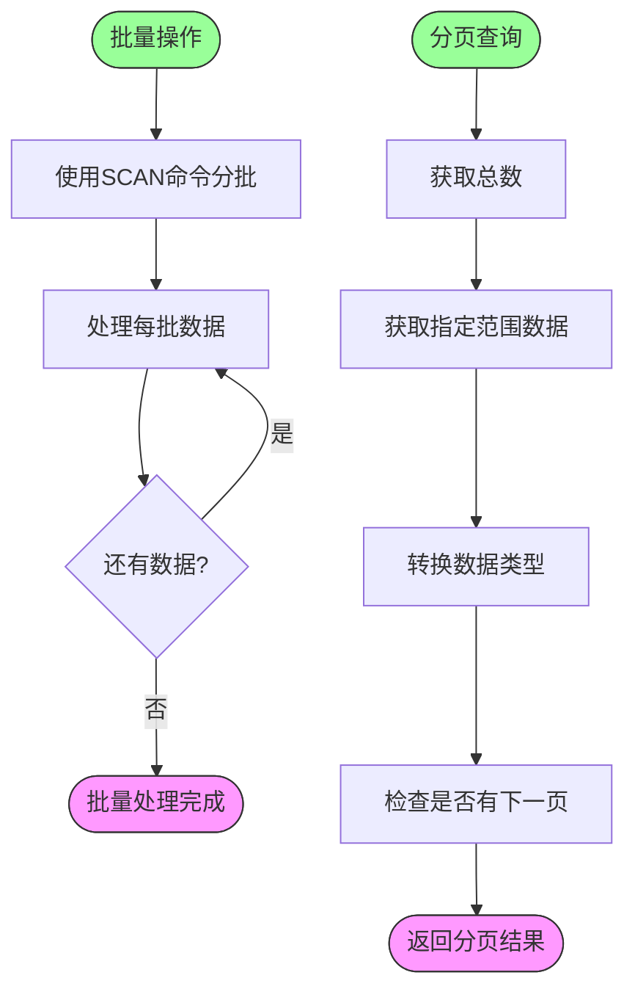

# 直播间管理

<cite>
**本文档引用的文件**  
- [LivingRoomServiceImpl.java](file://live-living-provider/src/main/java/com/logilong/live/living/provider/service/impl/LivingRoomServiceImpl.java)
- [LivingRoomReqDTO.java](file://live-living-interface/src/main/java/com/logilong/live/living/interfaces/dto/LivingRoomReqDTO.java)
- [LivingRoomRespDTO.java](file://live-living-interface/src/main/java/com/logilong/live/living/interfaces/dto/LivingRoomRespDTO.java)
- [ILivingRoomRPC.java](file://live-living-interface/src/main/java/com/logilong/live/living/interfaces/rpc/ILivingRoomRPC.java)
- [StartLivingRoomConsumer.java](file://live-living-provider/src/main/java/com/logilong/live/living/provider/consumer/StartLivingRoomConsumer.java)
- [LivingProviderCacheKeyBuilder.java](file://live-framework/live-framework-redis-starter/src/main/java/com/logilong/live/framework/redis/starter/key/LivingProviderCacheKeyBuilder.java)
- [LivingRoomPO.java](file://live-living-provider/src/main/java/com/logilong/live/living/provider/dao/po/LivingRoomPO.java)
- [LivingRoomRecordPO.java](file://live-living-provider/src/main/java/com/logilong/live/living/provider/dao/po/LivingRoomRecordPO.java)
- [ImOnlineDTO.java](file://live-im-core-server-interfaces/src/main/java/com/logilong/live/im/core/server/interfaces/dto/ImOnlineDTO.java)
- [ImOfflineDTO.java](file://live-im-core-server-interfaces/src/main/java/com/logilong/live/im/core/server/interfaces/dto/ImOfflineDTO.java)
- [ImRouterRPC.java](file://live-im-router-interface/src/main/java/com/logilong/live/im/router/interfaces/ImRouterRPC.java)
- [LivingRoomTypeEnum.java](file://live-living-interface/src/main/java/com/logilong/live/living/interfaces/constants/LivingRoomTypeEnum.java)
- [LivingProviderTopicNames.java](file://live-common-interface/src/main/java/com/logilong/live/common/interfaces/topic/LivingProviderTopicNames.java)
</cite>

## 目录
1. [简介](#简介)
2. [核心功能实现](#核心功能实现)
3. [开播流程分析](#开播流程分析)
4. [关播流程分析](#关播流程分析)
5. [房间查询缓存设计](#房间查询缓存设计)
6. [IM系统集成](#im系统集成)
7. [高并发性能优化](#高并发性能优化)
8. [总结](#总结)

## 简介
本文档深入解析直播平台中直播间管理的核心功能实现，涵盖开播、关播、房间状态维护等关键业务流程。重点分析`startLivingRoom`方法中如何创建直播间记录、初始化Redis缓存并触发商品库存加载MQ事件，以及`closeLiving`方法的事务处理机制。同时阐述与IM系统的集成方式，提供高并发场景下的缓存一致性保障方案和性能优化建议。

## 核心功能实现

直播间管理服务通过`LivingRoomServiceImpl`类实现核心业务逻辑，主要功能包括开播、关播、房间查询、用户在线状态管理等。服务采用分层架构设计，通过Dubbo RPC接口暴露服务，实现了业务逻辑与接口定义的解耦。



**图示来源**
- [LivingRoomServiceImpl.java](file://live-living-provider/src/main/java/com/logilong/live/living/provider/service/impl/LivingRoomServiceImpl.java#L47-L293)
- [ILivingRoomService.java](file://live-living-provider/src/main/java/com/logilong/live/living/provider/service/ILivingRoomService.java)
- [ILivingRoomRPC.java](file://live-living-interface/src/main/java/com/logilong/live/living/interfaces/rpc/ILivingRoomRPC.java)

**本节来源**
- [LivingRoomServiceImpl.java](file://live-living-provider/src/main/java/com/logilong/live/living/provider/service/impl/LivingRoomServiceImpl.java#L47-L293)

## 开播流程分析

### 开播核心逻辑
`startLivingRoom`方法是开播流程的核心，实现了直播间创建、数据库持久化、缓存初始化和异步消息触发等关键步骤。



**图示来源**
- [LivingRoomServiceImpl.java](file://live-living-provider/src/main/java/com/logilong/live/living/provider/service/impl/LivingRoomServiceImpl.java#L68-L86)
- [StartLivingRoomConsumer.java](file://live-living-provider/src/main/java/com/logilong/live/living/provider/consumer/StartLivingRoomConsumer.java)

### 开播流程详细步骤
1. **参数转换与初始化**：将`LivingRoomReqDTO`转换为`LivingRoomPO`对象，并设置状态为有效、记录开始时间。
2. **数据库持久化**：通过`LivingRoomMapper`将直播间信息插入`t_living_room`表。
3. **缓存处理**：构建直播间对象缓存键，删除可能存在的旧缓存，防止缓存污染。
4. **异步消息触发**：发送`START_LIVING_ROOM`主题的MQ消息，触发商品库存加载等异步操作。



**图示来源**
- [LivingRoomServiceImpl.java](file://live-living-provider/src/main/java/com/logilong/live/living/provider/service/impl/LivingRoomServiceImpl.java#L68-L86)
- [LivingProviderTopicNames.java](file://live-common-interface/src/main/java/com/logilong/live/common/interfaces/topic/LivingProviderTopicNames.java)

**本节来源**
- [LivingRoomServiceImpl.java](file://live-living-provider/src/main/java/com/logilong/live/living/provider/service/impl/LivingRoomServiceImpl.java#L68-L86)

## 关播流程分析

### 事务性关播处理
`closeLiving`方法采用事务性设计，确保直播记录归档、数据清理和缓存失效的原子性操作。



**图示来源**
- [LivingRoomServiceImpl.java](file://live-living-provider/src/main/java/com/logilong/live/living/provider/service/impl/LivingRoomServiceImpl.java#L90-L107)
- [LivingRoomRecordPO.java](file://live-living-provider/src/main/java/com/logilong/live/living/provider/dao/po/LivingRoomRecordPO.java)

### 关播流程关键机制
1. **身份验证**：检查请求中的主播ID是否与直播间记录中的主播ID一致，确保只有主播才能关闭直播间。
2. **数据归档**：将当前直播间数据复制到`LivingRoomRecordPO`对象，并设置结束时间，然后插入`t_living_room_record`归档表。
3. **数据清理**：从`t_living_room`表中删除当前直播间记录。
4. **缓存失效**：删除直播间相关的Redis缓存，确保后续查询能获取最新数据。



**图示来源**
- [LivingRoomServiceImpl.java](file://live-living-provider/src/main/java/com/logilong/live/living/provider/service/impl/LivingRoomServiceImpl.java#L90-L107)
- [LivingRoomRecordMapper.java](file://live-living-provider/src/main/java/com/logilong/live/living/provider/dao/mapper/LivingRoomRecordMapper.java)

**本节来源**
- [LivingRoomServiceImpl.java](file://live-living-provider/src/main/java/com/logilong/live/living/provider/service/impl/LivingRoomServiceImpl.java#L90-L107)

## 房间查询缓存设计

### 缓存键设计
系统采用`LivingProviderCacheKeyBuilder`类统一管理直播间相关的Redis缓存键，确保缓存键命名的一致性和可维护性。

```mermaid
classDiagram
class LivingProviderCacheKeyBuilder {
+buildLivingRoomObj(Integer) String
+buildLivingRoomList(Integer) String
+buildLivingRoomUserSet(Integer, Integer) String
+buildLivingOnlinePk(Integer) String
+buildRefreshLivingRoomListLock() String
}
class RedisKeyBuilder {
<<abstract>>
+getPrefix() String
+getSplitItem() String
}
LivingProviderCacheKeyBuilder --|> RedisKeyBuilder : "继承"
note right of LivingProviderCacheKeyBuilder
缓存键格式 : {前缀}{类型}{分隔符}{参数}
如 : live-living-provider : living_room_obj : 1
end note
```

**图示来源**
- [LivingProviderCacheKeyBuilder.java](file://live-framework/live-framework-redis-starter/src/main/java/com/logilong/live/framework/redis/starter/key/LivingProviderCacheKeyBuilder.java)

### 查询缓存策略
`queryByRoomId`方法实现了完善的缓存设计，包含缓存穿透防护和缓存更新策略。



**图示来源**
- [LivingRoomServiceImpl.java](file://live-living-provider/src/main/java/com/logilong/live/living/provider/service/impl/LivingRoomServiceImpl.java#L112-L136)
- [LivingProviderCacheKeyBuilder.java](file://live-framework/live-framework-redis-starter/src/main/java/com/logilong/live/framework/redis/starter/key/LivingProviderCacheKeyBuilder.java)

### 缓存设计特点
1. **缓存穿透防护**：当数据库查询不到数据时，设置空值缓存（有效期1分钟），防止频繁查询数据库。
2. **差异化缓存时间**：正常数据缓存30分钟，空值缓存1分钟，平衡性能和数据新鲜度。
3. **特殊逻辑处理**：对于PK直播间，额外查询PK用户信息并注入到返回结果中。
4. **缓存键清理**：在开播和关播操作中主动删除相关缓存，保证数据一致性。

**本节来源**
- [LivingRoomServiceImpl.java](file://live-living-provider/src/main/java/com/logilong/live/living/provider/service/impl/LivingRoomServiceImpl.java#L112-L136)
- [LivingProviderCacheKeyBuilder.java](file://live-framework/live-framework-redis-starter/src/main/java/com/logilong/live/framework/redis/starter/key/LivingProviderCacheKeyBuilder.java)

## IM系统集成

### 用户在线状态管理
系统通过`userOnlineHandler`和`userOfflineHandler`方法与IM系统集成，实现用户在线状态与直播间关联管理。



**图示来源**
- [LivingRoomServiceImpl.java](file://live-living-provider/src/main/java/com/logilong/live/living/provider/service/impl/LivingRoomServiceImpl.java#L182-L207)
- [ImOnlineDTO.java](file://live-im-core-server-interfaces/src/main/java/com/logilong/live/im/core/server/interfaces/dto/ImOnlineDTO.java)
- [ImOfflineDTO.java](file://live-im-core-server-interfaces/src/main/java/com/logilong/live/im/core/server/interfaces/dto/ImOfflineDTO.java)

### 在线状态处理逻辑
1. **上线处理**：当用户连接IM服务器时，将用户ID添加到对应直播间和应用ID的用户集合中，并设置12小时过期时间。
2. **下线处理**：当用户断开IM连接时，从用户集合中移除用户ID，并触发PK下线和直播间关闭逻辑。
3. **批量查询优化**：使用Redis的SCAN命令分批查询用户ID，避免大数据集导致的阻塞问题。



**图示来源**
- [LivingRoomServiceImpl.java](file://live-living-provider/src/main/java/com/logilong/live/living/provider/service/impl/LivingRoomServiceImpl.java#L182-L207)
- [LivingProviderCacheKeyBuilder.java](file://live-framework/live-framework-redis-starter/src/main/java/com/logilong/live/framework/redis/starter/key/LivingProviderCacheKeyBuilder.java)

### 消息路由集成
通过`ImRouterRPC`接口实现与IM消息系统的集成，支持单条和批量消息发送。

```mermaid
classDiagram
class ImRouterRPC {
<<interface>>
+sendMsg(ImMsgBody) boolean
+batchSendMsg(List<ImMsgBody>) void
}
class ImMsgBody {
+Integer appId
+Integer bizCode
+String data
+Long userId
}
class LivingRoomServiceImpl {
+routerRPC
+batchSendImMsg(List<Long>, Integer, JSONObject)
}
LivingRoomServiceImpl --> ImRouterRPC : "依赖"
ImRouterRPC <-- ImMsgBody : "使用"
LivingRoomServiceImpl --> ImMsgBody : "创建"
note right of ImRouterRPC
用于向指定用户或用户列表发送IM消息
end note
```

**图示来源**
- [ImRouterRPC.java](file://live-im-router-interface/src/main/java/com/logilong/live/im/router/interfaces/ImRouterRPC.java)
- [LivingRoomServiceImpl.java](file://live-living-provider/src/main/java/com/logilong/live/living/provider/service/impl/LivingRoomServiceImpl.java#L60-L65)

**本节来源**
- [LivingRoomServiceImpl.java](file://live-living-provider/src/main/java/com/logilong/live/living/provider/service/impl/LivingRoomServiceImpl.java#L182-L207)
- [ImOnlineDTO.java](file://live-im-core-server-interfaces/src/main/java/com/logilong/live/im/core/server/interfaces/dto/ImOnlineDTO.java)
- [ImOfflineDTO.java](file://live-im-core-server-interfaces/src/main/java/com/logilong/live/im/core/server/interfaces/dto/ImOfflineDTO.java)
- [ImRouterRPC.java](file://live-im-router-interface/src/main/java/com/logilong/live/im/router/interfaces/ImRouterRPC.java)

## 高并发性能优化

### 缓存一致性保障
系统采用多种策略保障高并发场景下的缓存一致性：

1. **写时失效**：在数据更新操作（开播、关播）后立即删除相关缓存，确保下次读取时能获取最新数据。
2. **空值缓存**：防止缓存穿透，避免大量请求直接打到数据库。
3. **合理缓存时间**：根据数据更新频率设置适当的缓存过期时间，平衡性能和数据新鲜度。
4. **异步更新**：通过MQ实现数据的异步更新，减少主流程的响应时间。

### 批量操作优化
针对大数据集的查询和操作，系统采用了以下优化措施：

1. **SCAN命令分批查询**：使用Redis的SCAN命令分批查询用户ID集合，避免一次性加载大量数据导致的阻塞。
2. **批量消息发送**：通过`batchSendMsg`接口批量发送IM消息，减少网络开销和系统调用次数。
3. **分页缓存**：对直播间列表采用分页缓存策略，将整个列表缓存到Redis的List结构中，按页查询。



**图示来源**
- [LivingRoomServiceImpl.java](file://live-living-provider/src/main/java/com/logilong/live/living/provider/service/impl/LivingRoomServiceImpl.java#L210-L220)
- [LivingRoomServiceImpl.java](file://live-living-provider/src/main/java/com/logilong/live/living/provider/service/impl/LivingRoomServiceImpl.java#L150-L165)

### 性能优化建议
1. **监控缓存命中率**：定期监控Redis缓存的命中率，及时发现缓存失效或穿透问题。
2. **优化MQ消费**：确保`StartLivingRoomConsumer`的消费能力，避免消息积压。
3. **数据库索引优化**：为`t_living_room`表的`anchorId`、`roomId`等常用查询字段建立索引。
4. **连接池配置**：合理配置数据库和Redis的连接池参数，避免连接资源耗尽。
5. **限流保护**：对高频查询接口实施限流保护，防止系统被突发流量击垮。

**本节来源**
- [LivingRoomServiceImpl.java](file://live-living-provider/src/main/java/com/logilong/live/living/provider/service/impl/LivingRoomServiceImpl.java#L150-L165)
- [LivingRoomServiceImpl.java](file://live-living-provider/src/main/java/com/logilong/live/living/provider/service/impl/LivingRoomServiceImpl.java#L210-L220)
- [StartLivingRoomConsumer.java](file://live-living-provider/src/main/java/com/logilong/live/living/provider/consumer/StartLivingRoomConsumer.java)

## 总结
本文档深入分析了直播平台中直播间管理的核心功能实现。系统通过`LivingRoomServiceImpl`类实现了开播、关播、房间查询等核心业务逻辑，采用事务性设计确保数据一致性，通过Redis缓存提升查询性能，并与IM系统深度集成实现用户状态管理。

关键设计亮点包括：
- **开播流程**：通过MQ异步触发商品库存加载，解耦核心流程与耗时操作。
- **关播流程**：采用事务性设计，确保数据归档和清理的原子性。
- **缓存设计**：实现完善的缓存穿透防护和差异化缓存策略。
- **IM集成**：通过用户在线/离线处理器实现直播间用户状态的实时管理。
- **性能优化**：采用SCAN命令、批量操作等技术应对高并发场景。

这些设计共同保障了直播间管理系统的高性能、高可用和数据一致性，为直播业务的稳定运行提供了坚实基础。