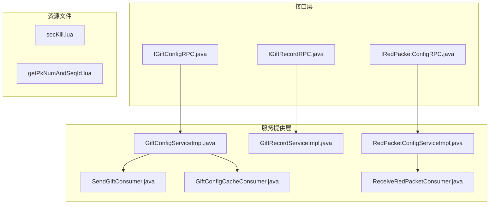
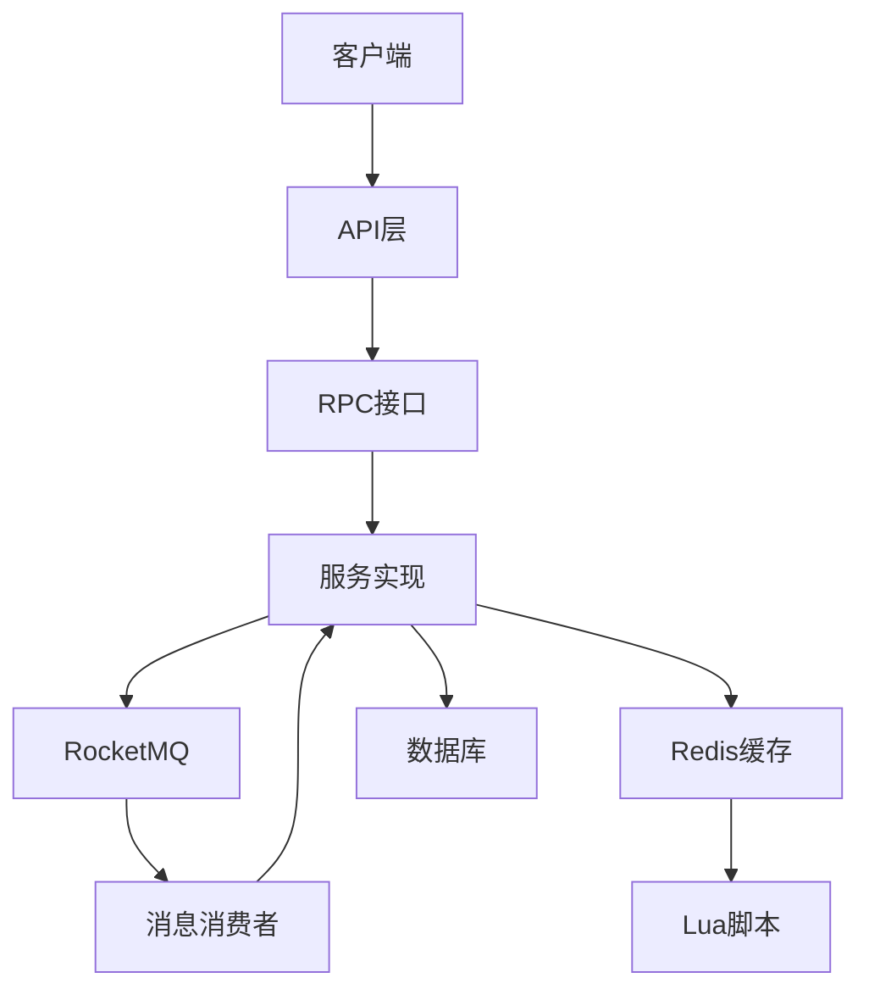
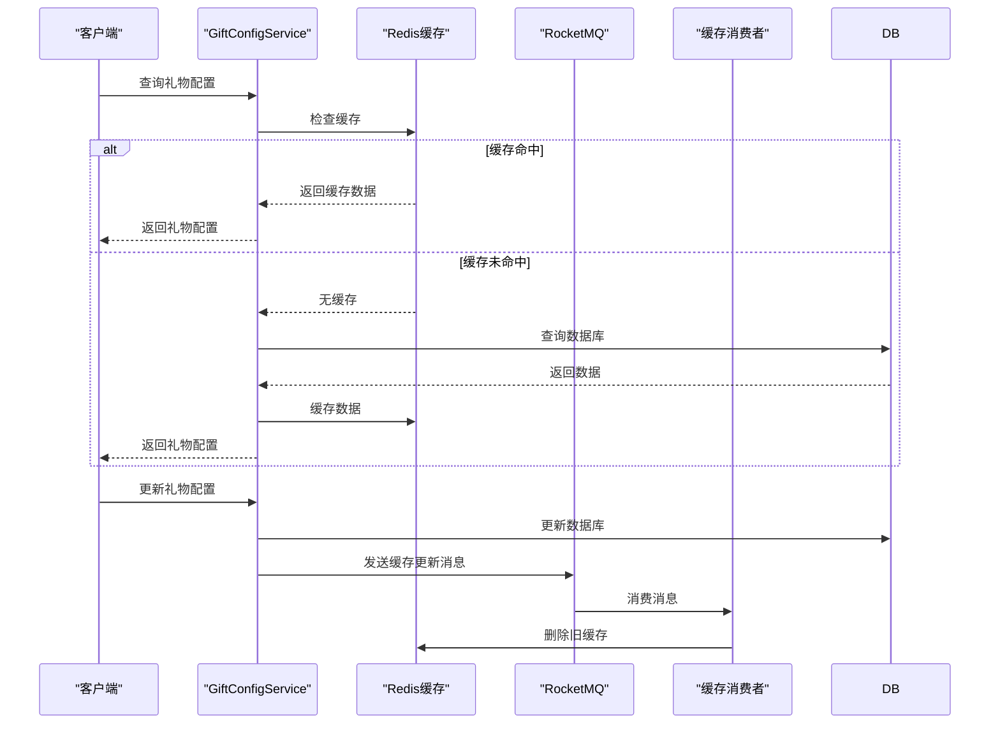
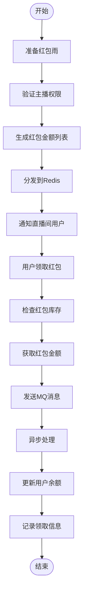
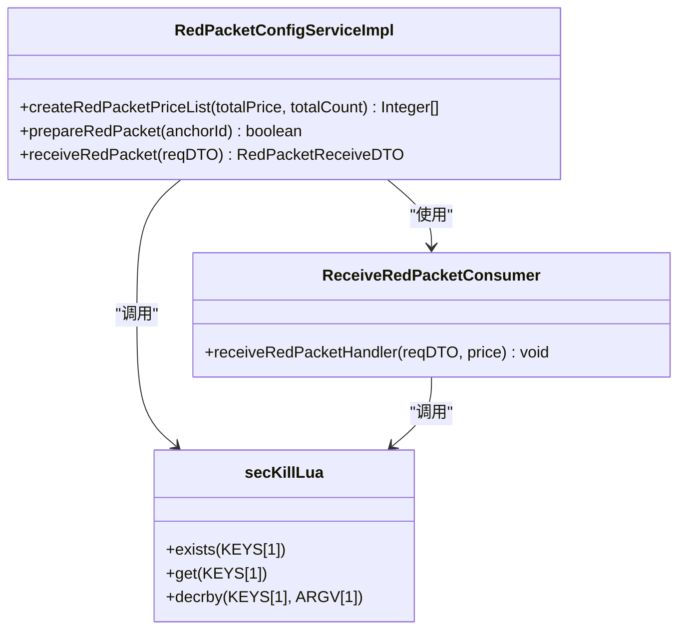
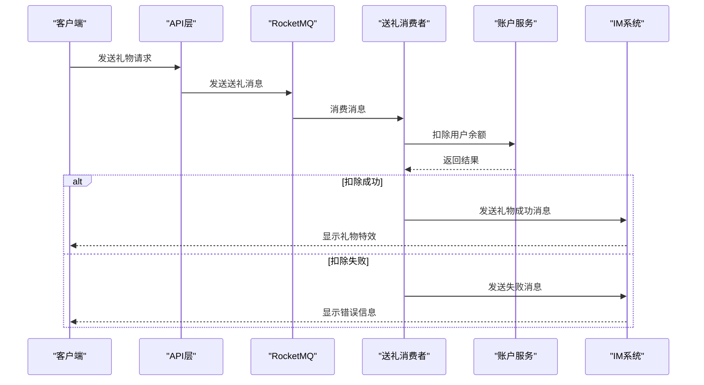
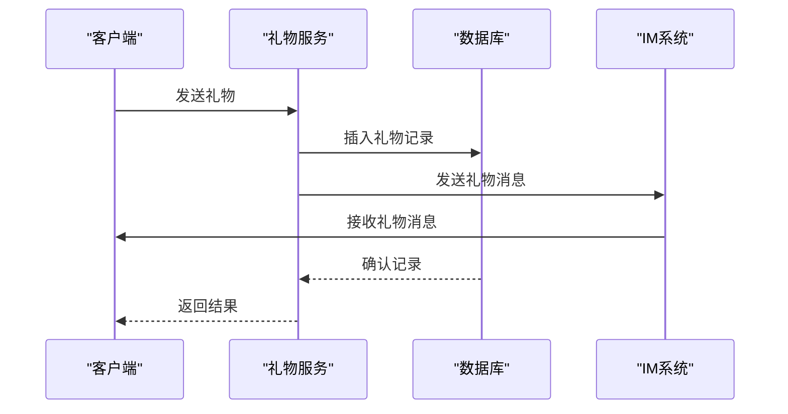
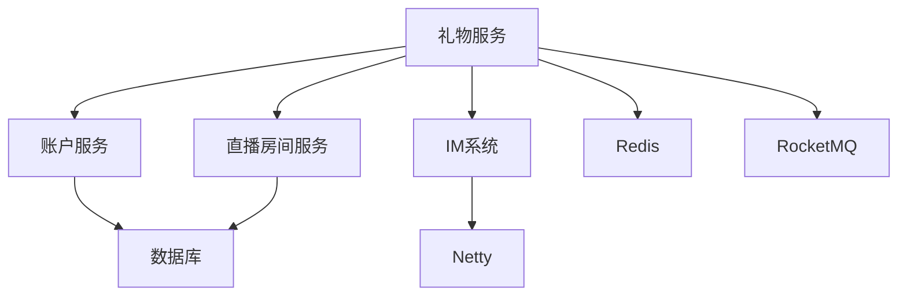

# 礼物系统

<cite>
**本文档引用的文件**
- [IGiftConfigRPC.java](file://live-gift-interface\src\main\java\com\logilong\live\gift\interfaces\IGiftConfigRPC.java)
- [IGiftRecordRPC.java](file://live-gift-interface\src\main\java\com\logilong\live\gift\interfaces\IGiftRecordRPC.java)
- [IRedPacketConfigRPC.java](file://live-gift-interface\src\main\java\com\logilong\live\gift\interfaces\IRedPacketConfigRPC.java)
- [IGiftConfigService.java](file://live-gift-provider\src\main\java\com\logilong\live\gift\provider\service\IGiftConfigService.java)
- [IGiftRecordService.java](file://live-gift-provider\src\main\java\com\logilong\live\gift\provider\service\IGiftRecordService.java)
- [IRedPacketConfigService.java](file://live-gift-provider\src\main\java\com\logilong\live\gift\provider\service\IRedPacketConfigService.java)
- [GiftConfigServiceImpl.java](file://live-gift-provider\src\main\java\com\logilong\live\gift\provider\service\impl\GiftConfigServiceImpl.java)
- [GiftRecordServiceImpl.java](file://live-gift-provider\src\main\java\com\logilong\live\gift\provider\service\impl\GiftRecordServiceImpl.java)
- [RedPacketConfigServiceImpl.java](file://live-gift-provider\src\main\java\com\logilong\live\gift\provider\service\impl\RedPacketConfigServiceImpl.java)
- [GiftController.java](file://live-api\src\main\java\com\logilong\live\api\controller\GiftController.java)
- [SendGiftConsumer.java](file://live-gift-provider\src\main\java\com\logilong\live\gift\provider\consumer\SendGiftConsumer.java)
- [GiftConfigCacheConsumer.java](file://live-gift-provider\src\main\java\com\logilong\live\gift\provider\consumer\GiftConfigCacheConsumer.java)
- [ReceiveRedPacketConsumer.java](file://live-gift-provider\src\main\java\com\logilong\live\gift\provider\consumer\ReceiveRedPacketConsumer.java)
- [GiftConfigDTO.java](file://live-gift-interface\src\main\java\com\logilong\live\gift\dto\GiftConfigDTO.java)
- [GiftRecordDTO.java](file://live-gift-interface\src\main\java\com\logilong\live\gift\dto\GiftRecordDTO.java)
- [secKill.lua](file://live-gift-provider\src\main\resources\secKill.lua)
- [getPkNumAndSeqId.lua](file://live-gift-provider\src\main\resources\getPkNumAndSeqId.lua)
</cite>

## 目录
1. [简介](#简介)
2. [项目结构](#项目结构)
3. [核心组件](#核心组件)
4. [架构概述](#架构概述)
5. [详细组件分析](#详细组件分析)
6. [依赖分析](#依赖分析)
7. [性能考虑](#性能考虑)
8. [故障排除指南](#故障排除指南)
9. [结论](#结论)

## 简介
礼物系统是直播平台中的核心功能模块，负责礼物配置管理、礼物赠送流程、红包功能等关键业务。系统采用微服务架构，通过RPC接口提供服务，利用Redis实现高性能缓存，并通过RocketMQ实现异步消息处理，确保高并发场景下的系统稳定性和性能。

## 项目结构
礼物系统由多个模块组成，主要包括接口层、服务提供层和资源文件。接口层定义了礼物配置、礼物记录和红包配置的RPC接口；服务提供层实现了具体的业务逻辑；资源文件包含了用于原子操作的Lua脚本。

**图示来源**
- [IGiftConfigRPC.java](file://live-gift-interface\src\main\java\com\logilong\live\gift\interfaces\IGiftConfigRPC.java)
- [IGiftRecordRPC.java](file://live-gift-interface\src\main\java\com\logilong\live\gift\interfaces\IGiftRecordRPC.java)
- [IRedPacketConfigRPC.java](file://live-gift-interface\src\main\java\com\logilong\live\gift\interfaces\IRedPacketConfigRPC.java)
- [GiftConfigServiceImpl.java](file://live-gift-provider\src\main\java\com\logilong\live\gift\provider\service\impl\GiftConfigServiceImpl.java)
- [GiftRecordServiceImpl.java](file://live-gift-provider\src\main\java\com\logilong\live\gift\provider\service\impl\GiftRecordServiceImpl.java)
- [RedPacketConfigServiceImpl.java](file://live-gift-provider\src\main\java\com\logilong\live\gift\provider\service\impl\RedPacketConfigServiceImpl.java)
- [SendGiftConsumer.java](file://live-gift-provider\src\main\java\com\logilong\live\gift\provider\consumer\SendGiftConsumer.java)
- [GiftConfigCacheConsumer.java](file://live-gift-provider\src\main\java\com\logilong\live\gift\provider\consumer\GiftConfigCacheConsumer.java)
- [ReceiveRedPacketConsumer.java](file://live-gift-provider\src\main\java\com\logilong\live\gift\provider\consumer\ReceiveRedPacketConsumer.java)

**章节来源**
- [IGiftConfigRPC.java](file://live-gift-interface\src\main\java\com\logilong\live\gift\interfaces\IGiftConfigRPC.java)
- [IGiftRecordRPC.java](file://live-gift-interface\src\main\java\com\logilong\live\gift\interfaces\IGiftRecordRPC.java)
- [IRedPacketConfigRPC.java](file://live-gift-interface\src\main\java\com\logilong\live\gift\interfaces\IRedPacketConfigRPC.java)

## 核心组件
礼物系统的核心组件包括礼物配置服务(GiftConfigService)、礼物记录服务(GiftRecordService)和红包配置服务(RedPacketConfigService)。这些服务通过RPC接口对外提供功能，实现了礼物的配置管理、赠送记录和红包功能。

**章节来源**
- [IGiftConfigService.java](file://live-gift-provider\src\main\java\com\logilong\live\gift\provider\service\IGiftConfigService.java)
- [IGiftRecordService.java](file://live-gift-provider\src\main\java\com\logilong\live\gift\provider\service\IGiftRecordService.java)
- [IRedPacketConfigService.java](file://live-gift-provider\src\main\java\com\logilong\live\gift\provider\service\IRedPacketConfigService.java)

## 架构概述
礼物系统采用分层架构设计，包括接口层、服务层和数据访问层。系统通过RocketMQ实现异步处理，利用Redis实现缓存和原子操作，确保高并发场景下的性能和数据一致性。

**图示来源**
- [GiftController.java](file://live-api\src\main\java\com\logilong\live\api\controller\GiftController.java)
- [SendGiftConsumer.java](file://live-gift-provider\src\main\java\com\logilong\live\gift\provider\consumer\SendGiftConsumer.java)
- [GiftConfigCacheConsumer.java](file://live-gift-provider\src\main\java\com\logilong\live\gift\provider\consumer\GiftConfigCacheConsumer.java)
- [ReceiveRedPacketConsumer.java](file://live-gift-provider\src\main\java\com\logilong\live\gift\provider\consumer\ReceiveRedPacketConsumer.java)

## 详细组件分析

### 礼物配置服务分析
礼物配置服务(GiftConfigService)负责礼物的配置管理，包括礼物信息的查询、插入和更新。服务实现了高效的缓存策略和热更新机制。

#### 缓存策略与热更新机制
礼物配置服务采用了多级缓存策略，使用Redis缓存礼物配置信息，有效减轻数据库访问压力。当礼物配置信息发生变化时，服务通过RocketMQ发送消息，通知缓存消费者更新缓存。

**图示来源**
- [GiftConfigServiceImpl.java](file://live-gift-provider\src\main\java\com\logilong\live\gift\provider\service\impl\GiftConfigServiceImpl.java)
- [GiftConfigCacheConsumer.java](file://live-gift-provider\src\main\java\com\logilong\live\gift\provider\consumer\GiftConfigCacheConsumer.java)

**章节来源**
- [GiftConfigServiceImpl.java](file://live-gift-provider\src\main\java\com\logilong\live\gift\provider\service\impl\GiftConfigServiceImpl.java)
- [GiftConfigCacheConsumer.java](file://live-gift-provider\src\main\java\com\logilong\live\gift\provider\consumer\GiftConfigCacheConsumer.java)

### 红包功能实现分析
红包功能是礼物系统的重要组成部分，实现了红包雨的配置、发放和领取功能。系统通过Lua脚本确保库存控制的原子性，使用二倍均值法实现随机算法，并通过幂等性保证确保数据一致性。

#### 红包功能实现原理
红包功能的实现涉及多个关键组件，包括红包配置、随机算法、幂等性保证和库存控制。系统使用Redis存储红包金额列表，通过Lua脚本实现原子操作。

**图示来源**
- [RedPacketConfigServiceImpl.java](file://live-gift-provider\src\main\java\com\logilong\live\gift\provider\service\impl\RedPacketConfigServiceImpl.java)
- [ReceiveRedPacketConsumer.java](file://live-gift-provider\src\main\java\com\logilong\live\gift\provider\consumer\ReceiveRedPacketConsumer.java)
- [secKill.lua](file://live-gift-provider\src\main\resources\secKill.lua)

**章节来源**
- [RedPacketConfigServiceImpl.java](file://live-gift-provider\src\main\java\com\logilong\live\gift\provider\service\impl\RedPacketConfigServiceImpl.java)
- [ReceiveRedPacketConsumer.java](file://live-gift-provider\src\main\java\com\logilong\live\gift\provider\consumer\ReceiveRedPacketConsumer.java)

#### 随机算法与库存控制
红包金额的分配采用二倍均值法，确保金额分配的公平性和随机性。库存控制通过Lua脚本实现原子操作，防止超发。

**图示来源**
- [RedPacketConfigServiceImpl.java](file://live-gift-provider\src\main\java\com\logilong\live\gift\provider\service\impl\RedPacketConfigServiceImpl.java)
- [ReceiveRedPacketConsumer.java](file://live-gift-provider\src\main\java\com\logilong\live\gift\provider\consumer\ReceiveRedPacketConsumer.java)
- [secKill.lua](file://live-gift-provider\src\main\resources\secKill.lua)

### 异步送礼流程分析
系统通过RocketMQ实现异步送礼流程，确保高并发场景下的性能和可靠性。送礼请求首先被放入消息队列，然后由消费者异步处理。

**图示来源**
- [SendGiftConsumer.java](file://live-gift-provider\src\main\java\com\logilong\live\gift\provider\consumer\SendGiftConsumer.java)
- [GiftController.java](file://live-api\src\main\java\com\logilong\live\api\controller\GiftController.java)

**章节来源**
- [SendGiftConsumer.java](file://live-gift-provider\src\main\java\com\logilong\live\gift\provider\consumer\SendGiftConsumer.java)

### 礼物记录与IM集成分析
礼物记录服务负责生成和查询礼物赠送记录，并与IM系统集成，实现实时消息推送。

**图示来源**
- [GiftRecordServiceImpl.java](file://live-gift-provider\src\main\java\com\logilong\live\gift\provider\service\impl\GiftRecordServiceImpl.java)
- [SendGiftConsumer.java](file://live-gift-provider\src\main\java\com\logilong\live\gift\provider\consumer\SendGiftConsumer.java)

**章节来源**
- [GiftRecordServiceImpl.java](file://live-gift-provider\src\main\java\com\logilong\live\gift\provider\service\impl\GiftRecordServiceImpl.java)

## 依赖分析
礼物系统与其他多个服务存在依赖关系，包括账户服务、IM系统和直播房间服务。这些依赖通过Dubbo RPC实现。

**图示来源**
- [RedPacketConfigServiceImpl.java](file://live-gift-provider\src\main\java\com\logilong\live\gift\provider\service\impl\RedPacketConfigServiceImpl.java)
- [SendGiftConsumer.java](file://live-gift-provider\src\main\java\com\logilong\live\gift\provider\consumer\SendGiftConsumer.java)

**章节来源**
- [RedPacketConfigServiceImpl.java](file://live-gift-provider\src\main\java\com\logilong\live\gift\provider\service\impl\RedPacketConfigServiceImpl.java)
- [SendGiftConsumer.java](file://live-gift-provider\src\main\java\com\logilong\live\gift\provider\consumer\SendGiftConsumer.java)

## 性能考虑
礼物系统在高并发场景下通过多种机制优化性能，包括缓存策略、异步处理和原子操作。

### 高并发性能优化方案
1. **缓存优化**：使用Redis缓存礼物配置信息，减少数据库访问
2. **异步处理**：通过RocketMQ实现异步送礼流程，提高系统吞吐量
3. **原子操作**：使用Lua脚本确保库存控制的原子性
4. **批量处理**：对红包金额列表进行分批插入Redis，避免缓冲区溢出
5. **幂等性保证**：通过Redis分布式锁确保操作的幂等性

**章节来源**
- [GiftConfigServiceImpl.java](file://live-gift-provider\src\main\java\com\logilong\live\gift\provider\service\impl\GiftConfigServiceImpl.java)
- [RedPacketConfigServiceImpl.java](file://live-gift-provider\src\main\java\com\logilong\live\gift\provider\service\impl\RedPacketConfigServiceImpl.java)
- [secKill.lua](file://live-gift-provider\src\main\resources\secKill.lua)

## 故障排除指南
### 常见问题及解决方案
1. **缓存不一致**：检查RocketMQ消息是否正常消费，确保缓存消费者正常运行
2. **红包超发**：检查Lua脚本的原子性保证，确保库存检查和扣减的原子性
3. **消息丢失**：检查RocketMQ的持久化配置和消费者确认机制
4. **性能瓶颈**：监控Redis和数据库的性能指标，优化查询和缓存策略

**章节来源**
- [GiftConfigCacheConsumer.java](file://live-gift-provider\src\main\java\com\logilong\live\gift\provider\consumer\GiftConfigCacheConsumer.java)
- [ReceiveRedPacketConsumer.java](file://live-gift-provider\src\main\java\com\logilong\live\gift\provider\consumer\ReceiveRedPacketConsumer.java)
- [secKill.lua](file://live-gift-provider\src\main\resources\secKill.lua)

## 结论
礼物系统通过合理的架构设计和多种优化策略，实现了高性能、高可用的礼物赠送功能。系统采用微服务架构，通过RPC接口提供服务，利用Redis实现缓存和原子操作，通过RocketMQ实现异步处理，确保了高并发场景下的系统稳定性和性能。未来可以进一步优化缓存策略，引入更智能的负载均衡机制，提升系统的可扩展性和容错能力。