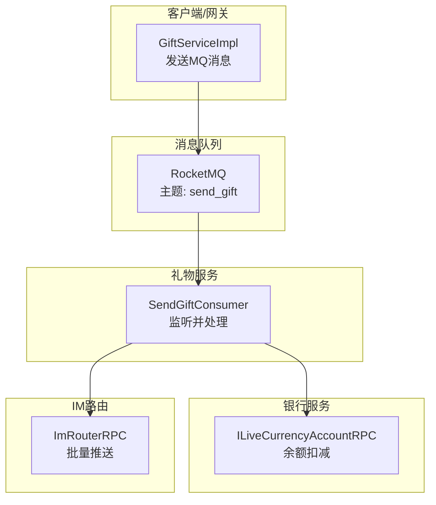
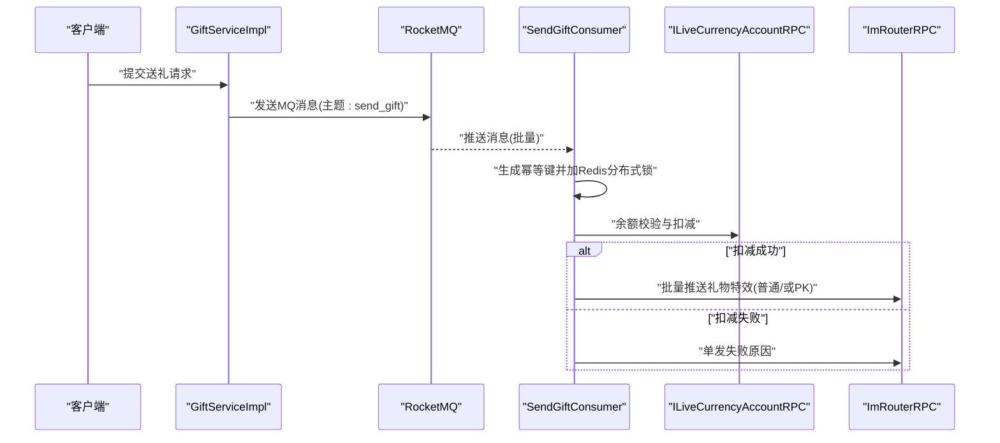
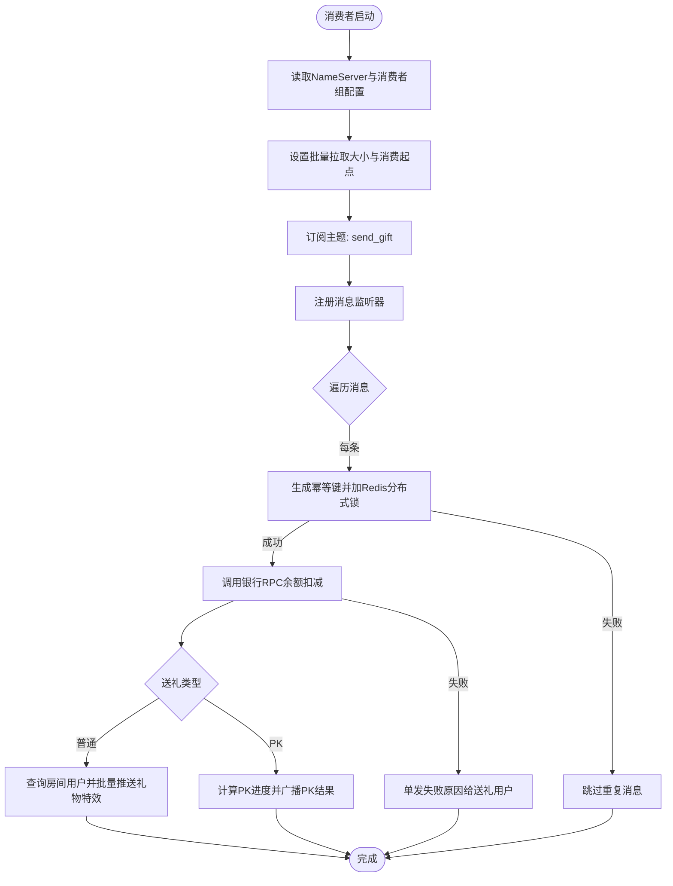
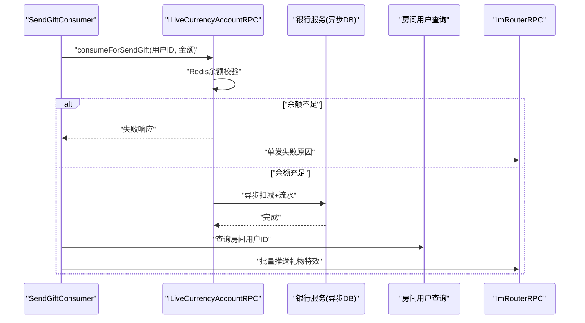
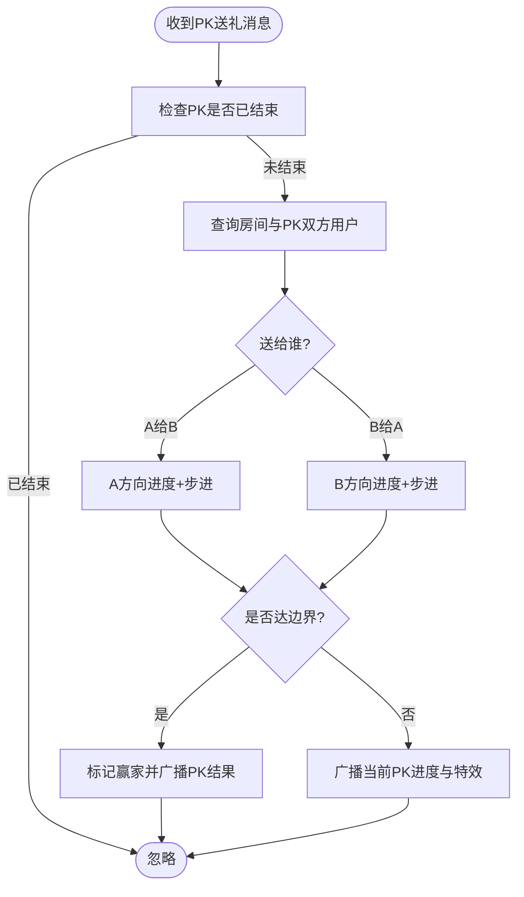
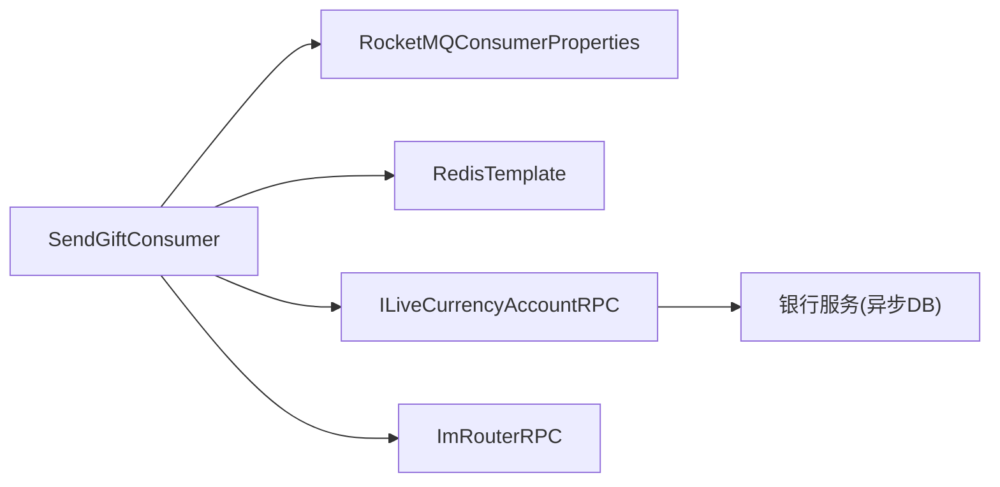

# 礼物赠送流程

<cite>
**本文引用的文件**
- [SendGiftConsumer.java](file://live-gift-provider/src/main/java/com/logilong/live/gift/provider/consumer/SendGiftConsumer.java)
- [GiftServiceImpl.java](file://live-api/src/main/java/com/logilong/live/api/service/impl/GiftServiceImpl.java)
- [ILiveCurrencyAccountRPC.java](file://live-bank-interface/src/main/java/com/logilong/live/bank/interfaces/ILiveCurrencyAccountRPC.java)
- [LiveCurrencyAccountServiceImpl.java](file://live-bank-provider/src/main/java/com/logilong/live/bank/provider/service/impl/LiveCurrencyAccountServiceImpl.java)
- [ImRouterRPC.java](file://live-im-router-interface/src/main/java/com/logilong/live/im/router/interfaces/ImRouterRPC.java)
- [SendGiftMq.java](file://live-common-interface/src/main/java/com/logilong/live/common/interfaces/dto/SendGiftMq.java)
- [GiftProviderTopicNames.java](file://live-common-interface/src/main/java/com/logilong/live/common/interfaces/topic/GiftProviderTopicNames.java)
- [RocketMQConsumerProperties.java](file://live-framework/live-framework-mq-starter/src/main/java/com/logilong/live/framework/mq/starter/properties/RocketMQConsumerProperties.java)
- [GiftProviderCacheKeyBuilder.java](file://live-framework/live-framework-redis-starter/src/main/java/com/logilong/live/framework/redis/starter/key/GiftProviderCacheKeyBuilder.java)
- [SendGiftTypeEnum.java](file://live-gift-interface/src/main/java/com/logilong/live/gift/constants/SendGiftTypeEnum.java)
</cite>

## 目录
1. [引言](#引言)
2. [项目结构](#项目结构)
3. [核心组件](#核心组件)
4. [架构总览](#架构总览)
5. [详细组件分析](#详细组件分析)
6. [依赖关系分析](#依赖关系分析)
7. [性能考量](#性能考量)
8. [故障排查指南](#故障排查指南)
9. [结论](#结论)

## 引言
本文件围绕“礼物赠送”的完整业务闭环展开，从客户端发起送礼请求，到MQ消息投递与消费，再到虚拟货币扣减、送礼类型分支处理（普通送礼与PK送礼）、IM消息推送与失败回告，以及幂等性控制与高并发优化策略进行系统化梳理。文档旨在帮助开发者快速理解并高效维护该链路。

## 项目结构
- 客户端/网关侧：通过API服务将送礼请求转换为MQ消息，发布到指定主题。
- MQ侧：RocketMQ作为消息中间件，承载送礼事件。
- 礼物服务侧：消费端监听主题，执行余额校验与扣减、IM推送、PK进度计算等。
- 银行服务侧：提供虚拟货币账户的余额查询与扣减能力。
- IM路由侧：负责将礼物特效消息批量推送到直播间所有用户。

图表来源
- [GiftServiceImpl.java](file://live-api/src/main/java/com/logilong/live/api/service/impl/GiftServiceImpl.java#L50-L77)
- [SendGiftConsumer.java](file://live-gift-provider/src/main/java/com/logilong/live/gift/provider/consumer/SendGiftConsumer.java#L74-L126)
- [ILiveCurrencyAccountRPC.java](file://live-bank-interface/src/main/java/com/logilong/live/bank/interfaces/ILiveCurrencyAccountRPC.java#L1-L54)
- [ImRouterRPC.java](file://live-im-router-interface/src/main/java/com/logilong/live/im/router/interfaces/ImRouterRPC.java#L1-L20)

章节来源
- [GiftServiceImpl.java](file://live-api/src/main/java/com/logilong/live/api/service/impl/GiftServiceImpl.java#L50-L77)
- [SendGiftConsumer.java](file://live-gift-provider/src/main/java/com/logilong/live/gift/provider/consumer/SendGiftConsumer.java#L74-L126)

## 核心组件
- MQ消息体：包含送礼用户、礼物ID、价格、接收者、房间号、特效URL、幂等UUID、送礼类型等字段。
- MQ消费者：初始化RocketMQ消费者组、批量消费、从头消费、监听主题、幂等控制、余额扣减、IM推送。
- 银行RPC：提供余额查询与扣减能力，支持送礼专用的“消费”接口。
- IM路由RPC：支持单发与批量推送，用于礼物特效广播与失败回告。

章节来源
- [SendGiftMq.java](file://live-common-interface/src/main/java/com/logilong/live/common/interfaces/dto/SendGiftMq.java#L1-L17)
- [SendGiftConsumer.java](file://live-gift-provider/src/main/java/com/logilong/live/gift/provider/consumer/SendGiftConsumer.java#L74-L126)
- [ILiveCurrencyAccountRPC.java](file://live-bank-interface/src/main/java/com/logilong/live/bank/interfaces/ILiveCurrencyAccountRPC.java#L1-L54)
- [ImRouterRPC.java](file://live-im-router-interface/src/main/java/com/logilong/live/im/router/interfaces/ImRouterRPC.java#L1-L20)

## 架构总览
从客户端到IM的完整链路如下：
- 客户端调用API服务，构造MQ消息并发送至“send_gift”主题。
- 礼物服务消费者订阅该主题，按批次拉取消息。
- 对每条消息生成幂等键，使用Redis分布式锁避免重复消费。
- 通过银行RPC对用户余额进行二次校验与扣减。
- 根据送礼类型执行不同逻辑：
  - 普通送礼：向房间内所有用户广播礼物特效。
  - PK送礼：计算PK进度，若达成条件则宣布赢家并广播PK结果。
- 若扣减失败，则单独向送礼用户推送失败原因。

图表来源
- [GiftServiceImpl.java](file://live-api/src/main/java/com/logilong/live/api/service/impl/GiftServiceImpl.java#L50-L77)
- [SendGiftConsumer.java](file://live-gift-provider/src/main/java/com/logilong/live/gift/provider/consumer/SendGiftConsumer.java#L74-L126)
- [ILiveCurrencyAccountRPC.java](file://live-bank-interface/src/main/java/com/logilong/live/bank/interfaces/ILiveCurrencyAccountRPC.java#L1-L54)
- [ImRouterRPC.java](file://live-im-router-interface/src/main/java/com/logilong/live/im/router/interfaces/ImRouterRPC.java#L1-L20)

## 详细组件分析

### SendGiftConsumer 初始化与消息监听机制
- 消费者组配置
  - 从配置类读取NameServer地址与消费者组名，拼接消费者类名形成唯一组名，确保同应用多实例可水平扩展。
- 批量消费设置
  - 设置批量拉取最大条数，提升吞吐；结合RocketMQ的顺序与并发消费模型，降低单条处理开销。
- 消费位点管理
  - 从第一条偏移开始消费，避免遗漏历史消息。
- 主题订阅
  - 订阅“send_gift”主题，处理送礼事件。
- 幂等性控制
  - 使用Redis的setIfAbsent生成“gift_consume_key:uuid”，设置超时时间，未获取到锁则跳过，防止重复处理。
- 消息监听与处理
  - 遍历批量消息，逐条解析为消息体，执行余额扣减与后续逻辑。

图表来源
- [SendGiftConsumer.java](file://live-gift-provider/src/main/java/com/logilong/live/gift/provider/consumer/SendGiftConsumer.java#L74-L126)
- [RocketMQConsumerProperties.java](file://live-framework/live-framework-mq-starter/src/main/java/com/logilong/live/framework/mq/starter/properties/RocketMQConsumerProperties.java#L1-L16)
- [GiftProviderCacheKeyBuilder.java](file://live-framework/live-framework-redis-starter/src/main/java/com/logilong/live/framework/redis/starter/key/GiftProviderCacheKeyBuilder.java#L72-L75)
- [GiftProviderTopicNames.java](file://live-common-interface/src/main/java/com/logilong/live/common/interfaces/topic/GiftProviderTopicNames.java#L1-L20)

章节来源
- [SendGiftConsumer.java](file://live-gift-provider/src/main/java/com/logilong/live/gift/provider/consumer/SendGiftConsumer.java#L74-L126)
- [RocketMQConsumerProperties.java](file://live-framework/live-framework-mq-starter/src/main/java/com/logilong/live/framework/mq/starter/properties/RocketMQConsumerProperties.java#L1-L16)
- [GiftProviderCacheKeyBuilder.java](file://live-framework/live-framework-redis-starter/src/main/java/com/logilong/live/framework/redis/starter/key/GiftProviderCacheKeyBuilder.java#L72-L75)
- [GiftProviderTopicNames.java](file://live-common-interface/src/main/java/com/logilong/live/common/interfaces/topic/GiftProviderTopicNames.java#L1-L20)

### 余额扣减与送礼核心流程
- 入参准备
  - 从消息体提取用户ID与价格，封装为余额扣减请求。
- 余额校验与扣减
  - 调用银行RPC的“送礼专用消费”接口，内部先查Redis余额，不足则直接失败；余额充足则执行Redis扣减，并异步落库与记账。
- 成功分支
  - 普通送礼：查询房间内所有用户ID，批量推送礼物特效。
  - PK送礼：计算PK进度，若达到边界则标记赢家并广播PK结果。
- 失败分支
  - 单发失败原因给送礼用户，提示余额不足或其他错误。

图表来源
- [SendGiftConsumer.java](file://live-gift-provider/src/main/java/com/logilong/live/gift/provider/consumer/SendGiftConsumer.java#L94-L119)
- [ILiveCurrencyAccountRPC.java](file://live-bank-interface/src/main/java/com/logilong/live/bank/interfaces/ILiveCurrencyAccountRPC.java#L43-L53)
- [LiveCurrencyAccountServiceImpl.java](file://live-bank-provider/src/main/java/com/logilong/live/bank/provider/service/impl/LiveCurrencyAccountServiceImpl.java#L176-L186)

章节来源
- [SendGiftConsumer.java](file://live-gift-provider/src/main/java/com/logilong/live/gift/provider/consumer/SendGiftConsumer.java#L94-L119)
- [ILiveCurrencyAccountRPC.java](file://live-bank-interface/src/main/java/com/logilong/live/bank/interfaces/ILiveCurrencyAccountRPC.java#L43-L53)
- [LiveCurrencyAccountServiceImpl.java](file://live-bank-provider/src/main/java/com/logilong/live/bank/provider/service/impl/LiveCurrencyAccountServiceImpl.java#L176-L186)

### 送礼类型分支：普通送礼与PK送礼
- 普通送礼
  - 直接广播礼物特效URL给房间内所有用户。
- PK送礼
  - 仅对PK双方生效：若送给PK一方，进度向其方向移动；送给另一方则反向移动。
  - 使用Redis Lua脚本原子性更新PK进度，达到边界即宣布赢家并广播PK结果。
  - 使用Redis键标记PK结束状态，避免重复广播。

图表来源
- [SendGiftConsumer.java](file://live-gift-provider/src/main/java/com/logilong/live/gift/provider/consumer/SendGiftConsumer.java#L145-L191)
- [GiftProviderCacheKeyBuilder.java](file://live-framework/live-framework-redis-starter/src/main/java/com/logilong/live/framework/redis/starter/key/GiftProviderCacheKeyBuilder.java#L61-L71)
- [SendGiftTypeEnum.java](file://live-gift-interface/src/main/java/com/logilong/live/gift/constants/SendGiftTypeEnum.java#L1-L18)

章节来源
- [SendGiftConsumer.java](file://live-gift-provider/src/main/java/com/logilong/live/gift/provider/consumer/SendGiftConsumer.java#L145-L191)
- [GiftProviderCacheKeyBuilder.java](file://live-framework/live-framework-redis-starter/src/main/java/com/logilong/live/framework/redis/starter/key/GiftProviderCacheKeyBuilder.java#L61-L71)
- [SendGiftTypeEnum.java](file://live-gift-interface/src/main/java/com/logilong/live/gift/constants/SendGiftTypeEnum.java#L1-L18)

### IM消息推送与错误通知
- 成功推送
  - 普通送礼：批量推送礼物特效URL。
  - PK送礼：批量推送PK进度、赢家、特效URL等。
- 失败通知
  - 单发失败原因给送礼用户，提示余额不足或其他错误。
- 推送载体
  - 通过ImRouterRPC的批量发送接口实现房间级广播。

章节来源
- [SendGiftConsumer.java](file://live-gift-provider/src/main/java/com/logilong/live/gift/provider/consumer/SendGiftConsumer.java#L102-L119)
- [SendGiftConsumer.java](file://live-gift-provider/src/main/java/com/logilong/live/gift/provider/consumer/SendGiftConsumer.java#L193-L211)
- [ImRouterRPC.java](file://live-im-router-interface/src/main/java/com/logilong/live/im/router/interfaces/ImRouterRPC.java#L1-L20)

## 依赖关系分析
- 组件耦合
  - SendGiftConsumer依赖RocketMQ消费者配置、Redis分布式锁、银行RPC、IM路由RPC、房间RPC。
  - 银行服务实现采用异步线程池落库，降低主流程阻塞。
- 外部依赖
  - RocketMQ：消息收发与消费模型。
  - Redis：幂等锁、PK进度、余额缓存。
  - Dubbo：RPC调用链路。

图表来源
- [SendGiftConsumer.java](file://live-gift-provider/src/main/java/com/logilong/live/gift/provider/consumer/SendGiftConsumer.java#L61-L73)
- [RocketMQConsumerProperties.java](file://live-framework/live-framework-mq-starter/src/main/java/com/logilong/live/framework/mq/starter/properties/RocketMQConsumerProperties.java#L1-L16)
- [LiveCurrencyAccountServiceImpl.java](file://live-bank-provider/src/main/java/com/logilong/live/bank/provider/service/impl/LiveCurrencyAccountServiceImpl.java#L38-L40)

章节来源
- [SendGiftConsumer.java](file://live-gift-provider/src/main/java/com/logilong/live/gift/provider/consumer/SendGiftConsumer.java#L61-L73)
- [LiveCurrencyAccountServiceImpl.java](file://live-bank-provider/src/main/java/com/logilong/live/bank/provider/service/impl/LiveCurrencyAccountServiceImpl.java#L38-L40)

## 性能考量
- 消息消费
  - 批量拉取提升吞吐，合理设置批量大小与并发度。
  - 从头消费确保历史消息不丢失，适合冷启动或重放场景。
- 幂等控制
  - Redis分布式锁避免重复消费，提高可靠性。
- 余额扣减
  - 先查Redis余额，不足直接失败，减少DB压力。
  - Redis扣减后异步落库，主流程非阻塞。
- IM推送
  - 房间内批量推送，减少网络往返。
- PK进度
  - 使用Lua脚本原子性更新，避免竞态。

章节来源
- [SendGiftConsumer.java](file://live-gift-provider/src/main/java/com/logilong/live/gift/provider/consumer/SendGiftConsumer.java#L74-L126)
- [LiveCurrencyAccountServiceImpl.java](file://live-bank-provider/src/main/java/com/logilong/live/bank/provider/service/impl/LiveCurrencyAccountServiceImpl.java#L176-L186)

## 故障排查指南
- MQ消费异常
  - 检查消费者组名与NameServer配置是否正确。
  - 确认主题订阅是否为“send_gift”，批量拉取大小是否合理。
- 幂等问题
  - 检查Redis中是否存在“gift_consume_key:uuid”键且未过期。
  - 如出现重复消费，确认锁是否被提前释放或超时时间过短。
- 余额扣减失败
  - 核对用户余额是否充足；查看银行服务日志与异步DB执行情况。
  - 关注Redis余额缓存是否命中。
- IM推送失败
  - 检查房间用户查询是否正常；确认ImRouterRPC批量发送接口可用。
  - 观察失败回告是否成功单发给送礼用户。
- PK进度异常
  - 检查Redis中PK进度键是否存在与过期；确认Lua脚本参数与边界值。

章节来源
- [RocketMQConsumerProperties.java](file://live-framework/live-framework-mq-starter/src/main/java/com/logilong/live/framework/mq/starter/properties/RocketMQConsumerProperties.java#L1-L16)
- [GiftProviderCacheKeyBuilder.java](file://live-framework/live-framework-redis-starter/src/main/java/com/logilong/live/framework/redis/starter/key/GiftProviderCacheKeyBuilder.java#L61-L71)
- [SendGiftConsumer.java](file://live-gift-provider/src/main/java/com/logilong/live/gift/provider/consumer/SendGiftConsumer.java#L145-L191)
- [LiveCurrencyAccountServiceImpl.java](file://live-bank-provider/src/main/java/com/logilong/live/bank/provider/service/impl/LiveCurrencyAccountServiceImpl.java#L176-L186)

## 结论
该流程通过MQ削峰、Redis幂等与余额缓存、异步DB落库与批量IM推送，实现了高并发场景下的稳定送礼体验。普通送礼与PK送礼分别采用不同的业务分支，既保证了用户体验，也兼顾了系统的可扩展性与可观测性。建议在生产环境中持续监控MQ积压、Redis命中率与银行服务延迟，并根据流量峰值动态调整消费者实例数量与批量大小。