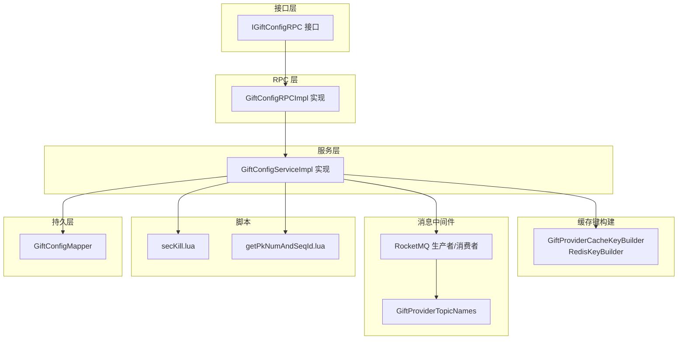
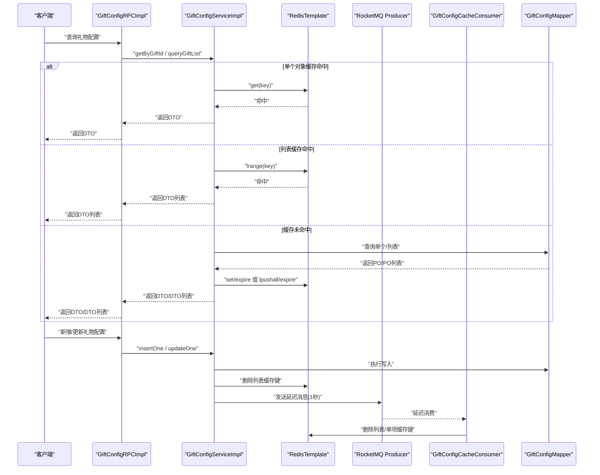
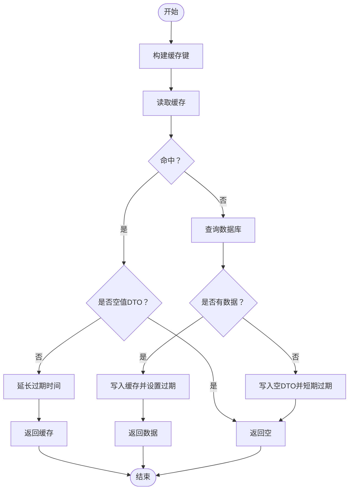
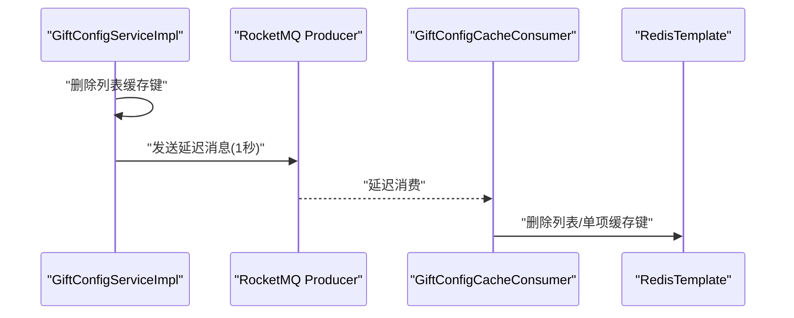
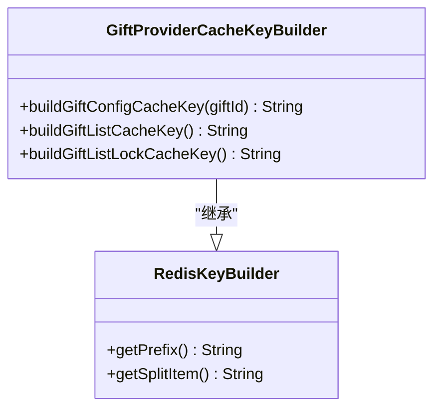
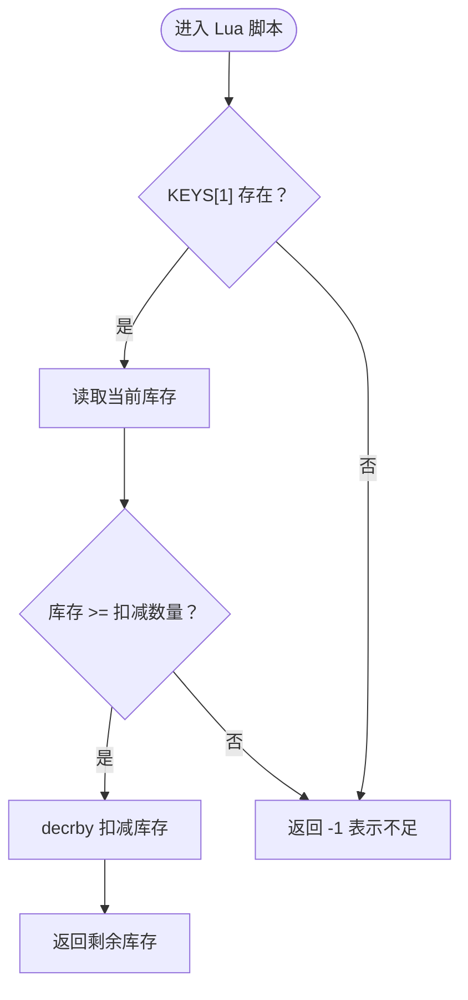
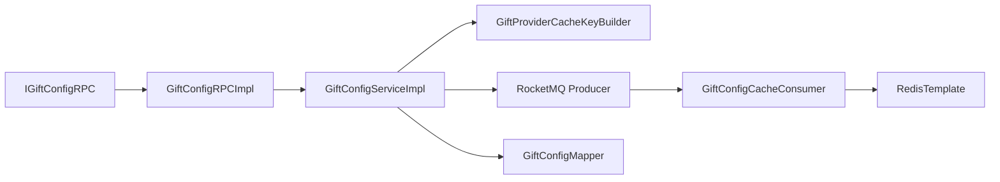

# 礼物配置管理

<cite>
**本文引用的文件**
- [GiftConfigServiceImpl.java](file://live-gift-provider/src/main/java/com/logilong/live/gift/provider/service/impl/GiftConfigServiceImpl.java)
- [IGiftConfigService.java](file://live-gift-provider/src/main/java/com/logilong/live/gift/provider/service/IGiftConfigService.java)
- [GiftConfigRPCImpl.java](file://live-gift-provider/src/main/java/com/logilong/live/gift/provider/rpc/GiftConfigRPCImpl.java)
- [IGiftConfigRPC.java](file://live-gift-interface/src/main/java/com/logilong/live/gift/interfaces/IGiftConfigRPC.java)
- [GiftConfigCacheConsumer.java](file://live-gift-provider/src/main/java/com/logilong/live/gift/provider/consumer/GiftConfigCacheConsumer.java)
- [GiftProviderCacheKeyBuilder.java](file://live-framework/live-framework-redis-starter/src/main/java/com/logilong/live/framework/redis/starter/key/GiftProviderCacheKeyBuilder.java)
- [RedisKeyBuilder.java](file://live-framework/live-framework-redis-starter/src/main/java/com/logilong/live/framework/redis/starter/key/RedisKeyBuilder.java)
- [GiftProviderTopicNames.java](file://live-common-interface/src/main/java/com/logilong/live/common/interfaces/topic/GiftProviderTopicNames.java)
- [GiftCacheRemoveBO.java](file://live-gift-provider/src/main/java/com/logilong/live/gift/provider/service/bo/GiftCacheRemoveBO.java)
- [secKill.lua](file://live-gift-provider/src/main/resources/secKill.lua)
- [getPkNumAndSeqId.lua](file://live-gift-provider/src/main/resources/getPkNumAndSeqId.lua)
</cite>

## 目录
1. [简介](#简介)
2. [项目结构](#项目结构)
3. [核心组件](#核心组件)
4. [架构总览](#架构总览)
5. [详细组件分析](#详细组件分析)
6. [依赖关系分析](#依赖关系分析)
7. [性能考量](#性能考量)
8. [故障排查指南](#故障排查指南)
9. [结论](#结论)
10. [附录](#附录)

## 简介
本文件系统化梳理礼物配置管理模块的实现机制，重点围绕 GiftConfigService 的缓存策略与热更新机制展开，覆盖以下关键点：
- 双重缓存设计：单个对象缓存与列表缓存的协同工作方式
- 缓存键构建、过期策略与空值缓存防穿透
- insertOne 与 updateOne 的延迟双删策略与 RocketMQ 异步通知
- GiftProviderCacheKeyBuilder 在缓存键管理中的作用
- 高并发库存扣减的 Lua 原子操作
- 缓存预热、击穿与雪崩的应对策略

## 项目结构
礼物配置管理涉及接口、服务、RPC 实现、缓存键构建、RocketMQ 消费者以及 Lua 脚本等模块，整体以“接口-服务-RPC-消费者-脚本”的分层组织，便于职责分离与扩展。

图表来源
- [IGiftConfigRPC.java](file://live-gift-interface/src/main/java/com/logilong/live/gift/interfaces/IGiftConfigRPC.java#L1-L28)
- [GiftConfigRPCImpl.java](file://live-gift-provider/src/main/java/com/logilong/live/gift/provider/rpc/GiftConfigRPCImpl.java#L1-L37)
- [GiftConfigServiceImpl.java](file://live-gift-provider/src/main/java/com/logilong/live/gift/provider/service/impl/GiftConfigServiceImpl.java#L1-L154)
- [GiftProviderCacheKeyBuilder.java](file://live-framework/live-framework-redis-starter/src/main/java/com/logilong/live/framework/redis/starter/key/GiftProviderCacheKeyBuilder.java#L1-L89)
- [RedisKeyBuilder.java](file://live-framework/live-framework-redis-starter/src/main/java/com/logilong/live/framework/redis/starter/key/RedisKeyBuilder.java#L1-L22)
- [GiftProviderTopicNames.java](file://live-common-interface/src/main/java/com/logilong/live/common/interfaces/topic/GiftProviderTopicNames.java#L1-L21)
- [secKill.lua](file://live-gift-provider/src/main/resources/secKill.lua#L1-L9)
- [getPkNumAndSeqId.lua](file://live-gift-provider/src/main/resources/getPkNumAndSeqId.lua#L1-L17)

章节来源
- [IGiftConfigRPC.java](file://live-gift-interface/src/main/java/com/logilong/live/gift/interfaces/IGiftConfigRPC.java#L1-L28)
- [GiftConfigRPCImpl.java](file://live-gift-provider/src/main/java/com/logilong/live/gift/provider/rpc/GiftConfigRPCImpl.java#L1-L37)
- [GiftConfigServiceImpl.java](file://live-gift-provider/src/main/java/com/logilong/live/gift/provider/service/impl/GiftConfigServiceImpl.java#L1-L154)
- [GiftProviderCacheKeyBuilder.java](file://live-framework/live-framework-redis-starter/src/main/java/com/logilong/live/framework/redis/starter/key/GiftProviderCacheKeyBuilder.java#L1-L89)
- [RedisKeyBuilder.java](file://live-framework/live-framework-redis-starter/src/main/java/com/logilong/live/framework/redis/starter/key/RedisKeyBuilder.java#L1-L22)
- [GiftProviderTopicNames.java](file://live-common-interface/src/main/java/com/logilong/live/common/interfaces/topic/GiftProviderTopicNames.java#L1-L21)
- [secKill.lua](file://live-gift-provider/src/main/resources/secKill.lua#L1-L9)
- [getPkNumAndSeqId.lua](file://live-gift-provider/src/main/resources/getPkNumAndSeqId.lua#L1-L17)

## 核心组件
- GiftConfigService：提供按礼物ID查询、查询全部礼物列表、新增与更新配置的能力，并内置双重缓存与热更新逻辑。
- GiftConfigRPCImpl：Dubbo RPC 实现，透传调用 GiftConfigService。
- GiftConfigCacheConsumer：RocketMQ 消费者，接收移除缓存指令并执行删除。
- GiftProviderCacheKeyBuilder：统一构建缓存键前缀与命名空间，确保键的可维护性与唯一性。
- secKill.lua：库存扣减的 Lua 原子脚本，保障高并发下的正确性。
- getPkNumAndSeqId.lua：PK 序号与人数的原子操作脚本。

章节来源
- [IGiftConfigService.java](file://live-gift-provider/src/main/java/com/logilong/live/gift/provider/service/IGiftConfigService.java#L1-L39)
- [IGiftConfigRPC.java](file://live-gift-interface/src/main/java/com/logilong/live/gift/interfaces/IGiftConfigRPC.java#L1-L28)
- [GiftConfigRPCImpl.java](file://live-gift-provider/src/main/java/com/logilong/live/gift/provider/rpc/GiftConfigRPCImpl.java#L1-L37)
- [GiftConfigServiceImpl.java](file://live-gift-provider/src/main/java/com/logilong/live/gift/provider/service/impl/GiftConfigServiceImpl.java#L1-L154)
- [GiftConfigCacheConsumer.java](file://live-gift-provider/src/main/java/com/logilong/live/gift/provider/consumer/GiftConfigCacheConsumer.java#L1-L64)
- [GiftProviderCacheKeyBuilder.java](file://live-framework/live-framework-redis-starter/src/main/java/com/logilong/live/framework/redis/starter/key/GiftProviderCacheKeyBuilder.java#L1-L89)
- [RedisKeyBuilder.java](file://live-framework/live-framework-redis-starter/src/main/java/com/logilong/live/framework/redis/starter/key/RedisKeyBuilder.java#L1-L22)
- [secKill.lua](file://live-gift-provider/src/main/resources/secKill.lua#L1-L9)
- [getPkNumAndSeqId.lua](file://live-gift-provider/src/main/resources/getPkNumAndSeqId.lua#L1-L17)

## 架构总览
下面的序列图展示了“查询+写入+热更新”的端到端流程，体现双重缓存与延迟双删策略。

图表来源
- [GiftConfigRPCImpl.java](file://live-gift-provider/src/main/java/com/logilong/live/gift/provider/rpc/GiftConfigRPCImpl.java#L1-L37)
- [GiftConfigServiceImpl.java](file://live-gift-provider/src/main/java/com/logilong/live/gift/provider/service/impl/GiftConfigServiceImpl.java#L1-L154)
- [GiftConfigCacheConsumer.java](file://live-gift-provider/src/main/java/com/logilong/live/gift/provider/consumer/GiftConfigCacheConsumer.java#L1-L64)
- [GiftProviderTopicNames.java](file://live-common-interface/src/main/java/com/logilong/live/common/interfaces/topic/GiftProviderTopicNames.java#L1-L21)

## 详细组件分析

### GiftConfigService：双重缓存与热更新
- 单个对象缓存（getByGiftId）
  - 缓存键：由 GiftProviderCacheKeyBuilder 构建，包含应用名前缀与固定标识，确保唯一性与可维护性。
  - 命中逻辑：若缓存命中且非空值 DTO，则延长过期时间；若命中空值 DTO，则直接返回空，避免重复查库。
  - 未命中逻辑：查询数据库，命中则写入缓存并设置较长过期时间；为防止缓存穿透，未命中时写入一个空 DTO 并设置短期过期。
- 列表缓存（queryGiftList）
  - 缓存键：同样由 GiftProviderCacheKeyBuilder 构建，采用 Redis 列表存储 DTO。
  - 命中逻辑：若缓存命中且首元素非空，则延长过期时间；若命中空 DTO 则返回空列表。
  - 未命中逻辑：查询数据库，命中后使用短锁键（setIfAbsent）避免多个实例同时重建列表，成功后批量写入列表并设置较长过期时间；未命中时写入空 DTO 并设置短期过期。
- 写入与更新（insertOne/updateOne）
  - 先写数据库，再删除列表缓存键，随后发送 RocketMQ 延迟消息（1秒后消费），消费者收到消息后删除列表缓存或单项缓存，实现“延迟双删”以确保最终一致性。
- 缓存键与过期策略
  - 单项缓存：较长过期时间（分钟级），用于热点对象。
  - 列表缓存：较长过期时间（分钟级），配合短锁键避免重建风暴。
  - 空值缓存：短期过期（分钟级），防止缓存穿透。
- 空值缓存防穿透
  - 对于不存在的数据，写入一个空 DTO 并设置短期过期，后续请求命中空 DTO 直接返回，避免对 DB 的持续冲击。

图表来源
- [GiftConfigServiceImpl.java](file://live-gift-provider/src/main/java/com/logilong/live/gift/provider/service/impl/GiftConfigServiceImpl.java#L44-L109)
- [GiftProviderCacheKeyBuilder.java](file://live-framework/live-framework-redis-starter/src/main/java/com/logilong/live/framework/redis/starter/key/GiftProviderCacheKeyBuilder.java#L73-L88)
- [RedisKeyBuilder.java](file://live-framework/live-framework-redis-starter/src/main/java/com/logilong/live/framework/redis/starter/key/RedisKeyBuilder.java#L1-L22)

章节来源
- [GiftConfigServiceImpl.java](file://live-gift-provider/src/main/java/com/logilong/live/gift/provider/service/impl/GiftConfigServiceImpl.java#L44-L154)
- [IGiftConfigService.java](file://live-gift-provider/src/main/java/com/logilong/live/gift/provider/service/IGiftConfigService.java#L1-L39)

### RocketMQ 异步通知与延迟双删
- 生产者侧
  - insertOne：删除列表缓存键后，构造移除缓存 BO，设置延迟级别（1秒），发送到指定主题。
  - updateOne：删除列表缓存键与单项缓存键后，构造移除缓存 BO，设置延迟级别（1秒），发送到指定主题。
- 消费者侧
  - 订阅主题，解析消息体为移除缓存 BO，根据字段决定删除列表缓存或单项缓存，实现“延迟双删”。

图表来源
- [GiftConfigServiceImpl.java](file://live-gift-provider/src/main/java/com/logilong/live/gift/provider/service/impl/GiftConfigServiceImpl.java#L111-L154)
- [GiftConfigCacheConsumer.java](file://live-gift-provider/src/main/java/com/logilong/live/gift/provider/consumer/GiftConfigCacheConsumer.java#L1-L64)
- [GiftProviderTopicNames.java](file://live-common-interface/src/main/java/com/logilong/live/common/interfaces/topic/GiftProviderTopicNames.java#L1-L21)
- [GiftCacheRemoveBO.java](file://live-gift-provider/src/main/java/com/logilong/live/gift/provider/service/bo/GiftCacheRemoveBO.java#L1-L10)

章节来源
- [GiftConfigServiceImpl.java](file://live-gift-provider/src/main/java/com/logilong/live/gift/provider/service/impl/GiftConfigServiceImpl.java#L111-L154)
- [GiftConfigCacheConsumer.java](file://live-gift-provider/src/main/java/com/logilong/live/gift/provider/consumer/GiftConfigCacheConsumer.java#L1-L64)
- [GiftProviderTopicNames.java](file://live-common-interface/src/main/java/com/logilong/live/common/interfaces/topic/GiftProviderTopicNames.java#L1-L21)
- [GiftCacheRemoveBO.java](file://live-gift-provider/src/main/java/com/logilong/live/gift/provider/service/bo/GiftCacheRemoveBO.java#L1-L10)

### 缓存键构建与命名规范
- GiftProviderCacheKeyBuilder 继承 RedisKeyBuilder，统一以“应用名:”作为前缀，使用固定分隔符连接各层级标识，形成清晰的命名空间。
- 提供多项缓存键生成方法，如单项缓存键、列表缓存键、列表重建锁键等，确保不同场景下的键隔离与可维护性。

图表来源
- [RedisKeyBuilder.java](file://live-framework/live-framework-redis-starter/src/main/java/com/logilong/live/framework/redis/starter/key/RedisKeyBuilder.java#L1-L22)
- [GiftProviderCacheKeyBuilder.java](file://live-framework/live-framework-redis-starter/src/main/java/com/logilong/live/framework/redis/starter/key/GiftProviderCacheKeyBuilder.java#L1-L89)

章节来源
- [RedisKeyBuilder.java](file://live-framework/live-framework-redis-starter/src/main/java/com/logilong/live/framework/redis/starter/key/RedisKeyBuilder.java#L1-L22)
- [GiftProviderCacheKeyBuilder.java](file://live-framework/live-framework-redis-starter/src/main/java/com/logilong/live/framework/redis/starter/key/GiftProviderCacheKeyBuilder.java#L1-L89)

### 高并发库存扣减：Lua 原子操作
- secKill.lua：在 Redis 中以 Lua 脚本形式执行库存判断与扣减，保证“存在性检查+扣减”为原子操作，避免竞态条件导致超卖。
- getPkNumAndSeqId.lua：在 Redis 中实现 PK 人数与序号的原子递增/初始化，支持区间校验与过期控制。

图表来源
- [secKill.lua](file://live-gift-provider/src/main/resources/secKill.lua#L1-L9)

章节来源
- [secKill.lua](file://live-gift-provider/src/main/resources/secKill.lua#L1-L9)
- [getPkNumAndSeqId.lua](file://live-gift-provider/src/main/resources/getPkNumAndSeqId.lua#L1-L17)

## 依赖关系分析
- 接口与实现
  - IGiftConfigRPC 定义对外能力；GiftConfigRPCImpl 作为 Dubbo 服务暴露；GiftConfigServiceImpl 实现具体逻辑。
- 缓存键依赖
  - GiftConfigServiceImpl 依赖 GiftProviderCacheKeyBuilder 构建缓存键；后者依赖 RedisKeyBuilder 提供统一前缀与分隔符。
- 消息通信
  - GiftConfigServiceImpl 通过 RocketMQ Producer 发送延迟消息；GiftConfigCacheConsumer 订阅主题并消费，删除对应缓存键。
- 数据访问
  - GiftConfigServiceImpl 通过 GiftConfigMapper 访问数据库，实现查询与写入。

图表来源
- [IGiftConfigRPC.java](file://live-gift-interface/src/main/java/com/logilong/live/gift/interfaces/IGiftConfigRPC.java#L1-L28)
- [GiftConfigRPCImpl.java](file://live-gift-provider/src/main/java/com/logilong/live/gift/provider/rpc/GiftConfigRPCImpl.java#L1-L37)
- [GiftConfigServiceImpl.java](file://live-gift-provider/src/main/java/com/logilong/live/gift/provider/service/impl/GiftConfigServiceImpl.java#L1-L154)
- [GiftProviderCacheKeyBuilder.java](file://live-framework/live-framework-redis-starter/src/main/java/com/logilong/live/framework/redis/starter/key/GiftProviderCacheKeyBuilder.java#L1-L89)
- [GiftConfigCacheConsumer.java](file://live-gift-provider/src/main/java/com/logilong/live/gift/provider/consumer/GiftConfigCacheConsumer.java#L1-L64)

章节来源
- [IGiftConfigRPC.java](file://live-gift-interface/src/main/java/com/logilong/live/gift/interfaces/IGiftConfigRPC.java#L1-L28)
- [GiftConfigRPCImpl.java](file://live-gift-provider/src/main/java/com/logilong/live/gift/provider/rpc/GiftConfigRPCImpl.java#L1-L37)
- [GiftConfigServiceImpl.java](file://live-gift-provider/src/main/java/com/logilong/live/gift/provider/service/impl/GiftConfigServiceImpl.java#L1-L154)
- [GiftProviderCacheKeyBuilder.java](file://live-framework/live-framework-redis-starter/src/main/java/com/logilong/live/framework/redis/starter/key/GiftProviderCacheKeyBuilder.java#L1-L89)
- [GiftConfigCacheConsumer.java](file://live-gift-provider/src/main/java/com/logilong/live/gift/provider/consumer/GiftConfigCacheConsumer.java#L1-L64)

## 性能考量
- 缓存命中率优化
  - 单个对象缓存与列表缓存并行存在，热点对象优先走单项缓存，列表缓存用于批量场景。
  - 使用较短的重建锁键（setIfAbsent）避免多个实例同时重建列表，降低抖动。
- 过期策略
  - 热点对象与列表缓存设置较长过期时间，空值缓存设置短期过期，平衡一致性与性能。
- 异步与延迟双删
  - 写入后立即删除缓存，再发送延迟消息，确保极端情况下最终一致性。
- Lua 原子操作
  - 库存扣减与 PK 计数使用 Lua 脚本，减少网络往返与竞态风险。

[本节为通用性能建议，不直接分析具体文件]

## 故障排查指南
- 缓存未命中但 DB 压力过大
  - 检查是否正确写入空值缓存与短期过期；确认列表重建锁键是否生效。
- 写入后缓存未及时刷新
  - 检查 RocketMQ 延迟消息是否成功发送与消费；确认消费者订阅主题与日志输出。
- 库存扣减异常
  - 检查 Lua 脚本参数与键名是否一致；确认 Redis 返回值与业务分支处理。
- 键冲突或命名不规范
  - 检查 GiftProviderCacheKeyBuilder 生成的键是否包含应用名前缀与分隔符；核对命名空间是否一致。

章节来源
- [GiftConfigServiceImpl.java](file://live-gift-provider/src/main/java/com/logilong/live/gift/provider/service/impl/GiftConfigServiceImpl.java#L44-L154)
- [GiftConfigCacheConsumer.java](file://live-gift-provider/src/main/java/com/logilong/live/gift/provider/consumer/GiftConfigCacheConsumer.java#L1-L64)
- [secKill.lua](file://live-gift-provider/src/main/resources/secKill.lua#L1-L9)

## 结论
礼物配置管理模块通过“双重缓存 + RocketMQ 延迟双删 + Lua 原子操作”的组合，实现了高并发场景下的稳定与一致性：
- 双重缓存有效降低 DB 压力，空值缓存防穿透进一步提升稳定性。
- 延迟双删确保写入后的最终一致性，结合短锁键避免重建风暴。
- Lua 脚本保障关键路径的原子性，提升吞吐与正确性。
建议在生产环境中结合监控指标（命中率、延迟、错误率）持续优化过期策略与消息延迟级别。

[本节为总结性内容，不直接分析具体文件]

## 附录
- 缓存预热
  - 在业务高峰前，主动调用查询接口预热列表缓存与热点单项缓存，缩短首次访问延迟。
- 缓存击穿防护
  - 对热点单项对象设置较短的重建锁键与合理的过期时间，避免同一时刻大量请求同时打到 DB。
- 缓存雪崩应对
  - 为缓存设置随机过期时间，避免同一时间大面积失效；同时利用短锁键与异步重建降低抖动。

[本节为通用最佳实践，不直接分析具体文件]