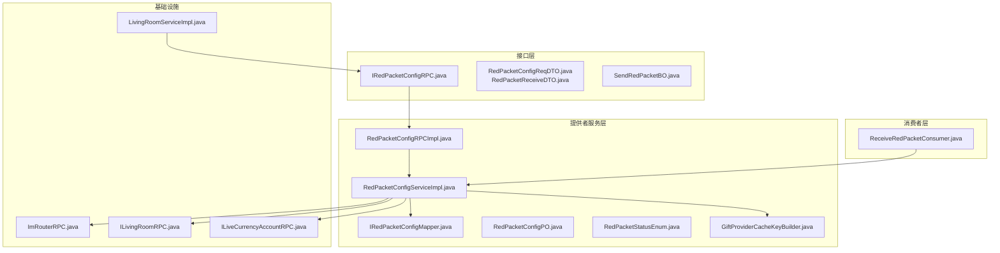
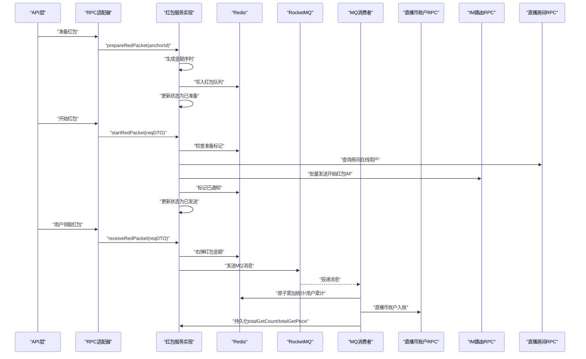
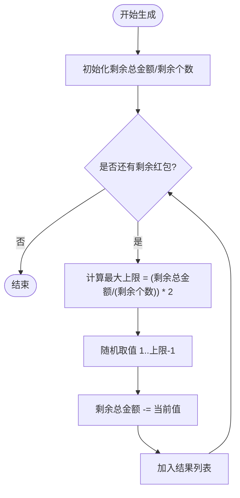
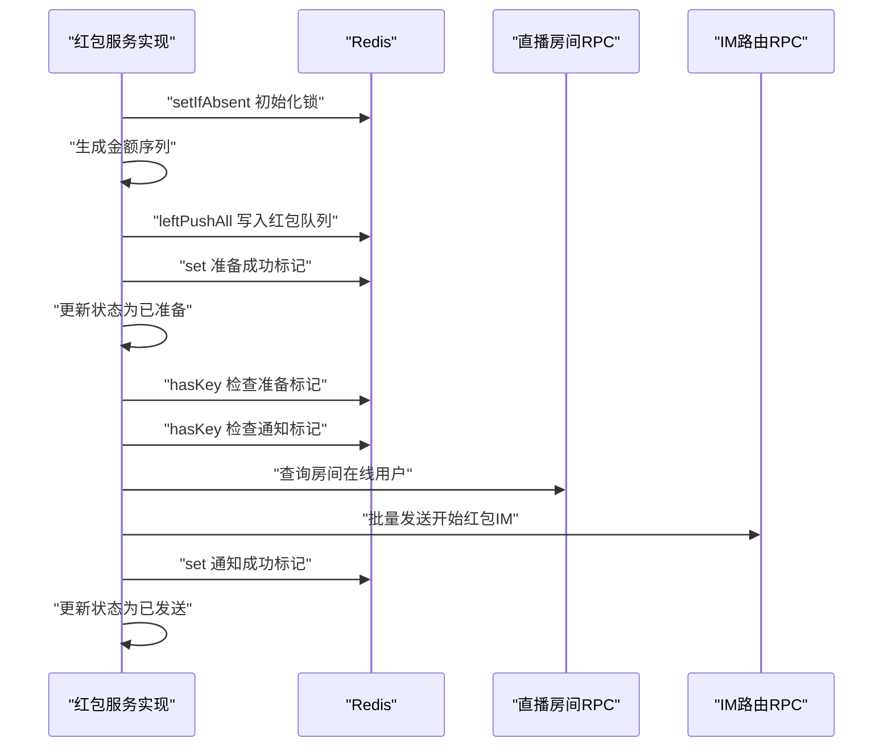
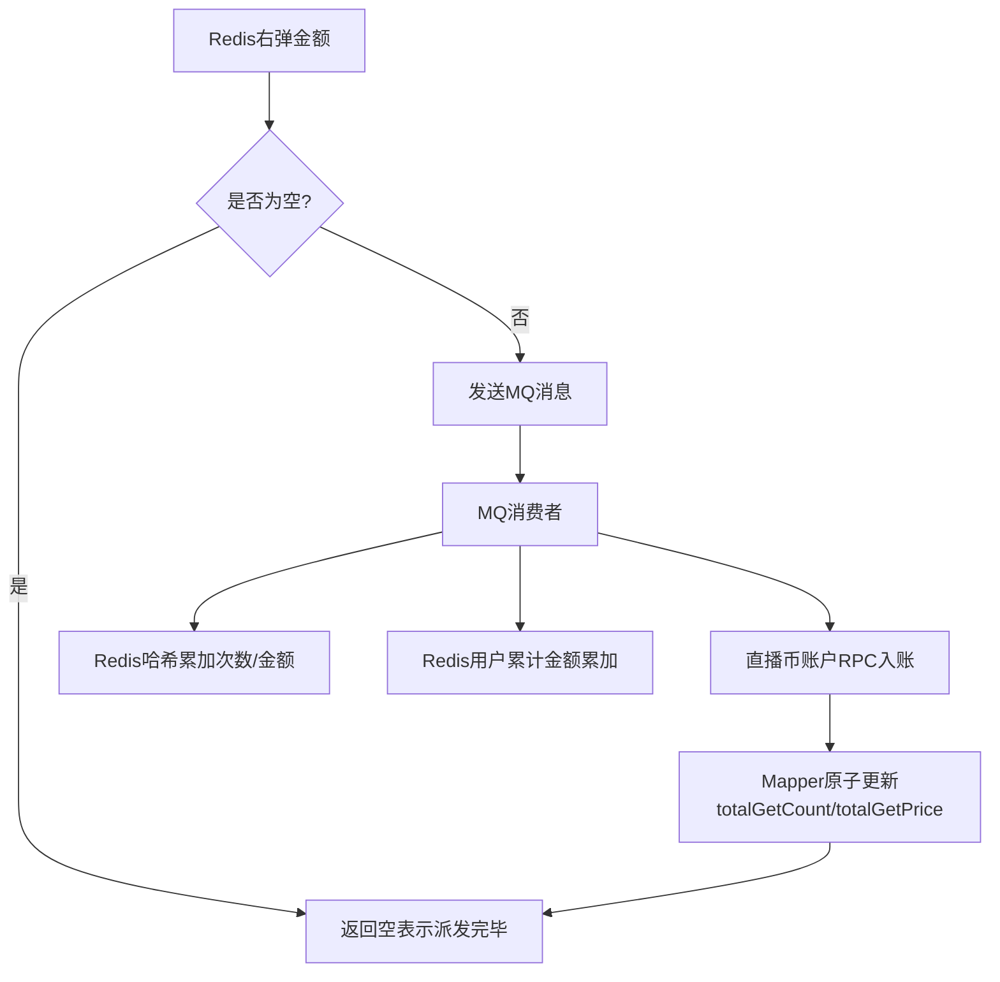
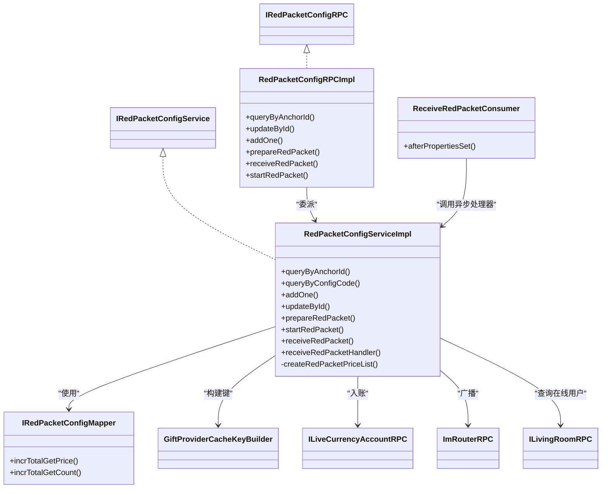

# 红包系统

<cite>
**本文引用的文件**
- [RedPacketConfigServiceImpl.java](file://live-gift-provider/src/main/java/com/logilong/live/gift/provider/service/impl/RedPacketConfigServiceImpl.java)
- [IRedPacketConfigService.java](file://live-gift-provider/src/main/java/com/logilong/live/gift/provider/service/IRedPacketConfigService.java)
- [RedPacketConfigRPCImpl.java](file://live-gift-provider/src/main/java/com/logilong/live/gift/provider/rpc/RedPacketConfigRPCImpl.java)
- [IRedPacketConfigRPC.java](file://live-gift-interface/src/main/java/com/logilong/live/gift/interfaces/IRedPacketConfigRPC.java)
- [ReceiveRedPacketConsumer.java](file://live-gift-provider/src/main/java/com/logilong/live/gift/provider/consumer/ReceiveRedPacketConsumer.java)
- [IRedPacketConfigMapper.java](file://live-gift-provider/src/main/java/com/logilong/live/gift/provider/dao/mapper/IRedPacketConfigMapper.java)
- [RedPacketConfigPO.java](file://live-gift-provider/src/main/java/com/logilong/live/gift/provider/dao/po/RedPacketConfigPO.java)
- [RedPacketStatusEnum.java](file://live-gift-interface/src/main/java/com/logilong/live/gift/constants/RedPacketStatusEnum.java)
- [GiftProviderCacheKeyBuilder.java](file://live-framework/live-framework-redis-starter/src/main/java/com/logilong/live/framework/redis/starter/key/GiftProviderCacheKeyBuilder.java)
- [LivingRoomServiceImpl.java](file://live-api/src/main/java/com/logilong/live/api/service/impl/LivingRoomServiceImpl.java)
- [SendRedPacketBO.java](file://live-gift-interface/src/main/java/com/logilong/live/gift/bo/SendRedPacketBO.java)
- [ImRouterRPC.java](file://live-im-router-interface/src/main/java/com/logilong/live/im/router/interfaces/ImRouterRPC.java)
- [ILivingRoomRPC.java](file://live-living-interface/src/main/java/com/logilong/live/living/interfaces/rpc/ILivingRoomRPC.java)
- [ILiveCurrencyAccountRPC.java](file://live-bank-interface/src/main/java/com/logilong/live/bank/interfaces/ILiveCurrencyAccountRPC.java)
- [RedPacketReceiveDTO.java](file://live-gift-interface/src/main/java/com/logilong/live/gift/dto/RedPacketReceiveDTO.java)
- [RedPacketConfigReqDTO.java](file://live-gift-interface/src/main/java/com/logilong/live/gift/dto/RedPacketConfigReqDTO.java)
</cite>

## 目录
1. [简介](#简介)
2. [项目结构](#项目结构)
3. [核心组件](#核心组件)
4. [架构总览](#架构总览)
5. [详细组件分析](#详细组件分析)
6. [依赖关系分析](#依赖关系分析)
7. [性能与并发特性](#性能与并发特性)
8. [故障排查指南](#故障排查指南)
9. [结论](#结论)
10. [附录](#附录)

## 简介
本文件全面阐述红包系统的实现原理，覆盖红包创建、发放、领取的完整生命周期管理。重点解析RedPacketConfigServiceImpl中红包金额随机算法的公平性与随机性保障；详解prepareRedPacket与startRedPacket方法如何协同完成红包的预生成与激活；深入分析receiveRedPacketHandler在高并发下通过Redis原子操作实现的线程安全与库存扣减；说明红包领取成功后通过IM消息实时通知所有直播间用户的机制；并给出红包过期处理、重复领取防护、金额一致性保证等关键问题的解决方案，最后提供红包雨等高级功能的扩展思路。

## 项目结构
红包系统主要分布在以下模块：
- 接口层：定义RPC接口与DTO/BO
- 提供者服务层：实现红包生命周期管理、随机金额生成、Redis与RocketMQ集成
- 消费者层：消费“抢红包”MQ消息，异步落库与账户入账
- 基础设施：Redis键空间、IM路由RPC、直播房间RPC、银行账户RPC

图表来源
- [IRedPacketConfigRPC.java](file://live-gift-interface/src/main/java/com/logilong/live/gift/interfaces/IRedPacketConfigRPC.java#L1-L39)
- [RedPacketConfigRPCImpl.java](file://live-gift-provider/src/main/java/com/logilong/live/gift/provider/rpc/RedPacketConfigRPCImpl.java#L1-L48)
- [RedPacketConfigServiceImpl.java](file://live-gift-provider/src/main/java/com/logilong/live/gift/provider/service/impl/RedPacketConfigServiceImpl.java#L1-L239)
- [IRedPacketConfigMapper.java](file://live-gift-provider/src/main/java/com/logilong/live/gift/provider/dao/mapper/IRedPacketConfigMapper.java#L1-L17)
- [RedPacketConfigPO.java](file://live-gift-provider/src/main/java/com/logilong/live/gift/provider/dao/po/RedPacketConfigPO.java#L1-L28)
- [RedPacketStatusEnum.java](file://live-gift-interface/src/main/java/com/logilong/live/gift/constants/RedPacketStatusEnum.java#L1-L19)
- [GiftProviderCacheKeyBuilder.java](file://live-framework/live-framework-redis-starter/src/main/java/com/logilong/live/framework/redis/starter/key/GiftProviderCacheKeyBuilder.java#L1-L89)
- [ReceiveRedPacketConsumer.java](file://live-gift-provider/src/main/java/com/logilong/live/gift/provider/consumer/ReceiveRedPacketConsumer.java#L1-L56)
- [ImRouterRPC.java](file://live-im-router-interface/src/main/java/com/logilong/live/im/router/interfaces/ImRouterRPC.java#L1-L19)
- [ILivingRoomRPC.java](file://live-living-interface/src/main/java/com/logilong/live/living/interfaces/rpc/ILivingRoomRPC.java)
- [ILiveCurrencyAccountRPC.java](file://live-bank-interface/src/main/java/com/logilong/live/bank/interfaces/ILiveCurrencyAccountRPC.java)
- [LivingRoomServiceImpl.java](file://live-api/src/main/java/com/logilong/live/api/service/impl/LivingRoomServiceImpl.java#L108-L159)

章节来源
- [RedPacketConfigServiceImpl.java](file://live-gift-provider/src/main/java/com/logilong/live/gift/provider/service/impl/RedPacketConfigServiceImpl.java#L1-L239)
- [IRedPacketConfigService.java](file://live-gift-provider/src/main/java/com/logilong/live/gift/provider/service/IRedPacketConfigService.java#L1-L48)
- [IRedPacketConfigRPC.java](file://live-gift-interface/src/main/java/com/logilong/live/gift/interfaces/IRedPacketConfigRPC.java#L1-L39)
- [RedPacketConfigRPCImpl.java](file://live-gift-provider/src/main/java/com/logilong/live/gift/provider/rpc/RedPacketConfigRPCImpl.java#L1-L48)
- [ReceiveRedPacketConsumer.java](file://live-gift-provider/src/main/java/com/logilong/live/gift/provider/consumer/ReceiveRedPacketConsumer.java#L1-L56)
- [IRedPacketConfigMapper.java](file://live-gift-provider/src/main/java/com/logilong/live/gift/provider/dao/mapper/IRedPacketConfigMapper.java#L1-L17)
- [RedPacketConfigPO.java](file://live-gift-provider/src/main/java/com/logilong/live/gift/provider/dao/po/RedPacketConfigPO.java#L1-L28)
- [RedPacketStatusEnum.java](file://live-gift-interface/src/main/java/com/logilong/live/gift/constants/RedPacketStatusEnum.java#L1-L19)
- [GiftProviderCacheKeyBuilder.java](file://live-framework/live-framework-redis-starter/src/main/java/com/logilong/live/framework/redis/starter/key/GiftProviderCacheKeyBuilder.java#L1-L89)
- [LivingRoomServiceImpl.java](file://live-api/src/main/java/com/logilong/live/api/service/impl/LivingRoomServiceImpl.java#L108-L159)
- [SendRedPacketBO.java](file://live-gift-interface/src/main/java/com/logilong/live/gift/bo/SendRedPacketBO.java#L1-L20)
- [ImRouterRPC.java](file://live-im-router-interface/src/main/java/com/logilong/live/im/router/interfaces/ImRouterRPC.java#L1-L19)
- [ILivingRoomRPC.java](file://live-living-interface/src/main/java/com/logilong/live/living/interfaces/rpc/ILivingRoomRPC.java)
- [ILiveCurrencyAccountRPC.java](file://live-bank-interface/src/main/java/com/logilong/live/bank/interfaces/ILiveCurrencyAccountRPC.java)

## 核心组件
- 红包服务实现：负责红包配置查询、准备、开始、领取、异步处理等全流程
- RPC适配器：对外暴露统一RPC接口，内部委派至服务实现
- MQ消费者：异步处理“抢红包”事件，完成统计与入账
- 缓存键构建：集中管理Redis键空间，确保命名规范与隔离
- 状态枚举：维护红包配置状态机
- 数据访问：MyBatis Mapper封装持久化增量

章节来源
- [IRedPacketConfigService.java](file://live-gift-provider/src/main/java/com/logilong/live/gift/provider/service/IRedPacketConfigService.java#L1-L48)
- [RedPacketConfigServiceImpl.java](file://live-gift-provider/src/main/java/com/logilong/live/gift/provider/service/impl/RedPacketConfigServiceImpl.java#L1-L239)
- [IRedPacketConfigRPC.java](file://live-gift-interface/src/main/java/com/logilong/live/gift/interfaces/IRedPacketConfigRPC.java#L1-L39)
- [RedPacketConfigRPCImpl.java](file://live-gift-provider/src/main/java/com/logilong/live/gift/provider/rpc/RedPacketConfigRPCImpl.java#L1-L48)
- [ReceiveRedPacketConsumer.java](file://live-gift-provider/src/main/java/com/logilong/live/gift/provider/consumer/ReceiveRedPacketConsumer.java#L1-L56)
- [GiftProviderCacheKeyBuilder.java](file://live-framework/live-framework-redis-starter/src/main/java/com/logilong/live/framework/redis/starter/key/GiftProviderCacheKeyBuilder.java#L1-L89)
- [RedPacketStatusEnum.java](file://live-gift-interface/src/main/java/com/logilong/live/gift/constants/RedPacketStatusEnum.java#L1-L19)
- [IRedPacketConfigMapper.java](file://live-gift-provider/src/main/java/com/logilong/live/gift/provider/dao/mapper/IRedPacketConfigMapper.java#L1-L17)

## 架构总览
红包系统采用“预生成+异步处理”的架构模式：
- 预生成阶段：主播端发起准备，服务端生成红包金额序列并写入Redis队列，同时更新状态
- 激活阶段：主播端发起开始，服务端广播通知所有在线用户，并标记已通知
- 领取阶段：用户端发起领取，服务端从Redis队列弹出金额，异步发送MQ消息
- 异步处理阶段：MQ消费者原子性地累加统计、更新用户累计金额、入账直播币

图表来源
- [LivingRoomServiceImpl.java](file://live-api/src/main/java/com/logilong/live/api/service/impl/LivingRoomServiceImpl.java#L108-L159)
- [RedPacketConfigRPCImpl.java](file://live-gift-provider/src/main/java/com/logilong/live/gift/provider/rpc/RedPacketConfigRPCImpl.java#L1-L48)
- [RedPacketConfigServiceImpl.java](file://live-gift-provider/src/main/java/com/logilong/live/gift/provider/service/impl/RedPacketConfigServiceImpl.java#L94-L154)
- [ReceiveRedPacketConsumer.java](file://live-gift-provider/src/main/java/com/logilong/live/gift/provider/consumer/ReceiveRedPacketConsumer.java#L1-L56)
- [ILiveCurrencyAccountRPC.java](file://live-bank-interface/src/main/java/com/logilong/live/bank/interfaces/ILiveCurrencyAccountRPC.java)
- [ImRouterRPC.java](file://live-im-router-interface/src/main/java/com/logilong/live/im/router/interfaces/ImRouterRPC.java#L1-L19)
- [ILivingRoomRPC.java](file://live-living-interface/src/main/java/com/logilong/live/living/interfaces/rpc/ILivingRoomRPC.java)

## 详细组件分析

### 红包金额随机算法与公平性
- 生成策略：采用“二倍均值法”，对剩余金额按剩余个数动态计算上限，上限为当前平均值的两倍，从而在保证总金额不变的前提下，避免极端大小的红包出现，提升整体公平性与随机性
- 边界处理：最后一个红包直接取剩余总金额，确保最终一致性
- 并发安全：生成过程在单线程内完成，避免多线程竞争导致的不一致

图表来源
- [RedPacketConfigServiceImpl.java](file://live-gift-provider/src/main/java/com/logilong/live/gift/provider/service/impl/RedPacketConfigServiceImpl.java#L220-L239)

章节来源
- [RedPacketConfigServiceImpl.java](file://live-gift-provider/src/main/java/com/logilong/live/gift/provider/service/impl/RedPacketConfigServiceImpl.java#L220-L239)

### prepareRedPacket 与 startRedPacket 的协同
- prepareRedPacket
  - 查询有效配置（非“已发送”状态）
  - 使用Redis分布式锁防重
  - 生成红包金额序列并分批写入Redis列表键
  - 设置准备成功标记，更新状态为“已准备”
- startRedPacket
  - 检查准备成功标记
  - 防止重复通知（通知成功标记）
  - 查询房间在线用户列表
  - 通过IM路由RPC批量发送“开始红包”消息
  - 更新状态为“已发送”，设置通知成功标记

图表来源
- [RedPacketConfigServiceImpl.java](file://live-gift-provider/src/main/java/com/logilong/live/gift/provider/service/impl/RedPacketConfigServiceImpl.java#L94-L154)
- [GiftProviderCacheKeyBuilder.java](file://live-framework/live-framework-redis-starter/src/main/java/com/logilong/live/framework/redis/starter/key/GiftProviderCacheKeyBuilder.java#L1-L89)
- [ILivingRoomRPC.java](file://live-living-interface/src/main/java/com/logilong/live/living/interfaces/rpc/ILivingRoomRPC.java)
- [ImRouterRPC.java](file://live-im-router-interface/src/main/java/com/logilong/live/im/router/interfaces/ImRouterRPC.java#L1-L19)

章节来源
- [RedPacketConfigServiceImpl.java](file://live-gift-provider/src/main/java/com/logilong/live/gift/provider/service/impl/RedPacketConfigServiceImpl.java#L94-L154)
- [GiftProviderCacheKeyBuilder.java](file://live-framework/live-framework-redis-starter/src/main/java/com/logilong/live/framework/redis/starter/key/GiftProviderCacheKeyBuilder.java#L1-L89)

### receiveRedPacketHandler 的线程安全与库存扣减
- 库存扣减：从Redis列表右弹金额，天然具备原子性；若为空则表示红包已派发完毕
- 统计与幂等：
  - 使用Redis Hash记录每个红包活动的领取次数与总金额
  - 使用Redis Value记录用户当日累计领取金额
  - 使用Redis过期时间控制日维度统计
- 异步入账：通过RocketMQ异步处理，消费者侧原子性累加统计与用户余额入账
- 一致性保障：数据库层面通过Mapper的原子更新语句累加totalGetCount与totalGetPrice，确保最终一致

图表来源
- [RedPacketConfigServiceImpl.java](file://live-gift-provider/src/main/java/com/logilong/live/gift/provider/service/impl/RedPacketConfigServiceImpl.java#L171-L218)
- [ReceiveRedPacketConsumer.java](file://live-gift-provider/src/main/java/com/logilong/live/gift/provider/consumer/ReceiveRedPacketConsumer.java#L1-L56)
- [IRedPacketConfigMapper.java](file://live-gift-provider/src/main/java/com/logilong/live/gift/provider/dao/mapper/IRedPacketConfigMapper.java#L1-L17)
- [ILiveCurrencyAccountRPC.java](file://live-bank-interface/src/main/java/com/logilong/live/bank/interfaces/ILiveCurrencyAccountRPC.java)

章节来源
- [RedPacketConfigServiceImpl.java](file://live-gift-provider/src/main/java/com/logilong/live/gift/provider/service/impl/RedPacketConfigServiceImpl.java#L171-L218)
- [ReceiveRedPacketConsumer.java](file://live-gift-provider/src/main/java/com/logilong/live/gift/provider/consumer/ReceiveRedPacketConsumer.java#L1-L56)
- [IRedPacketConfigMapper.java](file://live-gift-provider/src/main/java/com/logilong/live/gift/provider/dao/mapper/IRedPacketConfigMapper.java#L1-L17)

### IM消息实时通知机制
- 触发时机：startRedPacket成功后，查询房间在线用户列表，批量构造IM消息并通过路由RPC广播
- 消息内容：包含红包配置信息，用于前端展示“开始抢红包”提示
- 通知范围：仅向房间内在线用户推送，避免离线用户干扰

章节来源
- [RedPacketConfigServiceImpl.java](file://live-gift-provider/src/main/java/com/logilong/live/gift/provider/service/impl/RedPacketConfigServiceImpl.java#L124-L154)
- [ImRouterRPC.java](file://live-im-router-interface/src/main/java/com/logilong/live/im/router/interfaces/ImRouterRPC.java#L1-L19)
- [ILivingRoomRPC.java](file://live-living-interface/src/main/java/com/logilong/live/living/interfaces/rpc/ILivingRoomRPC.java)

### 生命周期管理与状态机
- 状态枚举：NOT_PREPARED、IS_PREPARED、IS_SEND
- 查询规则：
  - 查询主播有效配置时排除“已发送”状态
  - 查询已准备配置时限定“已准备”状态
- 更新策略：在准备与开始阶段分别更新状态，配合Redis标记实现幂等与防重

章节来源
- [RedPacketStatusEnum.java](file://live-gift-interface/src/main/java/com/logilong/live/gift/constants/RedPacketStatusEnum.java#L1-L19)
- [RedPacketConfigServiceImpl.java](file://live-gift-provider/src/main/java/com/logilong/live/gift/provider/service/impl/RedPacketConfigServiceImpl.java#L62-L81)

### 数据模型与持久化
- 表结构要点：包含主播ID、总金额、总个数、状态、配置码、创建/更新时间等字段
- 增量更新：通过Mapper提供的原子更新语句累加totalGetCount与totalGetPrice，保证最终一致性

章节来源
- [RedPacketConfigPO.java](file://live-gift-provider/src/main/java/com/logilong/live/gift/provider/dao/po/RedPacketConfigPO.java#L1-L28)
- [IRedPacketConfigMapper.java](file://live-gift-provider/src/main/java/com/logilong/live/gift/provider/dao/mapper/IRedPacketConfigMapper.java#L1-L17)

## 依赖关系分析
红包系统的关键依赖关系如下：
- 服务实现依赖RedisTemplate、RocketMQ生产者、IM路由RPC、直播房间RPC、直播币账户RPC、Mapper与缓存键构建器
- RPC适配器将接口调用委派至服务实现
- MQ消费者订阅指定主题，反序列化消息并调用服务实现的异步处理器

图表来源
- [IRedPacketConfigService.java](file://live-gift-provider/src/main/java/com/logilong/live/gift/provider/service/IRedPacketConfigService.java#L1-L48)
- [RedPacketConfigServiceImpl.java](file://live-gift-provider/src/main/java/com/logilong/live/gift/provider/service/impl/RedPacketConfigServiceImpl.java#L1-L239)
- [IRedPacketConfigRPC.java](file://live-gift-interface/src/main/java/com/logilong/live/gift/interfaces/IRedPacketConfigRPC.java#L1-L39)
- [RedPacketConfigRPCImpl.java](file://live-gift-provider/src/main/java/com/logilong/live/gift/provider/rpc/RedPacketConfigRPCImpl.java#L1-L48)
- [ReceiveRedPacketConsumer.java](file://live-gift-provider/src/main/java/com/logilong/live/gift/provider/consumer/ReceiveRedPacketConsumer.java#L1-L56)
- [IRedPacketConfigMapper.java](file://live-gift-provider/src/main/java/com/logilong/live/gift/provider/dao/mapper/IRedPacketConfigMapper.java#L1-L17)
- [GiftProviderCacheKeyBuilder.java](file://live-framework/live-framework-redis-starter/src/main/java/com/logilong/live/framework/redis/starter/key/GiftProviderCacheKeyBuilder.java#L1-L89)
- [ILiveCurrencyAccountRPC.java](file://live-bank-interface/src/main/java/com/logilong/live/bank/interfaces/ILiveCurrencyAccountRPC.java)
- [ImRouterRPC.java](file://live-im-router-interface/src/main/java/com/logilong/live/im/router/interfaces/ImRouterRPC.java#L1-L19)
- [ILivingRoomRPC.java](file://live-living-interface/src/main/java/com/logilong/live/living/interfaces/rpc/ILivingRoomRPC.java)

## 性能与并发特性
- 预生成优化：将红包金额序列分批写入Redis列表，避免一次性大批量写入造成IO瓶颈
- 原子性保障：
  - Redis列表右弹操作天然原子
  - 分布式锁保证prepareRedPacket幂等
  - Redis哈希与Value的原子累加结合过期策略，实现日维度统计
- 异步处理：MQ异步落库与入账，削峰填谷，降低主流程延迟
- 并发控制：Redis键空间隔离不同红包活动，避免跨活动串扰

章节来源
- [RedPacketConfigServiceImpl.java](file://live-gift-provider/src/main/java/com/logilong/live/gift/provider/service/impl/RedPacketConfigServiceImpl.java#L94-L154)
- [ReceiveRedPacketConsumer.java](file://live-gift-provider/src/main/java/com/logilong/live/gift/provider/consumer/ReceiveRedPacketConsumer.java#L1-L56)
- [GiftProviderCacheKeyBuilder.java](file://live-framework/live-framework-redis-starter/src/main/java/com/logilong/live/framework/redis/starter/key/GiftProviderCacheKeyBuilder.java#L1-L89)

## 故障排查指南
- 领取失败或“红包已被抢完”
  - 检查Redis红包队列是否存在且未过期
  - 确认prepareRedPacket是否成功执行并写入队列
  - 参考路径：[receiveRedPacket](file://live-gift-provider/src/main/java/com/logilong/live/gift/provider/service/impl/RedPacketConfigServiceImpl.java#L171-L199)
- 领取后未入账
  - 检查RocketMQ消费者是否正常启动并消费
  - 查看消费者日志与异常重试机制
  - 参考路径：[ReceiveRedPacketConsumer](file://live-gift-provider/src/main/java/com/logilong/live/gift/provider/consumer/ReceiveRedPacketConsumer.java#L1-L56)
- 通知未到达用户
  - 检查startRedPacket是否成功写入通知标记
  - 核对IM路由RPC调用与房间在线用户查询
  - 参考路径：[startRedPacket](file://live-gift-provider/src/main/java/com/logilong/live/gift/provider/service/impl/RedPacketConfigServiceImpl.java#L124-L154)
- 金额不一致
  - 核对Mapper原子更新是否执行
  - 检查Redis统计与数据库统计是否一致
  - 参考路径：[IRedPacketConfigMapper](file://live-gift-provider/src/main/java/com/logilong/live/gift/provider/dao/mapper/IRedPacketConfigMapper.java#L1-L17)

章节来源
- [RedPacketConfigServiceImpl.java](file://live-gift-provider/src/main/java/com/logilong/live/gift/provider/service/impl/RedPacketConfigServiceImpl.java#L124-L199)
- [ReceiveRedPacketConsumer.java](file://live-gift-provider/src/main/java/com/logilong/live/gift/provider/consumer/ReceiveRedPacketConsumer.java#L1-L56)
- [IRedPacketConfigMapper.java](file://live-gift-provider/src/main/java/com/logilong/live/gift/provider/dao/mapper/IRedPacketConfigMapper.java#L1-L17)

## 结论
红包系统通过“预生成+异步处理+Redis原子操作+MQ幂等”的组合，实现了高并发场景下的公平随机、线程安全与最终一致性。prepareRedPacket与startRedPacket的协同确保了活动生命周期的可控与可追溯；receiveRedPacketHandler通过Redis与数据库双通道保障了统计与入账的准确性；IM消息广播提升了用户体验。后续可在活动维度引入更多策略（如阶梯金额、限时翻倍）以增强趣味性与留存。

## 附录
- API入口参考
  - 主播准备红包：[LivingRoomServiceImpl.prepareRedPacket](file://live-api/src/main/java/com/logilong/live/api/service/impl/LivingRoomServiceImpl.java#L122-L128)
  - 主播开始红包：[LivingRoomServiceImpl.startRedPacket](file://live-api/src/main/java/com/logilong/live/api/service/impl/LivingRoomServiceImpl.java#L131-L139)
  - 用户领取红包：[LivingRoomServiceImpl.receiveRedPacket](file://live-api/src/main/java/com/logilong/live/api/service/impl/LivingRoomServiceImpl.java#L143-L156)
- 关键DTO/BO
  - [RedPacketConfigReqDTO.java](file://live-gift-interface/src/main/java/com/logilong/live/gift/dto/RedPacketConfigReqDTO.java#L1-L21)
  - [RedPacketReceiveDTO.java](file://live-gift-interface/src/main/java/com/logilong/live/gift/dto/RedPacketReceiveDTO.java#L1-L18)
  - [SendRedPacketBO.java](file://live-gift-interface/src/main/java/com/logilong/live/gift/bo/SendRedPacketBO.java#L1-L20)