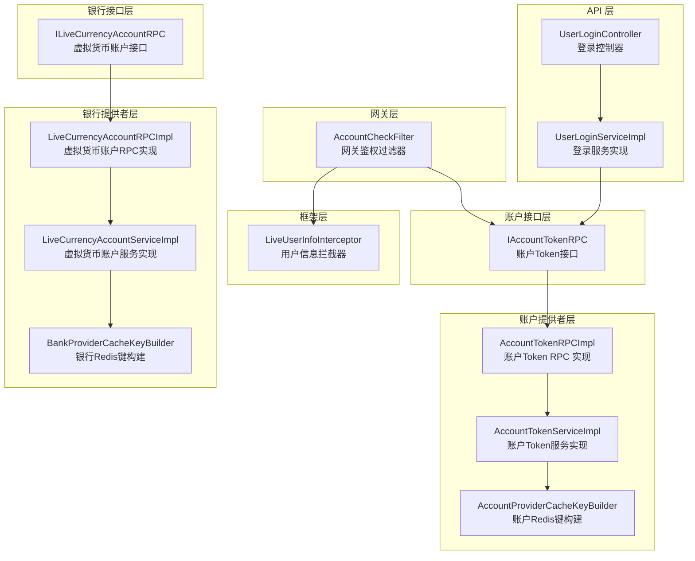
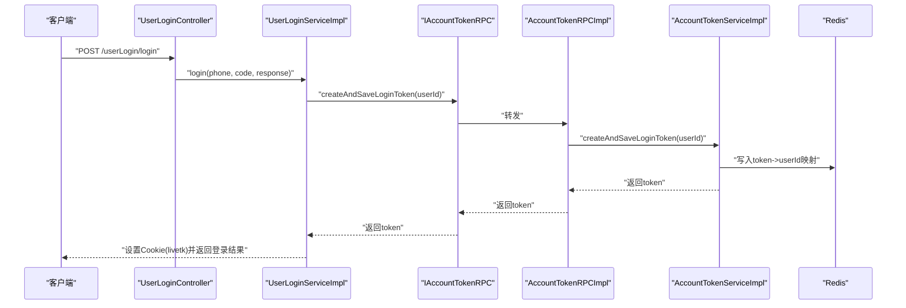
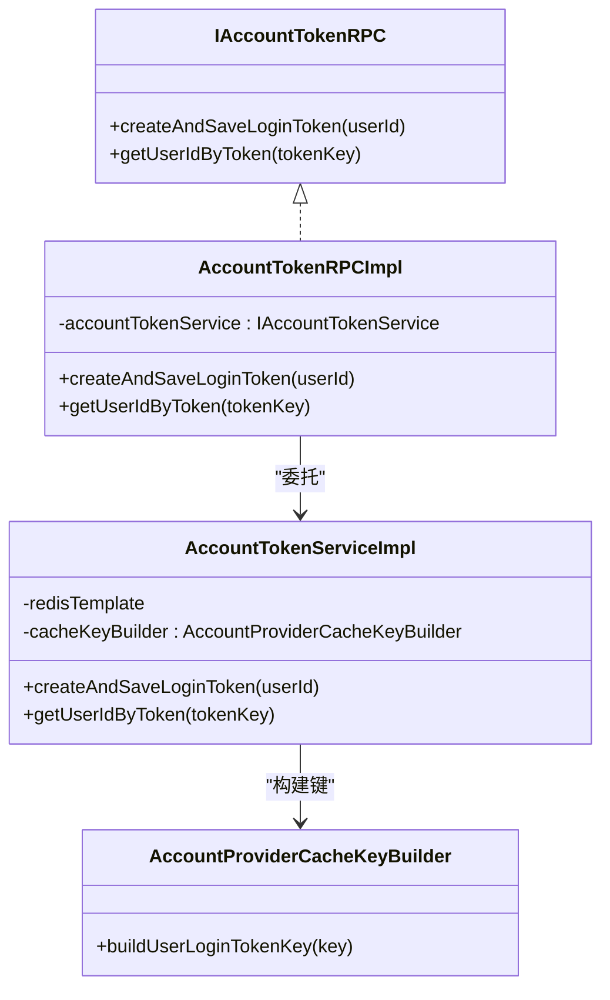
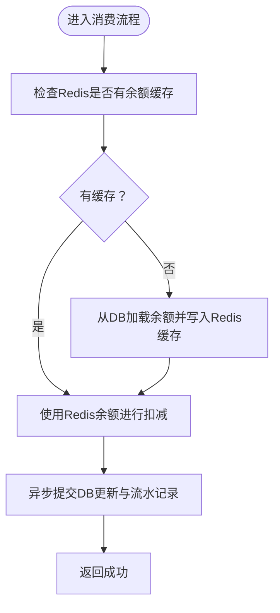
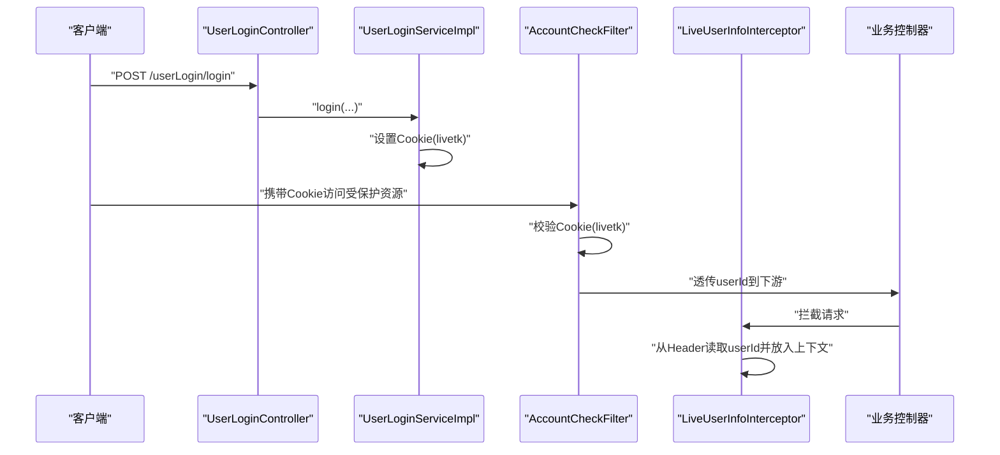
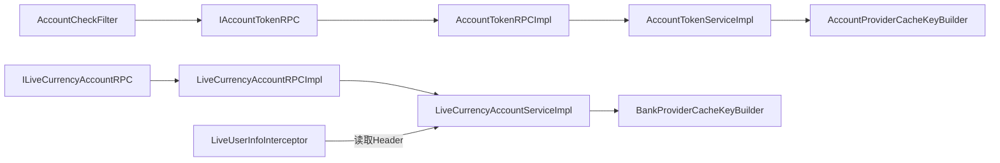

# 账户系统

<cite>
**本文引用的文件列表**
- [IAccountTokenRPC.java](file://live-account-interface/src/main/java/com/logilong/live/account/interfaces/IAccountTokenRPC.java)
- [AccountTokenRPCImpl.java](file://live-account-provider/src/main/java/com/logilong/live/account/provider/rpc/AccountTokenRPCImpl.java)
- [AccountTokenServiceImpl.java](file://live-account-provider/src/main/java/com/logilong/live/account/provider/service/impl/AccountTokenServiceImpl.java)
- [IAccountTokenService.java](file://live-account-provider/src/main/java/com/logilong/live/account/provider/service/IAccountTokenService.java)
- [AccountTokenRPCImpl.java](file://live-user-provider/src/main/java/com/logilong/live/user/provider/rpc/AccountTokenRPCImpl.java)
- [AccountTokenServiceImpl.java](file://live-user-provider/src/main/java/com/logilong/live/user/provider/service/impl/AccountTokenServiceImpl.java)
- [ILiveCurrencyAccountRPC.java](file://live-bank-interface/src/main/java/com/logilong/live/bank/interfaces/ILiveCurrencyAccountRPC.java)
- [LiveCurrencyAccountRPCImpl.java](file://live-bank-provider/src/main/java/com/logilong/live/bank/provider/rpc/LiveCurrencyAccountRPCImpl.java)
- [LiveCurrencyAccountServiceImpl.java](file://live-bank-provider/src/main/java/com/logilong/live/bank/provider/service/impl/LiveCurrencyAccountServiceImpl.java)
- [LiveCurrencyAccountDTO.java](file://live-bank-interface/src/main/java/com/logilong/live/bank/dto/LiveCurrencyAccountDTO.java)
- [AccountTradeReqDTO.java](file://live-bank-interface/src/main/java/com/logilong/live/bank/dto/AccountTradeReqDTO.java)
- [AccountTradeRespDTO.java](file://live-bank-interface/src/main/java/com/logilong/live/bank/dto/AccountTradeRespDTO.java)
- [AccountCheckFilter.java](file://live-gateway/src/main/java/com/logilong/live/gateway/filter/AccountCheckFilter.java)
- [UserLoginController.java](file://live-api/src/main/java/com/logilong/live/api/controller/UserLoginController.java)
- [UserLoginServiceImpl.java](file://live-api/src/main/java/com/logilong/live/api/service/impl/UserLoginServiceImpl.java)
- [LiveUserInfoInterceptor.java](file://live-framework/live-framework-web-starter/src/main/java/com/logilong/live/web/starter/context/LiveUserInfoInterceptor.java)
- [AccountProviderCacheKeyBuilder.java](file://live-framework/live-framework-redis-starter/src/main/java/com/logilong/live/framework/redis/starter/key/AccountProviderCacheKeyBuilder.java)
- [BankProviderCacheKeyBuilder.java](file://live-framework/live-framework-redis-starter/src/main/java/com/logilong/live/framework/redis/starter/key/BankProviderCacheKeyBuilder.java)
</cite>

## 目录
1. [引言](#引言)
2. [项目结构](#项目结构)
3. [核心组件](#核心组件)
4. [架构总览](#架构总览)
5. [详细组件分析](#详细组件分析)
6. [依赖关系分析](#依赖关系分析)
7. [性能考量](#性能考量)
8. [故障排查指南](#故障排查指南)
9. [结论](#结论)
10. [附录](#附录)

## 引言
本文件系统化梳理账户服务的核心功能与实现机制，重点覆盖：
- 基于 Dubbo RPC 的 Token 管理服务：用户身份验证、Token 生成与校验流程
- 虚拟货币账户（LiveCurrencyAccount）的余额管理、交易记录处理及与支付系统的集成方式
- 结合 AccountTokenServiceImpl 分析服务层的缓存策略与实现要点
- 与 API 网关的交互逻辑，以及在用户登录、权限校验等场景中的实际应用
- 提供 Token 刷新、失效处理等关键流程的代码示例路径与安全防护措施说明

## 项目结构
账户系统由多个子模块协同组成，围绕“账户 Token 管理”和“虚拟货币账户”两条主线展开：
- 接口层：定义账户 Token 与虚拟货币账户的 RPC 接口
- 提供者层：实现 Dubbo RPC 服务与业务逻辑
- 网关层：统一鉴权与上下文透传
- API 层：对外暴露登录接口，完成 Token 下发
- 框架层：Redis 缓存键构建、Web 拦截器、全局异常等基础设施

图表来源
- [AccountCheckFilter.java](file://live-gateway/src/main/java/com/logilong/live/gateway/filter/AccountCheckFilter.java#L1-L101)
- [UserLoginController.java](file://live-api/src/main/java/com/logilong/live/api/controller/UserLoginController.java#L1-L32)
- [UserLoginServiceImpl.java](file://live-api/src/main/java/com/logilong/live/api/service/impl/UserLoginServiceImpl.java#L1-L88)
- [IAccountTokenRPC.java](file://live-account-interface/src/main/java/com/logilong/live/account/interfaces/IAccountTokenRPC.java#L1-L22)
- [AccountTokenRPCImpl.java](file://live-account-provider/src/main/java/com/logilong/live/account/provider/rpc/AccountTokenRPCImpl.java#L1-L24)
- [AccountTokenServiceImpl.java](file://live-account-provider/src/main/java/com/logilong/live/account/provider/service/impl/AccountTokenServiceImpl.java#L1-L33)
- [AccountProviderCacheKeyBuilder.java](file://live-framework/live-framework-redis-starter/src/main/java/com/logilong/live/framework/redis/starter/key/AccountProviderCacheKeyBuilder.java#L1-L18)
- [ILiveCurrencyAccountRPC.java](file://live-bank-interface/src/main/java/com/logilong/live/bank/interfaces/ILiveCurrencyAccountRPC.java#L1-L54)
- [LiveCurrencyAccountRPCImpl.java](file://live-bank-provider/src/main/java/com/logilong/live/bank/provider/rpc/LiveCurrencyAccountRPCImpl.java#L1-L61)
- [LiveCurrencyAccountServiceImpl.java](file://live-bank-provider/src/main/java/com/logilong/live/bank/provider/service/impl/LiveCurrencyAccountServiceImpl.java#L1-L209)
- [BankProviderCacheKeyBuilder.java](file://live-framework/live-framework-redis-starter/src/main/java/com/logilong/live/framework/redis/starter/key/BankProviderCacheKeyBuilder.java#L1-L37)
- [LiveUserInfoInterceptor.java](file://live-framework/live-framework-web-starter/src/main/java/com/logilong/live/web/starter/context/LiveUserInfoInterceptor.java#L1-L35)

章节来源
- [AccountCheckFilter.java](file://live-gateway/src/main/java/com/logilong/live/gateway/filter/AccountCheckFilter.java#L1-L101)
- [UserLoginController.java](file://live-api/src/main/java/com/logilong/live/api/controller/UserLoginController.java#L1-L32)
- [UserLoginServiceImpl.java](file://live-api/src/main/java/com/logilong/live/api/service/impl/UserLoginServiceImpl.java#L1-L88)
- [IAccountTokenRPC.java](file://live-account-interface/src/main/java/com/logilong/live/account/interfaces/IAccountTokenRPC.java#L1-L22)
- [AccountTokenRPCImpl.java](file://live-account-provider/src/main/java/com/logilong/live/account/provider/rpc/AccountTokenRPCImpl.java#L1-L24)
- [AccountTokenServiceImpl.java](file://live-account-provider/src/main/java/com/logilong/live/account/provider/service/impl/AccountTokenServiceImpl.java#L1-L33)
- [ILiveCurrencyAccountRPC.java](file://live-bank-interface/src/main/java/com/logilong/live/bank/interfaces/ILiveCurrencyAccountRPC.java#L1-L54)
- [LiveCurrencyAccountRPCImpl.java](file://live-bank-provider/src/main/java/com/logilong/live/bank/provider/rpc/LiveCurrencyAccountRPCImpl.java#L1-L61)
- [LiveCurrencyAccountServiceImpl.java](file://live-bank-provider/src/main/java/com/logilong/live/bank/provider/service/impl/LiveCurrencyAccountServiceImpl.java#L1-L209)
- [LiveUserInfoInterceptor.java](file://live-framework/live-framework-web-starter/src/main/java/com/logilong/live/web/starter/context/LiveUserInfoInterceptor.java#L1-L35)

## 核心组件
- 账户 Token 管理
  - 接口定义：IAccountTokenRPC
  - RPC 实现：AccountTokenRPCImpl、AccountTokenRPCImpl（用户模块）
  - 服务实现：AccountTokenServiceImpl（账户模块）、AccountTokenServiceImpl（用户模块）
  - 缓存键构建：AccountProviderCacheKeyBuilder
- 虚拟货币账户
  - 接口定义：ILiveCurrencyAccountRPC
  - RPC 实现：LiveCurrencyAccountRPCImpl
  - 服务实现：LiveCurrencyAccountServiceImpl
  - 数据传输对象：LiveCurrencyAccountDTO、AccountTradeReqDTO、AccountTradeRespDTO
  - 缓存键构建：BankProviderCacheKeyBuilder
- 网关鉴权与上下文透传
  - 过滤器：AccountCheckFilter
  - 拦截器：LiveUserInfoInterceptor
- 登录入口
  - 控制器：UserLoginController
  - 服务：UserLoginServiceImpl

章节来源
- [IAccountTokenRPC.java](file://live-account-interface/src/main/java/com/logilong/live/account/interfaces/IAccountTokenRPC.java#L1-L22)
- [AccountTokenRPCImpl.java](file://live-account-provider/src/main/java/com/logilong/live/account/provider/rpc/AccountTokenRPCImpl.java#L1-L24)
- [AccountTokenServiceImpl.java](file://live-account-provider/src/main/java/com/logilong/live/account/provider/service/impl/AccountTokenServiceImpl.java#L1-L33)
- [AccountProviderCacheKeyBuilder.java](file://live-framework/live-framework-redis-starter/src/main/java/com/logilong/live/framework/redis/starter/key/AccountProviderCacheKeyBuilder.java#L1-L18)
- [ILiveCurrencyAccountRPC.java](file://live-bank-interface/src/main/java/com/logilong/live/bank/interfaces/ILiveCurrencyAccountRPC.java#L1-L54)
- [LiveCurrencyAccountRPCImpl.java](file://live-bank-provider/src/main/java/com/logilong/live/bank/provider/rpc/LiveCurrencyAccountRPCImpl.java#L1-L61)
- [LiveCurrencyAccountServiceImpl.java](file://live-bank-provider/src/main/java/com/logilong/live/bank/provider/service/impl/LiveCurrencyAccountServiceImpl.java#L1-L209)
- [LiveCurrencyAccountDTO.java](file://live-bank-interface/src/main/java/com/logilong/live/bank/dto/LiveCurrencyAccountDTO.java#L1-L24)
- [AccountTradeReqDTO.java](file://live-bank-interface/src/main/java/com/logilong/live/bank/dto/AccountTradeReqDTO.java#L1-L16)
- [AccountTradeRespDTO.java](file://live-bank-interface/src/main/java/com/logilong/live/bank/dto/AccountTradeRespDTO.java#L1-L35)
- [AccountCheckFilter.java](file://live-gateway/src/main/java/com/logilong/live/gateway/filter/AccountCheckFilter.java#L1-L101)
- [LiveUserInfoInterceptor.java](file://live-framework/live-framework-web-starter/src/main/java/com/logilong/live/web/starter/context/LiveUserInfoInterceptor.java#L1-L35)
- [UserLoginController.java](file://live-api/src/main/java/com/logilong/live/api/controller/UserLoginController.java#L1-L32)
- [UserLoginServiceImpl.java](file://live-api/src/main/java/com/logilong/live/api/service/impl/UserLoginServiceImpl.java#L1-L88)

## 架构总览
账户系统采用“接口 + Dubbo RPC + 服务实现 + 缓存”的分层设计，配合网关统一鉴权与业务侧拦截器透传用户上下文，形成从登录到鉴权再到业务处理的完整闭环。

图表来源
- [UserLoginController.java](file://live-api/src/main/java/com/logilong/live/api/controller/UserLoginController.java#L1-L32)
- [UserLoginServiceImpl.java](file://live-api/src/main/java/com/logilong/live/api/service/impl/UserLoginServiceImpl.java#L1-L88)
- [IAccountTokenRPC.java](file://live-account-interface/src/main/java/com/logilong/live/account/interfaces/IAccountTokenRPC.java#L1-L22)
- [AccountTokenRPCImpl.java](file://live-account-provider/src/main/java/com/logilong/live/account/provider/rpc/AccountTokenRPCImpl.java#L1-L24)
- [AccountTokenServiceImpl.java](file://live-account-provider/src/main/java/com/logilong/live/account/provider/service/impl/AccountTokenServiceImpl.java#L1-L33)

## 详细组件分析

### 组件一：基于 Dubbo 的 Token 管理服务
- 接口职责
  - IAccountTokenRPC 定义创建登录 Token 与按 Token 获取用户标识的能力
- RPC 实现
  - AccountTokenRPCImpl、AccountTokenRPCImpl（用户模块）均委托至对应的 IAccountTokenService
- 服务实现
  - AccountTokenServiceImpl 使用 Redis 存储 token->userId 映射，键使用 AccountProviderCacheKeyBuilder 构建
  - Token 默认有效期 30 天
- 网关鉴权
  - AccountCheckFilter 从 Cookie 中读取 livetk，调用 IAccountTokenRPC 校验，成功后将 userId 以 Header 形式透传给下游

图表来源
- [IAccountTokenRPC.java](file://live-account-interface/src/main/java/com/logilong/live/account/interfaces/IAccountTokenRPC.java#L1-L22)
- [AccountTokenRPCImpl.java](file://live-account-provider/src/main/java/com/logilong/live/account/provider/rpc/AccountTokenRPCImpl.java#L1-L24)
- [AccountTokenServiceImpl.java](file://live-account-provider/src/main/java/com/logilong/live/account/provider/service/impl/AccountTokenServiceImpl.java#L1-L33)
- [AccountProviderCacheKeyBuilder.java](file://live-framework/live-framework-redis-starter/src/main/java/com/logilong/live/framework/redis/starter/key/AccountProviderCacheKeyBuilder.java#L1-L18)

章节来源
- [IAccountTokenRPC.java](file://live-account-interface/src/main/java/com/logilong/live/account/interfaces/IAccountTokenRPC.java#L1-L22)
- [AccountTokenRPCImpl.java](file://live-account-provider/src/main/java/com/logilong/live/account/provider/rpc/AccountTokenRPCImpl.java#L1-L24)
- [AccountTokenServiceImpl.java](file://live-account-provider/src/main/java/com/logilong/live/account/provider/service/impl/AccountTokenServiceImpl.java#L1-L33)
- [AccountProviderCacheKeyBuilder.java](file://live-framework/live-framework-redis-starter/src/main/java/com/logilong/live/framework/redis/starter/key/AccountProviderCacheKeyBuilder.java#L1-L18)

### 组件二：虚拟货币账户与交易流水
- 接口职责
  - ILiveCurrencyAccountRPC 提供账户初始化、余额增减、余额查询、消费扣减、送礼专用消费等能力
- RPC 实现
  - LiveCurrencyAccountRPCImpl 将调用转发至 ILiveCurrencyAccountService
- 服务实现
  - LiveCurrencyAccountServiceImpl
    - 余额缓存：使用 BankProviderCacheKeyBuilder 构建用户余额缓存键，Redis 中缓存余额，过期时间通常为分钟级
    - 异步落库：通过线程池异步执行数据库更新与流水记录，保证高并发下的吞吐
    - 事务控制：数据库更新与流水记录在独立方法上使用 @Transactional，确保一致性
    - 余额校验：在消费前先查 Redis；若无缓存则回源数据库并写入缓存
- DTO
  - LiveCurrencyAccountDTO：封装用户余额、状态、时间等字段
  - AccountTradeReqDTO / AccountTradeRespDTO：封装交易请求与响应

图表来源
- [LiveCurrencyAccountServiceImpl.java](file://live-bank-provider/src/main/java/com/logilong/live/bank/provider/service/impl/LiveCurrencyAccountServiceImpl.java#L1-L209)
- [BankProviderCacheKeyBuilder.java](file://live-framework/live-framework-redis-starter/src/main/java/com/logilong/live/framework/redis/starter/key/BankProviderCacheKeyBuilder.java#L1-L37)
- [ILiveCurrencyAccountRPC.java](file://live-bank-interface/src/main/java/com/logilong/live/bank/interfaces/ILiveCurrencyAccountRPC.java#L1-L54)
- [LiveCurrencyAccountRPCImpl.java](file://live-bank-provider/src/main/java/com/logilong/live/bank/provider/rpc/LiveCurrencyAccountRPCImpl.java#L1-L61)
- [LiveCurrencyAccountDTO.java](file://live-bank-interface/src/main/java/com/logilong/live/bank/dto/LiveCurrencyAccountDTO.java#L1-L24)
- [AccountTradeReqDTO.java](file://live-bank-interface/src/main/java/com/logilong/live/bank/dto/AccountTradeReqDTO.java#L1-L16)
- [AccountTradeRespDTO.java](file://live-bank-interface/src/main/java/com/logilong/live/bank/dto/AccountTradeRespDTO.java#L1-L35)

章节来源
- [ILiveCurrencyAccountRPC.java](file://live-bank-interface/src/main/java/com/logilong/live/bank/interfaces/ILiveCurrencyAccountRPC.java#L1-L54)
- [LiveCurrencyAccountRPCImpl.java](file://live-bank-provider/src/main/java/com/logilong/live/bank/provider/rpc/LiveCurrencyAccountRPCImpl.java#L1-L61)
- [LiveCurrencyAccountServiceImpl.java](file://live-bank-provider/src/main/java/com/logilong/live/bank/provider/service/impl/LiveCurrencyAccountServiceImpl.java#L1-L209)
- [LiveCurrencyAccountDTO.java](file://live-bank-interface/src/main/java/com/logilong/live/bank/dto/LiveCurrencyAccountDTO.java#L1-L24)
- [AccountTradeReqDTO.java](file://live-bank-interface/src/main/java/com/logilong/live/bank/dto/AccountTradeReqDTO.java#L1-L16)
- [AccountTradeRespDTO.java](file://live-bank-interface/src/main/java/com/logilong/live/bank/dto/AccountTradeRespDTO.java#L1-L35)
- [BankProviderCacheKeyBuilder.java](file://live-framework/live-framework-redis-starter/src/main/java/com/logilong/live/framework/redis/starter/key/BankProviderCacheKeyBuilder.java#L1-L37)

### 组件三：与 API 网关的交互逻辑
- 登录下发 Token
  - UserLoginController 调用 UserLoginServiceImpl.login
  - UserLoginServiceImpl 通过 IAccountTokenRPC.createAndSaveLoginToken 获取 token，并设置 Cookie(livetk)
- 网关鉴权
  - AccountCheckFilter 从 Cookie 中提取 livetk，调用 IAccountTokenRPC.getUserIdByToken 校验
  - 若合法，将 userId 写入 Header（GatewayHeaderEnum.USER_LOGIN_ID），透传给下游
- 业务侧拦截
  - LiveUserInfoInterceptor 从 Header 读取 userId 并放入线程上下文，便于后续业务使用

图表来源
- [UserLoginController.java](file://live-api/src/main/java/com/logilong/live/api/controller/UserLoginController.java#L1-L32)
- [UserLoginServiceImpl.java](file://live-api/src/main/java/com/logilong/live/api/service/impl/UserLoginServiceImpl.java#L1-L88)
- [AccountCheckFilter.java](file://live-gateway/src/main/java/com/logilong/live/gateway/filter/AccountCheckFilter.java#L1-L101)
- [LiveUserInfoInterceptor.java](file://live-framework/live-framework-web-starter/src/main/java/com/logilong/live/web/starter/context/LiveUserInfoInterceptor.java#L1-L35)

章节来源
- [UserLoginController.java](file://live-api/src/main/java/com/logilong/live/api/controller/UserLoginController.java#L1-L32)
- [UserLoginServiceImpl.java](file://live-api/src/main/java/com/logilong/live/api/service/impl/UserLoginServiceImpl.java#L1-L88)
- [AccountCheckFilter.java](file://live-gateway/src/main/java/com/logilong/live/gateway/filter/AccountCheckFilter.java#L1-L101)
- [LiveUserInfoInterceptor.java](file://live-framework/live-framework-web-starter/src/main/java/com/logilong/live/web/starter/context/LiveUserInfoInterceptor.java#L1-L35)

### 组件四：服务层事务控制、异常处理与缓存策略
- 事务控制
  - 数据库更新与流水记录在独立方法上使用 @Transactional，确保一致性
- 异常处理
  - 账户初始化 insertOne 捕获异常但不抛出，避免重复创建账户
  - 消费接口在余额不足或账户状态异常时返回标准化错误响应
- 缓存策略
  - Redis 缓存用户余额，过期时间通常为分钟级；未命中时回源数据库并写入缓存
  - Token 使用 AccountProviderCacheKeyBuilder 构建键，有效期 30 天

章节来源
- [LiveCurrencyAccountServiceImpl.java](file://live-bank-provider/src/main/java/com/logilong/live/bank/provider/service/impl/LiveCurrencyAccountServiceImpl.java#L1-L209)
- [AccountTokenServiceImpl.java](file://live-account-provider/src/main/java/com/logilong/live/account/provider/service/impl/AccountTokenServiceImpl.java#L1-L33)
- [AccountTokenServiceImpl.java](file://live-user-provider/src/main/java/com/logilong/live/user/provider/service/impl/AccountTokenServiceImpl.java#L1-L35)

## 依赖关系分析
- 接口与实现解耦
  - IAccountTokenRPC 与 ILiveCurrencyAccountRPC 作为接口，分别由 AccountTokenRPCImpl/LiveCurrencyAccountRPCImpl 实现
- 服务层与缓存层
  - 服务实现依赖 RedisTemplate 与 CacheKeyBuilder，实现高性能缓存与键空间管理
- 网关与业务侧协作
  - 网关负责鉴权与 Header 透传，业务侧拦截器负责将 userId 注入线程上下文

图表来源
- [IAccountTokenRPC.java](file://live-account-interface/src/main/java/com/logilong/live/account/interfaces/IAccountTokenRPC.java#L1-L22)
- [AccountTokenRPCImpl.java](file://live-account-provider/src/main/java/com/logilong/live/account/provider/rpc/AccountTokenRPCImpl.java#L1-L24)
- [AccountTokenServiceImpl.java](file://live-account-provider/src/main/java/com/logilong/live/account/provider/service/impl/AccountTokenServiceImpl.java#L1-L33)
- [AccountProviderCacheKeyBuilder.java](file://live-framework/live-framework-redis-starter/src/main/java/com/logilong/live/framework/redis/starter/key/AccountProviderCacheKeyBuilder.java#L1-L18)
- [ILiveCurrencyAccountRPC.java](file://live-bank-interface/src/main/java/com/logilong/live/bank/interfaces/ILiveCurrencyAccountRPC.java#L1-L54)
- [LiveCurrencyAccountRPCImpl.java](file://live-bank-provider/src/main/java/com/logilong/live/bank/provider/rpc/LiveCurrencyAccountRPCImpl.java#L1-L61)
- [LiveCurrencyAccountServiceImpl.java](file://live-bank-provider/src/main/java/com/logilong/live/bank/provider/service/impl/LiveCurrencyAccountServiceImpl.java#L1-L209)
- [BankProviderCacheKeyBuilder.java](file://live-framework/live-framework-redis-starter/src/main/java/com/logilong/live/framework/redis/starter/key/BankProviderCacheKeyBuilder.java#L1-L37)
- [AccountCheckFilter.java](file://live-gateway/src/main/java/com/logilong/live/gateway/filter/AccountCheckFilter.java#L1-L101)
- [LiveUserInfoInterceptor.java](file://live-framework/live-framework-web-starter/src/main/java/com/logilong/live/web/starter/context/LiveUserInfoInterceptor.java#L1-L35)

## 性能考量
- 高并发优化
  - 余额操作优先走 Redis 缓存，减少数据库压力
  - 异步线程池处理数据库更新与流水记录，提升吞吐
- 缓存过期策略
  - 余额缓存过期时间较短，保证最终一致性
  - Token 缓存长期有效，降低鉴权成本
- CAP 理论取舍
  - 在高并发送礼场景下，采用“可用性优先”的策略，通过异步补偿与幂等设计保证最终一致

[本节为通用性能讨论，无需列出具体文件来源]

## 故障排查指南
- 登录失败或 Cookie 未设置
  - 检查 UserLoginServiceImpl 是否成功调用 IAccountTokenRPC.createAndSaveLoginToken 并正确设置 Cookie(livetk)
  - 参考路径：[UserLoginServiceImpl.java](file://live-api/src/main/java/com/logilong/live/api/service/impl/UserLoginServiceImpl.java#L1-L88)
- 网关拦截请求
  - 检查 AccountCheckFilter 是否能从 Cookie 中读取 livetk，以及 IAccountTokenRPC.getUserIdByToken 返回值
  - 参考路径：[AccountCheckFilter.java](file://live-gateway/src/main/java/com/logilong/live/gateway/filter/AccountCheckFilter.java#L1-L101)
- 业务侧无法获取 userId
  - 检查 LiveUserInfoInterceptor 是否从 Header 读取到 GatewayHeaderEnum.USER_LOGIN_ID
  - 参考路径：[LiveUserInfoInterceptor.java](file://live-framework/live-framework-web-starter/src/main/java/com/logilong/live/web/starter/context/LiveUserInfoInterceptor.java#L1-L35)
- 余额不足或账户异常
  - 检查 LiveCurrencyAccountServiceImpl.consume 与 consumeForSendGift 的返回值与错误码
  - 参考路径：[LiveCurrencyAccountServiceImpl.java](file://live-bank-provider/src/main/java/com/logilong/live/bank/provider/service/impl/LiveCurrencyAccountServiceImpl.java#L1-L209)

章节来源
- [UserLoginServiceImpl.java](file://live-api/src/main/java/com/logilong/live/api/service/impl/UserLoginServiceImpl.java#L1-L88)
- [AccountCheckFilter.java](file://live-gateway/src/main/java/com/logilong/live/gateway/filter/AccountCheckFilter.java#L1-L101)
- [LiveUserInfoInterceptor.java](file://live-framework/live-framework-web-starter/src/main/java/com/logilong/live/web/starter/context/LiveUserInfoInterceptor.java#L1-L35)
- [LiveCurrencyAccountServiceImpl.java](file://live-bank-provider/src/main/java/com/logilong/live/bank/provider/service/impl/LiveCurrencyAccountServiceImpl.java#L1-L209)

## 结论
账户系统通过 Dubbo RPC 将鉴权与业务解耦，结合 Redis 缓存与异步落库策略，实现了高并发下的稳定与高效。Token 管理与虚拟货币账户两大核心能力分别服务于“身份认证”和“支付结算”，并通过网关与拦截器形成统一的上下文传递链路。在实际应用中，建议重点关注缓存过期与异步补偿、幂等设计与错误码规范，以保障系统在高负载场景下的可靠性与可维护性。

[本节为总结性内容，无需列出具体文件来源]

## 附录
- 关键流程示例路径（不含代码片段）
  - Token 生成与校验
    - [IAccountTokenRPC.java](file://live-account-interface/src/main/java/com/logilong/live/account/interfaces/IAccountTokenRPC.java#L1-L22)
    - [AccountTokenRPCImpl.java](file://live-account-provider/src/main/java/com/logilong/live/account/provider/rpc/AccountTokenRPCImpl.java#L1-L24)
    - [AccountTokenServiceImpl.java](file://live-account-provider/src/main/java/com/logilong/live/account/provider/service/impl/AccountTokenServiceImpl.java#L1-L33)
  - 登录下发 Token
    - [UserLoginController.java](file://live-api/src/main/java/com/logilong/live/api/controller/UserLoginController.java#L1-L32)
    - [UserLoginServiceImpl.java](file://live-api/src/main/java/com/logilong/live/api/service/impl/UserLoginServiceImpl.java#L1-L88)
  - 网关鉴权与上下文透传
    - [AccountCheckFilter.java](file://live-gateway/src/main/java/com/logilong/live/gateway/filter/AccountCheckFilter.java#L1-L101)
    - [LiveUserInfoInterceptor.java](file://live-framework/live-framework-web-starter/src/main/java/com/logilong/live/web/starter/context/LiveUserInfoInterceptor.java#L1-L35)
  - 虚拟货币账户余额管理与交易
    - [ILiveCurrencyAccountRPC.java](file://live-bank-interface/src/main/java/com/logilong/live/bank/interfaces/ILiveCurrencyAccountRPC.java#L1-L54)
    - [LiveCurrencyAccountRPCImpl.java](file://live-bank-provider/src/main/java/com/logilong/live/bank/provider/rpc/LiveCurrencyAccountRPCImpl.java#L1-L61)
    - [LiveCurrencyAccountServiceImpl.java](file://live-bank-provider/src/main/java/com/logilong/live/bank/provider/service/impl/LiveCurrencyAccountServiceImpl.java#L1-L209)
    - [LiveCurrencyAccountDTO.java](file://live-bank-interface/src/main/java/com/logilong/live/bank/dto/LiveCurrencyAccountDTO.java#L1-L24)
    - [AccountTradeReqDTO.java](file://live-bank-interface/src/main/java/com/logilong/live/bank/dto/AccountTradeReqDTO.java#L1-L16)
    - [AccountTradeRespDTO.java](file://live-bank-interface/src/main/java/com/logilong/live/bank/dto/AccountTradeRespDTO.java#L1-L35)