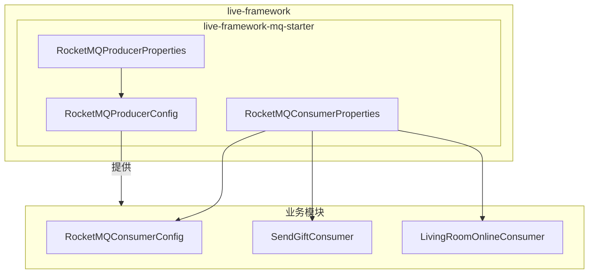
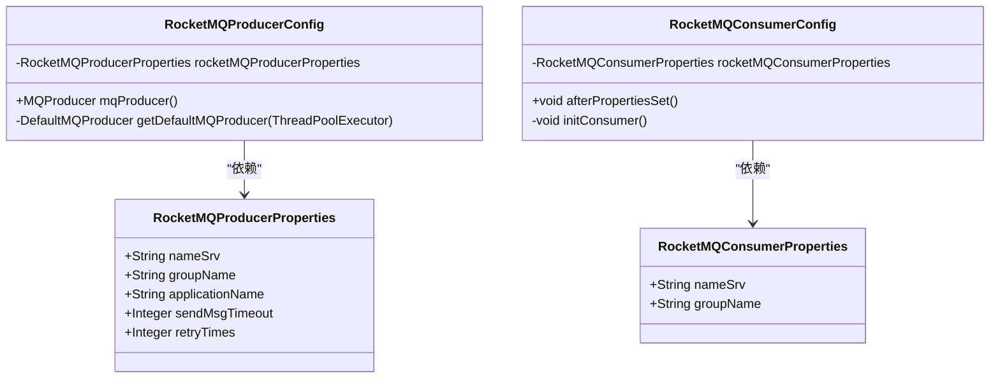
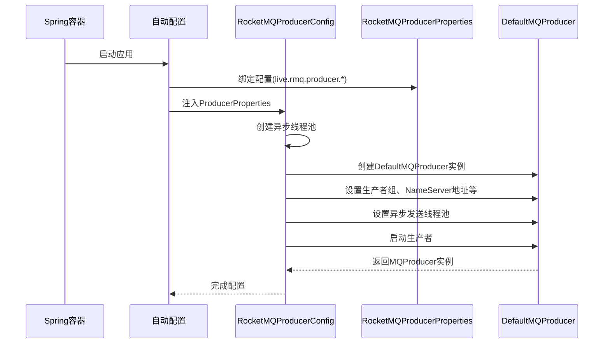
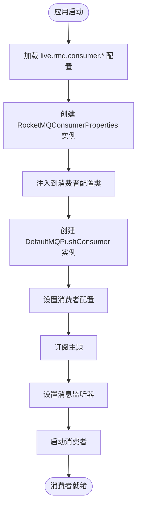
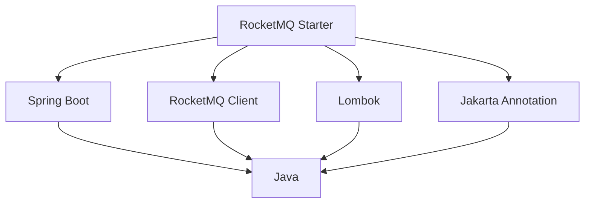

# MQ Starter组件

<cite>
**本文档中引用的文件**  
- [RocketMQProducerConfig.java](file://live-framework/live-framework-mq-starter/src/main/java/com/logilong/live/framework/mq/starter/producer/RocketMQProducerConfig.java)
- [RocketMQProducerProperties.java](file://live-framework/live-framework-mq-starter/src/main/java/com/logilong/live/framework/mq/starter/properties/RocketMQProducerProperties.java)
- [RocketMQConsumerProperties.java](file://live-framework/live-framework-mq-starter/src/main/java/com/logilong/live/framework/mq/starter/properties/RocketMQConsumerProperties.java)
- [RocketMQConsumerConfig.java](file://live-user-provider/src/main/java/com/logilong/live/user/provider/consumer/RocketMQConsumerConfig.java)
- [org.springframework.boot.autoconfigure.AutoConfiguration.imports](file://live-framework/live-framework-mq-starter/src/main/resources/META-INF/spring/org.springframework.boot.autoconfigure.AutoConfiguration.imports)
</cite>

## 目录
1. [简介](#简介)
2. [项目结构](#项目结构)
3. [核心组件](#核心组件)
4. [架构概述](#架构概述)
5. [详细组件分析](#详细组件分析)
6. [依赖分析](#依赖分析)
7. [性能考虑](#性能考虑)
8. [故障排除指南](#故障排除指南)
9. [结论](#结论)

## 简介
本文档深入解析`mq-starter`组件的实现机制，重点说明RocketMQ生产者和消费者的自动化配置流程。文档详细阐述了`RocketMQProducerConfig`如何通过`RocketMQProducerProperties`加载配置并创建和启动`DefaultMQProducer`实例，以及异步发送线程池的配置策略。同时，分析了`RocketMQConsumerProperties`和`RocketMQProducerProperties`如何通过Spring Boot的配置绑定机制实现RocketMQ客户端参数的灵活配置，并提供在业务模块中集成mq-starter的代码示例。

## 项目结构
`mq-starter`组件位于`live-framework`模块下的`live-framework-mq-starter`子模块中，是整个平台消息中间件的统一接入层。该组件通过Spring Boot自动配置机制，为各业务模块提供开箱即用的RocketMQ生产者和消费者配置能力。

**图示来源**  
- [RocketMQProducerConfig.java](file://live-framework/live-framework-mq-starter/src/main/java/com/logilong/live/framework/mq/starter/producer/RocketMQProducerConfig.java)
- [RocketMQProducerProperties.java](file://live-framework/live-framework-mq-starter/src/main/java/com/logilong/live/framework/mq/starter/properties/RocketMQProducerProperties.java)
- [RocketMQConsumerProperties.java](file://live-framework/live-framework-mq-starter/src/main/java/com/logilong/live/framework/mq/starter/properties/RocketMQConsumerProperties.java)

**本节来源**  
- [live-framework-mq-starter](file://live-framework/live-framework-mq-starter)

## 核心组件
`mq-starter`的核心组件包括`RocketMQProducerConfig`、`RocketMQProducerProperties`和`RocketMQConsumerProperties`。这些组件共同实现了RocketMQ客户端的自动化配置，使得业务模块无需关心底层配置细节，只需通过简单的配置即可使用消息队列功能。

**本节来源**  
- [RocketMQProducerConfig.java](file://live-framework/live-framework-mq-starter/src/main/java/com/logilong/live/framework/mq/starter/producer/RocketMQProducerConfig.java)
- [RocketMQProducerProperties.java](file://live-framework/live-framework-mq-starter/src/main/java/com/logilong/live/framework/mq/starter/properties/RocketMQProducerProperties.java)
- [RocketMQConsumerProperties.java](file://live-framework/live-framework-mq-starter/src/main/java/com/logilong/live/framework/mq/starter/properties/RocketMQConsumerProperties.java)

## 架构概述
`mq-starter`组件采用Spring Boot的自动配置机制，通过`@ConfigurationProperties`注解实现配置属性的绑定。生产者配置通过`RocketMQProducerConfig`类创建并启动`DefaultMQProducer`实例，而消费者则由各业务模块自行配置，但共享统一的`RocketMQConsumerProperties`配置。

**图示来源**  
- [RocketMQProducerConfig.java](file://live-framework/live-framework-mq-starter/src/main/java/com/logilong/live/framework/mq/starter/producer/RocketMQProducerConfig.java)
- [RocketMQProducerProperties.java](file://live-framework/live-framework-mq-starter/src/main/java/com/logilong/live/framework/mq/starter/properties/RocketMQProducerProperties.java)
- [RocketMQConsumerProperties.java](file://live-framework/live-framework-mq-starter/src/main/java/com/logilong/live/framework/mq/starter/properties/RocketMQConsumerProperties.java)
- [RocketMQConsumerConfig.java](file://live-user-provider/src/main/java/com/logilong/live/user/provider/consumer/RocketMQConsumerConfig.java)

## 详细组件分析

### 生产者配置分析
`RocketMQProducerConfig`是生产者配置的核心类，通过`@Configuration`注解标记为配置类，并使用`@Resource`注入`RocketMQProducerProperties`配置属性。该类通过`@Bean`注解的方法创建`MQProducer`实例。

#### 配置加载机制
`RocketMQProducerProperties`类使用`@ConfigurationProperties(prefix = "live.rmq.producer")`注解，将前缀为`live.rmq.producer`的配置项自动绑定到类的属性上。这种机制使得开发者可以在`application.yml`中通过简单的配置来设置RocketMQ生产者的各项参数。

**图示来源**  
- [RocketMQProducerConfig.java](file://live-framework/live-framework-mq-starter/src/main/java/com/logilong/live/framework/mq/starter/producer/RocketMQProducerConfig.java)
- [RocketMQProducerProperties.java](file://live-framework/live-framework-mq-starter/src/main/java/com/logilong/live/framework/mq/starter/properties/RocketMQProducerProperties.java)

#### 异步发送线程池配置
`RocketMQProducerConfig`在创建生产者实例时，会先创建一个异步发送线程池。该线程池的配置策略如下：
- 核心线程数：CPU核心数的2倍
- 最大线程数：100
- 空闲线程存活时间：30秒
- 队列容量：2000
- 线程命名策略：以"rocketmq-async-thread-"开头

这种配置策略确保了在高并发场景下消息的异步发送性能，同时避免了线程资源的过度消耗。

**本节来源**  
- [RocketMQProducerConfig.java](file://live-framework/live-framework-mq-starter/src/main/java/com/logilong/live/framework/mq/starter/producer/RocketMQProducerConfig.java#L26-L31)

### 消费者配置分析
与生产者不同，`mq-starter`组件并未提供统一的消费者配置类，而是提供了`RocketMQConsumerProperties`供各业务模块自行配置消费者。这种设计给予了业务模块更大的灵活性。

#### 配置绑定机制
`RocketMQConsumerProperties`类使用`@ConfigurationProperties(prefix = "live.rmq.consumer")`注解，将前缀为`live.rmq.consumer`的配置项自动绑定到类的属性上。业务模块可以通过`@Resource`注入该配置类，获取通用的消费者配置。

**图示来源**  
- [RocketMQConsumerProperties.java](file://live-framework/live-framework-mq-starter/src/main/java/com/logilong/live/framework/mq/starter/properties/RocketMQConsumerProperties.java)
- [RocketMQConsumerConfig.java](file://live-user-provider/src/main/java/com/logilong/live/user/provider/consumer/RocketMQConsumerConfig.java)

#### 实际使用示例
以`user-provider`模块中的`RocketMQConsumerConfig`为例，该类实现了消费者的具体配置：
- 通过`@Resource`注入`RocketMQConsumerProperties`
- 实现`InitializingBean`接口，在`afterPropertiesSet`方法中初始化消费者
- 创建`DefaultMQPushConsumer`实例并设置各项参数
- 订阅特定主题并设置消息监听器
- 启动消费者实例

**本节来源**  
- [RocketMQConsumerConfig.java](file://live-user-provider/src/main/java/com/logilong/live/user/provider/consumer/RocketMQConsumerConfig.java)

## 依赖分析
`mq-starter`组件的依赖关系清晰，主要依赖于Spring Boot框架和RocketMQ客户端库。

**图示来源**  
- [pom.xml](file://live-framework/live-framework-mq-starter/pom.xml)

**本节来源**  
- [pom.xml](file://live-framework/live-framework-mq-starter/pom.xml)

## 性能考虑
`mq-starter`组件在设计时充分考虑了性能因素，特别是在异步发送线程池的配置上。

### 异步发送性能优化
通过配置独立的异步发送线程池，`mq-starter`确保了消息发送不会阻塞业务主线程。线程池的参数设置经过精心设计：
- 核心线程数基于CPU核心数动态计算，充分利用多核优势
- 足够大的队列容量（2000）可以缓冲突发的消息发送请求
- 合理的最大线程数（100）防止资源耗尽

### 可靠性保障
组件还配置了多项可靠性保障机制：
- 发送失败重试次数可配置
- 发送异步失败时也会重试
- 当消息未成功存储时，会尝试切换到其他Broker

这些配置确保了在各种异常情况下消息的可靠传递。

**本节来源**  
- [RocketMQProducerConfig.java](file://live-framework/live-framework-mq-starter/src/main/java/com/logilong/live/framework/mq/starter/producer/RocketMQProducerConfig.java#L46-L48)

## 故障排除指南
当遇到`mq-starter`相关问题时，可以按照以下步骤进行排查：

### 生产者启动失败
1. 检查`live.rmq.producer.nameSrv`配置是否正确
2. 确认NameServer服务是否正常运行
3. 检查网络连接是否通畅
4. 查看日志中是否有具体的异常信息

### 消费者无法接收消息
1. 检查`live.rmq.consumer.nameSrv`配置是否正确
2. 确认消费者组名是否与其他实例冲突
3. 检查订阅的主题是否存在
4. 验证消息监听器是否正确实现

### 消息发送延迟
1. 检查异步线程池是否已满
2. 查看系统资源使用情况（CPU、内存）
3. 检查网络延迟
4. 考虑调整`sendMsgTimeout`参数

**本节来源**  
- [RocketMQProducerConfig.java](file://live-framework/live-framework-mq-starter/src/main/java/com/logilong/live/framework/mq/starter/producer/RocketMQProducerConfig.java#L34-L38)
- [RocketMQConsumerConfig.java](file://live-user-provider/src/main/java/com/logilong/live/user/provider/consumer/RocketMQConsumerConfig.java#L67-L68)

## 结论
`mq-starter`组件通过Spring Boot的自动配置机制，为平台提供了统一、便捷的RocketMQ接入方案。生产者配置实现了完全的自动化，而消费者配置则保持了足够的灵活性。组件的设计充分考虑了高性能和可靠性需求，通过合理的线程池配置和重试机制，确保了消息系统的稳定运行。各业务模块可以轻松集成该组件，专注于业务逻辑的实现，而无需关心消息中间件的底层细节。