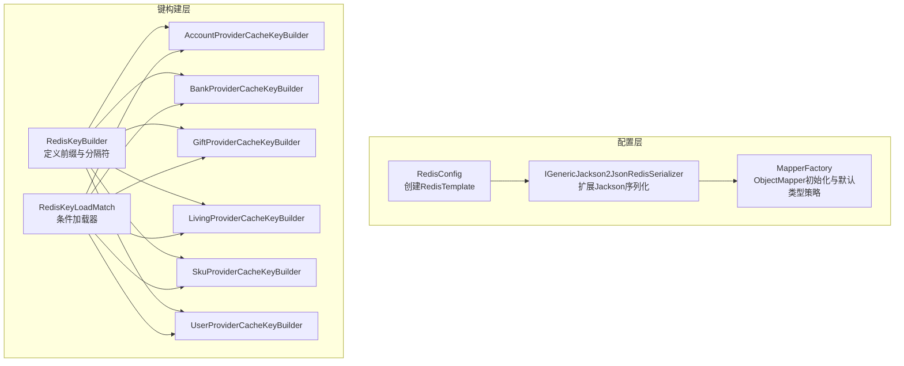
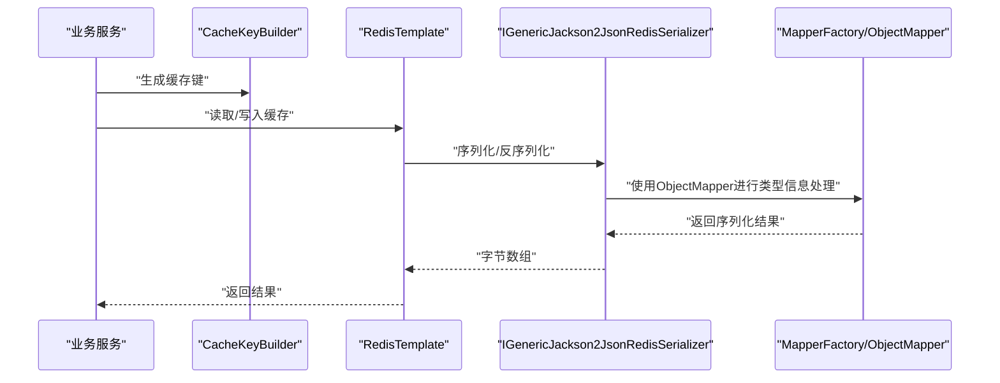
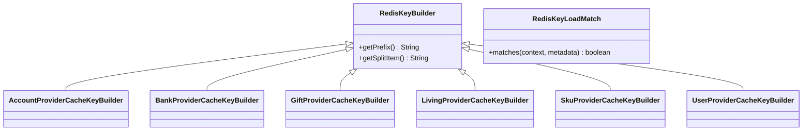
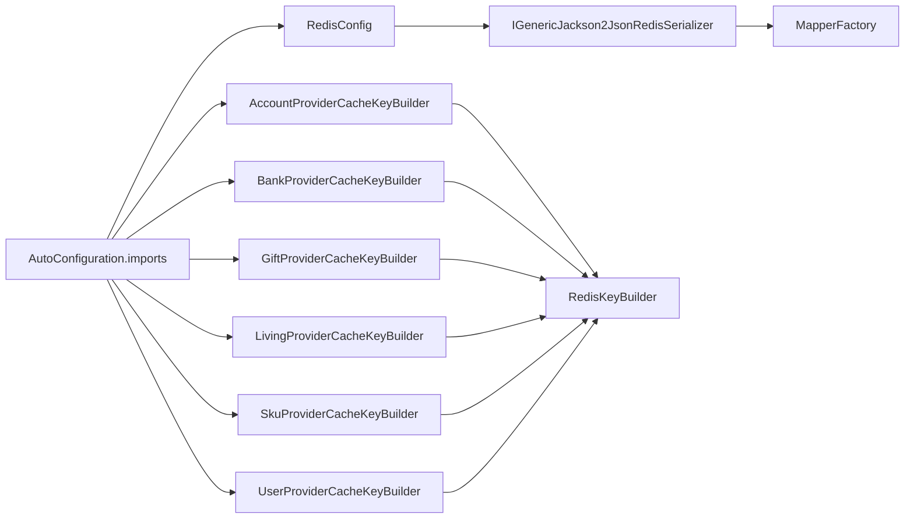
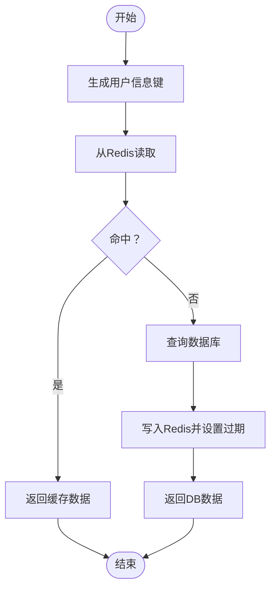

# Redis Starter组件

<cite>
**本文引用的文件列表**
- [RedisConfig.java](file://live-framework/live-framework-redis-starter/src/main/java/com/logilong/live/framework/redis/starter/config/RedisConfig.java)
- [IGenericJackson2JsonRedisSerializer.java](file://live-framework/live-framework-redis-starter/src/main/java/com/logilong/live/framework/redis/starter/config/IGenericJackson2JsonRedisSerializer.java)
- [MapperFactory.java](file://live-framework/live-framework-redis-starter/src/main/java/com/logilong/live/framework/redis/starter/config/MapperFactory.java)
- [RedisKeyBuilder.java](file://live-framework/live-framework-redis-starter/src/main/java/com/logilong/live/framework/redis/starter/key/RedisKeyBuilder.java)
- [RedisKeyLoadMatch.java](file://live-framework/live-framework-redis-starter/src/main/java/com/logilong/live/framework/redis/starter/key/RedisKeyLoadMatch.java)
- [AccountProviderCacheKeyBuilder.java](file://live-framework/live-framework-redis-starter/src/main/java/com/logilong/live/framework/redis/starter/key/AccountProviderCacheKeyBuilder.java)
- [BankProviderCacheKeyBuilder.java](file://live-framework/live-framework-redis-starter/src/main/java/com/logilong/live/framework/redis/starter/key/BankProviderCacheKeyBuilder.java)
- [GiftProviderCacheKeyBuilder.java](file://live-framework/live-framework-redis-starter/src/main/java/com/logilong/live/framework/redis/starter/key/GiftProviderCacheKeyBuilder.java)
- [LivingProviderCacheKeyBuilder.java](file://live-framework/live-framework-redis-starter/src/main/java/com/logilong/live/framework/redis/starter/key/LivingProviderCacheKeyBuilder.java)
- [SkuProviderCacheKeyBuilder.java](file://live-framework/live-framework-redis-starter/src/main/java/com/logilong/live/framework/redis/starter/key/SkuProviderCacheKeyBuilder.java)
- [UserProviderCacheKeyBuilder.java](file://live-framework/live-framework-redis-starter/src/main/java/com/logilong/live/framework/redis/starter/key/UserProviderCacheKeyBuilder.java)
- [org.springframework.boot.autoconfigure.AutoConfiguration.imports](file://live-framework/live-framework-redis-starter/src/main/resources/META-INF/spring/org.springframework.boot.autoconfigure.AutoConfiguration.imports)
- [pom.xml](file://live-framework/live-framework-redis-starter/pom.xml)
- [UserServiceImpl.java](file://live-user-provider/src/main/java/com/logilong/live/user/provider/service/impl/UserServiceImpl.java)
- [UserPhoneServiceImpl.java](file://live-user-provider/src/main/java/com/logilong/live/user/provider/service/impl/UserPhoneServiceImpl.java)
- [LiveCurrencyAccountServiceImpl.java](file://live-bank-provider/src/main/java/com/logilong/live/bank/provider/service/impl/LiveCurrencyAccountServiceImpl.java)
</cite>

## 目录
1. [引言](#引言)
2. [项目结构](#项目结构)
3. [核心组件](#核心组件)
4. [架构总览](#架构总览)
5. [关键组件详解](#关键组件详解)
6. [依赖关系分析](#依赖关系分析)
7. [性能与可靠性考量](#性能与可靠性考量)
8. [故障排查指南](#故障排查指南)
9. [结论](#结论)
10. [附录：使用示例与最佳实践](#附录使用示例与最佳实践)

## 引言
本文件系统性解析 live-framework-redis-starter 组件的架构设计与实现要点，重点覆盖：
- RedisTemplate 的配置与序列化策略，通过 IGenericJackson2JsonRedisSerializer 解决 Java 对象存储时的类型丢失问题，并由 MapperFactory 提供泛型映射支持；
- RedisKeyBuilder 抽象类与各业务模块专用 CacheKeyBuilder 的设计模式，统一缓存键命名规范；
- 在业务服务中使用 RedisTemplate 进行缓存读写、键生成与序列化的完整实践路径与最佳实践。

## 项目结构
该组件位于 live-framework 子模块下，采用“自动装配 + 命名规范 + 序列化工厂”的分层设计：
- 配置层：RedisConfig 负责创建 RedisTemplate 并设置序列化器；IGenericJackson2JsonRedisSerializer 扩展 Jackson 序列化并注入 MapperFactory；MapperFactory 统一 ObjectMapper 初始化与默认类型信息策略。
- 键构建层：RedisKeyBuilder 定义前缀与分隔符；各业务模块的 CacheKeyBuilder 继承 RedisKeyBuilder，按模块约定生成键；RedisKeyLoadMatch 条件加载器仅对当前应用生效，避免资源浪费。
- 自动装配：Spring Boot 自动导入清单声明了所有配置与键构建 Bean，便于按需启用。

图表来源
- [RedisConfig.java](file://live-framework/live-framework-redis-starter/src/main/java/com/logilong/live/framework/redis/starter/config/RedisConfig.java#L1-L28)
- [IGenericJackson2JsonRedisSerializer.java](file://live-framework/live-framework-redis-starter/src/main/java/com/logilong/live/framework/redis/starter/config/IGenericJackson2JsonRedisSerializer.java#L1-L21)
- [MapperFactory.java](file://live-framework/live-framework-redis-starter/src/main/java/com/logilong/live/framework/redis/starter/config/MapperFactory.java#L1-L70)
- [RedisKeyBuilder.java](file://live-framework/live-framework-redis-starter/src/main/java/com/logilong/live/framework/redis/starter/key/RedisKeyBuilder.java#L1-L22)
- [RedisKeyLoadMatch.java](file://live-framework/live-framework-redis-starter/src/main/java/com/logilong/live/framework/redis/starter/key/RedisKeyLoadMatch.java#L1-L45)
- [AccountProviderCacheKeyBuilder.java](file://live-framework/live-framework-redis-starter/src/main/java/com/logilong/live/framework/redis/starter/key/AccountProviderCacheKeyBuilder.java#L1-L18)
- [BankProviderCacheKeyBuilder.java](file://live-framework/live-framework-redis-starter/src/main/java/com/logilong/live/framework/redis/starter/key/BankProviderCacheKeyBuilder.java#L1-L37)
- [GiftProviderCacheKeyBuilder.java](file://live-framework/live-framework-redis-starter/src/main/java/com/logilong/live/framework/redis/starter/key/GiftProviderCacheKeyBuilder.java#L1-L89)
- [LivingProviderCacheKeyBuilder.java](file://live-framework/live-framework-redis-starter/src/main/java/com/logilong/live/framework/redis/starter/key/LivingProviderCacheKeyBuilder.java#L1-L40)
- [SkuProviderCacheKeyBuilder.java](file://live-framework/live-framework-redis-starter/src/main/java/com/logilong/live/framework/redis/starter/key/SkuProviderCacheKeyBuilder.java#L1-L41)
- [UserProviderCacheKeyBuilder.java](file://live-framework/live-framework-redis-starter/src/main/java/com/logilong/live/framework/redis/starter/key/UserProviderCacheKeyBuilder.java#L1-L46)

章节来源
- [org.springframework.boot.autoconfigure.AutoConfiguration.imports](file://live-framework/live-framework-redis-starter/src/main/resources/META-INF/spring/org.springframework.boot.autoconfigure.AutoConfiguration.imports#L1-L10)
- [pom.xml](file://live-framework/live-framework-redis-starter/pom.xml#L1-L34)

## 核心组件
- RedisConfig：创建 RedisTemplate，设置 key/value 及 hash key/value 的序列化器为 StringRedisSerializer 和 IGenericJackson2JsonRedisSerializer，确保字符串键与 JSON 值的一致性。
- IGenericJackson2JsonRedisSerializer：继承 GenericJackson2JsonRedisSerializer，构造函数注入 MapperFactory.newInstance()，并在 serialize 中对基础类型（如 String、Character）直接返回字节，避免多余包装，提升性能与兼容性。
- MapperFactory：负责 ObjectMapper 的初始化，开启非 final 类型的默认类型信息（As.PROPERTY 或指定属性），禁用未知属性失败，注册 NullValue 序列化器以支持 Spring Cache 的 NullValue 场景。
- RedisKeyBuilder：定义统一前缀（应用名 + 冒号）与分隔符，作为所有业务键的基础。
- 各业务 CacheKeyBuilder：继承 RedisKeyBuilder，按模块约定拼接业务标识与业务参数，形成可读且稳定的缓存键。
- RedisKeyLoadMatch：条件加载器，根据 spring.application.name 与类名匹配，仅加载当前应用的 CacheKeyBuilder，避免跨项目资源浪费。

章节来源
- [RedisConfig.java](file://live-framework/live-framework-redis-starter/src/main/java/com/logilong/live/framework/redis/starter/config/RedisConfig.java#L1-L28)
- [IGenericJackson2JsonRedisSerializer.java](file://live-framework/live-framework-redis-starter/src/main/java/com/logilong/live/framework/redis/starter/config/IGenericJackson2JsonRedisSerializer.java#L1-L21)
- [MapperFactory.java](file://live-framework/live-framework-redis-starter/src/main/java/com/logilong/live/framework/redis/starter/config/MapperFactory.java#L1-L70)
- [RedisKeyBuilder.java](file://live-framework/live-framework-redis-starter/src/main/java/com/logilong/live/framework/redis/starter/key/RedisKeyBuilder.java#L1-L22)
- [RedisKeyLoadMatch.java](file://live-framework/live-framework-redis-starter/src/main/java/com/logilong/live/framework/redis/starter/key/RedisKeyLoadMatch.java#L1-L45)

## 架构总览
Redis Starter 的整体流程如下：
- 应用启动时，Spring Boot 自动导入清单加载 RedisConfig 与各 CacheKeyBuilder；
- RedisConfig 创建 RedisTemplate 并注入自定义序列化器；
- 业务服务通过 @Resource 注入 RedisTemplate 与对应 CacheKeyBuilder；
- 业务逻辑先用 CacheKeyBuilder 生成键，再调用 RedisTemplate 执行读写；
- 序列化链路：IGenericJackson2JsonRedisSerializer -> MapperFactory -> ObjectMapper，保障泛型对象的类型信息保留与反序列化安全。

图表来源
- [RedisConfig.java](file://live-framework/live-framework-redis-starter/src/main/java/com/logilong/live/framework/redis/starter/config/RedisConfig.java#L1-L28)
- [IGenericJackson2JsonRedisSerializer.java](file://live-framework/live-framework-redis-starter/src/main/java/com/logilong/live/framework/redis/starter/config/IGenericJackson2JsonRedisSerializer.java#L1-L21)
- [MapperFactory.java](file://live-framework/live-framework-redis-starter/src/main/java/com/logilong/live/framework/redis/starter/config/MapperFactory.java#L1-L70)
- [UserProviderCacheKeyBuilder.java](file://live-framework/live-framework-redis-starter/src/main/java/com/logilong/live/framework/redis/starter/key/UserProviderCacheKeyBuilder.java#L1-L46)

## 关键组件详解

### RedisConfig：RedisTemplate 配置与序列化策略
- 作用：创建 RedisTemplate，设置 key/value 与 hash key/value 的序列化器，确保键为字符串、值为 JSON 字节数组。
- 关键点：
  - key/value 序列化器：StringRedisSerializer
  - 值序列化器：IGenericJackson2JsonRedisSerializer，用于 JSON 序列化与反序列化
  - afterPropertiesSet：完成模板初始化

章节来源
- [RedisConfig.java](file://live-framework/live-framework-redis-starter/src/main/java/com/logilong/live/framework/redis/starter/config/RedisConfig.java#L1-L28)

### IGenericJackson2JsonRedisSerializer：泛型对象 JSON 序列化
- 作用：扩展 GenericJackson2JsonRedisSerializer，注入 MapperFactory.newInstance()，在 serialize 中对基础类型（String、Character）直接返回字节数组，避免额外包装。
- 设计意义：解决 Java 对象存储时的类型丢失问题，同时兼顾基础类型的高效序列化。

章节来源
- [IGenericJackson2JsonRedisSerializer.java](file://live-framework/live-framework-redis-starter/src/main/java/com/logilong/live/framework/redis/starter/config/IGenericJackson2JsonRedisSerializer.java#L1-L21)

### MapperFactory：泛型映射与默认类型信息
- 作用：统一初始化 ObjectMapper，开启非 final 类的默认类型信息（As.PROPERTY 或指定属性），禁用未知属性失败，注册 NullValue 序列化器以支持 Spring Cache 的 NullValue。
- 复杂度与性能：初始化一次，复用 ObjectMapper 实例，减少反射开销；默认类型信息确保泛型对象反序列化时保留原始类型。

章节来源
- [MapperFactory.java](file://live-framework/live-framework-redis-starter/src/main/java/com/logilong/live/framework/redis/starter/config/MapperFactory.java#L1-L70)

### RedisKeyBuilder 与各业务 CacheKeyBuilder：统一命名规范
- RedisKeyBuilder：
  - 定义统一前缀（应用名 + 冒号）与分隔符
  - 提供 getPrefix()/getSplitItem() 供子类使用
- 各业务 CacheKeyBuilder：
  - 继承 RedisKeyBuilder，按模块约定拼接业务标识与业务参数，形成稳定、可读的键
  - 使用 @Conditional(RedisKeyLoadMatch.class) 仅在当前应用加载
- RedisKeyLoadMatch：
  - 通过 spring.application.name 与类名匹配，仅加载当前应用的 CacheKeyBuilder，避免资源浪费

图表来源
- [RedisKeyBuilder.java](file://live-framework/live-framework-redis-starter/src/main/java/com/logilong/live/framework/redis/starter/key/RedisKeyBuilder.java#L1-L22)
- [RedisKeyLoadMatch.java](file://live-framework/live-framework-redis-starter/src/main/java/com/logilong/live/framework/redis/starter/key/RedisKeyLoadMatch.java#L1-L45)
- [AccountProviderCacheKeyBuilder.java](file://live-framework/live-framework-redis-starter/src/main/java/com/logilong/live/framework/redis/starter/key/AccountProviderCacheKeyBuilder.java#L1-L18)
- [BankProviderCacheKeyBuilder.java](file://live-framework/live-framework-redis-starter/src/main/java/com/logilong/live/framework/redis/starter/key/BankProviderCacheKeyBuilder.java#L1-L37)
- [GiftProviderCacheKeyBuilder.java](file://live-framework/live-framework-redis-starter/src/main/java/com/logilong/live/framework/redis/starter/key/GiftProviderCacheKeyBuilder.java#L1-L89)
- [LivingProviderCacheKeyBuilder.java](file://live-framework/live-framework-redis-starter/src/main/java/com/logilong/live/framework/redis/starter/key/LivingProviderCacheKeyBuilder.java#L1-L40)
- [SkuProviderCacheKeyBuilder.java](file://live-framework/live-framework-redis-starter/src/main/java/com/logilong/live/framework/redis/starter/key/SkuProviderCacheKeyBuilder.java#L1-L41)
- [UserProviderCacheKeyBuilder.java](file://live-framework/live-framework-redis-starter/src/main/java/com/logilong/live/framework/redis/starter/key/UserProviderCacheKeyBuilder.java#L1-L46)

## 依赖关系分析
- 自动装配：Spring Boot 自动导入清单声明了 RedisConfig 与所有 CacheKeyBuilder，确保组件随应用启动自动装配。
- 组件耦合：
  - RedisConfig 依赖 IGenericJackson2JsonRedisSerializer
  - IGenericJackson2JsonRedisSerializer 依赖 MapperFactory
  - 各 CacheKeyBuilder 依赖 RedisKeyBuilder
  - RedisKeyLoadMatch 通过条件注解控制加载范围
- 外部依赖：spring-boot-starter-data-redis、spring-boot-starter-web

图表来源
- [org.springframework.boot.autoconfigure.AutoConfiguration.imports](file://live-framework/live-framework-redis-starter/src/main/resources/META-INF/spring/org.springframework.boot.autoconfigure.AutoConfiguration.imports#L1-L10)
- [RedisConfig.java](file://live-framework/live-framework-redis-starter/src/main/java/com/logilong/live/framework/redis/starter/config/RedisConfig.java#L1-L28)
- [IGenericJackson2JsonRedisSerializer.java](file://live-framework/live-framework-redis-starter/src/main/java/com/logilong/live/framework/redis/starter/config/IGenericJackson2JsonRedisSerializer.java#L1-L21)
- [MapperFactory.java](file://live-framework/live-framework-redis-starter/src/main/java/com/logilong/live/framework/redis/starter/config/MapperFactory.java#L1-L70)
- [RedisKeyBuilder.java](file://live-framework/live-framework-redis-starter/src/main/java/com/logilong/live/framework/redis/starter/key/RedisKeyBuilder.java#L1-L22)
- [AccountProviderCacheKeyBuilder.java](file://live-framework/live-framework-redis-starter/src/main/java/com/logilong/live/framework/redis/starter/key/AccountProviderCacheKeyBuilder.java#L1-L18)
- [BankProviderCacheKeyBuilder.java](file://live-framework/live-framework-redis-starter/src/main/java/com/logilong/live/framework/redis/starter/key/BankProviderCacheKeyBuilder.java#L1-L37)
- [GiftProviderCacheKeyBuilder.java](file://live-framework/live-framework-redis-starter/src/main/java/com/logilong/live/framework/redis/starter/key/GiftProviderCacheKeyBuilder.java#L1-L89)
- [LivingProviderCacheKeyBuilder.java](file://live-framework/live-framework-redis-starter/src/main/java/com/logilong/live/framework/redis/starter/key/LivingProviderCacheKeyBuilder.java#L1-L40)
- [SkuProviderCacheKeyBuilder.java](file://live-framework/live-framework-redis-starter/src/main/java/com/logilong/live/framework/redis/starter/key/SkuProviderCacheKeyBuilder.java#L1-L41)
- [UserProviderCacheKeyBuilder.java](file://live-framework/live-framework-redis-starter/src/main/java/com/logilong/live/framework/redis/starter/key/UserProviderCacheKeyBuilder.java#L1-L46)

章节来源
- [org.springframework.boot.autoconfigure.AutoConfiguration.imports](file://live-framework/live-framework-redis-starter/src/main/resources/META-INF/spring/org.springframework.boot.autoconfigure.AutoConfiguration.imports#L1-L10)
- [pom.xml](file://live-framework/live-framework-redis-starter/pom.xml#L1-L34)

## 性能与可靠性考量
- 序列化性能：
  - IGenericJackson2JsonRedisSerializer 对基础类型直接返回字节数组，避免额外包装，降低序列化成本。
  - ObjectMapper 由 MapperFactory 统一初始化并复用，减少反射与类型信息解析开销。
- 泛型与类型安全：
  - MapperFactory 开启非 final 类的默认类型信息，确保泛型对象反序列化时保留原始类型，解决类型丢失问题。
  - 禁用未知属性失败，增强兼容性，避免因字段变更导致的反序列化异常。
- 键命名一致性：
  - RedisKeyBuilder 统一前缀与分隔符，CacheKeyBuilder 按模块约定拼接，便于运维检索与清理。
- 条件加载：
  - RedisKeyLoadMatch 仅加载当前应用的 CacheKeyBuilder，避免跨项目资源浪费与潜在冲突。

[本节为通用指导，不直接分析具体文件]

## 故障排查指南
- 序列化/反序列化异常
  - 现象：存储或读取对象时报错，提示类型不匹配或未知字段
  - 排查：确认对象是否包含泛型类型信息；检查 MapperFactory 是否正确初始化；确认 IGenericJackson2JsonRedisSerializer 是否被注入到 RedisTemplate
  - 参考路径
    - [IGenericJackson2JsonRedisSerializer.java](file://live-framework/live-framework-redis-starter/src/main/java/com/logilong/live/framework/redis/starter/config/IGenericJackson2JsonRedisSerializer.java#L1-L21)
    - [MapperFactory.java](file://live-framework/live-framework-redis-starter/src/main/java/com/logilong/live/framework/redis/starter/config/MapperFactory.java#L1-L70)
    - [RedisConfig.java](file://live-framework/live-framework-redis-starter/src/main/java/com/logilong/live/framework/redis/starter/config/RedisConfig.java#L1-L28)
- 键命名冲突或不可读
  - 现象：缓存键重复或难以识别
  - 排查：确认 CacheKeyBuilder 是否正确继承 RedisKeyBuilder；检查业务标识与业务参数拼接是否唯一且可读
  - 参考路径
    - [RedisKeyBuilder.java](file://live-framework/live-framework-redis-starter/src/main/java/com/logilong/live/framework/redis/starter/key/RedisKeyBuilder.java#L1-L22)
    - [UserProviderCacheKeyBuilder.java](file://live-framework/live-framework-redis-starter/src/main/java/com/logilong/live/framework/redis/starter/key/UserProviderCacheKeyBuilder.java#L1-L46)
- 条件加载未生效
  - 现象：某些 CacheKeyBuilder 未被加载
  - 排查：确认 spring.application.name 与类名匹配规则；检查 RedisKeyLoadMatch 的日志输出
  - 参考路径
    - [RedisKeyLoadMatch.java](file://live-framework/live-framework-redis-starter/src/main/java/com/logilong/live/framework/redis/starter/key/RedisKeyLoadMatch.java#L1-L45)
    - [org.springframework.boot.autoconfigure.AutoConfiguration.imports](file://live-framework/live-framework-redis-starter/src/main/resources/META-INF/spring/org.springframework.boot.autoconfigure.AutoConfiguration.imports#L1-L10)

章节来源
- [IGenericJackson2JsonRedisSerializer.java](file://live-framework/live-framework-redis-starter/src/main/java/com/logilong/live/framework/redis/starter/config/IGenericJackson2JsonRedisSerializer.java#L1-L21)
- [MapperFactory.java](file://live-framework/live-framework-redis-starter/src/main/java/com/logilong/live/framework/redis/starter/config/MapperFactory.java#L1-L70)
- [RedisConfig.java](file://live-framework/live-framework-redis-starter/src/main/java/com/logilong/live/framework/redis/starter/config/RedisConfig.java#L1-L28)
- [RedisKeyBuilder.java](file://live-framework/live-framework-redis-starter/src/main/java/com/logilong/live/framework/redis/starter/key/RedisKeyBuilder.java#L1-L22)
- [RedisKeyLoadMatch.java](file://live-framework/live-framework-redis-starter/src/main/java/com/logilong/live/framework/redis/starter/key/RedisKeyLoadMatch.java#L1-L45)
- [org.springframework.boot.autoconfigure.AutoConfiguration.imports](file://live-framework/live-framework-redis-starter/src/main/resources/META-INF/spring/org.springframework.boot.autoconfigure.AutoConfiguration.imports#L1-L10)

## 结论
live-framework-redis-starter 通过“配置 + 序列化 + 键构建 + 条件加载”的组合，实现了：
- 高性能、低侵入的 Redis 缓存接入；
- 泛型对象的类型安全存储与读取；
- 统一、可维护的缓存键命名规范；
- 面向多模块的可扩展设计与按需加载能力。

[本节为总结性内容，不直接分析具体文件]

## 附录：使用示例与最佳实践

### 示例一：用户信息服务中的缓存读写与键生成
- 步骤
  - 注入 RedisTemplate<String, UserDTO> 与 UserProviderCacheKeyBuilder
  - 使用 cacheKeyBuilder.buildUserInfoKey(userId) 生成键
  - 先从 Redis 读取，命中则直接返回；未命中则查询 DB，再写入 Redis 并设置过期时间
  - 更新用户信息后删除对应键，确保后续读取走 DB 再回填
- 参考路径
  - [UserServiceImpl.java](file://live-user-provider/src/main/java/com/logilong/live/user/provider/service/impl/UserServiceImpl.java#L27-L68)
  - [UserProviderCacheKeyBuilder.java](file://live-framework/live-framework-redis-starter/src/main/java/com/logilong/live/framework/redis/starter/key/UserProviderCacheKeyBuilder.java#L1-L46)

图表来源
- [UserServiceImpl.java](file://live-user-provider/src/main/java/com/logilong/live/user/provider/service/impl/UserServiceImpl.java#L27-L68)
- [UserProviderCacheKeyBuilder.java](file://live-framework/live-framework-redis-starter/src/main/java/com/logilong/live/framework/redis/starter/key/UserProviderCacheKeyBuilder.java#L1-L46)

### 示例二：用户手机号列表的缓存读写与空值缓存
- 步骤
  - 使用 cacheKeyBuilder.buildUserPhoneListKey(userId) 生成键
  - 列表读取使用 opsForList.range；命中则判断是否为空值缓存对象
  - 未命中则查询 DB，若存在数据则写入列表并设置过期；否则写入空对象并设置短期过期，防止缓存穿透
- 参考路径
  - [UserPhoneServiceImpl.java](file://live-user-provider/src/main/java/com/logilong/live/user/provider/service/impl/UserPhoneServiceImpl.java#L124-L181)
  - [UserProviderCacheKeyBuilder.java](file://live-framework/live-framework-redis-starter/src/main/java/com/logilong/live/framework/redis/starter/key/UserProviderCacheKeyBuilder.java#L1-L46)

### 示例三：余额增减的缓存与异步落库
- 步骤
  - 使用 bank CacheKeyBuilder 生成用户余额键
  - 先在 Redis 上执行增量/减量操作，再异步提交 DB 事务，保证最终一致性
  - 注意：Redis 侧先于 DB 操作，DB 失败时可通过补偿机制或重试策略恢复
- 参考路径
  - [LiveCurrencyAccountServiceImpl.java](file://live-bank-provider/src/main/java/com/logilong/live/bank/provider/service/impl/LiveCurrencyAccountServiceImpl.java#L59-L88)
  - [BankProviderCacheKeyBuilder.java](file://live-framework/live-framework-redis-starter/src/main/java/com/logilong/live/framework/redis/starter/key/BankProviderCacheKeyBuilder.java#L1-L37)

### 最佳实践
- 键命名规范
  - 使用 RedisKeyBuilder.getPrefix() 与模块标识拼接，避免跨模块键冲突
  - 对于复杂键，使用多个参数分隔，保持可读性与唯一性
- 序列化策略
  - 优先使用 RedisTemplate<String, T> 昨天的键与泛型值，利用 IGenericJackson2JsonRedisSerializer 与 MapperFactory 的默认类型信息
  - 对于基础类型，避免不必要的包装，减少序列化体积
- 缓存一致性
  - 写操作后及时删除或更新缓存键，避免脏读
  - 对热点数据设置合理过期时间，结合空值缓存应对缓存穿透
- 条件加载
  - 通过 RedisKeyLoadMatch 仅加载当前应用的 CacheKeyBuilder，避免资源浪费与潜在冲突

[本节为通用指导，不直接分析具体文件]