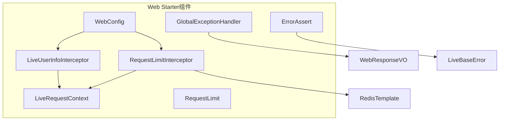
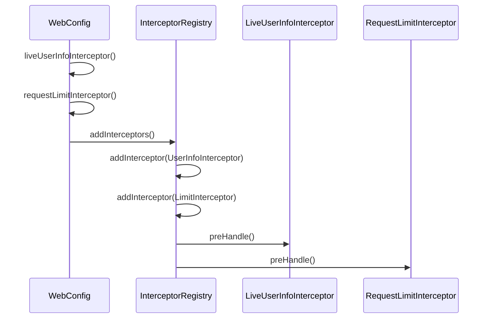
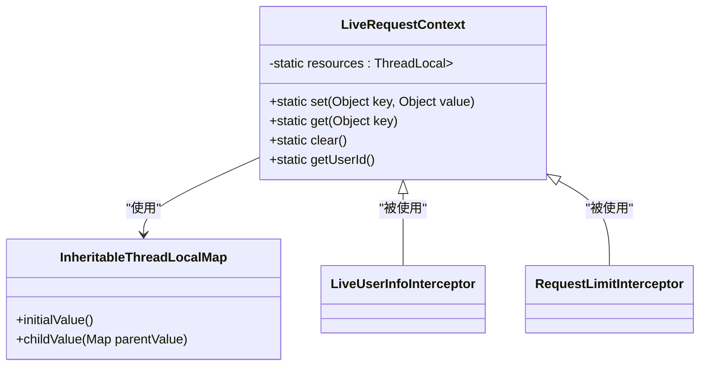
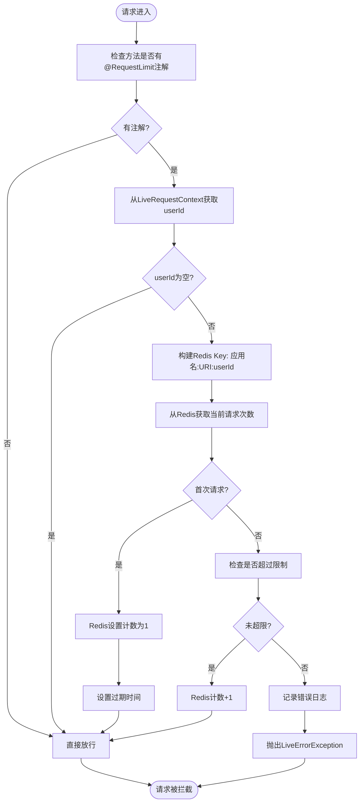
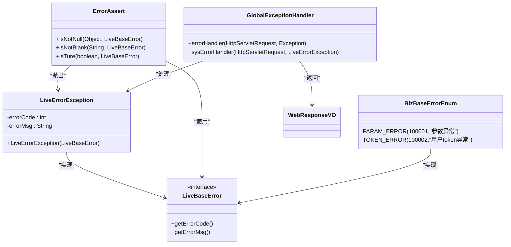

# Web Starter组件

<cite>
**本文档引用文件**  
- [WebConfig.java](file://live-framework/live-framework-web-starter/src/main/java/com/logilong/live/web/starter/config/WebConfig.java)
- [RequestLimit.java](file://live-framework/live-framework-web-starter/src/main/java/com/logilong/live/web/starter/config/RequestLimit.java)
- [LiveUserInfoInterceptor.java](file://live-framework/live-framework-web-starter/src/main/java/com/logilong/live/web/starter/context/LiveUserInfoInterceptor.java)
- [RequestLimitInterceptor.java](file://live-framework/live-framework-web-starter/src/main/java/com/logilong/live/web/starter/context/RequestLimitInterceptor.java)
- [LiveRequestContext.java](file://live-framework/live-framework-web-starter/src/main/java/com/logilong/live/web/starter/context/LiveRequestContext.java)
- [GlobalExceptionHandler.java](file://live-framework/live-framework-web-starter/src/main/java/com/logilong/live/web/starter/error/GlobalExceptionHandler.java)
- [LiveBaseError.java](file://live-framework/live-framework-web-starter/src/main/java/com/logilong/live/web/starter/error/LiveBaseError.java)
- [ErrorAssert.java](file://live-framework/live-framework-web-starter/src/main/java/com/logilong/live/web/starter/error/ErrorAssert.java)
- [BizBaseErrorEnum.java](file://live-framework/live-framework-web-starter/src/main/java/com/logilong/live/web/starter/error/BizBaseErrorEnum.java)
- [LivingRoomServiceImpl.java](file://live-api/src/main/java/com/logilong/live/api/service/impl/LivingRoomServiceImpl.java)
- [org.springframework.boot.autoconfigure.AutoConfiguration.imports](file://live-framework/live-framework-web-starter/src/main/resources/META-INF/spring/org.springframework.boot.autoconfigure.AutoConfiguration.imports)
</cite>

## 目录

1. [引言](#引言)
2. [核心组件设计](#核心组件设计)
3. [Web配置与拦截器注册](#web配置与拦截器注册)
4. [请求上下文管理](#请求上下文管理)
5. [接口限流机制](#接口限流机制)
6. [全局异常处理](#全局异常处理)
7. [业务模块接入实践](#业务模块接入实践)
8. [总结](#总结)

## 引言

Web Starter组件是直播平台微服务架构中的核心基础组件，提供统一的请求处理、上下文管理、限流控制和异常处理机制。该组件通过Spring Boot自动配置机制集成到各业务服务中，实现跨服务的标准化处理流程。

## 核心组件设计

Web Starter组件采用模块化设计，主要包含以下核心模块：
- **配置模块**：WebConfig实现WebMvcConfigurer接口，注册拦截器
- **上下文管理模块**：LiveRequestContext使用ThreadLocal存储用户请求上下文
- **限流模块**：RequestLimit注解与RequestLimitInterceptor配合实现分布式限流
- **异常处理模块**：GlobalExceptionHandler统一处理系统异常
- **断言工具模块**：ErrorAssert提供业务参数校验功能



**图示来源**
- [WebConfig.java](file://live-framework/live-framework-web-starter/src/main/java/com/logilong/live/web/starter/config/WebConfig.java)
- [LiveUserInfoInterceptor.java](file://live-framework/live-framework-web-starter/src/main/java/com/logilong/live/web/starter/context/LiveUserInfoInterceptor.java)
- [RequestLimitInterceptor.java](file://live-framework/live-framework-web-starter/src/main/java/com/logilong/live/web/starter/context/RequestLimitInterceptor.java)

## Web配置与拦截器注册

WebConfig类通过实现WebMvcConfigurer接口，注册两个核心拦截器：LiveUserInfoInterceptor和RequestLimitInterceptor。



**图示来源**
- [WebConfig.java](file://live-framework/live-framework-web-starter/src/main/java/com/logilong/live/web/starter/config/WebConfig.java#L10-L27)

**本节来源**
- [WebConfig.java](file://live-framework/live-framework-web-starter/src/main/java/com/logilong/live/web/starter/config/WebConfig.java#L1-L28)

## 请求上下文管理

LiveRequestContext利用ThreadLocal实现用户请求上下文的存储与传递，确保跨方法调用时用户信息的可访问性。



**图示来源**
- [LiveRequestContext.java](file://live-framework/live-framework-web-starter/src/main/java/com/logilong/live/web/starter/context/LiveRequestContext.java#L12-L65)
- [LiveUserInfoInterceptor.java](file://live-framework/live-framework-web-starter/src/main/java/com/logilong/live/web/starter/context/LiveUserInfoInterceptor.java#L14-L34)
- [RequestLimitInterceptor.java](file://live-framework/live-framework-web-starter/src/main/java/com/logilong/live/web/starter/context/RequestLimitInterceptor.java#L21-L67)

**本节来源**
- [LiveRequestContext.java](file://live-framework/live-framework-web-starter/src/main/java/com/logilong/live/web/starter/context/LiveRequestContext.java#L1-L65)
- [LiveUserInfoInterceptor.java](file://live-framework/live-framework-web-starter/src/main/java/com/logilong/live/web/starter/context/LiveUserInfoInterceptor.java#L1-L34)
- [RequestConstants.java](file://live-framework/live-framework-web-starter/src/main/java/com/logilong/live/web/starter/constants/RequestConstants.java#L1-L7)

## 接口限流机制

RequestLimit注解与RequestLimitInterceptor配合，基于Redis实现分布式接口限流，防止接口被恶意刷请求。



**图示来源**
- [RequestLimit.java](file://live-framework/live-framework-web-starter/src/main/java/com/logilong/live/web/starter/config/RequestLimit.java#L1-L28)
- [RequestLimitInterceptor.java](file://live-framework/live-framework-web-starter/src/main/java/com/logilong/live/web/starter/context/RequestLimitInterceptor.java#L21-L67)

**本节来源**
- [RequestLimit.java](file://live-framework/live-framework-web-starter/src/main/java/com/logilong/live/web/starter/config/RequestLimit.java#L1-L28)
- [RequestLimitInterceptor.java](file://live-framework/live-framework-web-starter/src/main/java/com/logilong/live/web/starter/context/RequestLimitInterceptor.java#L1-L67)

## 全局异常处理

GlobalExceptionHandler统一处理系统异常，结合LiveBaseError和ErrorAssert实现标准化错误响应。



**图示来源**
- [GlobalExceptionHandler.java](file://live-framework/live-framework-web-starter/src/main/java/com/logilong/live/web/starter/error/GlobalExceptionHandler.java#L12-L32)
- [LiveBaseError.java](file://live-framework/live-framework-web-starter/src/main/java/com/logilong/live/web/starter/error/LiveBaseError.java#L4-L8)
- [LiveErrorException.java](file://live-framework/live-framework-web-starter/src/main/java/com/logilong/live/web/starter/error/LiveErrorException.java#L10-L20)
- [ErrorAssert.java](file://live-framework/live-framework-web-starter/src/main/java/com/logilong/live/web/starter/error/ErrorAssert.java#L4-L54)
- [BizBaseErrorEnum.java](file://live-framework/live-framework-web-starter/src/main/java/com/logilong/live/web/starter/error/BizBaseErrorEnum.java#L10-L17)

**本节来源**
- [GlobalExceptionHandler.java](file://live-framework/live-framework-web-starter/src/main/java/com/logilong/live/web/starter/error/GlobalExceptionHandler.java#L1-L32)
- [LiveBaseError.java](file://live-framework/live-framework-web-starter/src/main/java/com/logilong/live/web/starter/error/LiveBaseError.java#L1-L8)
- [LiveErrorException.java](file://live-framework/live-framework-web-starter/src/main/java/com/logilong/live/web/starter/error/LiveErrorException.java#L1-L20)
- [ErrorAssert.java](file://live-framework/live-framework-web-starter/src/main/java/com/logilong/live/web/starter/error/ErrorAssert.java#L1-L54)
- [BizBaseErrorEnum.java](file://live-framework/live-framework-web-starter/src/main/java/com/logilong/live/web/starter/error/BizBaseErrorEnum.java#L1-L17)

## 业务模块接入实践

在业务模块中接入web-starter组件，需要遵循以下最佳实践：

### 依赖引入

在业务模块的pom.xml中引入web-starter依赖：

```xml
<dependency>
    <groupId>com.logilong</groupId>
    <artifactId>live-framework-web-starter</artifactId>
    <version>${project.version}</version>
</dependency>
```

### 自动配置加载

web-starter通过META-INF/spring/org.springframework.boot.autoconfigure.AutoConfiguration.imports文件实现自动配置：

```
com.logilong.live.web.starter.config.WebConfig
com.logilong.live.web.starter.error.GlobalExceptionHandler
```

**本节来源**
- [org.springframework.boot.autoconfigure.AutoConfiguration.imports](file://live-framework/live-framework-web-starter/src/main/resources/META-INF/spring/org.springframework.boot.autoconfigure.AutoConfiguration.imports#L1-L2)

### 上下文使用示例

在业务服务中使用LiveRequestContext获取当前用户ID：

```java
@Service
public class LivingRoomServiceImpl implements ILivingRoomService {
    
    @Override
    public Integer startingLiving(Integer type) {
        Long userId = LiveRequestContext.getUserId();
        // 使用userId进行业务处理
        return livingRoomService.startLivingRoom(userId, type);
    }
}
```

**本节来源**
- [LivingRoomServiceImpl.java](file://live-api/src/main/java/com/logilong/live/api/service/impl/LivingRoomServiceImpl.java#L26-L59)

### 异常处理实践

使用ErrorAssert进行参数校验，自动抛出标准化异常：

```java
// 校验对象不为空
ErrorAssert.isNotNull(user, BizBaseErrorEnum.PARAM_ERROR);

// 校验字符串不为空
ErrorAssert.isNotBlank(token, BizBaseErrorEnum.TOKEN_ERROR);

// 校验条件为真
ErrorAssert.isTure(user.isActive(), BizBaseErrorEnum.PARAM_ERROR);
```

### 限流配置示例

在需要限流的接口方法上添加@RequestLimit注解：

```java
@RestController
public class UserController {
    
    @GetMapping("/user/profile")
    @RequestLimit(limit = 10, second = 60, msg = "查询过于频繁")
    public WebResponseVO getUserProfile() {
        // 业务逻辑
        return WebResponseVO.success();
    }
}
```

## 总结

Web Starter组件通过精心设计的架构，为直播平台各微服务提供了统一的基础能力支持：

1. **请求上下文管理**：通过LiveRequestContext和ThreadLocal实现用户信息的跨方法传递
2. **接口限流控制**：基于Redis的分布式限流机制，有效防止接口被恶意刷请求
3. **全局异常处理**：标准化的错误响应格式，提升系统稳定性和用户体验
4. **自动配置集成**：通过Spring Boot自动配置机制，简化业务模块接入成本

该组件的设计体现了高内聚、低耦合的原则，各功能模块职责清晰，易于维护和扩展，为直播平台的稳定运行提供了坚实的基础支撑。