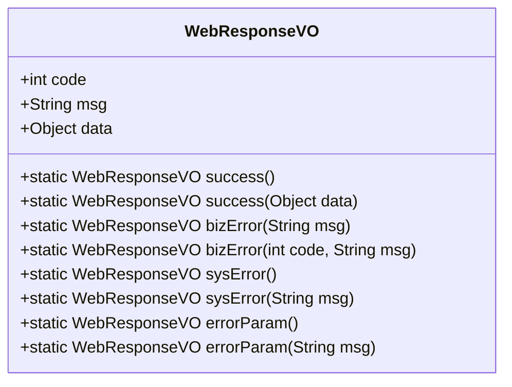
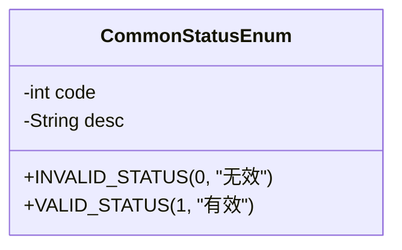
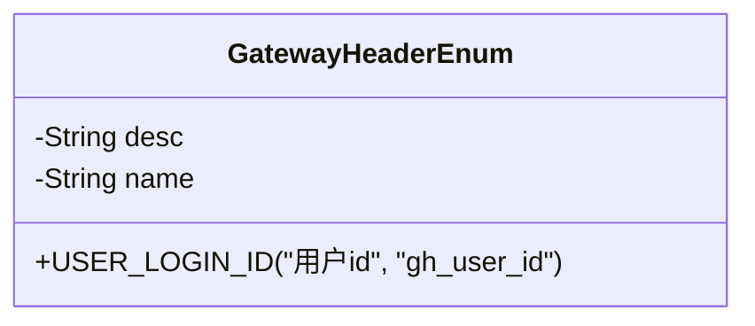
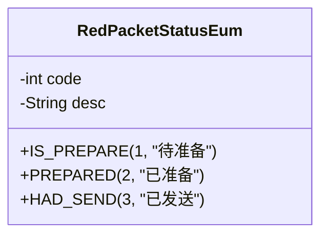
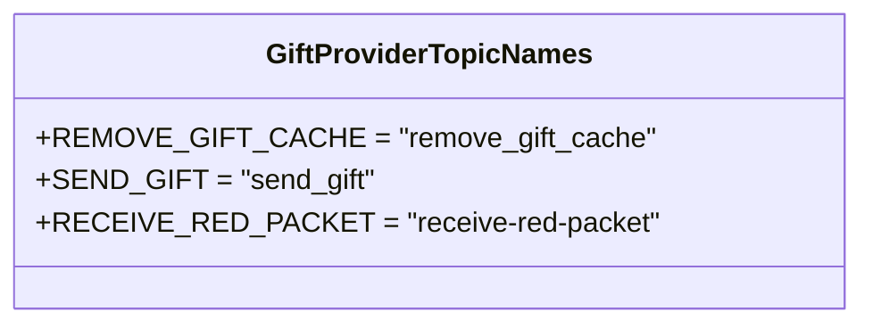
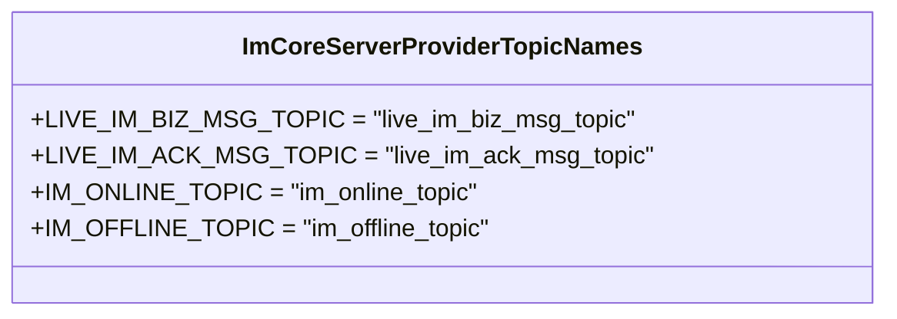
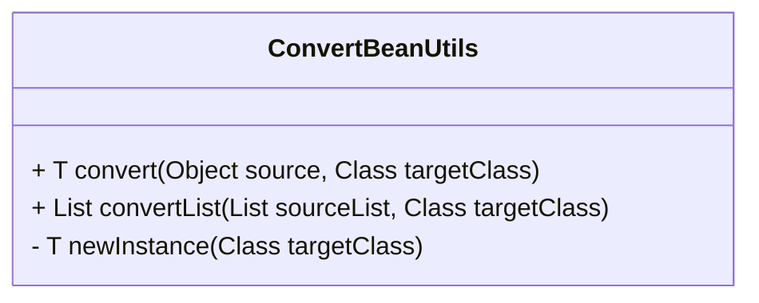
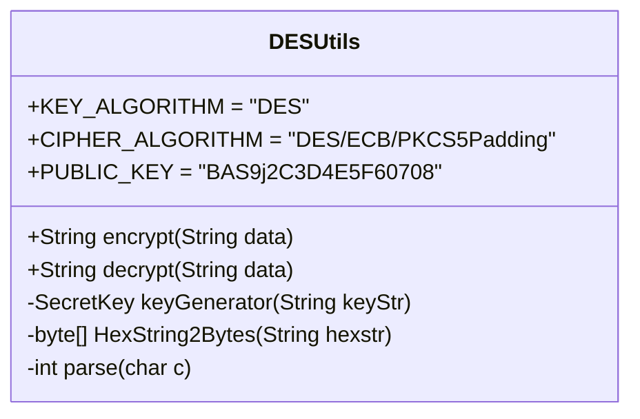
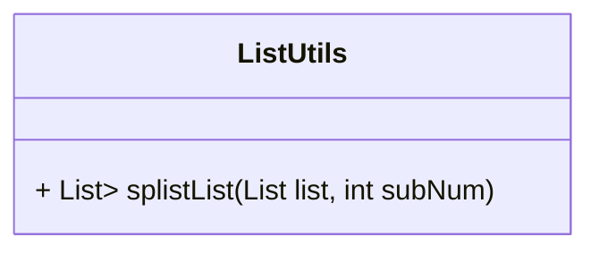
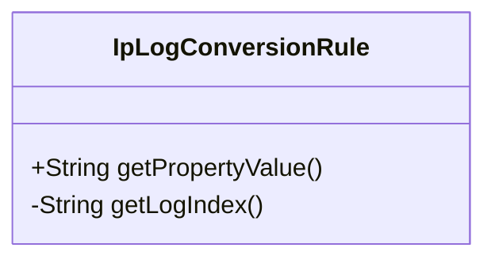

# 公共接口与工具模块

<cite>
**本文档引用文件**  
- [WebResponseVO.java](file://live-common-interface/src/main/java/com/logilong/live/common/interfaces/vo/WebResponseVO.java)
- [PageWrapper.java](file://live-common-interface/src/main/java/com/logilong/live/common/interfaces/dto/PageWrapper.java)
- [CommonStatusEnum.java](file://live-common-interface/src/main/java/com/logilong/live/common/interfaces/enums/CommonStatusEnum.java)
- [GatewayHeaderEnum.java](file://live-common-interface/src/main/java/com/logilong/live/common/interfaces/enums/GatewayHeaderEnum.java)
- [GiftProviderTopicNames.java](file://live-common-interface/src/main/java/com/logilong/live/common/interfaces/topic/GiftProviderTopicNames.java)
- [ImCoreServerProviderTopicNames.java](file://live-common-interface/src/main/java/com/logilong/live/common/interfaces/topic/ImCoreServerProviderTopicNames.java)
- [LivingProviderTopicNames.java](file://live-common-interface/src/main/java/com/logilong/live/common/interfaces/topic/LivingProviderTopicNames.java)
- [SkuProviderTopicNames.java](file://live-common-interface/src/main/java/com/logilong/live/common/interfaces/topic/SkuProviderTopicNames.java)
- [UserProviderTopicNames.java](file://live-common-interface/src/main/java/com/logilong/live/common/interfaces/topic/UserProviderTopicNames.java)
- [ConvertBeanUtils.java](file://live-common-interface/src/main/java/com/logilong/live/common/interfaces/utils/ConvertBeanUtils.java)
- [DESUtils.java](file://live-common-interface/src/main/java/com/logilong/live/common/interfaces/utils/DESUtils.java)
- [ListUtils.java](file://live-common-interface/src/main/java/com/logilong/live/common/interfaces/utils/ListUtils.java)
- [IpLogConversionRule.java](file://live-common-interface/src/main/java/com/logilong/live/common/interfaces/utils/IpLogConversionRule.java)
- [SendGiftMq.java](file://live-common-interface/src/main/java/com/logilong/live/common/interfaces/dto/SendGiftMq.java)
- [RedPacketStatusEum.java](file://live-common-interface/src/main/java/com/logilong/live/common/interfaces/enums/RedPacketStatusEum.java)
</cite>

## 目录
1. [引言](#引言)
2. [核心组成与复用价值](#核心组成与复用价值)
3. [统一API响应封装](#统一api响应封装)
4. [分页查询通用结构](#分页查询通用结构)
5. [枚举类标准化管理](#枚举类标准化管理)
6. [消息主题常量定义](#消息主题常量定义)
7. [核心工具类详解](#核心工具类详解)
8. [模块引用方式](#模块引用方式)

## 引言
`common-interface`模块作为整个直播平台的基础公共接口与工具库，为各业务模块提供了统一的数据结构、常量定义和通用工具方法。该模块的设计目标是实现跨服务的标准化、减少重复代码、提升开发效率和系统稳定性。通过集中管理通用组件，确保了整个微服务架构中数据格式、状态码、消息主题等关键元素的一致性。

## 核心组成与复用价值
`common-interface`模块主要由以下核心组件构成：
- **统一响应对象**：`WebResponseVO` 提供标准化的API返回格式
- **分页数据结构**：`PageWrapper` 作为分页查询的通用包装类
- **枚举常量管理**：`CommonStatusEnum`、`GatewayHeaderEnum` 等实现状态码和网关头信息的标准化
- **消息主题定义**：各类`TopicNames`常量类统一RocketMQ消息主题
- **通用工具类**：`ConvertBeanUtils`、`DESUtils`、`ListUtils` 等提供常用功能支持

该模块的复用价值体现在：
1. **一致性保障**：所有服务使用相同的响应格式和状态码，便于前端统一处理
2. **减少硬编码**：通过常量类管理消息主题、枚举值等，避免散落在各处的字符串
3. **开发效率提升**：提供成熟的工具方法，避免重复造轮子
4. **维护成本降低**：集中修改即可影响所有引用模块，便于全局调整

**Section sources**
- [WebResponseVO.java](file://live-common-interface/src/main/java/com/logilong/live/common/interfaces/vo/WebResponseVO.java)
- [PageWrapper.java](file://live-common-interface/src/main/java/com/logilong/live/common/interfaces/dto/PageWrapper.java)
- [CommonStatusEnum.java](file://live-common-interface/src/main/java/com/logilong/live/common/interfaces/enums/CommonStatusEnum.java)
- [GatewayHeaderEnum.java](file://live-common-interface/src/main/java/com/logilong/live/common/interfaces/enums/GatewayHeaderEnum.java)
- [GiftProviderTopicNames.java](file://live-common-interface/src/main/java/com/logilong/live/common/interfaces/topic/GiftProviderTopicNames.java)
- [ConvertBeanUtils.java](file://live-common-interface/src/main/java/com/logilong/live/common/interfaces/utils/ConvertBeanUtils.java)

## 统一API响应封装
`WebResponseVO`类作为统一的API响应封装，通过静态工厂方法确保各服务返回格式的一致性。

### 响应结构


**Diagram sources**
- [WebResponseVO.java](file://live-common-interface/src/main/java/com/logilong/live/common/interfaces/vo/WebResponseVO.java)

### 静态工厂方法
| 方法名 | 状态码 | 用途 |
|-------|-------|------|
| `success()` | 200 | 成功响应，无数据 |
| `success(Object data)` | 200 | 成功响应，包含数据 |
| `bizError(String msg)` | 501 | 业务错误，自定义消息 |
| `bizError(int code, String msg)` | 自定义 | 业务错误，自定义状态码和消息 |
| `sysError()` | 500 | 系统错误，无消息 |
| `sysError(String msg)` | 500 | 系统错误，自定义消息 |
| `errorParam()` | 400 | 参数错误，固定消息 |
| `errorParam(String msg)` | 400 | 参数错误，自定义消息 |

**Section sources**
- [WebResponseVO.java](file://live-common-interface/src/main/java/com/logilong/live/common/interfaces/vo/WebResponseVO.java)

## 分页查询通用结构
`PageWrapper`类作为分页查询的通用数据结构，提供了一致的分页响应格式。

### 结构定义
```mermaid
classDiagram
class PageWrapper<T> {
+List<T> list
+boolean hasNext
}
```

**Diagram sources**
- [PageWrapper.java](file://live-common-interface/src/main/java/com/logilong/live/common/interfaces/dto/PageWrapper.java)

### 使用说明
- `list`：当前页的数据列表
- `hasNext`：是否还有下一页，用于前端判断是否继续加载
- 泛型支持：可包装任意类型的数据列表，如`PageWrapper<LivingRoomRespDTO>`

该结构被广泛应用于需要分页查询的接口，如直播间列表、商品列表等，确保了分页响应的一致性。

**Section sources**
- [PageWrapper.java](file://live-common-interface/src/main/java/com/logilong/live/common/interfaces/dto/PageWrapper.java)

## 枚举类标准化管理
枚举类在状态码和网关头信息管理中发挥着重要作用，实现了标准化和类型安全。

### 状态码枚举
`CommonStatusEnum`定义了通用的状态标识：



**Diagram sources**
- [CommonStatusEnum.java](file://live-common-interface/src/main/java/com/logilong/live/common/interfaces/enums/CommonStatusEnum.java)

### 网关头信息枚举
`GatewayHeaderEnum`定义了网关服务传递给下游的header信息：



**Diagram sources**
- [GatewayHeaderEnum.java](file://live-common-interface/src/main/java/com/logilong/live/common/interfaces/enums/GatewayHeaderEnum.java)

### 红包状态枚举
`RedPacketStatusEum`定义了红包的生命周期状态：



**Diagram sources**
- [RedPacketStatusEum.java](file://live-common-interface/src/main/java/com/logilong/live/common/interfaces/enums/RedPacketStatusEum.java)

这些枚举类的使用避免了魔法值的散落，提高了代码的可读性和可维护性。

**Section sources**
- [CommonStatusEnum.java](file://live-common-interface/src/main/java/com/logilong/live/common/interfaces/enums/CommonStatusEnum.java)
- [GatewayHeaderEnum.java](file://live-common-interface/src/main/java/com/logilong/live/common/interfaces/enums/GatewayHeaderEnum.java)
- [RedPacketStatusEum.java](file://live-common-interface/src/main/java/com/logilong/live/common/interfaces/enums/RedPacketStatusEum.java)

## 消息主题常量定义
主题名称常量类统一了RocketMQ消息主题的定义，避免了硬编码问题。

### 礼物服务主题
`GiftProviderTopicNames`定义了礼物相关的消息主题：



**Diagram sources**
- [GiftProviderTopicNames.java](file://live-common-interface/src/main/java/com/logilong/live/common/interfaces/topic/GiftProviderTopicNames.java)

### IM核心服务主题
`ImCoreServerProviderTopicNames`定义了IM服务相关的消息主题：



**Diagram sources**
- [ImCoreServerProviderTopicNames.java](file://live-common-interface/src/main/java/com/logilong/live/common/interfaces/topic/ImCoreServerProviderTopicNames.java)

### 其他服务主题
- `LivingProviderTopicNames`：直播间服务主题（如`start_living_room`）
- `SkuProviderTopicNames`：商品服务主题（如`roll_back_stock`）
- `UserProviderTopicNames`：用户服务主题（如`UserCacheAsyncDelete`）

这些常量类的集中管理确保了消息主题的统一性，便于消息的生产和消费。

**Section sources**
- [GiftProviderTopicNames.java](file://live-common-interface/src/main/java/com/logilong/live/common/interfaces/topic/GiftProviderTopicNames.java)
- [ImCoreServerProviderTopicNames.java](file://live-common-interface/src/main/java/com/logilong/live/common/interfaces/topic/ImCoreServerProviderTopicNames.java)
- [LivingProviderTopicNames.java](file://live-common-interface/src/main/java/com/logilong/live/common/interfaces/topic/LivingProviderTopicNames.java)
- [SkuProviderTopicNames.java](file://live-common-interface/src/main/java/com/logilong/live/common/interfaces/topic/SkuProviderTopicNames.java)
- [UserProviderTopicNames.java](file://live-common-interface/src/main/java/com/logilong/live/common/interfaces/topic/UserProviderTopicNames.java)

## 核心工具类详解
`common-interface`模块提供了多个实用的工具类，支持各种常见操作。

### Bean转换工具
`ConvertBeanUtils`提供对象和列表的转换功能：



**Diagram sources**
- [ConvertBeanUtils.java](file://live-common-interface/src/main/java/com/logilong/live/common/interfaces/utils/ConvertBeanUtils.java)

**使用场景**：
- DTO与PO之间的转换
- 接口参数与内部模型的转换
- 列表批量转换

### 加解密工具
`DESUtils`提供基于DES算法的加解密实现：



**Diagram sources**
- [DESUtils.java](file://live-common-interface/src/main/java/com/logilong/live/common/interfaces/utils/DESUtils.java)

**使用场景**：
- 敏感信息（如手机号）的加密存储
- 数据传输的安全保护
- 主要用于用户手机号等隐私数据的处理

### 集合分割工具
`ListUtils`提供列表分割功能，避免Redis缓冲区堵塞：



**Diagram sources**
- [ListUtils.java](file://live-common-interface/src/main/java/com/logilong/live/common/interfaces/utils/ListUtils.java)

**使用场景**：
- 大量数据批量写入Redis时的分批处理
- 避免单次操作数据量过大导致的性能问题
- 通常用于缓存批量更新场景

### 日志转换规则
`IpLogConversionRule`保证Docker容器日志目录的唯一性：



**Diagram sources**
- [IpLogConversionRule.java](file://live-common-interface/src/main/java/com/logilong/live/common/interfaces/utils/IpLogConversionRule.java)

**使用场景**：
- Logback配置中确保每个容器有独立的日志目录
- 基于IP地址或随机数生成唯一标识

**Section sources**
- [ConvertBeanUtils.java](file://live-common-interface/src/main/java/com/logilong/live/common/interfaces/utils/ConvertBeanUtils.java)
- [DESUtils.java](file://live-common-interface/src/main/java/com/logilong/live/common/interfaces/utils/DESUtils.java)
- [ListUtils.java](file://live-common-interface/src/main/java/com/logilong/live/common/interfaces/utils/ListUtils.java)
- [IpLogConversionRule.java](file://live-common-interface/src/main/java/com/logilong/live/common/interfaces/utils/IpLogConversionRule.java)

## 模块引用方式
在各业务模块中引用`common-interface`的正确方式如下：

### Maven依赖配置
```xml
<dependency>
    <groupId>com.logilong.live</groupId>
    <artifactId>live-common-interface</artifactId>
    <version>1.0.0</version>
</dependency>
```

### 使用最佳实践
1. **统一响应**：所有Controller返回值应使用`WebResponseVO`封装
2. **分页查询**：涉及分页的接口应返回`PageWrapper<T>`类型
3. **状态管理**：使用枚举类而非魔法值进行状态判断
4. **消息通信**：生产或消费RocketMQ消息时使用对应的`TopicNames`常量
5. **工具调用**：优先使用`common-interface`提供的工具类，避免重复实现

通过遵循这些实践，可以确保整个系统的一致性和可维护性。

**Section sources**
- [pom.xml](file://live-common-interface/pom.xml)
- [WebResponseVO.java](file://live-common-interface/src/main/java/com/logilong/live/common/interfaces/vo/WebResponseVO.java)
- [PageWrapper.java](file://live-common-interface/src/main/java/com/logilong/live/common/interfaces/dto/PageWrapper.java)