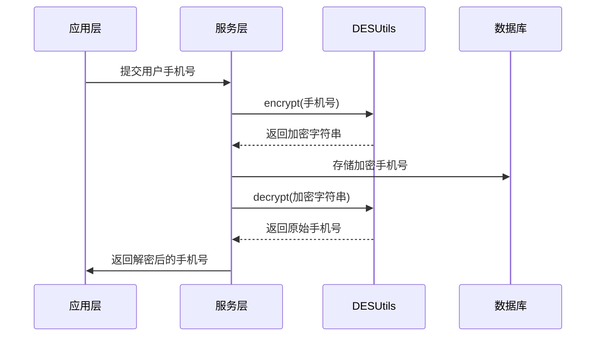
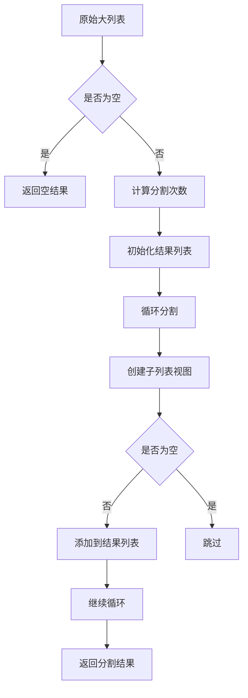

# 工具类库

<cite>
**本文档中引用的文件**  
- [ConvertBeanUtils.java](file://live-common-interface/src/main/java/com/logilong/live/common/interfaces/utils/ConvertBeanUtils.java)
- [DESUtils.java](file://live-common-interface/src/main/java/com/logilong/live/common/interfaces/utils/DESUtils.java)
- [ListUtils.java](file://live-common-interface/src/main/java/com/logilong/live/common/interfaces/utils/ListUtils.java)
- [IpLogConversionRule.java](file://live-common-interface/src/main/java/com/logilong/live/common/interfaces/utils/IpLogConversionRule.java)
- [GiftServiceImpl.java](file://live-api/src/main/java/com/logilong/live/api/service/impl/GiftServiceImpl.java)
- [SmsServiceImpl.java](file://live-msg-provider/src/main/java/com/logilong/live/msg/provider/service/impl/SmsServiceImpl.java)
- [RedPacketConfigServiceImpl.java](file://live-gift-provider/src/main/java/com/logilong/live/gift/provider/service/impl/RedPacketConfigServiceImpl.java)
- [UserPhoneServiceImpl.java](file://live-user-provider/src/main/java/com/logilong/live/user/provider/service/impl/UserPhoneServiceImpl.java)
</cite>

## 目录
1. [引言](#引言)
2. [对象转换工具类](#对象转换工具类)
3. [对称加密解密工具类](#对称加密解密工具类)
4. [列表分批处理工具类](#列表分批处理工具类)
5. [日志IP脱敏规则](#日志ip脱敏规则)
6. [线程安全性与性能考量](#线程安全性与性能考量)
7. [异常处理机制](#异常处理机制)
8. [总结](#总结)

## 引言
本系统化文档详细阐述了公共工具类库的设计与使用，涵盖对象转换、数据加密、批量处理和日志脱敏等核心功能。这些工具类位于`live-common-interface`模块中，为整个微服务架构提供基础支持能力，确保各服务间的数据一致性、安全性和处理效率。

## 对象转换工具类

`ConvertBeanUtils`是基于Spring框架`BeanUtils`封装的通用对象转换工具类，解决了Java泛型擦除导致的List类型转换问题，支持单个对象及集合的批量转换。

该工具类提供了两个核心方法：`convert`用于单个对象之间的属性拷贝，`convertList`则实现了List到List的批量转换。通过反射机制创建目标类型实例，并利用Spring的`BeanUtils.copyProperties`方法完成同名属性的自动映射，极大简化了DO、DTO、VO等不同层次对象间的转换逻辑。

在实际应用中，该工具被广泛用于服务层与接口层之间的数据传输对象转换，如将数据库实体转换为接口返回对象，或在RPC调用中进行参数封装。

**Section sources**
- [ConvertBeanUtils.java](file://live-common-interface/src/main/java/com/logilong/live/common/interfaces/utils/ConvertBeanUtils.java#L1-L55)
- [GiftServiceImpl.java](file://live-api/src/main/java/com/logilong/live/api/service/impl/GiftServiceImpl.java#L45)

## 对称加密解密工具类

`DESUtils`提供了基于DES算法的对称加密解密功能，主要用于敏感数据（如手机号）在传输和存储过程中的安全保护。

该工具采用DES/ECB/PKCS5Padding加密模式，使用预定义的公共密钥`BAS9j2C3D4E5F60708`进行加解密操作。加密流程包括：通过密钥字符串生成DESKeySpec，利用SecretKeyFactory创建SecretKey，初始化Cipher对象执行加密，并将结果进行Base64编码。解密过程则相反，先Base64解码再执行Cipher解密。

在系统中，`DESUtils`被用于用户手机号的加密存储和查询。当需要保存用户手机号时，先进行加密；查询时使用加密后的值匹配数据库记录，返回结果前再解密，确保敏感信息的安全性。

**Diagram sources**
- [DESUtils.java](file://live-common-interface/src/main/java/com/logilong/live/common/interfaces/utils/DESUtils.java#L13-L108)
- [UserPhoneServiceImpl.java](file://live-user-provider/src/main/java/com/logilong/live/user/provider/service/impl/UserPhoneServiceImpl.java#L100)

## 列表分批处理工具类

`ListUtils`中的`splistList`方法用于将大数据量的List集合拆分为多个子集合，主要解决Redis批量操作时可能引发的输入输出缓冲区阻塞问题。

该方法接受一个源List和子集合元素数量作为参数，通过计算分割次数，使用`subList`方法创建视图子列表，避免了数据复制的开销。每个子集合包含指定数量的元素（最后一组可能不足），便于后续进行分批处理。

在实际业务场景中，该工具被用于红包金额列表的批量处理。当需要处理大量红包金额数据时，先将其分割成每组100个元素的小列表，然后逐批进行数据库操作或缓存更新，有效控制单次操作的数据量，提升系统稳定性和响应性能。

**Diagram sources**
- [ListUtils.java](file://live-common-interface/src/main/java/com/logilong/live/common/interfaces/utils/ListUtils.java#L9-L34)
- [RedPacketConfigServiceImpl.java](file://live-gift-provider/src/main/java/com/logilong/live/gift/provider/service/impl/RedPacketConfigServiceImpl.java#L110)

## 日志IP脱敏规则

`IpLogConversionRule`是Logback日志框架的自定义属性定义器，用于实现IP地址脱敏输出，保证每个Docker容器的日志挂载目录唯一性。

该类继承自`PropertyDefinerBase`，重写`getPropertyValue`方法以获取当前主机IP地址。通过`InetAddress.getLocalHost().getHostAddress()`获取本机IP，若获取失败则生成随机数作为替代值。这一机制确保了在容器化部署环境下，不同实例能够生成唯一的日志路径标识，避免日志文件冲突。

此规则在日志配置中被引用，作为日志文件路径的动态变量，实现了基于IP地址的日志分离策略，便于分布式环境下的日志追踪与管理。

**Section sources**
- [IpLogConversionRule.java](file://live-common-interface/src/main/java/com/logilong/live/common/interfaces/utils/IpLogConversionRule.java#L1-L27)

## 线程安全性与性能考量

所有工具类均设计为无状态的静态工具方法，天然具备线程安全性。`ConvertBeanUtils`、`DESUtils`、`ListUtils`和`IpLogConversionRule`不维护任何实例变量，所有操作基于传入参数完成，可在多线程环境下安全使用。

性能方面，`ConvertBeanUtils`在转换List时预先计算目标集合容量，减少动态扩容开销；`ListUtils`的`splistList`方法使用`subList`创建视图而非复制数据，显著降低内存消耗；`DESUtils`的加解密操作虽涉及较多底层调用，但通过Base64编码优化了传输效率。

建议在高并发场景下合理使用对象池或缓存机制，避免频繁的对象创建与销毁，同时注意DES加密的性能开销，对于非敏感数据可考虑其他轻量级方案。

**Section sources**
- [ConvertBeanUtils.java](file://live-common-interface/src/main/java/com/logilong/live/common/interfaces/utils/ConvertBeanUtils.java#L41)
- [ListUtils.java](file://live-common-interface/src/main/java/com/logilong/live/common/interfaces/utils/ListUtils.java#L15)

## 异常处理机制

各工具类均实现了完善的异常处理策略。`ConvertBeanUtils`在对象实例化失败时抛出`BeanInstantiationException`，确保类型转换过程中的错误能够被及时捕获；`DESUtils`将底层加密异常统一包装为运行时异常，简化调用方的异常处理逻辑；`ListUtils`通过空值检查避免空指针异常；`IpLogConversionRule`在IP获取失败时提供随机数兜底方案，保证系统稳定性。

调用这些工具类时，建议捕获相应的异常类型，并根据业务场景进行重试、降级或记录日志等处理，确保系统的健壮性和可维护性。

**Section sources**
- [ConvertBeanUtils.java](file://live-common-interface/src/main/java/com/logilong/live/common/interfaces/utils/ConvertBeanUtils.java#L48-L53)
- [DESUtils.java](file://live-common-interface/src/main/java/com/logilong/live/common/interfaces/utils/DESUtils.java#L75-L77)

## 总结
本文档系统化地介绍了公共工具类库的核心组件及其应用。`ConvertBeanUtils`解决了对象转换的通用性问题，`DESUtils`保障了敏感数据的安全，`ListUtils`优化了大数据量处理性能，`IpLogConversionRule`实现了日志的精细化管理。这些工具类共同构成了系统的基础支撑体系，提升了开发效率和系统可靠性。