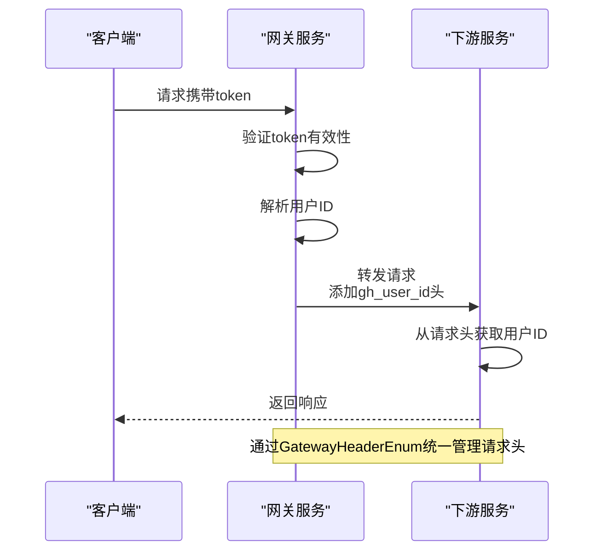
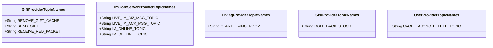

# 常量与枚举定义

<cite>
**本文档引用的文件**  
- [CommonStatusEnum.java](file://live-common-interface/src/main/java/com/logilong/live/common/interfaces/enums/CommonStatusEnum.java)
- [GatewayHeaderEnum.java](file://live-common-interface/src/main/java/com/logilong/live/common/interfaces/enums/GatewayHeaderEnum.java)
- [RedPacketStatusEum.java](file://live-common-interface/src/main/java/com/logilong/live/common/interfaces/enums/RedPacketStatusEum.java)
- [GiftProviderTopicNames.java](file://live-common-interface/src/main/java/com/logilong/live/common/interfaces/topic/GiftProviderTopicNames.java)
- [ImCoreServerProviderTopicNames.java](file://live-common-interface/src/main/java/com/logilong/live/common/interfaces/topic/ImCoreServerProviderTopicNames.java)
- [LivingProviderTopicNames.java](file://live-common-interface/src/main/java/com/logilong/live/common/interfaces/topic/LivingProviderTopicNames.java)
- [SkuProviderTopicNames.java](file://live-common-interface/src/main/java/com/logilong/live/common/interfaces/topic/SkuProviderTopicNames.java)
- [UserProviderTopicNames.java](file://live-common-interface/src/main/java/com/logilong/live/common/interfaces/topic/UserProviderTopicNames.java)
- [GlobalExceptionHandler.java](file://live-framework/live-framework-web-starter/src/main/java/com/logilong/live/web/starter/error/GlobalExceptionHandler.java)
- [AccountCheckFilter.java](file://live-gateway/src/main/java/com/logilong/live/gateway/filter/AccountCheckFilter.java)
- [WebResponseVO.java](file://live-common-interface/src/main/java/com/logilong/live/common/interfaces/vo/WebResponseVO.java)
</cite>

## 目录
1. [系统通用状态码枚举](#系统通用状态码枚举)
2. [网关请求头字段管理](#网关请求头字段管理)
3. [红包状态枚举设计](#红包状态枚举设计)
4. [消息主题常量体系](#消息主题常量体系)
5. [使用规范与最佳实践](#使用规范与最佳实践)

## 系统通用状态码枚举

`CommonStatusEnum` 枚举类定义了系统中通用的状态码体系，用于统一标识数据的有效性状态。该枚举位于 `live-common-interface` 模块中，确保所有服务都能使用一致的状态码标准。

该枚举包含两个核心状态：
- `INVALID_STATUS`：表示无效状态，状态码为 0，描述为"无效"
- `VALID_STATUS`：表示有效状态，状态码为 1，描述为"有效"

在全局异常处理机制中，这些状态码通过 `WebResponseVO` 类进行封装返回。当业务逻辑需要返回状态信息时，可以通过枚举的 `code` 和 `desc` 属性获取对应的数值和描述，确保前后端交互的一致性。

**Section sources**
- [CommonStatusEnum.java](file://live-common-interface/src/main/java/com/logilong/live/common/interfaces/enums/CommonStatusEnum.java#L1-L17)
- [WebResponseVO.java](file://live-common-interface/src/main/java/com/logilong/live/common/interfaces/vo/WebResponseVO.java#L1-L72)

## 网关请求头字段管理

`GatewayHeaderEnum` 枚举类用于统一管理网关服务向下游服务传递的请求头字段，确保跨服务调用时上下文信息的一致性和可维护性。

该枚举目前定义了用户登录 ID 的传递规范：
- `USER_LOGIN_ID`：对应请求头名称为 "gh_user_id"，描述为"用户id"

在网关过滤器 `AccountCheckFilter` 中，当验证用户 token 合法后，会从 token 中解析出用户 ID，并通过 `GatewayHeaderEnum.USER_LOGIN_ID.getName()` 获取标准的请求头名称，将用户 ID 添加到请求头中传递给下游服务。这种设计避免了在代码中硬编码请求头名称，提高了系统的可维护性和一致性。

**Diagram sources**
- [GatewayHeaderEnum.java](file://live-common-interface/src/main/java/com/logilong/live/common/interfaces/enums/GatewayHeaderEnum.java#L1-L19)
- [AccountCheckFilter.java](file://live-gateway/src/main/java/com/logilong/live/gateway/filter/AccountCheckFilter.java#L1-L100)

**Section sources**
- [GatewayHeaderEnum.java](file://live-common-interface/src/main/java/com/logilong/live/common/interfaces/enums/GatewayHeaderEnum.java#L1-L19)
- [AccountCheckFilter.java](file://live-gateway/src/main/java/com/logilong/live/gateway/filter/AccountCheckFilter.java#L1-L100)

## 红包状态枚举设计

`RedPacketStatusEum` 枚举类定义了红包功能的核心状态流转，描述了红包从准备到发送的完整生命周期。

该枚举包含三个状态：
- `IS_PREPARE`：状态码 1，表示"待准备"，红包创建后但尚未准备就绪
- `PREPARED`：状态码 2，表示"已准备"，红包已准备好可以发送
- `HAD_SEND`：状态码 3，表示"已发送"，红包已经成功发送

这种状态设计支持红包功能的业务流程控制，确保状态转换的有序性。每个状态都有明确的数值编码和中文描述，便于数据库存储和前端展示。通过统一的枚举管理，避免了在不同服务中使用不一致的状态值，保证了系统的一致性。

**Section sources**
- [RedPacketStatusEum.java](file://live-common-interface/src/main/java/com/logilong/live/common/interfaces/enums/RedPacketStatusEum.java#L1-L18)

## 消息主题常量体系

各 `ProviderTopicNames` 常量类集中定义了 RocketMQ 消息主题名称，有效避免了硬编码问题，提升了系统的可维护性。这些常量类位于 `live-common-interface` 模块中，确保生产者和消费者使用相同的消息主题。

### 消息主题常量类概览

**Diagram sources**
- [GiftProviderTopicNames.java](file://live-common-interface/src/main/java/com/logilong/live/common/interfaces/topic/GiftProviderTopicNames.java#L1-L20)
- [ImCoreServerProviderTopicNames.java](file://live-common-interface/src/main/java/com/logilong/live/common/interfaces/topic/ImCoreServerProviderTopicNames.java#L1-L24)
- [LivingProviderTopicNames.java](file://live-common-interface/src/main/java/com/logilong/live/common/interfaces/topic/LivingProviderTopicNames.java#L1-L10)
- [SkuProviderTopicNames.java](file://live-common-interface/src/main/java/com/logilong/live/common/interfaces/topic/SkuProviderTopicNames.java#L1-L10)
- [UserProviderTopicNames.java](file://live-common-interface/src/main/java/com/logilong/live/common/interfaces/topic/UserProviderTopicNames.java#L1-L10)

#### 礼物服务主题

`GiftProviderTopicNames` 定义了礼物相关的核心消息主题：
- `REMOVE_GIFT_CACHE`：用于移除礼物信息缓存
- `SEND_GIFT`：用于发送礼物消息
- `RECEIVE_RED_PACKET`：用于用户红包雨抢红包消息

#### 即时通讯服务主题

`ImCoreServerProviderTopicNames` 管理即时通讯服务的消息主题：
- `LIVE_IM_BIZ_MSG_TOPIC`：接收 IM 系统发送的业务消息
- `LIVE_IM_ACK_MSG_TOPIC`：发送 IM 的 ACK 消息
- `IM_ONLINE_TOPIC`：用户初次登录 IM 服务时发送
- `IM_OFFLINE_TOPIC`：用户断开 IM 服务时发送

#### 其他服务主题

其他服务也定义了各自专用的消息主题，如直播间开启、库存回滚、用户缓存删除等，确保各服务间消息通信的清晰和规范。

**Section sources**
- [GiftProviderTopicNames.java](file://live-common-interface/src/main/java/com/logilong/live/common/interfaces/topic/GiftProviderTopicNames.java#L1-L20)
- [ImCoreServerProviderTopicNames.java](file://live-common-interface/src/main/java/com/logilong/live/common/interfaces/topic/ImCoreServerProviderTopicNames.java#L1-L24)
- [LivingProviderTopicNames.java](file://live-common-interface/src/main/java/com/logilong/live/common/interfaces/topic/LivingProviderTopicNames.java#L1-L10)
- [SkuProviderTopicNames.java](file://live-common-interface/src/main/java/com/logilong/live/common/interfaces/topic/SkuProviderTopicNames.java#L1-L10)
- [UserProviderTopicNames.java](file://live-common-interface/src/main/java/com/logilong/live/common/interfaces/topic/UserProviderTopicNames.java#L1-L10)

## 使用规范与最佳实践

### 生产者和消费者中的引用方式

在生产者和消费者代码中引用这些枚举和常量的标准方式如下：

1. **导入常量类**：在需要使用消息主题的类中导入对应的 `ProviderTopicNames` 类
2. **直接引用常量**：通过类名.常量名的方式引用，如 `GiftProviderTopicNames.SEND_GIFT`
3. **状态码使用**：在业务逻辑中使用枚举实例，通过 `enumInstance.getCode()` 获取状态码

### 新增枚举项的规范流程

当需要新增枚举项时，应遵循以下规范流程：

1. **评估必要性**：确认新增状态或常量是否确实需要，避免过度设计
2. **统一命名**：遵循现有的命名规范，使用大写下划线分隔的命名方式
3. **添加文档**：为新增项添加清晰的 JavaDoc 注释，说明其用途和使用场景
4. **更新依赖**：通知所有相关服务团队，确保生产者和消费者同步更新
5. **测试验证**：在测试环境中验证新增项的功能，确保不影响现有业务

通过这种集中化的常量与枚举管理体系，系统实现了配置的统一管理，降低了维护成本，提高了代码的可读性和可维护性。

**Section sources**
- [CommonStatusEnum.java](file://live-common-interface/src/main/java/com/logilong/live/common/interfaces/enums/CommonStatusEnum.java#L1-L17)
- [GatewayHeaderEnum.java](file://live-common-interface/src/main/java/com/logilong/live/common/interfaces/enums/GatewayHeaderEnum.java#L1-L19)
- [RedPacketStatusEum.java](file://live-common-interface/src/main/java/com/logilong/live/common/interfaces/enums/RedPacketStatusEum.java#L1-L18)
- [GiftProviderTopicNames.java](file://live-common-interface/src/main/java/com/logilong/live/common/interfaces/topic/GiftProviderTopicNames.java#L1-L20)