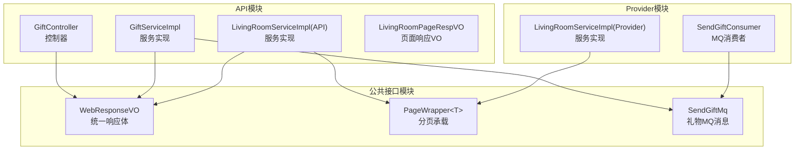
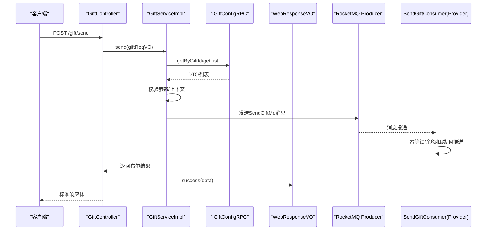
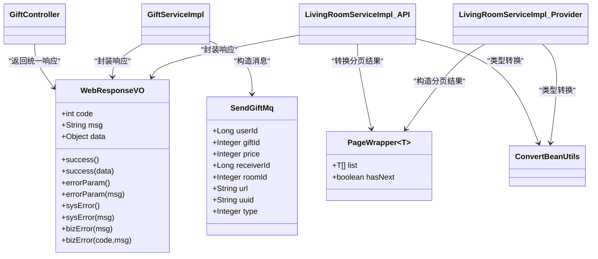

# 通用数据结构

<cite>
**本文引用的文件**
- [WebResponseVO.java](file://live-common-interface/src/main/java/com/logilong/live/common/interfaces/vo/WebResponseVO.java)
- [PageWrapper.java](file://live-common-interface/src/main/java/com/logilong/live/common/interfaces/dto/PageWrapper.java)
- [SendGiftMq.java](file://live-common-interface/src/main/java/com/logilong/live/common/interfaces/dto/SendGiftMq.java)
- [GiftController.java](file://live-api/src/main/java/com/logilong/live/api/controller/GiftController.java)
- [GiftServiceImpl.java](file://live-api/src/main/java/com/logilong/live/api/service/impl/GiftServiceImpl.java)
- [LivingRoomServiceImpl.java（API层）](file://live-api/src/main/java/com/logilong/live/api/service/impl/LivingRoomServiceImpl.java)
- [LivingRoomServiceImpl.java（Provider层）](file://live-living-provider/src/main/java/com/logilong/live/living/provider/service/impl/LivingRoomServiceImpl.java)
- [LivingRoomPageRespVO.java](file://live-api/src/main/java/com/logilong/live/api/vo/resp/LivingRoomPageRespVO.java)
- [SendGiftConsumer.java](file://live-gift-provider/src/main/java/com/logilong/live/gift/provider/consumer/SendGiftConsumer.java)
- [ConvertBeanUtils.java](file://live-common-interface/src/main/java/com/logilong/live/common/interfaces/utils/ConvertBeanUtils.java)
</cite>

## 目录
1. [引言](#引言)
2. [项目结构](#项目结构)
3. [核心组件](#核心组件)
4. [架构总览](#架构总览)
5. [详细组件分析](#详细组件分析)
6. [依赖关系分析](#依赖关系分析)
7. [性能考量](#性能考量)
8. [故障排查指南](#故障排查指南)
9. [结论](#结论)
10. [附录](#附录)

## 引言
本文件聚焦于公共接口模块中的通用数据结构设计，围绕以下三类核心类型展开：
- 统一API响应体：WebResponseVO
- 分页通用承载：PageWrapper
- 礼物系统MQ消息：SendGiftMq

通过对控制器与服务层的使用方式、序列化规范、泛型支持以及跨模块协作流程进行系统性分析，帮助开发者在各微服务中实现一致、可维护且高性能的返回格式与数据承载。

## 项目结构
公共数据结构位于公共接口模块，供API网关与各业务Provider共享；控制器与服务层在各自模块内使用这些VO/DTO完成对外输出与内部协作。

图表来源
- [WebResponseVO.java](file://live-common-interface/src/main/java/com/logilong/live/common/interfaces/vo/WebResponseVO.java#L1-L71)
- [PageWrapper.java](file://live-common-interface/src/main/java/com/logilong/live/common/interfaces/dto/PageWrapper.java#L1-L16)
- [SendGiftMq.java](file://live-common-interface/src/main/java/com/logilong/live/common/interfaces/dto/SendGiftMq.java#L1-L16)
- [GiftController.java](file://live-api/src/main/java/com/logilong/live/api/controller/GiftController.java#L1-L40)
- [GiftServiceImpl.java](file://live-api/src/main/java/com/logilong/live/api/service/impl/GiftServiceImpl.java#L1-L57)
- [LivingRoomServiceImpl.java（API层）](file://live-api/src/main/java/com/logilong/live/api/service/impl/LivingRoomServiceImpl.java#L1-L160)
- [LivingRoomServiceImpl.java（Provider层）](file://live-living-provider/src/main/java/com/logilong/live/living/provider/service/impl/LivingRoomServiceImpl.java#L140-L166)
- [LivingRoomPageRespVO.java](file://live-api/src/main/java/com/logilong/live/api/vo/resp/LivingRoomPageRespVO.java#L1-L12)
- [SendGiftConsumer.java](file://live-gift-provider/src/main/java/com/logilong/live/gift/provider/consumer/SendGiftConsumer.java#L81-L126)

章节来源
- [WebResponseVO.java](file://live-common-interface/src/main/java/com/logilong/live/common/interfaces/vo/WebResponseVO.java#L1-L71)
- [PageWrapper.java](file://live-common-interface/src/main/java/com/logilong/live/common/interfaces/dto/PageWrapper.java#L1-L16)
- [SendGiftMq.java](file://live-common-interface/src/main/java/com/logilong/live/common/interfaces/dto/SendGiftMq.java#L1-L16)

## 核心组件
- WebResponseVO：统一API响应体，提供success、errorParam、sysError、bizError等静态工厂方法，便于在控制器与服务层快速构造标准响应。
- PageWrapper<T>：泛型分页承载容器，包含列表与“是否存在下一页”的布尔标记，用于跨服务传递分页结果。
- SendGiftMq：礼物系统MQ消息载体，承载送礼相关的用户、房间、礼物与业务标识等关键字段。

章节来源
- [WebResponseVO.java](file://live-common-interface/src/main/java/com/logilong/live/common/interfaces/vo/WebResponseVO.java#L1-L71)
- [PageWrapper.java](file://live-common-interface/src/main/java/com/logilong/live/common/interfaces/dto/PageWrapper.java#L1-L16)
- [SendGiftMq.java](file://live-common-interface/src/main/java/com/logilong/live/common/interfaces/dto/SendGiftMq.java#L1-L16)

## 架构总览
下图展示了控制器、服务层与Provider层之间的数据流，以及通用数据结构在其中的角色。

图表来源
- [GiftController.java](file://live-api/src/main/java/com/logilong/live/api/controller/GiftController.java#L22-L40)
- [GiftServiceImpl.java](file://live-api/src/main/java/com/logilong/live/api/service/impl/GiftServiceImpl.java#L44-L57)
- [SendGiftConsumer.java](file://live-gift-provider/src/main/java/com/logilong/live/gift/provider/consumer/SendGiftConsumer.java#L81-L126)
- [WebResponseVO.java](file://live-common-interface/src/main/java/com/logilong/live/common/interfaces/vo/WebResponseVO.java#L56-L71)

## 详细组件分析

### WebResponseVO：统一API响应体
- 设计要点
  - 字段：code、msg、data，满足前端统一解析与错误码约定。
  - 静态工厂方法：
    - success()：无参成功响应，code=200，msg为“success”。
    - success(Object data)：带数据的成功响应，data字段承载业务数据。
    - errorParam() / errorParam(String msg)：参数错误，code=400。
    - sysError() / sysError(String msg)：系统错误，code=500。
    - bizError(String msg) / bizError(int code, String msg)：业务错误，code默认501或自定义。
- 使用场景
  - 控制器直接返回WebResponseVO，屏蔽底层异常细节，统一输出格式。
  - 服务层在需要向上游抛出统一响应时，也可复用该VO。
- 序列化规范
  - 基于Lombok生成getter/setter，JSON序列化遵循默认规则，字段名与值类型保持稳定。
- 泛型支持
  - data字段为Object类型，可承载任意业务对象；结合服务层转换工具，实现不同层级VO/DTO的无缝映射。

最佳实践示例（路径）
- 控制器返回成功响应：[GiftController.java](file://live-api/src/main/java/com/logilong/live/api/controller/GiftController.java#L22-L40)
- 服务层返回布尔结果并由控制器统一封装：[GiftServiceImpl.java](file://live-api/src/main/java/com/logilong/live/api/service/impl/GiftServiceImpl.java#L44-L57)

章节来源
- [WebResponseVO.java](file://live-common-interface/src/main/java/com/logilong/live/common/interfaces/vo/WebResponseVO.java#L1-L71)
- [GiftController.java](file://live-api/src/main/java/com/logilong/live/api/controller/GiftController.java#L22-L40)
- [GiftServiceImpl.java](file://live-api/src/main/java/com/logilong/live/api/service/impl/GiftServiceImpl.java#L44-L57)

### PageWrapper：分页通用承载
- 设计要点
  - 泛型T：承载任意业务实体类型，提升类型安全与可读性。
  - 字段：list（当前页数据）、hasNext（是否存在下一页）。
  - 序列化：实现Serializable，便于跨进程传输与缓存存储。
- 使用场景
  - Provider层对Redis中的直播房间列表进行分页读取，构造PageWrapper返回给API层。
  - API层将Provider返回的PageWrapper转换为页面响应VO（含List与hasNext），再由控制器统一返回。
- 复杂度与性能
  - 列表分页采用Redis列表切片，时间复杂度近似O(k)，k为pageSize；hasNext基于总长度计算，避免额外查询。
- 序列化规范
  - 通过泛型参数明确承载类型，JSON序列化时字段名与类型保持稳定。

最佳实践示例（路径）
- Provider层构造分页结果：[LivingRoomServiceImpl.java（Provider层）](file://live-living-provider/src/main/java/com/logilong/live/living/provider/service/impl/LivingRoomServiceImpl.java#L149-L166)
- API层转换为页面响应VO：[LivingRoomServiceImpl.java（API层）](file://live-api/src/main/java/com/logilong/live/api/service/impl/LivingRoomServiceImpl.java#L48-L55)
- 页面响应VO定义：[LivingRoomPageRespVO.java](file://live-api/src/main/java/com/logilong/live/api/vo/resp/LivingRoomPageRespVO.java#L1-L12)
- 类型转换工具：[ConvertBeanUtils.java](file://live-common-interface/src/main/java/com/logilong/live/common/interfaces/utils/ConvertBeanUtils.java#L10-L55)

章节来源
- [PageWrapper.java](file://live-common-interface/src/main/java/com/logilong/live/common/interfaces/dto/PageWrapper.java#L1-L16)
- [LivingRoomServiceImpl.java（Provider层）](file://live-living-provider/src/main/java/com/logilong/live/living/provider/service/impl/LivingRoomServiceImpl.java#L149-L166)
- [LivingRoomServiceImpl.java（API层）](file://live-api/src/main/java/com/logilong/live/api/service/impl/LivingRoomServiceImpl.java#L48-L55)
- [LivingRoomPageRespVO.java](file://live-api/src/main/java/com/logilong/live/api/vo/resp/LivingRoomPageRespVO.java#L1-L12)
- [ConvertBeanUtils.java](file://live-common-interface/src/main/java/com/logilong/live/common/interfaces/utils/ConvertBeanUtils.java#L10-L55)

### SendGiftMq：礼物系统MQ消息传输对象
- 设计要点
  - 字段：用户ID、礼物ID、价格、接收者ID、房间ID、礼物URL、唯一UUID、类型等，覆盖送礼主流程所需的关键信息。
  - 用途：服务层将送礼请求转换为MQ消息，Provider侧消费者幂等处理、余额扣减与IM消息推送。
- 序列化规范
  - 作为MQ消息体，字段需具备稳定的序列化与反序列化能力；建议保持字段命名与类型稳定，避免破坏兼容性。
- 幂等与一致性
  - 消费端使用UUID构建Redis键进行“仅一次消费”控制，避免重复扣款与推送。

最佳实践示例（路径）
- 服务层构造并发送MQ消息：[GiftServiceImpl.java](file://live-api/src/main/java/com/logilong/live/api/service/impl/GiftServiceImpl.java#L50-L57)
- Provider侧消费者消费与处理：[SendGiftConsumer.java](file://live-gift-provider/src/main/java/com/logilong/live/gift/provider/consumer/SendGiftConsumer.java#L81-L126)

章节来源
- [SendGiftMq.java](file://live-common-interface/src/main/java/com/logilong/live/common/interfaces/dto/SendGiftMq.java#L1-L16)
- [GiftServiceImpl.java](file://live-api/src/main/java/com/logilong/live/api/service/impl/GiftServiceImpl.java#L50-L57)
- [SendGiftConsumer.java](file://live-gift-provider/src/main/java/com/logilong/live/gift/provider/consumer/SendGiftConsumer.java#L81-L126)

## 依赖关系分析
- 控制器依赖
  - GiftController依赖WebResponseVO进行统一响应封装。
- 服务层依赖
  - GiftServiceImpl依赖SendGiftMq进行消息发送，并依赖WebResponseVO在必要时向上游返回统一响应。
  - LivingRoomServiceImpl(API层)依赖PageWrapper进行分页结果转换，并依赖WebResponseVO进行统一响应封装。
- Provider层依赖
  - LivingRoomServiceImpl(Provider层)依赖PageWrapper进行分页结果构造。
- 工具依赖
  - ConvertBeanUtils负责DTO/VO之间的类型转换，保障跨层数据形态一致。

图表来源
- [WebResponseVO.java](file://live-common-interface/src/main/java/com/logilong/live/common/interfaces/vo/WebResponseVO.java#L1-L71)
- [PageWrapper.java](file://live-common-interface/src/main/java/com/logilong/live/common/interfaces/dto/PageWrapper.java#L1-L16)
- [SendGiftMq.java](file://live-common-interface/src/main/java/com/logilong/live/common/interfaces/dto/SendGiftMq.java#L1-L16)
- [GiftController.java](file://live-api/src/main/java/com/logilong/live/api/controller/GiftController.java#L1-L40)
- [GiftServiceImpl.java](file://live-api/src/main/java/com/logilong/live/api/service/impl/GiftServiceImpl.java#L1-L57)
- [LivingRoomServiceImpl.java（API层）](file://live-api/src/main/java/com/logilong/live/api/service/impl/LivingRoomServiceImpl.java#L1-L160)
- [LivingRoomServiceImpl.java（Provider层）](file://live-living-provider/src/main/java/com/logilong/live/living/provider/service/impl/LivingRoomServiceImpl.java#L140-L166)
- [ConvertBeanUtils.java](file://live-common-interface/src/main/java/com/logilong/live/common/interfaces/utils/ConvertBeanUtils.java#L10-L55)

## 性能考量
- 分页读取
  - Provider层使用Redis列表切片进行分页，hasNext基于总长度计算，避免额外查询，整体复杂度近似O(k)。
- 缓存命中
  - PageWrapper与DTO/VO之间通过ConvertBeanUtils进行批量转换，减少重复映射成本。
- MQ消费幂等
  - SendGiftConsumer使用UUID+Redis键进行“仅一次消费”，降低重复处理风险，提高一致性与吞吐。

[本节为通用性能讨论，不直接分析具体代码文件]

## 故障排查指南
- 统一响应未按预期返回
  - 检查控制器是否直接返回WebResponseVO，而非业务对象。
  - 参考：[GiftController.java](file://live-api/src/main/java/com/logilong/live/api/controller/GiftController.java#L22-L40)
- 分页结果缺失或hasNext异常
  - 确认Provider层是否正确设置list与hasNext；检查Redis中列表长度与切片范围。
  - 参考：[LivingRoomServiceImpl.java（Provider层）](file://live-living-provider/src/main/java/com/logilong/live/living/provider/service/impl/LivingRoomServiceImpl.java#L149-L166)
- MQ消息未被消费或重复消费
  - 检查SendGiftConsumer的幂等键构建与Redis设置逻辑，确认UUID唯一性与过期策略。
  - 参考：[SendGiftConsumer.java](file://live-gift-provider/src/main/java/com/logilong/live/gift/provider/consumer/SendGiftConsumer.java#L81-L126)

章节来源
- [GiftController.java](file://live-api/src/main/java/com/logilong/live/api/controller/GiftController.java#L22-L40)
- [LivingRoomServiceImpl.java（Provider层）](file://live-living-provider/src/main/java/com/logilong/live/living/provider/service/impl/LivingRoomServiceImpl.java#L149-L166)
- [SendGiftConsumer.java](file://live-gift-provider/src/main/java/com/logilong/live/gift/provider/consumer/SendGiftConsumer.java#L81-L126)

## 结论
- WebResponseVO提供了统一的API响应封装，简化了控制器与服务层的返回逻辑，确保前后端交互的一致性。
- PageWrapper通过泛型承载分页数据，配合Provider层的Redis切片策略，实现了高效稳定的分页体验。
- SendGiftMq作为礼物系统的MQ消息载体，串联起服务层与Provider层的消息处理链路，配合幂等控制保障一致性与性能。
- 在实际开发中，应坚持在控制器统一返回WebResponseVO，在服务层通过ConvertBeanUtils进行类型转换，并在Provider层合理使用PageWrapper与Redis分页策略。

[本节为总结性内容，不直接分析具体代码文件]

## 附录
- 最佳实践清单
  - 控制器层：统一使用WebResponseVO.success(data)或WebResponseVO.bizError(...)返回。
  - 服务层：在需要时向上游返回统一响应，避免直接抛出底层异常。
  - 分页场景：Provider层优先使用Redis列表切片与hasNext计算，API层负责DTO/VO转换。
  - MQ场景：严格保证SendGiftMq字段的稳定性与幂等键的唯一性。

[本节为通用指导，不直接分析具体代码文件]