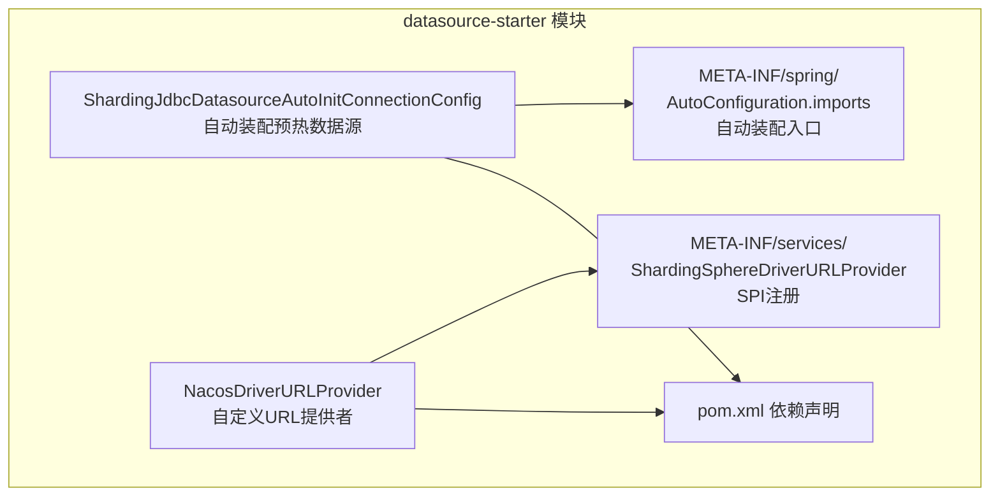
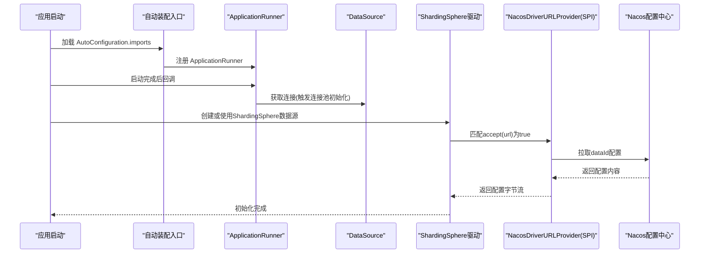
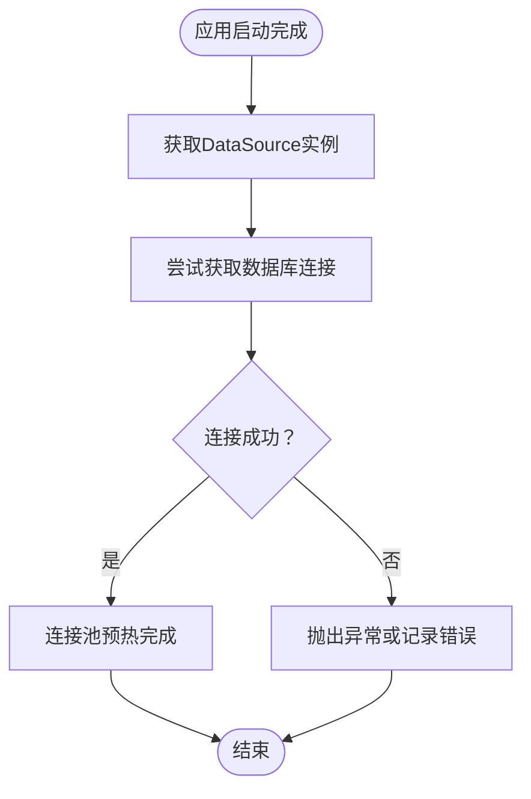
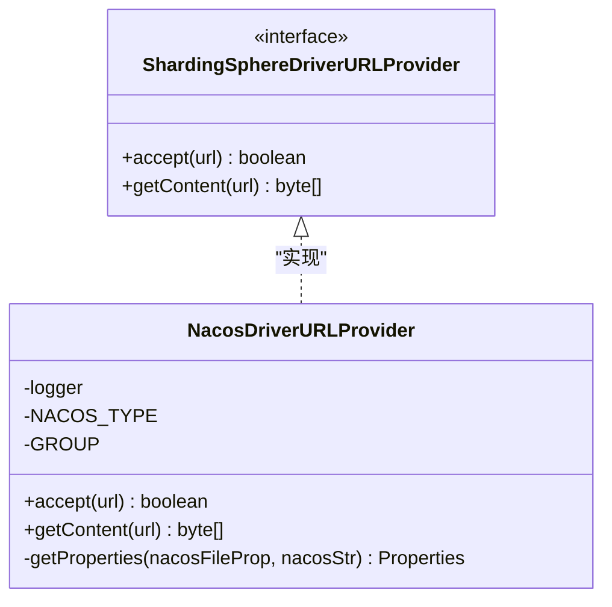
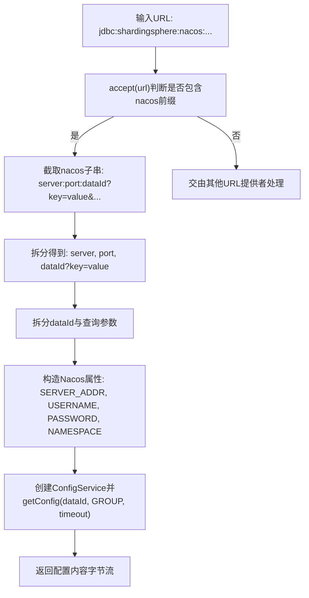
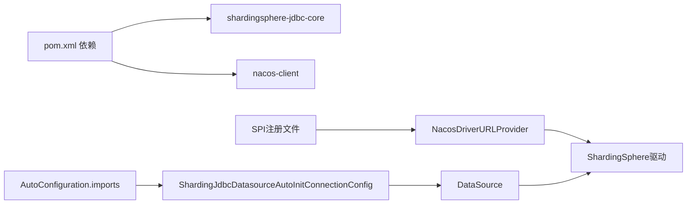

# 数据源Starter组件

<cite>
**本文引用的文件列表**
- [ShardingJdbcDatasourceAutoInitConnectionConfig.java](file://live-framework/live-framework-datasource-starter/src/main/java/com/logilong/live/framework/datasource/starter/config/ShardingJdbcDatasourceAutoInitConnectionConfig.java)
- [NacosDriverURLProvider.java](file://live-framework/live-framework-datasource-starter/src/main/java/com/logilong/live/framework/datasource/starter/config/NacosDriverURLProvider.java)
- [org.apache.shardingsphere.driver.jdbc.core.driver.ShardingSphereDriverURLProvider](file://live-framework/live-framework-datasource-starter/src/main/resources/META-INF/services/org.apache.shardingsphere.driver.jdbc.core.driver.ShardingSphereDriverURLProvider)
- [org.springframework.boot.autoconfigure.AutoConfiguration.imports](file://live-framework/live-framework-datasource-starter/src/main/resources/META-INF/spring/org.springframework.boot.autoconfigure.AutoConfiguration.imports)
- [pom.xml](file://live-framework/live-framework-datasource-starter/pom.xml)
- [bootstrap.yml（支付模块）](file://live-bank-provider/src/main/resources/bootstrap.yml)
- [bootstrap.yml（账户模块）](file://live-account-provider/src/main/resources/bootstrap.yml)
</cite>

## 目录
1. [引言](#引言)
2. [项目结构](#项目结构)
3. [核心组件](#核心组件)
4. [架构总览](#架构总览)
5. [详细组件分析](#详细组件分析)
6. [依赖关系分析](#依赖关系分析)
7. [性能考量](#性能考量)
8. [故障排查指南](#故障排查指南)
9. [结论](#结论)
10. [附录](#附录)

## 引言
本文件系统性解析 live-framework 中的 datasource-starter 组件，重点说明以下三点：
- 如何通过 ApplicationRunner 在应用启动阶段主动获取数据库连接，触发 ShardingSphere 数据源初始化，避免首次请求延迟；
- 如何实现自定义的 ShardingSphere URL 提供者，从 Nacos 配置中心动态拉取数据源配置，支撑分库分表场景；
- 在业务模块中如何正确引入与配置该 Starter，以获得稳定、高性能的数据源能力。

## 项目结构
datasource-starter 是一个 Spring Boot 自动装配模块，位于 live-framework 子模块下，主要包含两类资源：
- Java 配置类：自动装配入口与数据源预热逻辑
- SPI 与 AutoConfiguration 元数据：声明式注册 URL 提供者与自动配置类

图表来源
- [ShardingJdbcDatasourceAutoInitConnectionConfig.java](file://live-framework/live-framework-datasource-starter/src/main/java/com/logilong/live/framework/datasource/starter/config/ShardingJdbcDatasourceAutoInitConnectionConfig.java#L1-L30)
- [NacosDriverURLProvider.java](file://live-framework/live-framework-datasource-starter/src/main/java/com/logilong/live/framework/datasource/starter/config/NacosDriverURLProvider.java#L1-L96)
- [org.apache.shardingsphere.driver.jdbc.core.driver.ShardingSphereDriverURLProvider](file://live-framework/live-framework-datasource-starter/src/main/resources/META-INF/services/org.apache.shardingsphere.driver.jdbc.core.driver.ShardingSphereDriverURLProvider#L1-L1)
- [org.springframework.boot.autoconfigure.AutoConfiguration.imports](file://live-framework/live-framework-datasource-starter/src/main/resources/META-INF/spring/org.springframework.boot.autoconfigure.AutoConfiguration.imports#L1-L1)
- [pom.xml](file://live-framework/live-framework-datasource-starter/pom.xml#L1-L39)

章节来源
- [ShardingJdbcDatasourceAutoInitConnectionConfig.java](file://live-framework/live-framework-datasource-starter/src/main/java/com/logilong/live/framework/datasource/starter/config/ShardingJdbcDatasourceAutoInitConnectionConfig.java#L1-L30)
- [NacosDriverURLProvider.java](file://live-framework/live-framework-datasource-starter/src/main/java/com/logilong/live/framework/datasource/starter/config/NacosDriverURLProvider.java#L1-L96)
- [org.apache.shardingsphere.driver.jdbc.core.driver.ShardingSphereDriverURLProvider](file://live-framework/live-framework-datasource-starter/src/main/resources/META-INF/services/org.apache.shardingsphere.driver.jdbc.core.driver.ShardingSphereDriverURLProvider#L1-L1)
- [org.springframework.boot.autoconfigure.AutoConfiguration.imports](file://live-framework/live-framework-datasource-starter/src/main/resources/META-INF/spring/org.springframework.boot.autoconfigure.AutoConfiguration.imports#L1-L1)
- [pom.xml](file://live-framework/live-framework-datasource-starter/pom.xml#L1-L39)

## 核心组件
- 自动装配预热器：在应用启动完成后，通过 ApplicationRunner 主动获取一次 DataSource 连接，从而提前触发底层连接池初始化，减少首次请求延迟。
- 自定义 URL 提供者：基于 ShardingSphere 的 SPI 接口，实现从 Nacos 动态拉取配置的能力，支持 jdbc:shardingsphere:nacos:... 形式的驱动 URL。

章节来源
- [ShardingJdbcDatasourceAutoInitConnectionConfig.java](file://live-framework/live-framework-datasource-starter/src/main/java/com/logilong/live/framework/datasource/starter/config/ShardingJdbcDatasourceAutoInitConnectionConfig.java#L1-L30)
- [NacosDriverURLProvider.java](file://live-framework/live-framework-datasource-starter/src/main/java/com/logilong/live/framework/datasource/starter/config/NacosDriverURLProvider.java#L1-L96)

## 架构总览
datasource-starter 的运行时交互流程如下：
- 应用启动后，Spring Boot 加载 AutoConfiguration.imports，实例化预热配置类；
- 预热配置类在应用启动完成后执行 ApplicationRunner，调用 DataSource.getConnection() 触发连接池初始化；
- ShardingSphere 驱动在解析 JDBC URL 时，发现以 nacos: 开头的 URL，通过 SPI 调用 NacosDriverURLProvider；
- NacosDriverURLProvider 解析 URL 参数，构造 Nacos 客户端属性，从指定命名空间拉取配置内容并返回给 ShardingSphere。

图表来源
- [org.springframework.boot.autoconfigure.AutoConfiguration.imports](file://live-framework/live-framework-datasource-starter/src/main/resources/META-INF/spring/org.springframework.boot.autoconfigure.AutoConfiguration.imports#L1-L1)
- [ShardingJdbcDatasourceAutoInitConnectionConfig.java](file://live-framework/live-framework-datasource-starter/src/main/java/com/logilong/live/framework/datasource/starter/config/ShardingJdbcDatasourceAutoInitConnectionConfig.java#L1-L30)
- [NacosDriverURLProvider.java](file://live-framework/live-framework-datasource-starter/src/main/java/com/logilong/live/framework/datasource/starter/config/NacosDriverURLProvider.java#L1-L96)

## 详细组件分析

### 自动装配预热器：ShardingJdbcDatasourceAutoInitConnectionConfig
- 设计目的：解决某些连接池在应用启动阶段无法按参数完成初始化的问题，通过显式获取一次连接，强制完成连接池预热。
- 关键行为：在 ApplicationRunner 回调中，从容器注入的 DataSource 获取一次连接，日志记录 DataSource 实例，随后释放连接。
- 性能收益：避免首次请求时因连接池冷启动导致的抖动，提升首包响应稳定性。

图表来源
- [ShardingJdbcDatasourceAutoInitConnectionConfig.java](file://live-framework/live-framework-datasource-starter/src/main/java/com/logilong/live/framework/datasource/starter/config/ShardingJdbcDatasourceAutoInitConnectionConfig.java#L1-L30)

章节来源
- [ShardingJdbcDatasourceAutoInitConnectionConfig.java](file://live-framework/live-framework-datasource-starter/src/main/java/com/logilong/live/framework/datasource/starter/config/ShardingJdbcDatasourceAutoInitConnectionConfig.java#L1-L30)

### 自定义 URL 提供者：NacosDriverURLProvider
- SPI 注册：通过 META-INF/services 下的接口全限定名文件，将实现类注册为 ShardingSphere 的 URL 提供者。
- URL 协议识别：accept(url) 判断 URL 是否包含特定前缀，用于区分是否由该实现处理。
- URL 解析与拉取：
  - 从 URL 中提取 Nacos 地址、命名空间、dataId 等关键参数；
  - 将查询参数转换为 Nacos 客户端属性（如用户名、密码、命名空间）；
  - 使用 Nacos 客户端拉取配置内容并返回给驱动。
- 与 ShardingSphere 集成：当 JDBC URL 采用 nacos: 前缀时，驱动会优先通过 SPI 查找匹配的 URL 提供者，从而实现从 Nacos 动态加载配置。

图表来源
- [NacosDriverURLProvider.java](file://live-framework/live-framework-datasource-starter/src/main/java/com/logilong/live/framework/datasource/starter/config/NacosDriverURLProvider.java#L1-L96)
- [org.apache.shardingsphere.driver.jdbc.core.driver.ShardingSphereDriverURLProvider](file://live-framework/live-framework-datasource-starter/src/main/resources/META-INF/services/org.apache.shardingsphere.driver.jdbc.core.driver.ShardingSphereDriverURLProvider#L1-L1)

章节来源
- [NacosDriverURLProvider.java](file://live-framework/live-framework-datasource-starter/src/main/java/com/logilong/live/framework/datasource/starter/config/NacosDriverURLProvider.java#L1-L96)
- [org.apache.shardingsphere.driver.jdbc.core.driver.ShardingSphereDriverURLProvider](file://live-framework/live-framework-datasource-starter/src/main/resources/META-INF/services/org.apache.shardingsphere.driver.jdbc.core.driver.ShardingSphereDriverURLProvider#L1-L1)

### URL 解析流程（NacosDriverURLProvider）

图表来源
- [NacosDriverURLProvider.java](file://live-framework/live-framework-datasource-starter/src/main/java/com/logilong/live/framework/datasource/starter/config/NacosDriverURLProvider.java#L1-L96)

## 依赖关系分析
- 模块依赖：datasource-starter 依赖 ShardingSphere JDBC 核心与 Nacos 客户端，用于驱动与配置拉取。
- 自动装配：通过 AutoConfiguration.imports 注入预热配置类，实现零样板代码启用。
- SPI 注册：通过 META-INF/services 文件注册 NacosDriverURLProvider，使 ShardingSphere 驱动在解析 URL 时可找到自定义实现。

图表来源
- [pom.xml](file://live-framework/live-framework-datasource-starter/pom.xml#L1-L39)
- [org.apache.shardingsphere.driver.jdbc.core.driver.ShardingSphereDriverURLProvider](file://live-framework/live-framework-datasource-starter/src/main/resources/META-INF/services/org.apache.shardingsphere.driver.jdbc.core.driver.ShardingSphereDriverURLProvider#L1-L1)
- [org.springframework.boot.autoconfigure.AutoConfiguration.imports](file://live-framework/live-framework-datasource-starter/src/main/resources/META-INF/spring/org.springframework.boot.autoconfigure.AutoConfiguration.imports#L1-L1)
- [ShardingJdbcDatasourceAutoInitConnectionConfig.java](file://live-framework/live-framework-datasource-starter/src/main/java/com/logilong/live/framework/datasource/starter/config/ShardingJdbcDatasourceAutoInitConnectionConfig.java#L1-L30)
- [NacosDriverURLProvider.java](file://live-framework/live-framework-datasource-starter/src/main/java/com/logilong/live/framework/datasource/starter/config/NacosDriverURLProvider.java#L1-L96)

章节来源
- [pom.xml](file://live-framework/live-framework-datasource-starter/pom.xml#L1-L39)
- [org.apache.shardingsphere.driver.jdbc.core.driver.ShardingSphereDriverURLProvider](file://live-framework/live-framework-datasource-starter/src/main/resources/META-INF/services/org.apache.shardingsphere.driver.jdbc.core.driver.ShardingSphereDriverURLProvider#L1-L1)
- [org.springframework.boot.autoconfigure.AutoConfiguration.imports](file://live-framework/live-framework-datasource-starter/src/main/resources/META-INF/spring/org.springframework.boot.autoconfigure.AutoConfiguration.imports#L1-L1)

## 性能考量
- 预热策略：ApplicationRunner 在启动完成后执行，避免阻塞主流程；仅一次连接获取即可触发连接池初始化，成本低、收益明显。
- 配置拉取：Nacos 拉取配置时设置超时时间，建议结合业务实际调整超时阈值，避免启动阶段卡顿。
- 分布式一致性：在多实例部署时，建议将数据源配置统一收敛至 Nacos，避免各实例配置不一致导致的连接失败或性能差异。
- 连接池参数：预热后仍需结合业务峰值并发与连接池参数（最大连接数、空闲超时等）进行压测与调优。

## 故障排查指南
- 预热失败
  - 现象：启动日志中未见 DataSource 预热痕迹或报错。
  - 排查要点：确认 ApplicationRunner 已被加载（检查 AutoConfiguration.imports）、确认 DataSource 已正确注入、关注连接异常堆栈。
  - 参考路径：[ShardingJdbcDatasourceAutoInitConnectionConfig.java](file://live-framework/live-framework-datasource-starter/src/main/java/com/logilong/live/framework/datasource/starter/config/ShardingJdbcDatasourceAutoInitConnectionConfig.java#L1-L30)
- URL 不生效
  - 现象：ShardingSphere 未使用 Nacos 配置，或 URL 未被识别。
  - 排查要点：确认 JDBC URL 是否包含 nacos 前缀、SPI 注册文件是否存在且指向正确实现类、Nacos 地址与命名空间是否正确。
  - 参考路径：[NacosDriverURLProvider.java](file://live-framework/live-framework-datasource-starter/src/main/java/com/logilong/live/framework/datasource/starter/config/NacosDriverURLProvider.java#L1-L96)、[org.apache.shardingsphere.driver.jdbc.core.driver.ShardingSphereDriverURLProvider](file://live-framework/live-framework-datasource-starter/src/main/resources/META-INF/services/org.apache.shardingsphere.driver.jdbc.core.driver.ShardingSphereDriverURLProvider#L1-L1)
- Nacos 拉取失败
  - 现象：Nacos 客户端抛出异常或返回空内容。
  - 排查要点：核对 dataId、命名空间、用户名/密码、网络连通性；检查 Nacos 客户端版本兼容性；适当增大拉取超时。
  - 参考路径：[NacosDriverURLProvider.java](file://live-framework/live-framework-datasource-starter/src/main/java/com/logilong/live/framework/datasource/starter/config/NacosDriverURLProvider.java#L1-L96)

章节来源
- [ShardingJdbcDatasourceAutoInitConnectionConfig.java](file://live-framework/live-framework-datasource-starter/src/main/java/com/logilong/live/framework/datasource/starter/config/ShardingJdbcDatasourceAutoInitConnectionConfig.java#L1-L30)
- [NacosDriverURLProvider.java](file://live-framework/live-framework-datasource-starter/src/main/java/com/logilong/live/framework/datasource/starter/config/NacosDriverURLProvider.java#L1-L96)
- [org.apache.shardingsphere.driver.jdbc.core.driver.ShardingSphereDriverURLProvider](file://live-framework/live-framework-datasource-starter/src/main/resources/META-INF/services/org.apache.shardingsphere.driver.jdbc.core.driver.ShardingSphereDriverURLProvider#L1-L1)

## 结论
datasource-starter 通过“自动装配 + 预热 + SPI”的组合拳，实现了：
- 启动阶段即完成数据源初始化，消除首次请求延迟；
- 以 nacos: 前缀的 URL 无缝对接 Nacos 配置中心，便于集中治理与动态变更；
- 与 ShardingSphere 驱动深度集成，满足分库分表场景下的数据源管理需求。

## 附录

### 在业务模块中的使用与最佳实践
- 引入依赖
  - 在业务模块的 pom.xml 中添加对 datasource-starter 的依赖，确保自动装配生效。
  - 参考路径：[pom.xml](file://live-framework/live-framework-datasource-starter/pom.xml#L1-L39)
- 配置 JDBC URL
  - 使用以 nacos: 开头的 JDBC URL，格式示意：jdbc:shardingsphere:nacos:{server}:{port}:{dataId}?username={user}&password={pwd}&namespace={ns}。
  - 确保 dataId 对应的配置文件存在于 Nacos 指定命名空间中。
  - 参考实现：[NacosDriverURLProvider.java](file://live-framework/live-framework-datasource-starter/src/main/java/com/logilong/live/framework/datasource/starter/config/NacosDriverURLProvider.java#L1-L96)
- 启动预热
  - 无需额外代码，datasource-starter 已通过 AutoConfiguration.imports 注入预热逻辑。
  - 参考路径：[org.springframework.boot.autoconfigure.AutoConfiguration.imports](file://live-framework/live-framework-datasource-starter/src/main/resources/META-INF/spring/org.springframework.boot.autoconfigure.AutoConfiguration.imports#L1-L1)
- 配置中心接入
  - 业务模块的 bootstrap.yml 可按需引入 Nacos 配置，但 datasource-starter 的 URL 配置由 ShardingSphere 驱动直接从 Nacos 拉取。
  - 参考路径：
    - [bootstrap.yml（支付模块）](file://live-bank-provider/src/main/resources/bootstrap.yml#L1-L22)
    - [bootstrap.yml（账户模块）](file://live-account-provider/src/main/resources/bootstrap.yml#L1-L22)
- 最佳实践
  - 将分库分表规则、数据源连接信息统一收敛至 Nacos，避免多实例配置漂移；
  - 为 Nacos 拉取设置合理超时与重试策略，保障启动稳定性；
  - 结合压测结果优化连接池参数与 SQL 执行计划，持续监控连接池健康度。