# 框架与公共组件

<cite>
**本文档中引用的文件**  
- [LiveRequestContext.java](file://live-framework/live-framework-web-starter/src/main/java/com/logilong/live/web/starter/context/LiveRequestContext.java)
- [GlobalExceptionHandler.java](file://live-framework/live-framework-web-starter/src/main/java/com/logilong/live/web/starter/error/GlobalExceptionHandler.java)
- [RequestLimit.java](file://live-framework/live-framework-web-starter/src/main/java/com/logilong/live/web/starter/config/RequestLimit.java)
- [RedisConfig.java](file://live-framework/live-framework-redis-starter/src/main/java/com/logilong/live/framework/redis/starter/config/RedisConfig.java)
- [IGenericJackson2JsonRedisSerializer.java](file://live-framework/live-framework-redis-starter/src/main/java/com/logilong/live/framework/redis/starter/config/IGenericJackson2JsonRedisSerializer.java)
- [RocketMQProducerConfig.java](file://live-framework/live-framework-mq-starter/src/main/java/com/logilong/live/framework/mq/starter/producer/RocketMQProducerConfig.java)
- [ShardingJdbcDatasourceAutoInitConnectionConfig.java](file://live-framework/live-framework-datasource-starter/src/main/java/com/logilong/live/framework/datasource/starter/config/ShardingJdbcDatasourceAutoInitConnectionConfig.java)
- [WebResponseVO.java](file://live-common-interface/src/main/java/com/logilong/live/common/interfaces/vo/WebResponseVO.java)
- [DESUtils.java](file://live-common-interface/src/main/java/com/logilong/live/common/interfaces/utils/DESUtils.java)
- [ListUtils.java](file://live-common-interface/src/main/java/com/logilong/live/common/interfaces/utils/ListUtils.java)
- [ConvertBeanUtils.java](file://live-common-interface/src/main/java/com/logilong/live/common/interfaces/utils/ConvertBeanUtils.java)
</cite>

## 目录
1. [引言](#引言)
2. [web-starter组件设计与实现](#web-starter组件设计与实现)
3. [redis-starter组件设计与实现](#redis-starter组件设计与实现)
4. [mq-starter组件设计与实现](#mq-starter组件设计与实现)
5. [datasource-starter组件设计与实现](#datasource-starter组件设计与实现)
6. [common-interface公共模块设计与复用](#common-interface公共模块设计与复用)
7. [组件接入方式与最佳实践](#组件接入方式与最佳实践)
8. [结论](#结论)

## 引言
本项目是一个基于微服务架构的直播平台技术框架，通过一系列starter组件和公共接口模块实现了各服务间的标准化和解耦。核心设计包括web-starter统一处理请求拦截与上下文管理，redis-starter封装通用Redis操作，mq-starter简化RocketMQ配置，datasource-starter集成ShardingSphere实现分库分表，以及common-interface提供通用VO、DTO、枚举和工具类。这些组件共同构建了一个高效、可维护的分布式系统基础架构。

## web-starter组件设计与实现

### 请求拦截与上下文管理
web-starter组件通过`LiveUserInfoInterceptor`实现了用户请求拦截和上下文管理。该拦截器从HTTP请求头中提取用户ID，并将其存储在`LiveRequestContext`的ThreadLocal中，实现了跨方法调用的用户上下文传递。

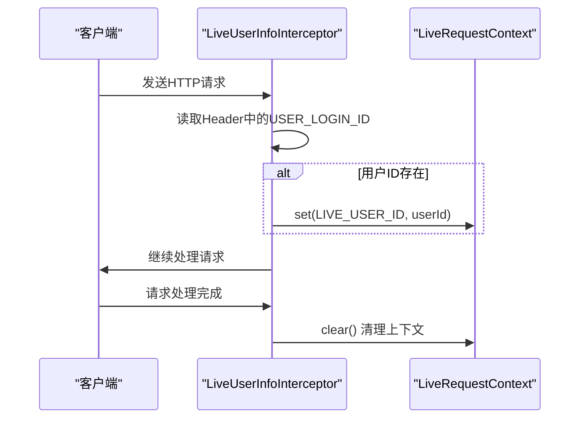

**图示来源**  
- [LiveUserInfoInterceptor.java](file://live-framework/live-framework-web-starter/src/main/java/com/logilong/live/web/starter/context/LiveUserInfoInterceptor.java#L14-L35)
- [LiveRequestContext.java](file://live-framework/live-framework-web-starter/src/main/java/com/logilong/live/web/starter/context/LiveRequestContext.java#L12-L66)

### 全局异常处理
`GlobalExceptionHandler`使用Spring的`@ControllerAdvice`注解实现了全局异常处理机制。它能够捕获系统中所有未处理的异常，并统一返回标准化的响应格式。

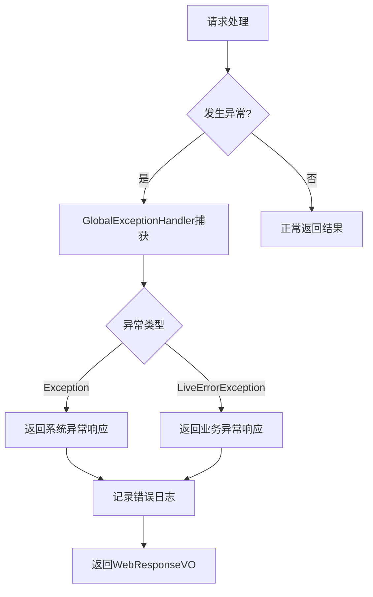

**图示来源**  
- [GlobalExceptionHandler.java](file://live-framework/live-framework-web-starter/src/main/java/com/logilong/live/web/starter/error/GlobalExceptionHandler.java#L12-L33)
- [WebResponseVO.java](file://live-common-interface/src/main/java/com/logilong/live/common/interfaces/vo/WebResponseVO.java#L8-L72)

### 限流控制
通过自定义注解`@RequestLimit`和`RequestLimitInterceptor`实现了接口级别的限流控制。该机制基于Redis记录用户请求频次，在指定时间窗口内超过阈值则拒绝请求。

```mermaid
flowchart TD
A[请求到达] --> B{方法有@RequestLimit注解?}
B --> |否| C[放行]
B --> |是| D[获取用户ID]
D --> E{用户ID为空?}
E --> |是| C
E --> |否| F[构建Redis Key]
F --> G[查询当前请求数]
G --> H{达到限制?}
H --> |否| I[递增计数并放行]
H --> |是| J[抛出LiveErrorException]
I --> K[设置过期时间]
```

**图示来源**  
- [RequestLimit.java](file://live-framework/live-framework-web-starter/src/main/java/com/logilong/live/web/starter/config/RequestLimit.java#L12-L29)
- [RequestLimitInterceptor.java](file://live-framework/live-framework-web-starter/src/main/java/com/logilong/live/web/starter/context/RequestLimitInterceptor.java#L21-L68)

**本节来源**  
- [LiveRequestContext.java](file://live-framework/live-framework-web-starter/src/main/java/com/logilong/live/web/starter/context/LiveRequestContext.java#L12-L66)
- [GlobalExceptionHandler.java](file://live-framework/live-framework-web-starter/src/main/java/com/logilong/live/web/starter/error/GlobalExceptionHandler.java#L12-L33)
- [RequestLimit.java](file://live-framework/live-framework-web-starter/src/main/java/com/logilong/live/web/starter/config/RequestLimit.java#L12-L29)
- [RequestLimitInterceptor.java](file://live-framework/live-framework-web-starter/src/main/java/com/logilong/live/web/starter/context/RequestLimitInterceptor.java#L21-L68)

## redis-starter组件设计与实现

### 通用Redis配置
`RedisConfig`类通过`@Configuration`注解定义了RedisTemplate的Bean，实现了自动配置。该配置使用自定义的序列化器，确保了对象存储的一致性和兼容性。

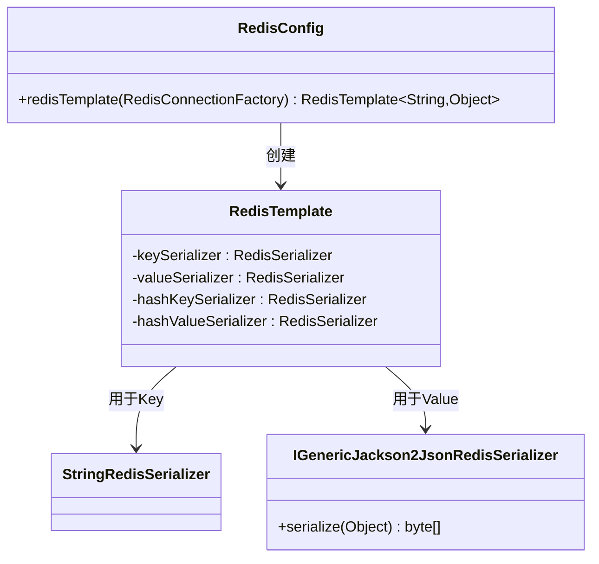

**图示来源**  
- [RedisConfig.java](file://live-framework/live-framework-redis-starter/src/main/java/com/logilong/live/framework/redis/starter/config/RedisConfig.java#L12-L28)
- [IGenericJackson2JsonRedisSerializer.java](file://live-framework/live-framework-redis-starter/src/main/java/com/logilong/live/framework/redis/starter/config/IGenericJackson2JsonRedisSerializer.java#L6-L21)

### 序列化策略
`IGenericJackson2JsonRedisSerializer`继承自Spring Data Redis的`GenericJackson2JsonRedisSerializer`，并重写了序列化方法，对字符串和字符类型采用直接字节数组转换，提高性能。

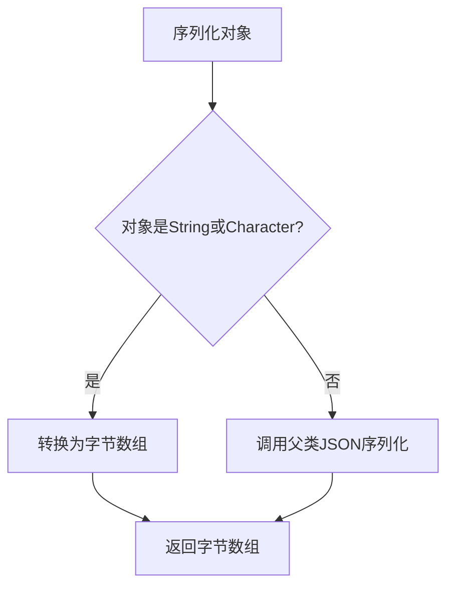

**图示来源**  
- [IGenericJackson2JsonRedisSerializer.java](file://live-framework/live-framework-redis-starter/src/main/java/com/logilong/live/framework/redis/starter/config/IGenericJackson2JsonRedisSerializer.java#L6-L21)
- [MapperFactory.java](file://live-framework/live-framework-redis-starter/src/main/java/com/logilong/live/framework/redis/starter/config/MapperFactory.java)

### 缓存键生成规则
通过`RedisKeyBuilder`基类和各服务专用的`CacheKeyBuilder`实现了统一的缓存键命名规范。所有缓存键都包含应用名称前缀，确保了多服务环境下的键空间隔离。

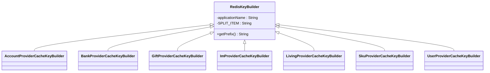

**图示来源**  
- [RedisKeyBuilder.java](file://live-framework/live-framework-redis-starter/src/main/java/com/logilong/live/framework/redis/starter/key/RedisKeyBuilder.java#L8-L22)
- [AccountProviderCacheKeyBuilder.java](file://live-framework/live-framework-redis-starter/src/main/java/com/logilong/live/framework/redis/starter/key/AccountProviderCacheKeyBuilder.java)
- [BankProviderCacheKeyBuilder.java](file://live-framework/live-framework-redis-starter/src/main/java/com/logilong/live/framework/redis/starter/key/BankProviderCacheKeyBuilder.java)

**本节来源**  
- [RedisConfig.java](file://live-framework/live-framework-redis-starter/src/main/java/com/logilong/live/framework/redis/starter/config/RedisConfig.java#L12-L28)
- [IGenericJackson2JsonRedisSerializer.java](file://live-framework/live-framework-redis-starter/src/main/java/com/logilong/live/framework/redis/starter/config/IGenericJackson2JsonRedisSerializer.java#L6-L21)
- [RedisKeyBuilder.java](file://live-framework/live-framework-redis-starter/src/main/java/com/logilong/live/framework/redis/starter/key/RedisKeyBuilder.java#L8-L22)

## mq-starter组件设计与实现

### 生产者配置
`RocketMQProducerConfig`通过Spring的`@Configuration`注解定义了MQProducer的Bean，实现了生产者的自动配置。配置中包含了线程池、重试机制等关键参数。

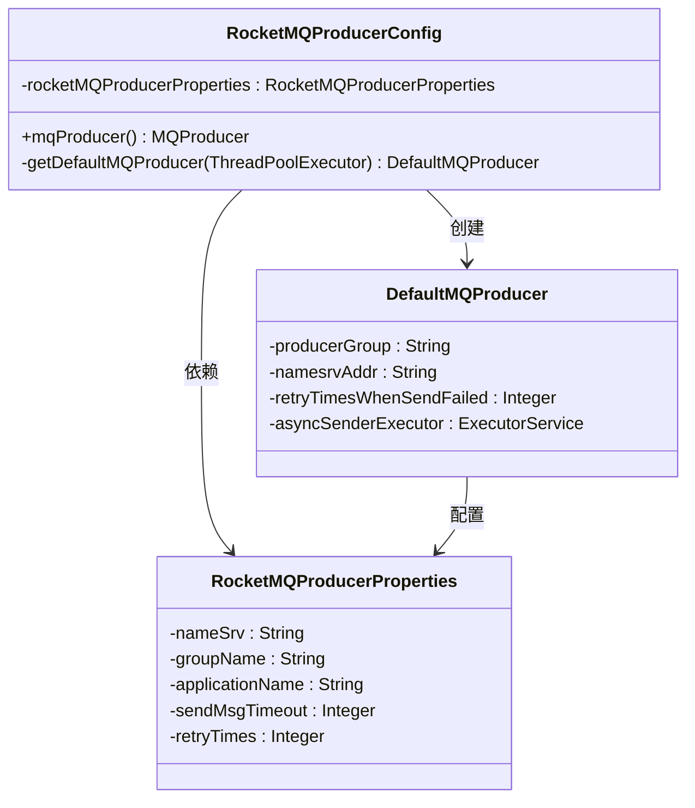

**图示来源**  
- [RocketMQProducerConfig.java](file://live-framework/live-framework-mq-starter/src/main/java/com/logilong/live/framework/mq/starter/producer/RocketMQProducerConfig.java#L19-L53)
- [RocketMQProducerProperties.java](file://live-framework/live-framework-mq-starter/src/main/java/com/logilong/live/framework/mq/starter/properties/RocketMQProducerProperties.java#L10-L19)

### 消费者配置
`RocketMQConsumerProperties`通过`@ConfigurationProperties`注解绑定了配置文件中的属性，为消费者提供了灵活的配置方式。

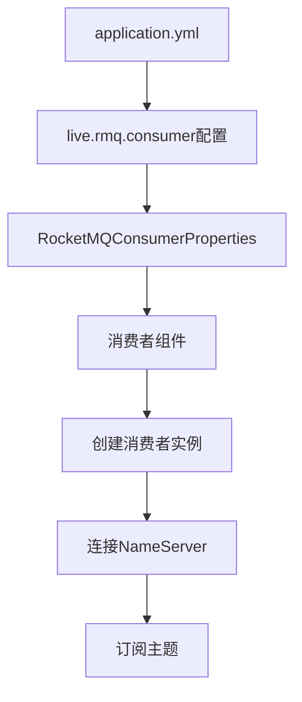

**图示来源**  
- [RocketMQConsumerProperties.java](file://live-framework/live-framework-mq-starter/src/main/java/com/logilong/live/framework/mq/starter/properties/RocketMQConsumerProperties.java#L11-L16)
- [RocketMQProducerConfig.java](file://live-framework/live-framework-mq-starter/src/main/java/com/logilong/live/framework/mq/starter/producer/RocketMQProducerConfig.java#L19-L53)

**本节来源**  
- [RocketMQProducerConfig.java](file://live-framework/live-framework-mq-starter/src/main/java/com/logilong/live/framework/mq/starter/producer/RocketMQProducerConfig.java#L19-L53)
- [RocketMQProducerProperties.java](file://live-framework/live-framework-mq-starter/src/main/java/com/logilong/live/framework/mq/starter/properties/RocketMQProducerProperties.java#L10-L19)
- [RocketMQConsumerProperties.java](file://live-framework/live-framework-mq-starter/src/main/java/com/logilong/live/framework/mq/starter/properties/RocketMQConsumerProperties.java#L11-L16)

## datasource-starter组件设计与实现

### ShardingSphere集成
`ShardingJdbcDatasourceAutoInitConnectionConfig`通过Spring的`ApplicationRunner`在应用启动时主动获取数据库连接，解决了Hikari连接池初始化的bug。

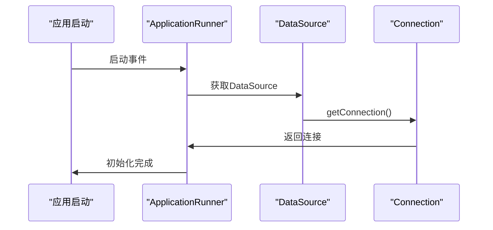

**图示来源**  
- [ShardingJdbcDatasourceAutoInitConnectionConfig.java](file://live-framework/live-framework-datasource-starter/src/main/java/com/logilong/live/framework/datasource/starter/config/ShardingJdbcDatasourceAutoInitConnectionConfig.java#L18-L30)
- [org.springframework.boot.autoconfigure.AutoConfiguration.imports](file://live-framework/live-framework-datasource-starter/src/main/resources/META-INF/spring/org.springframework.boot.autoconfigure.AutoConfiguration.imports#L1)

### 自动配置机制
通过`META-INF/spring/org.springframework.boot.autoconfigure.AutoConfiguration.imports`文件声明自动配置类，实现了Spring Boot的自动装配机制。

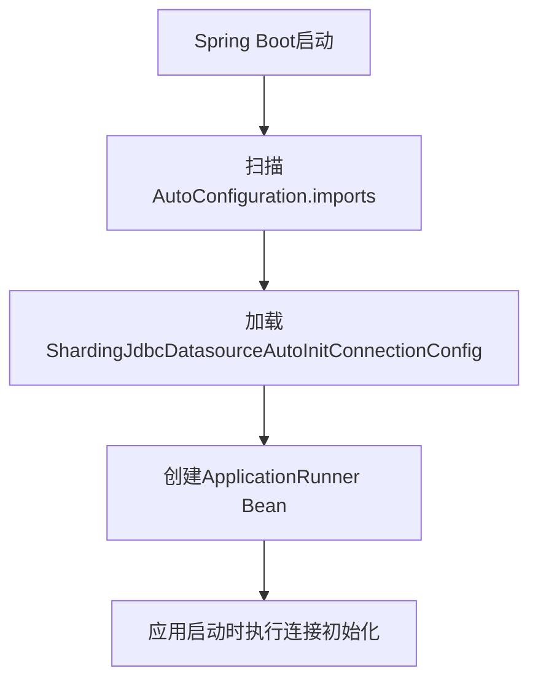

**图示来源**  
- [ShardingJdbcDatasourceAutoInitConnectionConfig.java](file://live-framework/live-framework-datasource-starter/src/main/java/com/logilong/live/framework/datasource/starter/config/ShardingJdbcDatasourceAutoInitConnectionConfig.java#L18-L30)
- [org.springframework.boot.autoconfigure.AutoConfiguration.imports](file://live-framework/live-framework-datasource-starter/src/main/resources/META-INF/spring/org.springframework.boot.autoconfigure.AutoConfiguration.imports#L1)

**本节来源**  
- [ShardingJdbcDatasourceAutoInitConnectionConfig.java](file://live-framework/live-framework-datasource-starter/src/main/java/com/logilong/live/framework/datasource/starter/config/ShardingJdbcDatasourceAutoInitConnectionConfig.java#L18-L30)
- [org.springframework.boot.autoconfigure.AutoConfiguration.imports](file://live-framework/live-framework-datasource-starter/src/main/resources/META-INF/spring/org.springframework.boot.autoconfigure.AutoConfiguration.imports#L1)

## common-interface公共模块设计与复用

### 通用VO与DTO
`WebResponseVO`作为统一的前端响应对象，定义了标准的返回格式，包括状态码、消息和数据体，实现了前后端交互的标准化。

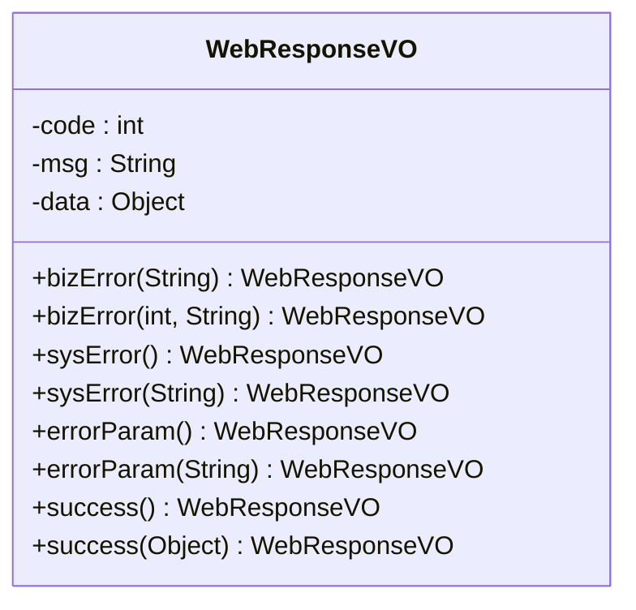

**图示来源**  
- [WebResponseVO.java](file://live-common-interface/src/main/java/com/logilong/live/common/interfaces/vo/WebResponseVO.java#L9-L72)

### 枚举类型
公共模块定义了多个枚举类型，如`CommonStatusEnum`、`GatewayHeaderEnum`等，实现了系统常量的集中管理，避免了硬编码。

### 工具类复用
#### DES加密工具
`DESUtils`提供了基于DES算法的加密解密功能，使用ECB模式和PKCS5Padding填充，支持Base64编码输出。

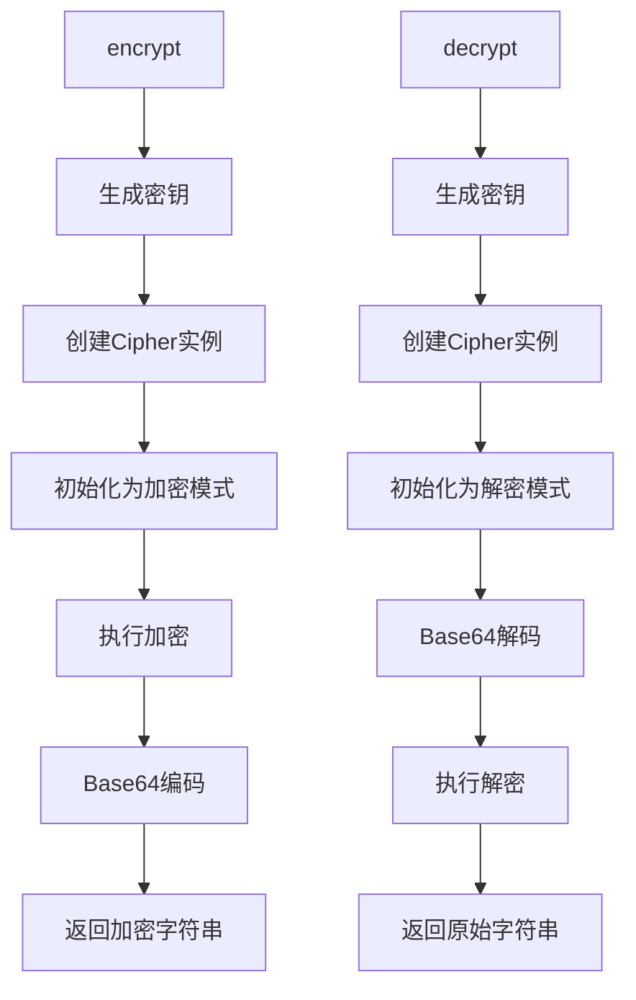

**图示来源**  
- [DESUtils.java](file://live-common-interface/src/main/java/com/logilong/live/common/interfaces/utils/DESUtils.java#L13-L108)

#### 集合工具
`ListUtils`提供了将大列表拆分为小列表的功能，主要用于避免Redis操作时的缓冲区溢出问题。

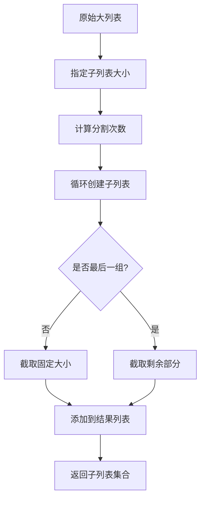

**图示来源**  
- [ListUtils.java](file://live-common-interface/src/main/java/com/logilong/live/common/interfaces/utils/ListUtils.java#L9-L35)

#### Bean转换工具
`ConvertBeanUtils`基于Spring的BeanUtils提供了对象和列表的转换功能，简化了DTO与实体类之间的转换。

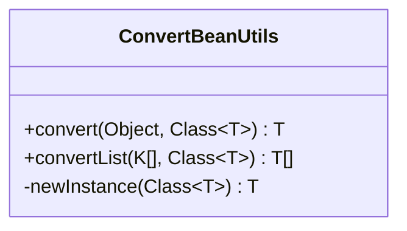

**图示来源**  
- [ConvertBeanUtils.java](file://live-common-interface/src/main/java/com/logilong/live/common/interfaces/utils/ConvertBeanUtils.java#L10-L56)

**本节来源**  
- [WebResponseVO.java](file://live-common-interface/src/main/java/com/logilong/live/common/interfaces/vo/WebResponseVO.java#L9-L72)
- [DESUtils.java](file://live-common-interface/src/main/java/com/logilong/live/common/interfaces/utils/DESUtils.java#L13-L108)
- [ListUtils.java](file://live-common-interface/src/main/java/com/logilong/live/common/interfaces/utils/ListUtils.java#L9-L35)
- [ConvertBeanUtils.java](file://live-common-interface/src/main/java/com/logilong/live/common/interfaces/utils/ConvertBeanUtils.java#L10-L56)

## 组件接入方式与最佳实践

### starter组件接入
各starter组件通过Maven依赖引入，无需额外配置即可自动生效。例如，引入web-starter后，请求拦截、上下文管理和全局异常处理将自动启用。

```xml
<dependency>
    <groupId>com.logilong.live.framework</groupId>
    <artifactId>live-framework-web-starter</artifactId>
    <version>1.0.0</version>
</dependency>
```

### 配置文件最佳实践
在`application.yml`中合理配置各组件参数，如Redis连接、RocketMQ地址、限流规则等，确保系统稳定运行。

### 代码使用最佳实践
- 使用`LiveRequestContext.getUserId()`获取当前用户ID
- 使用`@RequestLimit(limit=5, second=60)`注解实现接口限流
- 使用`WebResponseVO.success(data)`统一返回成功响应
- 使用`ConvertBeanUtils.convertList()`进行列表对象转换

## 结论
本技术框架通过精心设计的starter组件和公共接口模块，实现了微服务架构下的标准化和解耦。web-starter提供了统一的请求处理机制，redis-starter封装了高效的缓存操作，mq-starter简化了消息队列的使用，datasource-starter解决了分库分表的集成问题，common-interface则提供了丰富的公共工具。这些组件共同构建了一个高效、可维护的分布式系统基础架构，为直播平台的稳定运行提供了坚实的技术支撑。