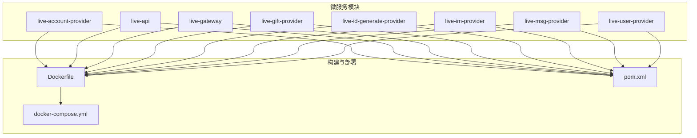
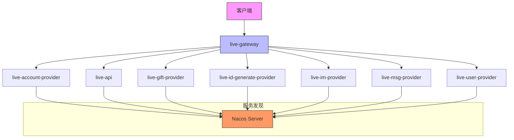
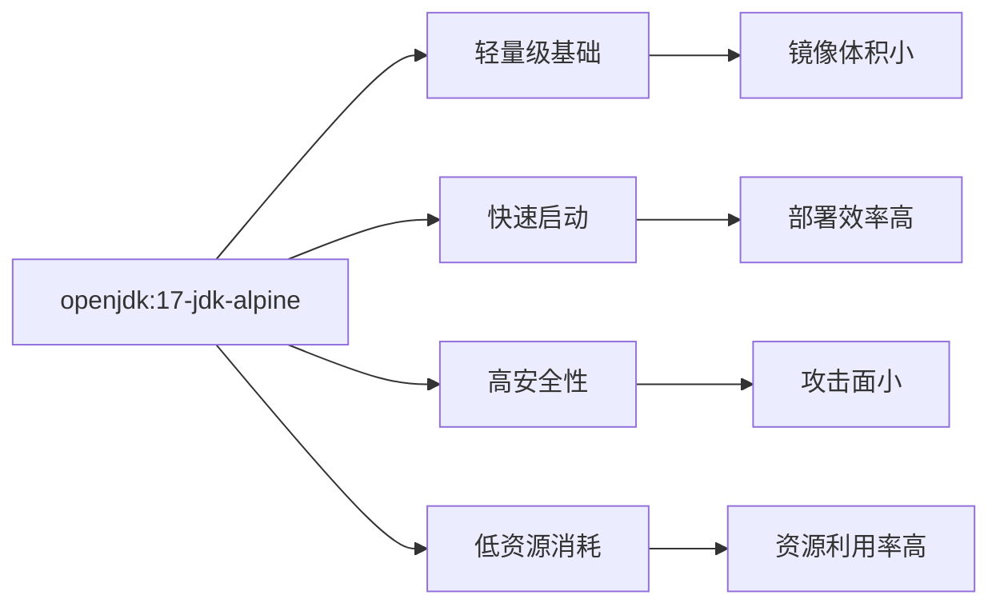
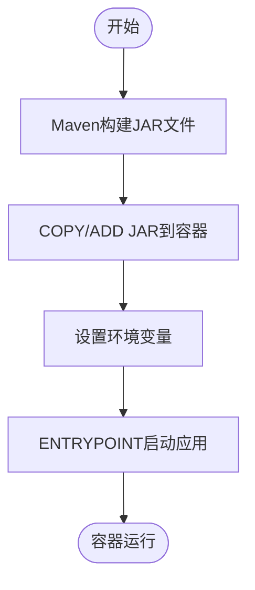
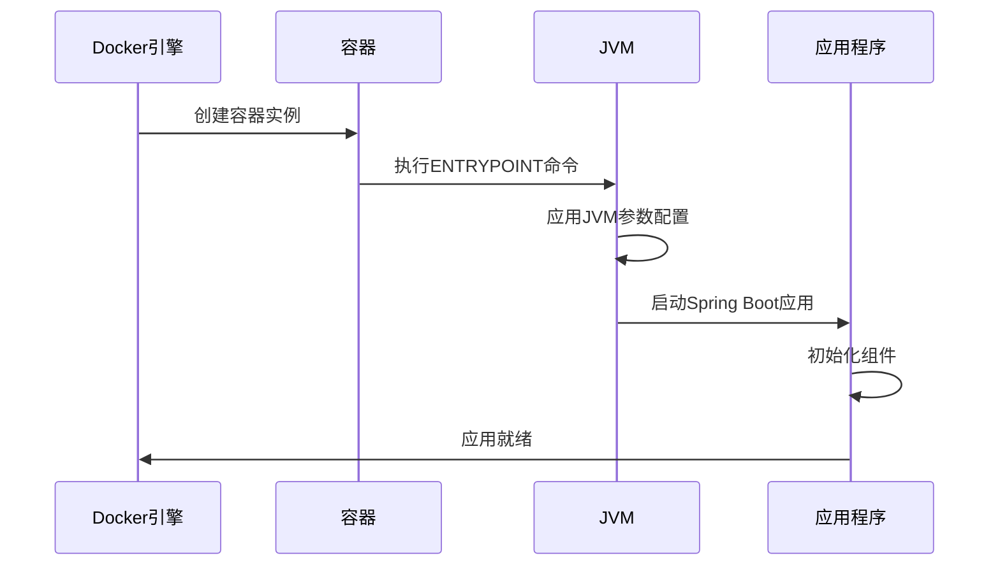

# Dockerfile配置

<cite>
**本文档中引用的文件**  
- [live-account-provider/docker/Dockerfile](file://live-account-provider/docker/Dockerfile)
- [live-api/docker/Dockerfile](file://live-api/docker/Dockerfile)
- [live-gateway/docker/Dockerfile](file://live-gateway/docker/Dockerfile)
- [live-gift-provider/docker/Dockerfile](file://live-gift-provider/docker/Dockerfile)
- [live-id-generate-provider/docker/Dockerfile](file://live-id-generate-provider/docker/Dockerfile)
- [live-im-provider/docker/Dockerfile](file://live-im-provider/docker/Dockerfile)
- [live-msg-provider/docker/Dockerfile](file://live-msg-provider/docker/Dockerfile)
- [live-user-provider/docker/Dockerfile](file://live-user-provider/docker/Dockerfile)
- [live-account-provider/pom.xml](file://live-account-provider/pom.xml)
- [live-api/pom.xml](file://live-api/pom.xml)
- [live-gateway/pom.xml](file://live-gateway/pom.xml)
- [pom.xml](file://pom.xml)
- [live-account-provider/docker/docker-compose.yml](file://live-account-provider/docker/docker-compose.yml)
- [live-api/docker/docker-compose.yml](file://live-api/docker/docker-compose.yml)
</cite>

## 目录
1. [简介](#简介)
2. [项目结构](#项目结构)
3. [核心组件](#核心组件)
4. [架构概述](#架构概述)
5. [详细组件分析](#详细组件分析)
6. [依赖分析](#依赖分析)
7. [性能考虑](#性能考虑)
8. [故障排除指南](#故障排除指南)
9. [结论](#结论)

## 简介
本文档详细说明了直播平台微服务架构中各模块的Dockerfile配置实现细节。文档分析了基础镜像的选择、JAR文件复制指令的最佳实践、容器启动命令的执行逻辑、端口声明的作用，并对比了不同服务Dockerfile的共性与差异。同时，文档还提供了Dockerfile编写规范建议，并结合Maven构建流程说明了如何生成可部署的JAR包。

## 项目结构
本项目采用微服务架构，包含多个独立的服务模块，每个模块都有自己的Dockerfile用于容器化部署。主要服务包括账户服务、API网关、消息服务、用户服务等。所有服务均采用Java技术栈，通过Spring Boot和Dubbo框架构建。



**图示来源**
- [live-account-provider/docker/Dockerfile](file://live-account-provider/docker/Dockerfile)
- [live-api/docker/Dockerfile](file://live-api/docker/Dockerfile)
- [live-gateway/docker/Dockerfile](file://live-gateway/docker/Dockerfile)

**本节来源**
- [live-account-provider/docker/Dockerfile](file://live-account-provider/docker/Dockerfile)
- [live-api/docker/Dockerfile](file://live-api/docker/Dockerfile)
- [live-gateway/docker/Dockerfile](file://live-gateway/docker/Dockerfile)

## 核心组件
本项目的核心组件包括多个微服务模块，每个模块都通过Docker容器化部署。所有服务均基于openjdk:17-jdk-alpine基础镜像构建，使用Maven进行构建，并通过Dockerfile定义容器化部署流程。各服务通过Nacos进行服务发现和配置管理，使用Dubbo作为RPC框架。

**本节来源**
- [live-account-provider/docker/Dockerfile](file://live-account-provider/docker/Dockerfile)
- [live-api/docker/Dockerfile](file://live-api/docker/Dockerfile)
- [live-gateway/docker/Dockerfile](file://live-gateway/docker/Dockerfile)
- [pom.xml](file://pom.xml)

## 架构概述
系统采用微服务架构，各服务独立部署并通过Docker容器化运行。API网关作为外部请求的入口，将请求路由到相应的后端服务。各微服务之间通过Dubbo RPC进行通信，使用Nacos作为服务注册与发现中心。所有服务的构建和部署流程都通过Maven和Docker实现标准化。



**图示来源**
- [live-gateway/docker/Dockerfile](file://live-gateway/docker/Dockerfile)
- [live-account-provider/docker/Dockerfile](file://live-account-provider/docker/Dockerfile)
- [live-api/docker/Dockerfile](file://live-api/docker/Dockerfile)

## 详细组件分析
### Dockerfile实现细节分析
#### 基础镜像选择
所有微服务均采用`docker.xuanyuan.dev/openjdk:17-jdk-alpine`作为基础镜像。Alpine Linux是一个轻量级的Linux发行版，具有以下优势：
- 镜像体积小，减少存储和传输成本
- 启动速度快，提高部署效率
- 安全性高，攻击面小
- 资源占用少，提高服务器资源利用率



**图示来源**
- [live-account-provider/docker/Dockerfile](file://live-account-provider/docker/Dockerfile)
- [live-api/docker/Dockerfile](file://live-api/docker/Dockerfile)

#### JAR文件复制指令
Dockerfile中使用`ADD`指令将构建好的JAR文件复制到容器中。这种做法的优势包括：
- 简化构建流程，直接复制已构建的JAR文件
- 避免在容器内重新编译，提高构建效率
- 确保构建环境与运行环境分离，提高可移植性



**图示来源**
- [live-account-provider/docker/Dockerfile](file://live-account-provider/docker/Dockerfile)
- [live-api/docker/Dockerfile](file://live-api/docker/Dockerfile)

#### 容器启动命令
所有服务的Dockerfile都使用`ENTRYPOINT`指令定义容器启动命令。启动命令包含JVM参数配置，确保应用在容器环境中稳定运行：
- 设置堆内存大小（Xmx, Xms）
- 配置新生代大小（Xmn）
- 启用服务器模式（-server）
- 配置安全随机数生成器



**图示来源**
- [live-account-provider/docker/Dockerfile](file://live-account-provider/docker/Dockerfile)
- [live-api/docker/Dockerfile](file://live-api/docker/Dockerfile)

#### 端口声明
虽然Dockerfile中没有显式的EXPOSE指令，但在docker-compose.yml文件中定义了端口映射。这种做法的优势是将端口配置与部署环境解耦，提高部署灵活性。

**本节来源**
- [live-account-provider/docker/Dockerfile](file://live-account-provider/docker/Dockerfile)
- [live-api/docker/Dockerfile](file://live-api/docker/Dockerfile)
- [live-gateway/docker/Dockerfile](file://live-gateway/docker/Dockerfile)

## 依赖分析
### 共性与差异分析
各微服务的Dockerfile具有高度一致性，体现了标准化的构建流程。所有服务都采用相同的基础镜像、相似的JVM参数配置和一致的构建模式。

```mermaid
classDiagram
class Dockerfile {
+FROM openjdk : 17-jdk-alpine
+VOLUME /tmp
+COPY arthas-bin.zip
+ADD *-docker.jar app.jar
+ENV JAVA_OPTS
+ENTRYPOINT java ${JAVA_OPTS}
}
class AccountDockerfile {
+ADD qiyu-live-account-provider-docker.jar app.jar
+-Xm512m -Xms512m
}
class ApiDockerfile {
+ADD live-api-docker.jar app.jar
+-Xmx1g -Xms1g
}
class GatewayDockerfile {
+ADD live-gateway-docker.jar app.jar
+-Xmx1g -Xms1g
}
Dockerfile <|-- AccountDockerfile
Dockerfile <|-- ApiDockerfile
Dockerfile <|-- GatewayDockerfile
```

**图示来源**
- [live-account-provider/docker/Dockerfile](file://live-account-provider/docker/Dockerfile)
- [live-api/docker/Dockerfile](file://live-api/docker/Dockerfile)
- [live-gateway/docker/Dockerfile](file://live-gateway/docker/Dockerfile)

### 多阶段构建优化空间
当前的Dockerfile采用单阶段构建，存在优化空间。可以考虑采用多阶段构建来进一步优化：
- 第一阶段：使用Maven镜像进行编译构建
- 第二阶段：使用JRE镜像作为运行环境
- 只将最终的JAR文件复制到运行镜像中

这种优化可以进一步减小镜像体积，提高安全性。

**本节来源**
- [live-account-provider/docker/Dockerfile](file://live-account-provider/docker/Dockerfile)
- [live-api/docker/Dockerfile](file://live-api/docker/Dockerfile)
- [live-gateway/docker/Dockerfile](file://live-gateway/docker/Dockerfile)

## 性能考虑
### 分层优化
Docker镜像的分层结构对构建性能有重要影响。当前的Dockerfile遵循了最佳实践：
- 基础镜像层：openjdk:17-jdk-alpine
- 依赖层：Arthas调试工具
- 应用层：JAR文件
- 配置层：环境变量和启动命令

这种分层策略有利于Docker构建缓存的利用，当应用代码变更时，只需要重新构建应用层。

### 缓存利用
Maven构建过程也考虑了缓存利用。pom.xml文件在Dockerfile中被单独复制，这样当依赖变更时才会重新下载，提高构建效率。

**本节来源**
- [live-account-provider/docker/Dockerfile](file://live-account-provider/docker/Dockerfile)
- [live-api/docker/Dockerfile](file://live-api/docker/Dockerfile)
- [live-account-provider/pom.xml](file://live-account-provider/pom.xml)
- [live-api/pom.xml](file://live-api/pom.xml)

## 故障排除指南
### 常见问题
1. **JVM内存不足**：根据服务类型调整Xmx和Xms参数
2. **端口冲突**：检查docker-compose.yml中的端口映射
3. **服务注册失败**：确认Nacos配置正确
4. **Arthas工具无法使用**：检查arthas-bin.zip是否正确复制

### 调试建议
- 使用Arthas工具进行线上诊断
- 查看容器日志文件
- 检查环境变量配置
- 验证网络连接

**本节来源**
- [live-account-provider/docker/Dockerfile](file://live-account-provider/docker/Dockerfile)
- [live-account-provider/docker/docker-compose.yml](file://live-account-provider/docker/docker-compose.yml)
- [live-api/docker/docker-compose.yml](file://live-api/docker/docker-compose.yml)

## 结论
本文档详细分析了直播平台微服务架构中各模块的Dockerfile配置。所有服务都采用了标准化的容器化部署方案，基于轻量级的Alpine Linux基础镜像，通过Maven构建生成可执行的JAR文件，并使用Dockerfile定义容器化部署流程。建议未来考虑采用多阶段构建进一步优化镜像体积和安全性，同时可以探索更精细化的JVM参数调优策略。