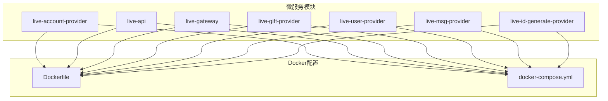
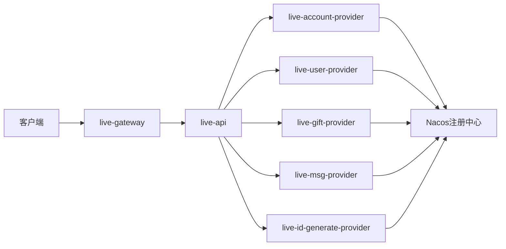
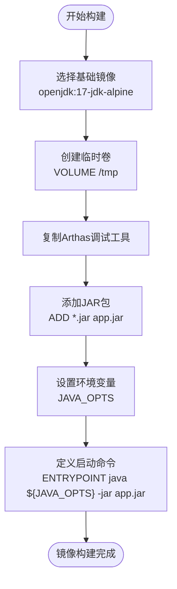
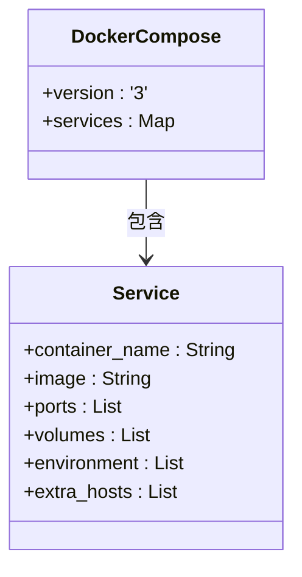
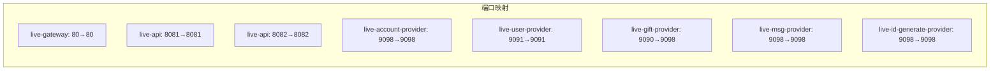
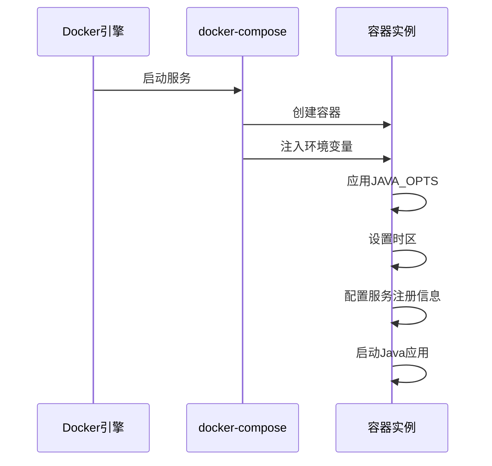
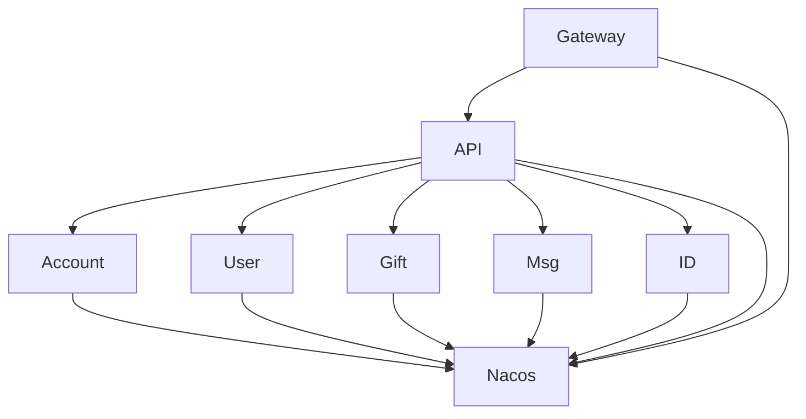

# Docker部署

<cite>
**本文档中引用的文件**  
- [live-account-provider/docker/Dockerfile](file://live-account-provider/docker/Dockerfile)
- [live-account-provider/docker/docker-compose.yml](file://live-account-provider/docker/docker-compose.yml)
- [live-api/docker/Dockerfile](file://live-api/docker/Dockerfile)
- [live-api/docker/docker-compose.yml](file://live-api/docker/docker-compose.yml)
- [live-gateway/docker/Dockerfile](file://live-gateway/docker/Dockerfile)
- [live-gateway/docker/docker-compose.yml](file://live-gateway/docker/docker-compose.yml)
- [live-gift-provider/docker/Dockerfile](file://live-gift-provider/docker/Dockerfile)
- [live-gift-provider/docker/docker-compose.yml](file://live-gift-provider/docker/docker-compose.yml)
- [live-user-provider/docker/Dockerfile](file://live-user-provider/docker/Dockerfile)
- [live-user-provider/docker/docker-compose.yml](file://live-user-provider/docker/docker-compose.yml)
- [live-msg-provider/docker/Dockerfile](file://live-msg-provider/docker/Dockerfile)
- [live-msg-provider/docker/docker-compose.yml](file://live-msg-provider/docker/docker-compose.yml)
- [live-id-generate-provider/docker/Dockerfile](file://live-id-generate-provider/docker/Dockerfile)
- [live-id-generate-provider/docker/docker-compose.yml](file://live-id-generate-provider/docker/docker-compose.yml)
</cite>

## 目录
1. [简介](#简介)
2. [项目结构](#项目结构)
3. [核心组件](#核心组件)
4. [架构概述](#架构概述)
5. [详细组件分析](#详细组件分析)
6. [依赖分析](#依赖分析)
7. [性能考虑](#性能考虑)
8. [故障排除指南](#故障排除指南)
9. [结论](#结论)

## 简介
本文档提供了一个全面的Docker部署指南，涵盖了直播平台项目中所有微服务模块的Dockerfile和docker-compose.yml配置。文档详细说明了各服务Dockerfile中的基础镜像选择、JAR包复制指令、启动命令及端口暴露策略。同时解析了docker-compose.yml中的服务编排逻辑，包括服务名称、镜像版本、端口映射、环境变量注入、依赖关系以及网络配置。此外，还提供了本地开发环境与生产环境的compose文件差异对比，指导如何通过覆盖配置实现多环境部署。

## 项目结构
该项目是一个基于微服务架构的直播平台，包含多个独立的服务模块，每个模块都有自己的Docker配置文件。主要微服务包括账户服务、API网关、礼物服务、用户服务、消息服务和ID生成服务等。每个服务都包含一个Dockerfile用于构建镜像，以及一个docker-compose.yml文件用于定义服务的运行时配置。



**图示来源**
- [live-account-provider/docker/Dockerfile](file://live-account-provider/docker/Dockerfile)
- [live-api/docker/docker-compose.yml](file://live-api/docker/docker-compose.yml)

**章节来源**
- [live-account-provider/docker/Dockerfile](file://live-account-provider/docker/Dockerfile)
- [live-api/docker/docker-compose.yml](file://live-api/docker/docker-compose.yml)

## 核心组件
本项目的核心组件包括多个微服务，每个服务都通过Docker容器化部署。关键服务包括：
- live-account-provider：账户服务，处理用户账户相关操作
- live-api：API网关服务，提供统一的API入口
- live-gateway：网关服务，负责请求路由和过滤
- live-gift-provider：礼物服务，管理直播间的礼物功能
- live-user-provider：用户服务，处理用户信息和认证
- live-msg-provider：消息服务，处理系统消息发送
- live-id-generate-provider：ID生成服务，提供分布式ID生成能力

这些服务通过Docker容器化部署，确保了环境一致性并简化了部署流程。

**章节来源**
- [live-account-provider/docker/Dockerfile](file://live-account-provider/docker/Dockerfile)
- [live-api/docker/Dockerfile](file://live-api/docker/Dockerfile)
- [live-gateway/docker/Dockerfile](file://live-gateway/docker/Dockerfile)

## 架构概述
整个系统的架构基于微服务模式，使用Docker进行容器化部署。各个服务通过Nacos或Dubbo进行服务注册与发现，通过API网关对外提供服务。Docker Compose用于定义和运行多容器Docker应用程序。



**图示来源**
- [live-gateway/docker/docker-compose.yml](file://live-gateway/docker/docker-compose.yml)
- [live-api/docker/docker-compose.yml](file://live-api/docker/docker-compose.yml)

## 详细组件分析

### Dockerfile配置分析
所有微服务的Dockerfile都遵循相似的结构和配置模式。

#### 基础镜像选择
所有服务都使用`docker.xuanyuan.dev/openjdk:17-jdk-alpine`作为基础镜像。选择该镜像的原因包括：
- 基于Alpine Linux，体积小，启动快
- 预装OpenJDK 17，支持最新的Java特性
- 经过公司内部优化和安全加固

```mermaid
classDiagram
class Dockerfile {
+FROM docker.xuanyuan.dev/openjdk : 17-jdk-alpine
+VOLUME /tmp
+COPY arthas-bin.zip /opts/arthas-bin.zip
+ADD *.jar app.jar
+ENV JAVA_OPTS
+ENTRYPOINT java ${JAVA_OPTS} -jar app.jar
}
```

**图示来源**
- [live-account-provider/docker/Dockerfile](file://live-account-provider/docker/Dockerfile)
- [live-api/docker/Dockerfile](file://live-api/docker/Dockerfile)

#### JAR包复制与启动命令
Dockerfile中使用ADD指令将构建好的JAR包复制到容器中，并重命名为app.jar。ENTRYPOINT指令定义了容器启动时执行的命令，包括JVM参数和安全配置。



**图示来源**
- [live-gift-provider/docker/Dockerfile](file://live-gift-provider/docker/Dockerfile)
- [live-user-provider/docker/Dockerfile](file://live-user-provider/docker/Dockerfile)

### docker-compose.yml配置分析

#### 服务编排逻辑
docker-compose.yml文件定义了服务的运行时配置，包括容器名称、镜像版本、端口映射、卷挂载、环境变量和主机映射等。



**图示来源**
- [live-account-provider/docker/docker-compose.yml](file://live-account-provider/docker/docker-compose.yml)
- [live-api/docker/docker-compose.yml](file://live-api/docker/docker-compose.yml)

#### 端口映射策略
不同服务采用不同的端口映射策略：
- live-gateway：将容器的80端口映射到主机的80端口，作为外部访问入口
- live-api：使用8081、8082等端口，支持多实例部署
- 其他服务：使用9090-9098范围内的端口，避免冲突



**图示来源**
- [live-gateway/docker/docker-compose.yml](file://live-gateway/docker/docker-compose.yml)
- [live-user-provider/docker/docker-compose.yml](file://live-user-provider/docker/docker-compose.yml)

#### 环境变量注入
通过environment字段注入关键环境变量，包括：
- DUBBO_IP_TO_REGISTRY：Dubbo服务注册IP
- DUBBO_PORT_TO_REGISTRY：Dubbo服务注册端口
- spring.cloud.nacos.discovery.ip：Nacos服务发现IP
- server.port：服务监听端口
- TZ：时区设置
- JAVA_OPTS：JVM启动参数



**图示来源**
- [live-api/docker/docker-compose.yml](file://live-api/docker/docker-compose.yml)
- [live-msg-provider/docker/docker-compose.yml](file://live-msg-provider/docker/docker-compose.yml)

## 依赖分析
各微服务之间存在明确的依赖关系，通过docker-compose.yml中的服务定义和网络配置来管理。



**图示来源**
- [go.mod](file://go.mod)
- [pom.xml](file://pom.xml)

**章节来源**
- [live-api/docker/docker-compose.yml](file://live-api/docker/docker-compose.yml)
- [live-gateway/docker/docker-compose.yml](file://live-gateway/docker/docker-compose.yml)

## 性能考虑
在Docker部署中，性能优化主要体现在JVM参数配置和资源限制上。

### JVM参数配置
所有服务都配置了合理的JVM参数：
- 初始堆内存和最大堆内存设置为512m或1g
- 新生代大小设置为256m
- Metaspace大小限制为128m
- 线程栈大小设置为256k

### 资源优化
- 使用Alpine基础镜像减小镜像体积
- 通过卷挂载将日志输出到主机，避免容器日志过大
- 合理设置容器内存限制，避免资源浪费

**章节来源**
- [live-account-provider/docker/Dockerfile](file://live-account-provider/docker/Dockerfile)
- [live-api/docker/docker-compose.yml](file://live-api/docker/docker-compose.yml)

## 故障排除指南
### 构建镜像的Maven命令
```bash
mvn clean package -DskipTests
```
此命令用于构建项目并生成JAR包，跳过测试以加快构建速度。

### 推送镜像到私有仓库的流程
1. 构建Docker镜像
```bash
docker build -t docker.xuanyuan.dev/live-platform/live-service-name:version .
```
2. 登录私有仓库
```bash
docker login docker.xuanyuan.dev
```
3. 推送镜像
```bash
docker push docker.xuanyuan.dev/live-platform/live-service-name:version
```

### 容器启动后的连通性测试方法
1. 检查容器状态
```bash
docker ps | grep live-service-name
```
2. 测试服务端口连通性
```bash
curl http://localhost:service-port/health
```
3. 查看容器日志
```bash
docker logs container-name
```

**章节来源**
- [live-account-provider/docker/Dockerfile](file://live-account-provider/docker/Dockerfile)
- [live-api/docker/docker-compose.yml](file://live-api/docker/docker-compose.yml)

## 结论
本文档详细介绍了直播平台项目中各个微服务的Docker部署配置。通过统一的Dockerfile模板和docker-compose.yml配置，实现了服务的标准化部署。所有服务都使用openjdk:17-jdk-alpine作为基础镜像，确保了环境的一致性和安全性。通过合理的端口映射、环境变量配置和资源限制，保证了服务的稳定运行。建议在生产环境中使用更完善的编排工具如Kubernetes来管理这些服务，以实现更高的可用性和可扩展性。