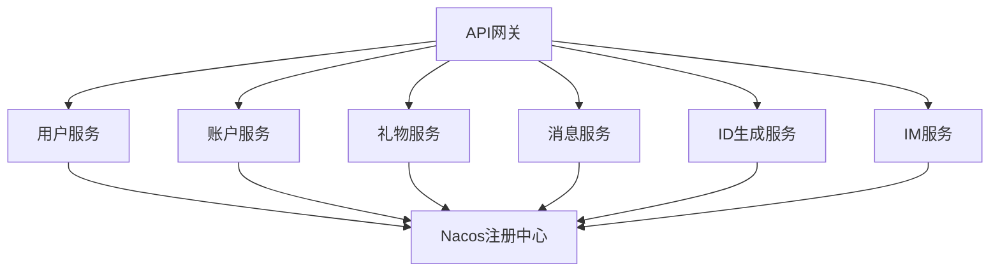
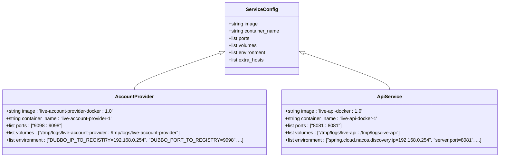
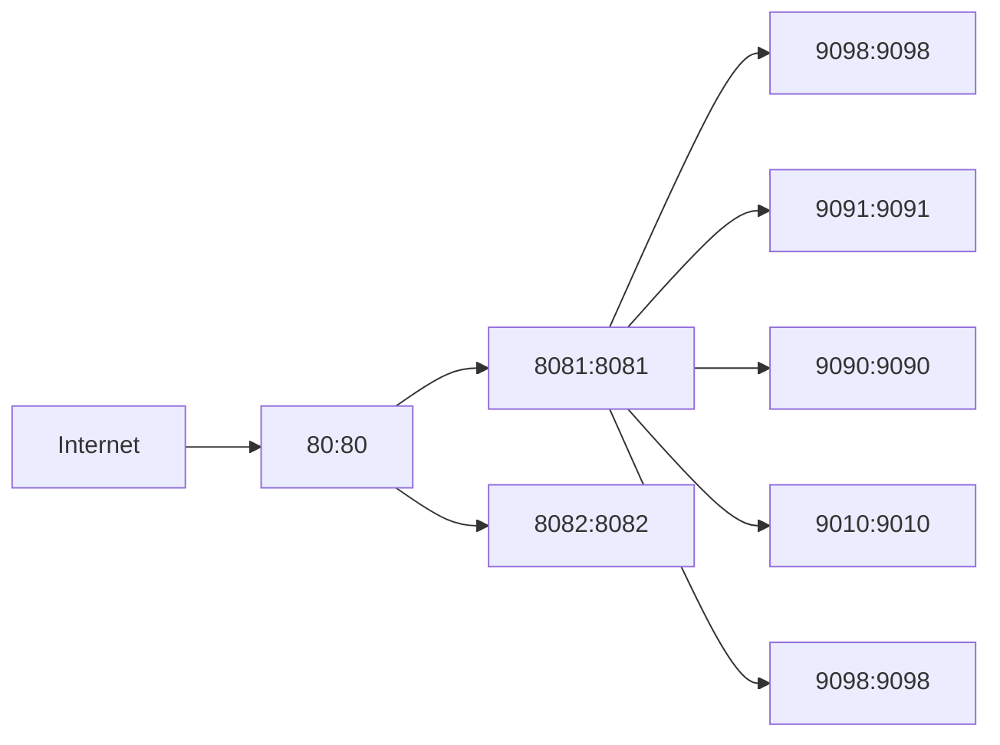
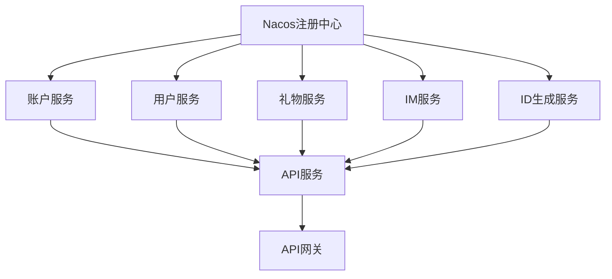
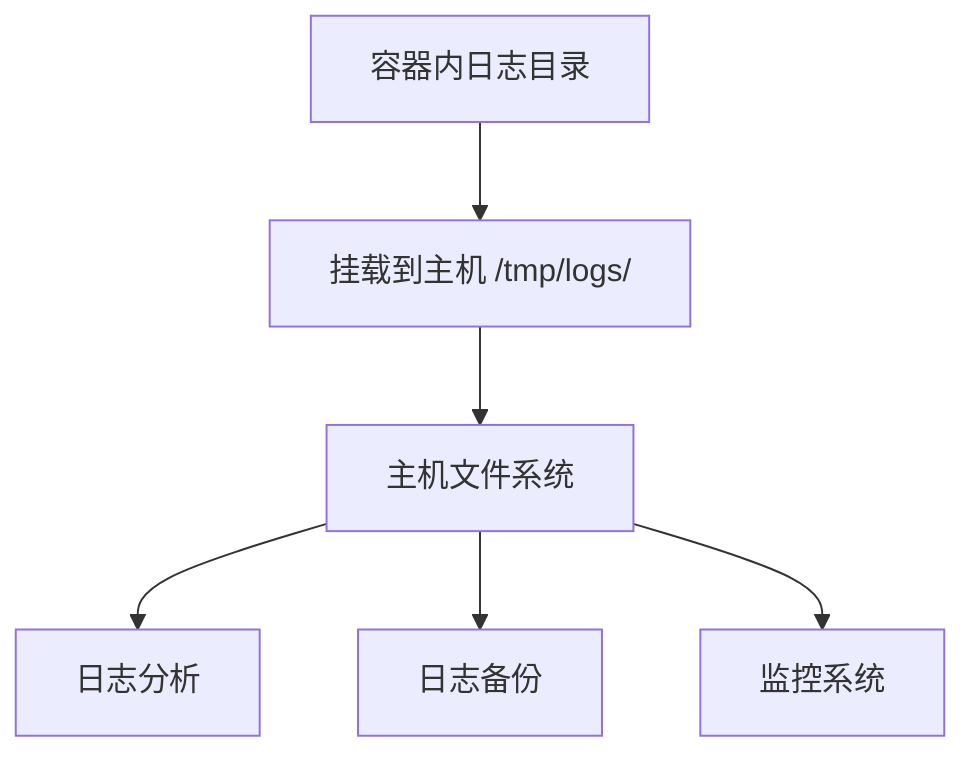
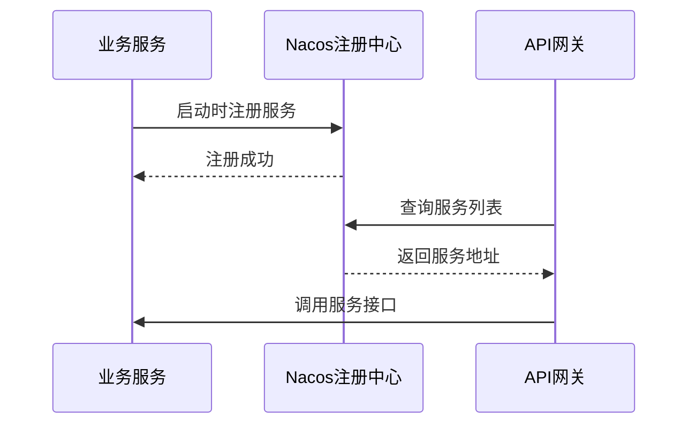
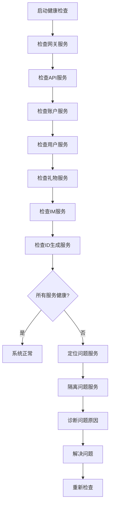

# docker-compose编排

<cite>
**本文档引用的文件**  
- [live-account-provider/docker/docker-compose.yml](file://live-account-provider/docker/docker-compose.yml)
- [live-api/docker/docker-compose.yml](file://live-api/docker/docker-compose.yml)
- [live-gateway/docker/docker-compose.yml](file://live-gateway/docker/docker-compose.yml)
- [live-gift-provider/docker/docker-compose.yml](file://live-gift-provider/docker/docker-compose.yml)
- [live-id-generate-provider/docker/docker-compose.yml](file://live-id-generate-provider/docker/docker-compose.yml)
- [live-im-provider/docker/docker-compose.yml](file://live-im-provider/docker/docker-compose.yml)
- [live-msg-provider/docker/docker-compose.yml](file://live-msg-provider/docker/docker-compose.yml)
- [live-user-provider/docker/docker-compose.yml](file://live-user-provider/docker/docker-compose.yml)
- [live-account-provider/docker/Dockerfile](file://live-account-provider/docker/Dockerfile)
- [live-api/docker/Dockerfile](file://live-api/docker/Dockerfile)
- [live-gateway/docker/Dockerfile](file://live-gateway/docker/Dockerfile)
- [live-gift-provider/docker/Dockerfile](file://live-gift-provider/docker/Dockerfile)
- [live-id-generate-provider/docker/Dockerfile](file://live-id-generate-provider/docker/Dockerfile)
- [live-im-provider/docker/Dockerfile](file://live-im-provider/docker/Dockerfile)
- [live-msg-provider/docker/Dockerfile](file://live-msg-provider/docker/Dockerfile)
- [live-user-provider/docker/Dockerfile](file://live-user-provider/docker/Dockerfile)
</cite>

## 目录
1. [简介](#简介)
2. [项目结构](#项目结构)
3. [核心编排配置解析](#核心编排配置解析)
4. [服务间依赖与启动顺序](#服务间依赖与启动顺序)
5. [网络与卷挂载配置](#网络与卷挂载配置)
6. [环境变量注入机制](#环境变量注入机制)
7. [本地开发与生产环境差异](#本地开发与生产环境差异)
8. [多服务协同调试技巧](#多服务协同调试技巧)
9. [总结](#总结)

## 简介
本文档深入解析直播平台项目的Docker Compose编排配置，涵盖各微服务的容器化部署方案。通过分析`docker-compose.yml`文件的结构与配置项，详细说明服务定义中的关键参数，包括镜像引用、容器命名、端口映射、环境变量注入、依赖控制等。同时探讨网络配置和服务间通信机制，为开发和运维人员提供完整的容器编排指南。

## 项目结构
本项目采用微服务架构，包含多个独立的服务模块，每个服务都有自己的Docker编排配置。主要服务包括用户服务、账户服务、API网关、消息服务、礼物服务等，所有服务通过Docker Compose进行容器化管理。



**图示来源**  
- [live-gateway/docker/docker-compose.yml](file://live-gateway/docker/docker-compose.yml#L1-L9)
- [live-user-provider/docker/docker-compose.yml](file://live-user-provider/docker/docker-compose.yml#L1-L33)
- [live-account-provider/docker/docker-compose.yml](file://live-account-provider/docker/docker-compose.yml#L1-L16)

**本节来源**  
- [live-gateway/docker/docker-compose.yml](file://live-gateway/docker/docker-compose.yml#L1-L9)
- [live-user-provider/docker/docker-compose.yml](file://live-user-provider/docker/docker-compose.yml#L1-L33)

## 核心编排配置解析

### 服务定义基础配置
每个服务的`docker-compose.yml`文件都遵循相同的结构，定义了服务的基本属性：

- **image**: 指定容器使用的镜像名称和标签
- **container_name**: 为容器指定唯一的名称
- **ports**: 配置主机端口与容器端口的映射关系
- **volumes**: 定义数据卷挂载，实现日志持久化
- **environment**: 设置容器内的环境变量
- **extra_hosts**: 配置额外的主机名解析



**图示来源**  
- [live-account-provider/docker/docker-compose.yml](file://live-account-provider/docker/docker-compose.yml#L1-L16)
- [live-api/docker/docker-compose.yml](file://live-api/docker/docker-compose.yml#L1-L31)

**本节来源**  
- [live-account-provider/docker/docker-compose.yml](file://live-account-provider/docker/docker-compose.yml#L1-L16)
- [live-api/docker/docker-compose.yml](file://live-api/docker/docker-compose.yml#L1-L31)

### 端口映射策略
各服务采用不同的端口映射策略，确保服务间的通信和外部访问：

- API网关服务映射到主机80端口，作为外部访问入口
- 各业务服务使用9000+端口范围，避免端口冲突
- Dubbo服务注册到特定端口，便于服务发现



**图示来源**  
- [live-gateway/docker/docker-compose.yml](file://live-gateway/docker/docker-compose.yml#L6-L7)
- [live-api/docker/docker-compose.yml](file://live-api/docker/docker-compose.yml#L7-L8)
- [live-account-provider/docker/docker-compose.yml](file://live-account-provider/docker/docker-compose.yml#L7-L8)

## 服务间依赖与启动顺序

### 依赖关系分析
虽然当前配置中未显式使用`depends_on`指令，但服务间存在隐式的依赖关系。API服务依赖于各个业务服务，而业务服务又依赖于注册中心（Nacos）。



**图示来源**  
- [live-api/docker/docker-compose.yml](file://live-api/docker/docker-compose.yml#L11-L14)
- [live-account-provider/docker/docker-compose.yml](file://live-account-provider/docker/docker-compose.yml#L11-L12)

### 启动顺序控制
通过环境变量配置服务注册信息，确保服务能够正确注册到注册中心：

- `DUBBO_IP_TO_REGISTRY`: 指定服务注册的IP地址
- `DUBBO_PORT_TO_REGISTRY`: 指定服务注册的端口号
- `spring.cloud.nacos.discovery.ip`: Nacos服务发现IP配置

这些配置确保了服务启动时能够正确地向注册中心注册自己的网络位置，供其他服务发现和调用。

**本节来源**  
- [live-account-provider/docker/docker-compose.yml](file://live-account-provider/docker/docker-compose.yml#L11-L12)
- [live-api/docker/docker-compose.yml](file://live-api/docker/docker-compose.yml#L11-L13)
- [live-gift-provider/docker/docker-compose.yml](file://live-gift-provider/docker/docker-compose.yml#L11-L12)

## 网络与卷挂载配置

### 网络配置
所有服务通过Docker默认网络进行通信，利用`extra_hosts`配置实现主机名解析：

```yaml
extra_hosts:
  - 'live-server:192.168.0.254'
```

此配置将`live-server`主机名解析到指定的IP地址，确保服务能够通过主机名访问注册中心和其他基础设施。

**本节来源**  
- [live-account-provider/docker/docker-compose.yml](file://live-account-provider/docker/docker-compose.yml#L15-L16)
- [live-api/docker/docker-compose.yml](file://live-api/docker/docker-compose.yml#L15-L16)

### 卷挂载应用
各服务配置了日志目录的卷挂载，实现日志的持久化存储：

```yaml
volumes:
  - /tmp/logs/service-name:/tmp/logs/service-name
```

这种配置确保了容器重启后日志不会丢失，便于问题排查和审计。



**图示来源**  
- [live-account-provider/docker/docker-compose.yml](file://live-account-provider/docker/docker-compose.yml#L8-L9)
- [live-api/docker/docker-compose.yml](file://live-api/docker/docker-compose.yml#L23-L24)

## 环境变量注入机制

### JVM参数配置
所有服务都通过环境变量配置JVM参数，优化Java应用的性能：

```yaml
environment:
  - JAVA_OPTS=-XX:MetaspaceSize=128m -XX:MaxMetaspaceSize=128m -Xms512m -Xmx512m -Xmn128m -Xss256k
```

这些参数设置了元空间大小、堆内存大小和线程栈大小，确保应用在容器环境中稳定运行。

### 时区配置
统一配置时区为亚洲/上海：

```yaml
environment:
  - TZ=Asia/Shanghai
```

确保所有服务使用相同的时区，避免时间处理上的不一致问题。

### 服务发现配置
不同服务使用不同的服务发现配置：

- Dubbo服务使用`DUBBO_IP_TO_REGISTRY`和`DUBBO_PORT_TO_REGISTRY`配置
- Spring Cloud服务使用`spring.cloud.nacos.discovery.ip`配置



**图示来源**  
- [live-account-provider/docker/docker-compose.yml](file://live-account-provider/docker/docker-compose.yml#L10-L14)
- [live-api/docker/docker-compose.yml](file://live-api/docker/docker-compose.yml#L10-L14)

**本节来源**  
- [live-account-provider/docker/docker-compose.yml](file://live-account-provider/docker/docker-compose.yml#L10-L14)
- [live-api/docker/docker-compose.yml](file://live-api/docker/docker-compose.yml#L10-L14)

## 本地开发与生产环境差异

### 当前环境分析
根据现有配置分析，当前的`docker-compose.yml`文件主要用于生产或类生产环境部署，具有以下特点：

- 使用固定的IP地址配置
- 配置了完整的日志持久化
- 设置了优化的JVM参数
- 使用了特定的镜像标签

### 配置覆盖机制
虽然项目中未找到`docker-compose.override.yml`文件，但可以建议使用该机制来实现环境差异配置：

```yaml
# docker-compose.override.yml (示例)
version: '3'
services:
  live-api-docker-1:
    environment:
      - spring.profiles.active=dev
      - logging.level.com.logilong=DEBUG
    volumes:
      - ./src/main/java:/app/src/main/java
```

这种配置方式允许在不修改主配置文件的情况下，为不同环境提供特定的覆盖配置。

**本节来源**  
- [live-api/docker/docker-compose.yml](file://live-api/docker/docker-compose.yml#L1-L31)
- [live-account-provider/docker/docker-compose.yml](file://live-account-provider/docker/docker-compose.yml#L1-L16)

## 多服务协同调试技巧

### 日志查看方法
使用Docker Compose命令查看服务日志：

```bash
# 查看所有服务日志
docker-compose logs

# 查看特定服务日志
docker-compose logs live-api-docker-1

# 实时查看日志
docker-compose logs -f
```

### 网络连通性测试
测试服务间的网络连通性：

```bash
# 进入容器内部
docker exec -it live-api-docker-1 sh

# 测试与其他服务的连接
ping live-account-provider-1
curl http://live-account-provider-1:9098/health
```

### 服务健康检查
通过API端点检查服务健康状态：



**图示来源**  
- [live-gateway/docker/docker-compose.yml](file://live-gateway/docker/docker-compose.yml#L6-L7)
- [live-api/docker/docker-compose.yml](file://live-api/docker/docker-compose.yml#L7-L8)

**本节来源**  
- [live-gateway/docker/docker-compose.yml](file://live-gateway/docker/docker-compose.yml#L1-L9)
- [live-api/docker/docker-compose.yml](file://live-api/docker/docker-compose.yml#L1-L31)

## 总结
本文档全面解析了直播平台项目的Docker Compose编排配置，涵盖了服务定义、网络配置、环境变量注入、依赖管理等关键方面。通过详细的配置分析和图示说明，为开发和运维人员提供了清晰的容器化部署指南。建议在未来的开发中引入`docker-compose.override.yml`机制，以更好地支持不同环境的配置需求，并进一步完善服务健康检查和监控体系。