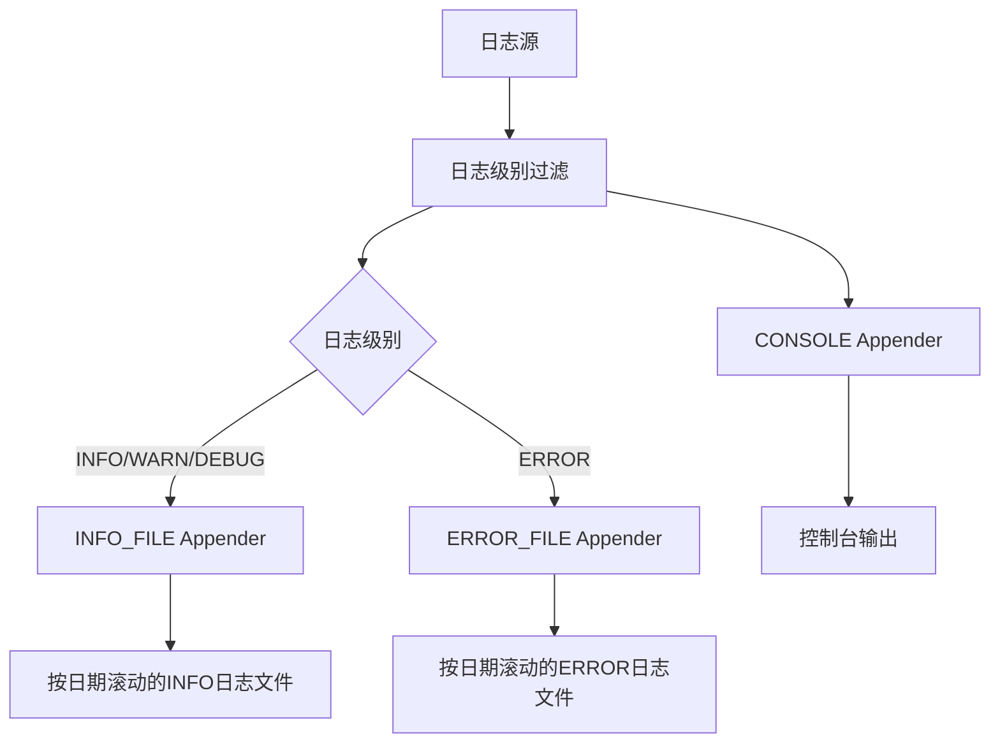
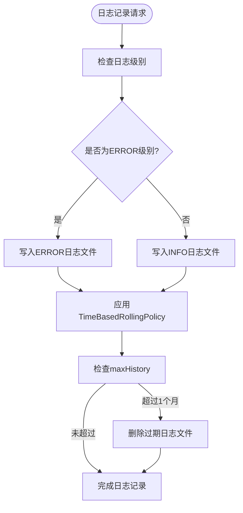
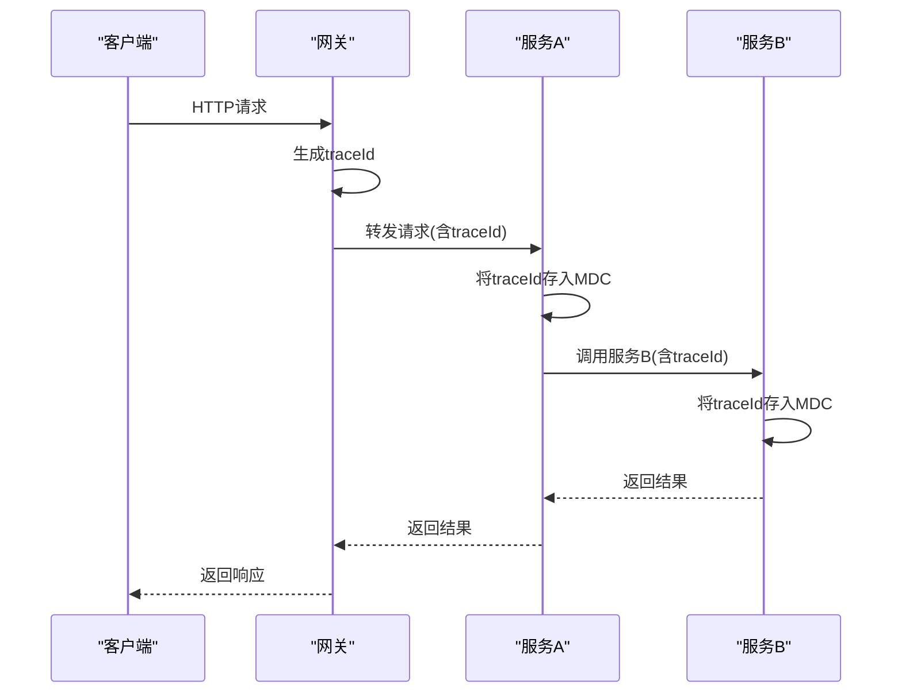
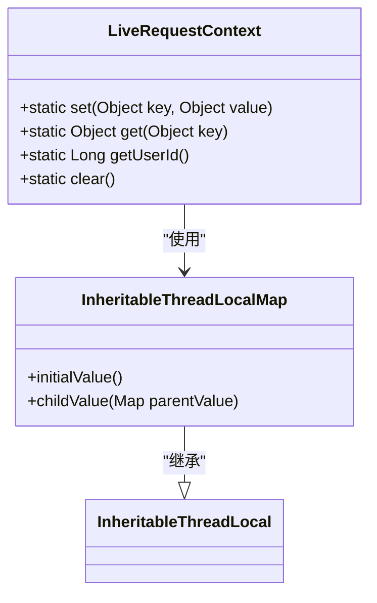
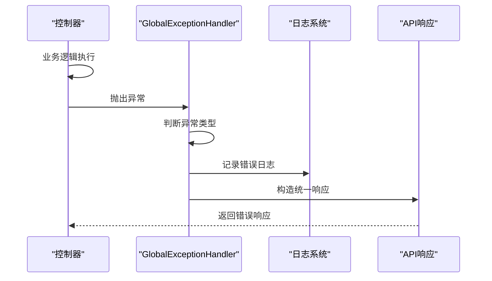
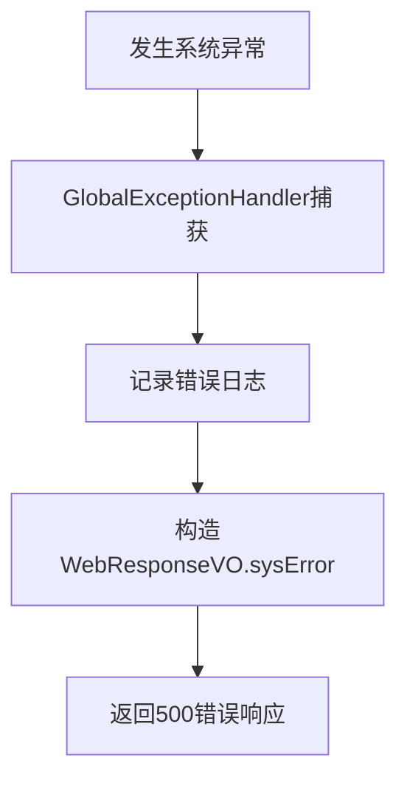
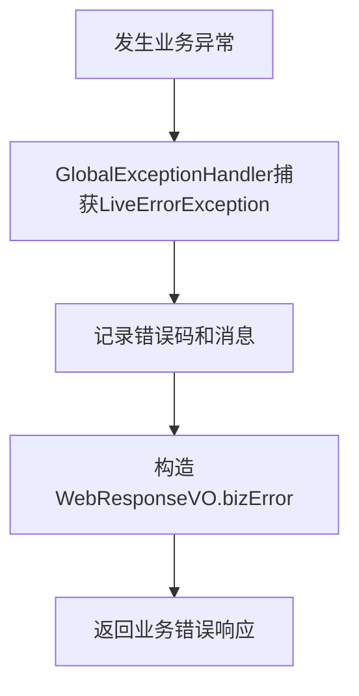
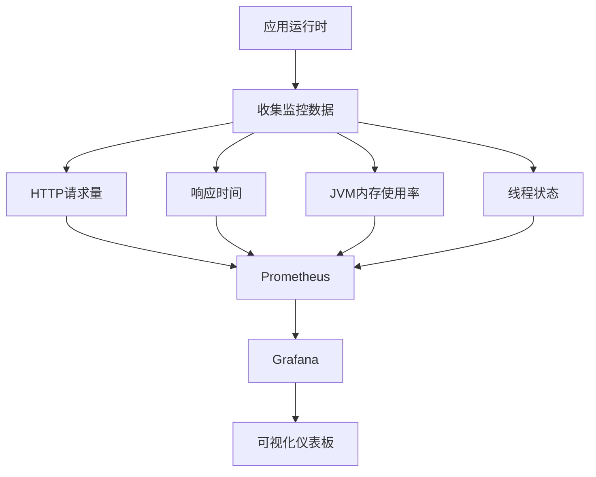
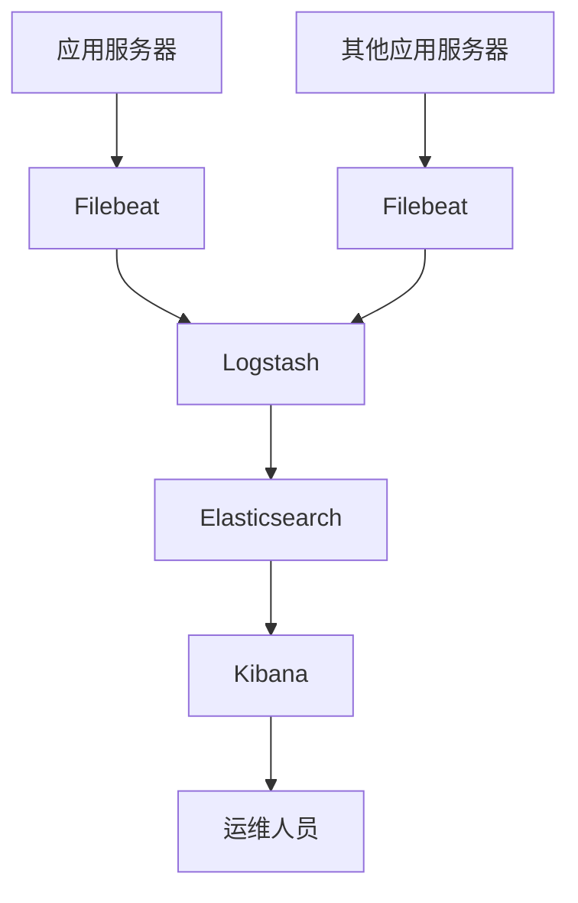

# 日志与监控

<cite>
**本文档引用的文件**
- [logback-spring.xml](file://live-account-provider/src/main/resources/logback-spring.xml)
- [logback-spring.xml](file://live-api/src/main/resources/logback-spring.xml)
- [GlobalExceptionHandler.java](file://live-framework/live-framework-web-starter/src/main/java/com/logilong/live/web/starter/error/GlobalExceptionHandler.java)
- [IpLogConversionRule.java](file://live-common-interface/src/main/java/com/logilong/live/common/interfaces/utils/IpLogConversionRule.java)
- [LiveRequestContext.java](file://live-framework/live-framework-web-starter/src/main/java/com/logilong/live/web/starter/context/LiveRequestContext.java)
- [LiveUserInfoInterceptor.java](file://live-framework/live-framework-web-starter/src/main/java/com/logilong/live/web/starter/context/LiveUserInfoInterceptor.java)
- [WebConfig.java](file://live-framework/live-framework-web-starter/src/main/java/com/logilong/live/web/starter/config/WebConfig.java)
- [bootstrap.yml](file://live-account-provider/src/main/resources/bootstrap.yml)
- [bootstrap.yml](file://live-api/src/main/resources/bootstrap.yml)
</cite>

## 目录
1. [日志配置体系](#日志配置体系)
2. [MDC与请求链路追踪](#mdc与请求链路追踪)
3. [全局异常处理机制](#全局异常处理机制)
4. [监控体系集成](#监控体系集成)
5. [ELK日志收集部署](#elk日志收集部署)

## 日志配置体系

本项目采用Logback作为日志框架，通过`logback-spring.xml`配置文件实现统一的日志管理。所有微服务模块均采用相同的日志配置模式，确保日志格式和行为的一致性。

日志配置包含三个主要输出目标：控制台、INFO级别日志文件和ERROR级别日志文件。日志输出格式统一为`[%d{yyyy-MM-dd HH:mm:ss.SSS} -%5p] %-40.40logger{39} :%msg%n`，包含时间戳、日志级别、类名和日志消息。



**图表来源**
- [logback-spring.xml](file://live-account-provider/src/main/resources/logback-spring.xml#L1-L60)

**本节来源**
- [logback-spring.xml](file://live-account-provider/src/main/resources/logback-spring.xml#L1-L60)
- [logback-spring.xml](file://live-api/src/main/resources/logback-spring.xml#L1-L60)

### 日志格式与输出目标

日志系统配置了三种输出目标：控制台、INFO级别日志文件和ERROR级别日志文件。控制台输出用于开发和调试，而文件输出用于生产环境的持久化存储和问题排查。

INFO级别日志文件记录INFO、WARN、DEBUG级别的日志，而ERROR级别日志文件专门记录ERROR级别的日志。这种分离设计便于运维人员快速定位错误信息，提高问题排查效率。

日志文件存储路径通过`LOG_HOME`变量定义，格式为`/tmp/logs/${APP_NAME}/${index}`，其中`${APP_NAME}`为Spring应用名称，`${index}`为容器标识，确保在Docker环境下多个容器实例的日志目录不会冲突。

**本节来源**
- [logback-spring.xml](file://live-account-provider/src/main/resources/logback-spring.xml#L1-L60)

### 滚动策略与级别控制

日志系统采用基于时间的滚动策略（TimeBasedRollingPolicy），每天生成一个新的日志文件。文件名模式为`${LOG_HOME}/${APP_NAME}.log.%d{yyyy-MM-dd}`，便于按日期归档和检索。

滚动策略配置了`maxHistory`为1，表示只保留最近一个月的日志文件，自动清理过期日志，避免磁盘空间被无限占用。这种策略在保证问题追溯能力的同时，有效控制了存储成本。

日志级别控制通过根日志记录器（root logger）配置，级别设置为INFO，意味着INFO及以上级别（WARN、ERROR）的日志都会被记录。ERROR文件通过LevelFilter过滤器确保只记录ERROR级别的日志，避免信息混杂。



**图表来源**
- [logback-spring.xml](file://live-account-provider/src/main/resources/logback-spring.xml#L21-L25)
- [logback-spring.xml](file://live-account-provider/src/main/resources/logback-spring.xml#L36-L40)

**本节来源**
- [logback-spring.xml](file://live-account-provider/src/main/resources/logback-spring.xml#L21-L40)

## MDC与请求链路追踪

项目通过MDC（Mapped Diagnostic Context）机制实现请求链路追踪，结合traceId进行问题定位。MDC是Logback提供的一个特性，允许在多线程环境中为每个线程维护一个独立的上下文映射，用于存储请求相关的诊断信息。



**图表来源**
- [LiveRequestContext.java](file://live-framework/live-framework-web-starter/src/main/java/com/logilong/live/web/starter/context/LiveRequestContext.java)
- [LiveUserInfoInterceptor.java](file://live-framework/live-framework-web-starter/src/main/java/com/logilong/live/web/starter/context/LiveUserInfoInterceptor.java)

**本节来源**
- [LiveRequestContext.java](file://live-framework/live-framework-web-starter/src/main/java/com/logilong/live/web/starter/context/LiveRequestContext.java#L1-L66)
- [LiveUserInfoInterceptor.java](file://live-framework/live-framework-web-starter/src/main/java/com/logilong/live/web/starter/context/LiveUserInfoInterceptor.java#L1-L35)

### 请求上下文管理

项目通过`LiveRequestContext`类实现请求上下文管理，采用ThreadLocal机制存储请求相关的数据。该类提供了set、get和clear方法，用于在请求处理过程中存储和获取上下文数据。

`LiveRequestContext`使用InheritableThreadLocalMap确保父子线程间的上下文传递，这对于异步处理和线程池场景下的上下文一致性至关重要。当主线程创建子线程时，子线程会继承主线程的上下文副本，保证了traceId等诊断信息的连续性。



**图表来源**
- [LiveRequestContext.java](file://live-framework/live-framework-web-starter/src/main/java/com/logilong/live/web/starter/context/LiveRequestContext.java#L14-L63)

**本节来源**
- [LiveRequestContext.java](file://live-framework/live-framework-web-starter/src/main/java/com/logilong/live/web/starter/context/LiveRequestContext.java#L1-L66)

### 用户信息拦截器

`LiveUserInfoInterceptor`是一个Spring MVC拦截器，负责在请求处理前从HTTP头中提取用户ID并存入请求上下文。该拦截器通过`preHandle`方法实现，从`GatewayHeaderEnum.USER_LOGIN_ID`指定的HTTP头中获取用户ID。

拦截器在`postHandle`方法中调用`LiveRequestContext.clear()`清理线程本地变量，防止内存泄漏。由于Web容器使用线程池处理请求，工作线程会长期存在，如果不及时清理ThreadLocal变量，会导致内存泄漏和数据污染。

```mermaid
flowchart TD
A[请求到达] --> B[执行preHandle]
B --> C[从Header获取userId]
C --> D{userId是否为空?}
D --> |是| E[跳过，返回true]
D --> |否| F[存入LiveRequestContext]
F --> G[返回true继续处理]
G --> H[业务逻辑处理]
H --> I[执行postHandle]
I --> J[调用LiveRequestContext.clear()]
J --> K[响应返回]
```

**图表来源**
- [LiveUserInfoInterceptor.java](file://live-framework/live-framework-web-starter/src/main/java/com/logilong/live/web/starter/context/LiveUserInfoInterceptor.java#L18-L32)
- [LiveRequestContext.java](file://live-framework/live-framework-web-starter/src/main/java/com/logilong/live/web/starter/context/LiveRequestContext.java#L41-L43)

**本节来源**
- [LiveUserInfoInterceptor.java](file://live-framework/live-framework-web-starter/src/main/java/com/logilong/live/web/starter/context/LiveUserInfoInterceptor.java#L1-L35)
- [WebConfig.java](file://live-framework/live-framework-web-starter/src/main/java/com/logilong/live/web/starter/config/WebConfig.java#L24-L26)

## 全局异常处理机制

项目通过`GlobalExceptionHandler`实现全局异常处理，统一捕获和处理应用程序中的异常，确保API响应格式的一致性，并记录详细的错误日志。



**图表来源**
- [GlobalExceptionHandler.java](file://live-framework/live-framework-web-starter/src/main/java/com/logilong/live/web/starter/error/GlobalExceptionHandler.java#L12-L32)

**本节来源**
- [GlobalExceptionHandler.java](file://live-framework/live-framework-web-starter/src/main/java/com/logilong/live/web/starter/error/GlobalExceptionHandler.java#L1-L33)

### 系统异常处理

`GlobalExceptionHandler`通过`@ExceptionHandler(value = Exception.class)`注解捕获所有未处理的系统异常。当发生系统异常时，处理器会记录详细的错误日志，包括请求URI和异常堆栈，然后返回统一的系统错误响应。

错误日志通过`LOGGER.error("{},error is ", request.getRequestURI(), e)`记录，使用了参数化日志记录方式，既保证了日志信息的完整性，又避免了字符串拼接的性能开销。异常堆栈会被完整记录，便于开发人员定位问题根源。



**图表来源**
- [GlobalExceptionHandler.java](file://live-framework/live-framework-web-starter/src/main/java/com/logilong/live/web/starter/error/GlobalExceptionHandler.java#L17-L22)

**本节来源**
- [GlobalExceptionHandler.java](file://live-framework/live-framework-web-starter/src/main/java/com/logilong/live/web/starter/error/GlobalExceptionHandler.java#L17-L22)
- [WebResponseVO.java](file://live-common-interface/src/main/java/com/logilong/live/common/interfaces/vo/WebResponseVO.java)

### 业务异常处理

对于业务异常，项目定义了`LiveErrorException`类，包含错误码和错误消息。`GlobalExceptionHandler`通过`@ExceptionHandler(value = LiveErrorException.class)`注解专门处理此类异常。

业务异常处理流程会记录错误码和错误消息，但不会暴露详细的异常堆栈给客户端，提高了系统的安全性。同时，这种设计使得前端可以根据错误码进行针对性的错误处理，提供更好的用户体验。



**图表来源**
- [GlobalExceptionHandler.java](file://live-framework/live-framework-web-starter/src/main/java/com/logilong/live/web/starter/error/GlobalExceptionHandler.java#L25-L31)
- [LiveErrorException.java](file://live-framework/live-framework-web-starter/src/main/java/com/logilong/live/web/starter/error/LiveErrorException.java#L1-L21)

**本节来源**
- [GlobalExceptionHandler.java](file://live-framework/live-framework-web-starter/src/main/java/com/logilong/live/web/starter/error/GlobalExceptionHandler.java#L25-L31)
- [LiveErrorException.java](file://live-framework/live-framework-web-starter/src/main/java/com/logilong/live/web/starter/error/LiveErrorException.java#L1-L21)

## 监控体系集成

项目具备集成Prometheus + Grafana监控方案的基础，可通过暴露`/actuator/metrics`端点来收集关键监控指标。

### 指标暴露配置

虽然当前配置文件中未直接显示Actuator配置，但基于Spring Boot标准实践，可通过在`bootstrap.yml`中添加Actuator配置来暴露监控端点。建议的配置包括启用metrics端点和Prometheus支持。



**本节来源**
- [bootstrap.yml](file://live-account-provider/src/main/resources/bootstrap.yml#L1-L22)
- [bootstrap.yml](file://live-api/src/main/resources/bootstrap.yml#L1-L22)

### 关键监控指标

建议定义以下关键监控指标：
- HTTP请求量：监控各API端点的请求频率，识别流量高峰和异常访问模式
- 响应时间：监控API的P95、P99响应时间，及时发现性能瓶颈
- JVM内存使用率：监控堆内存、非堆内存使用情况，预防内存溢出
- 线程池状态：监控核心线程数、活跃线程数、队列大小等，确保线程资源合理使用
- 错误率：监控HTTP 5xx错误率，快速发现系统异常

这些指标可通过Prometheus定时抓取，并在Grafana中创建可视化仪表板，实现对系统健康状况的实时监控。

## ELK日志收集部署

### 日志收集架构

建议采用ELK（Elasticsearch、Logstash、Kibana）技术栈实现日志的集中收集、存储和分析。Filebeat作为轻量级日志收集器部署在各应用服务器上，负责将日志文件发送到Logstash。



**本节来源**
- [logback-spring.xml](file://live-account-provider/src/main/resources/logback-spring.xml#L1-L60)

### 部署建议

1. 在每台应用服务器上部署Filebeat，配置其监控`/tmp/logs/`目录下的所有日志文件
2. 部署Logstash作为日志处理中心，负责解析日志格式、添加字段、过滤和转发
3. 部署Elasticsearch集群用于日志存储和检索，确保高可用性和扩展性
4. 部署Kibana提供可视化界面，创建仪表板和告警规则
5. 配置索引生命周期管理（ILM），自动归档和删除过期日志数据

通过ELK体系，可以实现跨服务的日志关联分析，结合traceId快速定位分布式系统中的问题，大大提高运维效率。