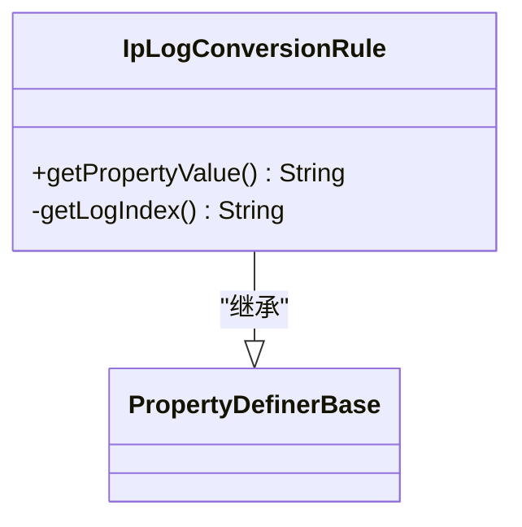
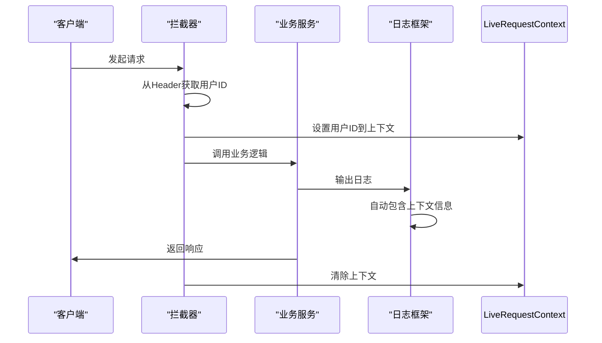

# 日志管理

<cite>
**本文档中引用的文件**   
- [logback-spring.xml](file://live-account-provider/src/main/resources/logback-spring.xml)
- [IpLogConversionRule.java](file://live-common-interface/src/main/java/com/logilong/live/common/interfaces/utils/IpLogConversionRule.java)
- [LiveRequestContext.java](file://live-framework/live-framework-web-starter/src/main/java/com/logilong/live/web/starter/context/LiveRequestContext.java)
- [LiveUserInfoInterceptor.java](file://live-framework/live-framework-web-starter/src/main/java/com/logilong/live/web/starter/context/LiveUserInfoInterceptor.java)
- [RequestLimitInterceptor.java](file://live-framework/live-framework-web-starter/src/main/java/com/logilong/live/web/starter/context/RequestLimitInterceptor.java)
- [WebConfig.java](file://live-framework/live-framework-web-starter/src/main/java/com/logilong/live/web/starter/config/WebConfig.java)
- [RequestConstants.java](file://live-framework/live-framework-web-starter/src/main/java/com/logilong/live/web/starter/constants/RequestConstants.java)
- [GatewayHeaderEnum.java](file://live-common-interface/src/main/java/com/logilong/live/common/interfaces/enums/GatewayHeaderEnum.java)
- [bootstrap.yml](file://live-account-provider/src/main/resources/bootstrap.yml)
- [GiftServiceImpl.java](file://live-api/src/main/java/com/logilong/live/api/service/impl/GiftServiceImpl.java)
</cite>

## 目录
1. [日志配置概述](#日志配置概述)
2. [核心属性定义](#核心属性定义)
3. [Appender配置详解](#appender配置详解)
4. [日志路径冲突解决方案](#日志路径冲突解决方案)
5. [业务代码中的日志使用](#业务代码中的日志使用)
6. [链路追踪实现](#链路追踪实现)
7. [最佳实践建议](#最佳实践建议)

## 日志配置概述

本项目采用Logback作为日志框架，通过`logback-spring.xml`配置文件实现灵活的日志管理。配置文件定义了应用名称、日志存储路径、输出格式以及多种日志输出方式，确保在分布式环境下能够有效管理和追踪日志信息。

**Section sources**
- [logback-spring.xml](file://live-account-provider/src/main/resources/logback-spring.xml)

## 核心属性定义

### APP_NAME属性
`APP_NAME`属性通过Spring Property从`spring.application.name`获取应用名称，若未配置则默认为"undefined"。该属性用于标识不同微服务实例，便于日志分类管理。

```xml
<springProperty name="APP_NAME" scope="context" source="spring.application.name" defaultValue="undefined"/>
```

### LOG_HOME属性
`LOG_HOME`属性定义了日志文件的存储根目录，采用`/tmp/logs/${APP_NAME}/${index}`格式。其中`${APP_NAME}`为应用名称，`${index}`为容器唯一标识，确保不同容器的日志文件路径不冲突。

```xml
<property name="LOG_HOME" value="/tmp/logs/${APP_NAME}/${index}"/>
```

### LOG_PATTERN属性
`LOG_PATTERN`属性定义了日志输出格式，包含时间戳、日志级别、类名和日志内容。统一的格式便于日志解析和分析。

```xml
<property name="LOG_PATTERN" value="[%d{yyyy-MM-dd HH:mm:ss.SSS} -%5p] %-40.40logger{39} :%msg%n"/>
```

**Section sources**
- [logback-spring.xml](file://live-account-provider/src/main/resources/logback-spring.xml)
- [bootstrap.yml](file://live-account-provider/src/main/resources/bootstrap.yml)

## Appender配置详解

### 控制台输出（CONSOLE）
控制台Appender将日志输出到标准输出流，便于开发和调试。使用`ConsoleAppender`类，采用预定义的`LOG_PATTERN`格式。

```xml
<appender name="CONSOLE" class="ch.qos.logback.core.ConsoleAppender">
    <layout class="ch.qos.logback.classic.PatternLayout">
        <pattern>${LOG_PATTERN}</pattern>
    </layout>
</appender>
```

### INFO日志文件（INFO_FILE）
INFO级别日志文件Appender将INFO及以上级别的日志写入文件。采用`RollingFileAppender`实现滚动日志，基于时间的滚动策略（`TimeBasedRollingPolicy`）每天生成一个新的日志文件。

```xml
<appender name="INFO_FILE" class="ch.qos.logback.core.rolling.RollingFileAppender">
    <file>${LOG_HOME}/${APP_NAME}.log</file>
    <rollingPolicy class="ch.qos.logback.core.rolling.TimeBasedRollingPolicy">
        <fileNamePattern>${LOG_HOME}/${APP_NAME}.log.%d{yyyy-MM-dd}</fileNamePattern>
        <maxHistory>1</maxHistory>
    </rollingPolicy>
    <layout class="ch.qos.logback.classic.PatternLayout">
        <pattern>${LOG_PATTERN}</pattern>
    </layout>
</appender>
```

### ERROR日志文件（ERROR_FILE）
ERROR级别日志文件Appender专门记录错误日志。与INFO日志类似，但增加了`LevelFilter`过滤器，只记录ERROR级别的日志，避免错误日志被其他级别日志淹没。

```xml
<appender name="ERROR_FILE" class="ch.qos.logback.core.rolling.RollingFileAppender">
    <file>${LOG_HOME}/${APP_NAME}_error.log</file>
    <rollingPolicy class="ch.qos.logback.core.rolling.TimeBasedRollingPolicy">
        <fileNamePattern>${LOG_HOME}/${APP_NAME}_error.log.%d{yyyy-MM-dd}</fileNamePattern>
        <maxHistory>1</maxHistory>
    </rollingPolicy>
    <layout class="ch.qos.logback.classic.PatternLayout">
        <pattern>${LOG_PATTERN}</pattern>
    </layout>
    <filter class="ch.qos.logback.classic.filter.LevelFilter">
        <level>error</level>
        <onMismatch>DENY</onMismatch>
    </filter>
</appender>
```

**Section sources**
- [logback-spring.xml](file://live-account-provider/src/main/resources/logback-spring.xml)

## 日志路径冲突解决方案

### IpLogConversionRule设计思路
在Docker容器化部署环境中，多个容器可能映射到同一台宿主机，导致日志路径冲突。`IpLogConversionRule`类通过获取容器的IP地址作为唯一标识，解决此问题。

当获取IP地址失败时，使用随机数作为备选方案，确保即使在极端情况下也能生成唯一标识。



**Diagram sources **
- [IpLogConversionRule.java](file://live-common-interface/src/main/java/com/logilong/live/common/interfaces/utils/IpLogConversionRule.java)

**Section sources**
- [IpLogConversionRule.java](file://live-common-interface/src/main/java/com/logilong/live/common/interfaces/utils/IpLogConversionRule.java)

## 业务代码中的日志使用

### SLF4J日志输出
在业务代码中，通过SLF4J API进行日志输出。首先定义静态Logger实例，然后根据需要使用不同级别的日志方法。

```java
private static final Logger LOGGER = LoggerFactory.getLogger(GiftServiceImpl.class);

// 不同级别的日志输出
LOGGER.info("[gift-send] send result is {}", sendResult);
LOGGER.error("[gift-send] send result is error:", e);
```

### 日志级别选择
- **DEBUG**: 用于开发调试，记录详细执行过程
- **INFO**: 用于记录重要业务操作和流程
- **WARN**: 用于记录潜在问题，但不影响系统运行
- **ERROR**: 用于记录错误和异常情况

**Section sources**
- [GiftServiceImpl.java](file://live-api/src/main/java/com/logilong/live/api/service/impl/GiftServiceImpl.java)

## 链路追踪实现

### MDC机制
通过MDC（Mapped Diagnostic Context）实现分布式环境下的链路追踪。在请求处理开始时设置traceId，在请求结束时清除，确保日志能够关联到特定请求。

### 请求上下文管理
`LiveRequestContext`类使用`InheritableThreadLocal`实现线程本地存储，支持父子线程间的上下文传递。



**Diagram sources **
- [LiveRequestContext.java](file://live-framework/live-framework-web-starter/src/main/java/com/logilong/live/web/starter/context/LiveRequestContext.java)
- [LiveUserInfoInterceptor.java](file://live-framework/live-framework-web-starter/src/main/java/com/logilong/live/web/starter/context/LiveUserInfoInterceptor.java)

**Section sources**
- [LiveRequestContext.java](file://live-framework/live-framework-web-starter/src/main/java/com/logilong/live/web/starter/context/LiveRequestContext.java)
- [LiveUserInfoInterceptor.java](file://live-framework/live-framework-web-starter/src/main/java/com/logilong/live/web/starter/context/LiveUserInfoInterceptor.java)
- [RequestLimitInterceptor.java](file://live-framework/live-framework-web-starter/src/main/java/com/logilong/live/web/starter/context/RequestLimitInterceptor.java)
- [WebConfig.java](file://live-framework/live-framework-web-starter/src/main/java/com/logilong/live/web/starter/config/WebConfig.java)

## 最佳实践建议

### 日志配置最佳实践
1. 合理设置`maxHistory`，平衡存储空间和日志保留需求
2. 使用有意义的应用名称，便于日志分类
3. 定期检查日志文件大小和数量，避免磁盘空间耗尽

### 日志使用最佳实践
1. 在关键业务流程中添加INFO级别日志
2. 异常处理时记录完整的错误信息和堆栈
3. 避免在循环中输出大量日志，影响性能
4. 使用参数化日志输出，提高性能

### 链路追踪最佳实践
1. 在请求入口处设置必要的上下文信息
2. 确保在请求结束时清除上下文，防止内存泄漏
3. 将关键业务参数纳入日志输出，便于问题定位

**Section sources**
- [logback-spring.xml](file://live-account-provider/src/main/resources/logback-spring.xml)
- [LiveRequestContext.java](file://live-framework/live-framework-web-starter/src/main/java/com/logilong/live/web/starter/context/LiveRequestContext.java)