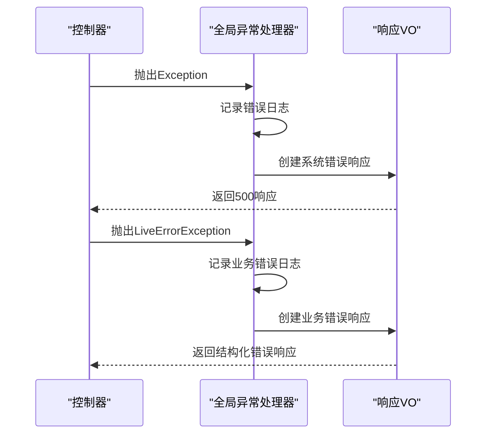
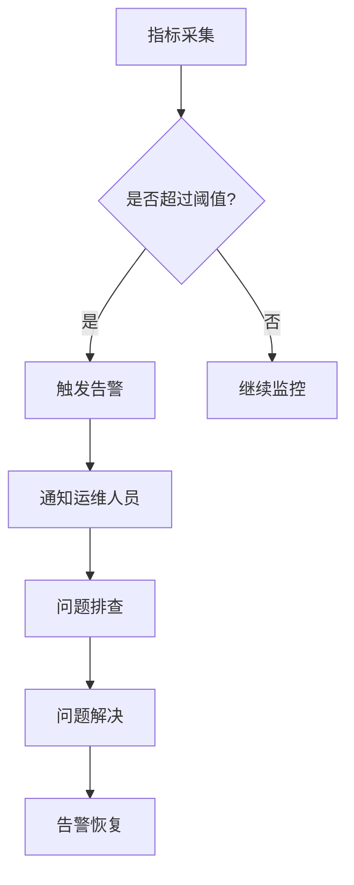

# 系统监控

<cite>
**本文档引用的文件**
- [GlobalExceptionHandler.java](file://live-framework/live-framework-web-starter/src/main/java/com/logilong/live/web/starter/error/GlobalExceptionHandler.java)
- [WebResponseVO.java](file://live-common-interface/src/main/java/com/logilong/live/common/interfaces/vo/WebResponseVO.java)
- [LiveErrorException.java](file://live-framework/live-framework-web-starter/src/main/java/com/logilong/live/web/starter/error/LiveErrorException.java)
- [bootstrap.yml](file://live-gateway/src/main/resources/bootstrap.yml)
- [logback-spring.xml](file://live-gateway/src/main/resources/logback-spring.xml)
- [ApiWebApplication.java](file://live-api/src/main/java/com/logilong/live/api/ApiWebApplication.java)
- [GateWayApplication.java](file://live-gateway/src/main/java/com/logilong/live/gateway/GateWayApplication.java)
</cite>

## 目录
1. [引言](#引言)
2. [Actuator与Prometheus监控体系](#actuator与prometheus监控体系)
3. [日志调试配置](#日志调试配置)
4. [全局异常处理机制](#全局异常处理机制)
5. [关键监控指标](#关键监控指标)
6. [告警规则建议](#告警规则建议)
7. [总结](#总结)

## 引言
本文档详细说明了基于Spring Boot Actuator与Prometheus的监控体系构建方案。通过分析项目代码结构，阐述了如何暴露健康检查和指标端点、配置日志调试级别、实现统一异常处理以及定义关键监控指标。该监控体系为直播平台的稳定运行提供了全面的可观测性支持。

## Actuator与Prometheus监控体系

在Spring Boot应用中，Actuator提供了生产就绪的监控端点，如`/actuator/health`和`/actuator/metrics`。这些端点可以被Prometheus定期抓取以收集系统指标。

虽然具体的Actuator配置未在提供的文件中直接显示，但根据Spring Boot标准实践，需要在`application.yml`或`bootstrap.yml`中启用相关端点。Prometheus通过HTTP请求定期从这些端点获取数据，抓取间隔通常配置为15-30秒，具体取决于监控精度需求和系统负载。

**Section sources**
- [ApiWebApplication.java](file://live-api/src/main/java/com/logilong/live/api/ApiWebApplication.java)
- [GateWayApplication.java](file://live-gateway/src/main/java/com/logilong/live/gateway/GateWayApplication.java)

## 日志调试配置

### 网关层HTTP客户端调试日志
在`live-gateway`模块的`bootstrap.yml`配置文件中，明确设置了网关层的调试日志级别：

```yaml
logging:
  level:
    org.springframework.cloud.gateway: DEBUG
    reactor.netty.http.client: DEBUG
```

此配置启用了Spring Cloud Gateway和Reactor Netty HTTP客户端的DEBUG级别日志，这对于调试网关路由、过滤器执行和HTTP客户端请求/响应过程至关重要。开发人员可以通过这些详细的日志信息追踪请求流经网关的全过程，包括请求头、响应状态码、路由决策等。

### 响应式编程组件调试
通过启用`reactor.netty.http.client: DEBUG`，可以监控基于Reactor的响应式HTTP客户端行为。这对于理解非阻塞I/O操作、连接池管理和背压控制非常有帮助。当出现性能问题或连接超时时，这些日志能提供关键的诊断信息。

**Section sources**
- [bootstrap.yml](file://live-gateway/src/main/resources/bootstrap.yml)
- [logback-spring.xml](file://live-gateway/src/main/resources/logback-spring.xml)

## 全局异常处理机制

### GlobalExceptionHandler作用
`GlobalExceptionHandler`是整个系统统一的异常处理中心，位于`live-framework-web-starter`模块中。它通过`@ControllerAdvice`注解实现全局异常捕获，确保所有控制器抛出的异常都能被统一处理。

该处理器主要捕获两种类型的异常：
1. **Exception**: 捕获所有未处理的系统异常
2. **LiveErrorException**: 捕获业务逻辑中主动抛出的业务异常



**Diagram sources**
- [GlobalExceptionHandler.java](file://live-framework/live-framework-web-starter/src/main/java/com/logilong/live/web/starter/error/GlobalExceptionHandler.java)
- [WebResponseVO.java](file://live-common-interface/src/main/java/com/logilong/live/common/interfaces/vo/WebResponseVO.java)

### 结构化错误响应
通过返回`WebResponseVO`对象，确保所有错误响应都遵循统一的格式，便于前端解析和监控系统识别。`WebResponseVO`类定义了标准的响应结构，包括状态码、消息和数据字段，支持不同类型的错误响应：

- `sysError()`: 系统异常，返回500状态码
- `bizError()`: 业务异常，返回501状态码
- `errorParam()`: 参数错误，返回400状态码

这种统一的错误处理模式大大简化了错误监控和分析工作。

**Section sources**
- [GlobalExceptionHandler.java](file://live-framework/live-framework-web-starter/src/main/java/com/logilong/live/web/starter/error/GlobalExceptionHandler.java)
- [WebResponseVO.java](file://live-common-interface/src/main/java/com/logilong/live/common/interfaces/vo/WebResponseVO.java)
- [LiveErrorException.java](file://live-framework/live-framework-web-starter/src/main/java/com/logilong/live/web/starter/error/LiveErrorException.java)

## 关键监控指标

### HTTP请求指标
- **QPS (Queries Per Second)**: 每秒请求数，衡量系统吞吐量
- **响应时间P95/P99**: 95%和99%的请求响应时间，识别性能瓶颈
- 错误率: HTTP 5xx和4xx状态码的比例

### JVM指标
- **堆内存使用率**: 监控老年代和新生代内存使用情况，预防OOM
- GC频率和暂停时间: Full GC和Young GC的频率及持续时间
- 线程池状态: 活跃线程数、队列大小、拒绝任务数

### 应用特定指标
- 网关路由成功率
- RPC调用延迟和成功率
- 缓存命中率
- 数据库连接池使用情况

这些指标可以通过Actuator的`/actuator/metrics`端点暴露，并由Prometheus抓取。建议使用Grafana创建仪表盘进行可视化展示，设置不同维度的图表，如按服务、按接口、按时间段等。

**Section sources**
- [GlobalExceptionHandler.java](file://live-framework/live-framework-web-starter/src/main/java/com/logilong/live/web/starter/error/GlobalExceptionHandler.java)
- [ApiWebApplication.java](file://live-api/src/main/java/com/logilong/live/api/ApiWebApplication.java)

## 告警规则建议

基于关键监控指标，建议配置以下告警规则：

1. **系统异常告警**: 当5分钟内错误率持续超过1%时触发告警
2. **性能降级告警**: P99响应时间连续5分钟超过1秒
3. **资源耗尽告警**: JVM堆内存使用率持续超过80%
4. **服务不可用告警**: `/actuator/health`端点返回非UP状态超过1分钟
5. **高负载告警**: QPS超过预设阈值的80%

这些告警规则应配置在Prometheus的Alertmanager中，通过邮件、短信或即时通讯工具通知运维人员。告警信息应包含详细的上下文信息，如服务名称、实例IP、异常堆栈等，以便快速定位问题。



**Diagram sources**
- [GlobalExceptionHandler.java](file://live-framework/live-framework-web-starter/src/main/java/com/logilong/live/web/starter/error/GlobalExceptionHandler.java)

## 总结
本监控体系通过Spring Boot Actuator、Prometheus和统一异常处理机制，为直播平台提供了全面的可观测性。通过合理配置日志级别、定义关键指标和设置智能告警，能够及时发现和解决系统问题，保障服务的稳定性和可靠性。建议持续优化监控策略，根据实际运行情况调整指标阈值和告警规则。