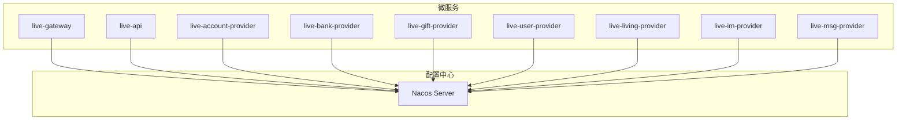
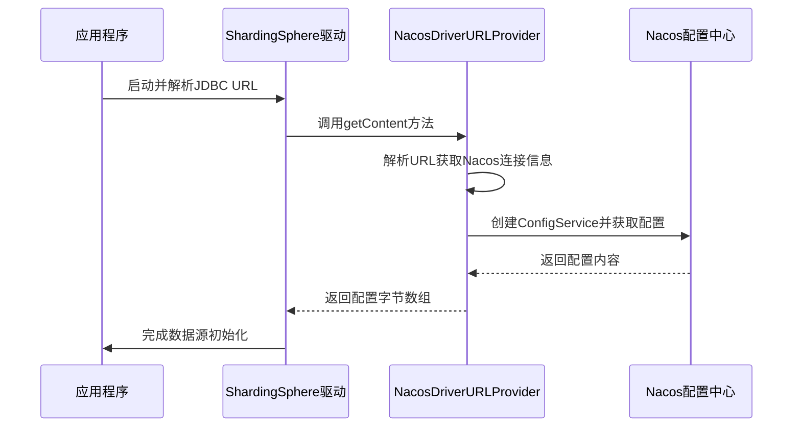
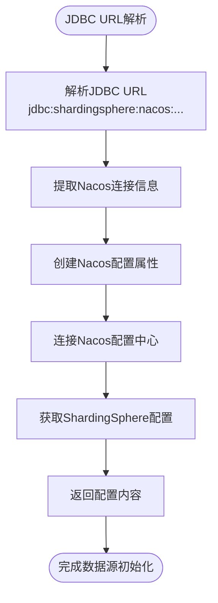

# 服务配置

<cite>
**本文档引用文件**  
- [bootstrap.yml](file://live-account-provider/src/main/resources/bootstrap.yml)
- [bootstrap.yml](file://live-api/src/main/resources/bootstrap.yml)
- [bootstrap.yml](file://live-gateway/src/main/resources/bootstrap.yml)
- [bootstrap.yml](file://live-bank-provider/src/main/resources/bootstrap.yml)
- [bootstrap.yml](file://live-gift-provider/src/main/resources/bootstrap.yml)
- [bootstrap.yml](file://live-im-core-server/src/main/resources/bootstrap.yml)
- [bootstrap.yml](file://live-user-provider/src/main/resources/bootstrap.yml)
- [bootstrap.yml](file://live-living-provider/src/main/resources/bootstrap.yml)
- [bootstrap.yml](file://live-id-generate-provider/src/main/resources/bootstrap.yml)
- [bootstrap.yml](file://live-bank-api/src/main/resources/bootstrap.yml)
- [bootstrap.yml](file://live-im-router-provider/src/main/resources/bootstrap.yml)
- [NacosDriverURLProvider.java](file://live-framework/live-framework-datasource-starter/src/main/java/com/logilong/live/framework/datasource/starter/config/NacosDriverURLProvider.java)
- [org.apache.shardingsphere.driver.jdbc.core.driver.ShardingSphereDriverURLProvider](file://live-framework/live-framework-datasource-starter/src/main/resources/META-INF/services/org.apache.shardingsphere.driver.jdbc.core.driver.ShardingSphereDriverURLProvider)
- [GatewayApplicationProperties.java](file://live-gateway/src/main/java/com/logilong/live/gateway/properties/GatewayApplicationProperties.java)
- [ApplicationProperties.java](file://live-msg-provider/src/main/java/com/logilong/live/msg/provider/config/ApplicationProperties.java)
- [pom.xml](file://pom.xml)
</cite>

## 目录
1. [简介](#简介)
2. [项目结构](#项目结构)
3. [核心配置项详解](#核心配置项详解)
4. [Nacos配置管理机制](#nacos配置管理机制)
5. [配置隔离与环境管理](#配置隔离与环境管理)
6. [配置加载优先级与动态刷新](#配置加载优先级与动态刷新)
7. [特殊配置场景](#特殊配置场景)
8. [配置加密方案](#配置加密方案)
9. [常见配置问题排查](#常见配置问题排查)
10. [结论](#结论)

## 简介
本文档详细说明基于Nacos的分布式配置管理机制，涵盖`bootstrap.yml`中关键配置项的作用与设置方法，指导如何在Nacos控制台创建命名空间、分组与配置文件，实现不同环境（dev/test/prod）的配置隔离。同时说明配置文件的加载优先级、动态刷新机制（@RefreshScope）以及配置加密方案，并提供常见配置错误排查方法。

## 项目结构
本项目采用微服务架构，包含多个服务模块，每个模块都有独立的`bootstrap.yml`配置文件用于Nacos配置管理。所有服务通过Nacos进行配置中心化管理，实现配置的动态更新和环境隔离。



**图示来源**
- [bootstrap.yml](file://live-gateway/src/main/resources/bootstrap.yml)
- [bootstrap.yml](file://live-api/src/main/resources/bootstrap.yml)
- [bootstrap.yml](file://live-account-provider/src/main/resources/bootstrap.yml)
- [bootstrap.yml](file://live-bank-provider/src/main/resources/bootstrap.yml)
- [bootstrap.yml](file://live-gift-provider/src/main/resources/bootstrap.yml)
- [bootstrap.yml](file://live-user-provider/src/main/resources/bootstrap.yml)
- [bootstrap.yml](file://live-living-provider/src/main/resources/bootstrap.yml)
- [bootstrap.yml](file://live-im-provider/src/main/resources/bootstrap.yml)
- [bootstrap.yml](file://live-msg-provider/src/main/resources/bootstrap.yml)

## 核心配置项详解

### spring.application.name
该配置项定义了应用的名称，是Nacos中配置文件的Data ID前缀。每个微服务都有唯一的应用名称，如`live-account-provider`、`live-api`等，用于在Nacos中标识和查找对应的配置文件。

**配置示例：**
```yaml
spring:
  application:
    name: live-account-provider
```

### spring.cloud.nacos.config.server-addr
该配置项指定Nacos配置服务器的地址，所有服务都配置为`live-server:8848`，这是Nacos服务的访问地址和端口。

### spring.cloud.nacos.discovery.server-addr
该配置项指定Nacos服务发现服务器的地址，同样配置为`live-server:8848`，用于服务注册与发现功能。

### spring.cloud.nacos.config.namespace
该配置项指定Nacos命名空间，所有服务都配置为`live-test`，用于实现不同环境的配置隔离。

### spring.cloud.nacos.config.file-extension
该配置项指定配置文件的扩展名，配置为`yaml`，表示从Nacos读取的配置文件格式为YAML。

### spring.config.import
该配置项使用`optional:nacos:${spring.application.name}.yaml`语法，表示可选地从Nacos导入配置文件，文件名为`${spring.application.name}.yaml`。

**配置项来源**
- [bootstrap.yml](file://live-account-provider/src/main/resources/bootstrap.yml#L1-L22)
- [bootstrap.yml](file://live-api/src/main/resources/bootstrap.yml#L1-L22)
- [bootstrap.yml](file://live-gateway/src/main/resources/bootstrap.yml#L1-L29)
- [bootstrap.yml](file://live-bank-provider/src/main/resources/bootstrap.yml#L1-L22)
- [bootstrap.yml](file://live-gift-provider/src/main/resources/bootstrap.yml#L1-L22)
- [bootstrap.yml](file://live-user-provider/src/main/resources/bootstrap.yml#L1-L22)
- [bootstrap.yml](file://live-living-provider/src/main/resources/bootstrap.yml#L1-L24)
- [bootstrap.yml](file://live-id-generate-provider/src/main/resources/bootstrap.yml#L1-L22)
- [bootstrap.yml](file://live-bank-api/src/main/resources/bootstrap.yml#L1-L22)
- [bootstrap.yml](file://live-im-router-provider/src/main/resources/bootstrap.yml#L1-L26)

## Nacos配置管理机制

### 配置加载流程
1. 服务启动时，通过`bootstrap.yml`中的配置连接到Nacos服务器
2. 根据`spring.application.name`和`file-extension`确定配置文件名
3. 从指定的命名空间中获取配置内容
4. 将配置注入到Spring环境中

### 自定义配置加载器
项目中实现了自定义的Nacos驱动URL提供器，用于从Nacos加载ShardingSphere的配置。



**图示来源**
- [NacosDriverURLProvider.java](file://live-framework/live-framework-datasource-starter/src/main/java/com/logilong/live/framework/datasource/starter/config/NacosDriverURLProvider.java#L32-L95)
- [org.apache.shardingsphere.driver.jdbc.core.driver.ShardingSphereDriverURLProvider](file://live-framework/live-framework-datasource-starter/src/main/resources/META-INF/services/org.apache.shardingsphere.driver.jdbc.core.driver.ShardingSphereDriverURLProvider#L1)

## 配置隔离与环境管理

### 命名空间（Namespace）
项目使用Nacos的命名空间功能实现环境隔离，当前所有服务配置为`live-test`命名空间。在实际部署中，可以通过创建不同的命名空间来区分开发、测试和生产环境：

- `live-dev`: 开发环境
- `live-test`: 测试环境  
- `live-prod`: 生产环境

### 分组（Group）
虽然配置文件中未显式指定分组，但Nacos默认使用`DEFAULT_GROUP`。可以通过配置`spring.cloud.nacos.config.group`来指定自定义分组，实现更细粒度的配置管理。

### 配置文件命名规范
配置文件遵循统一的命名规范：`${spring.application.name}.yaml`，确保每个服务都能正确加载自己的配置。

**配置隔离来源**
- [bootstrap.yml](file://live-account-provider/src/main/resources/bootstrap.yml#L10-L11)
- [bootstrap.yml](file://live-api/src/main/resources/bootstrap.yml#L10-L11)
- [bootstrap.yml](file://live-gateway/src/main/resources/bootstrap.yml#L12)
- [bootstrap.yml](file://live-bank-provider/src/main/resources/bootstrap.yml#L10-L11)

## 配置加载优先级与动态刷新

### 配置加载优先级
1. Bootstrap配置（bootstrap.yml）
2. Nacos远程配置
3. 本地配置文件（application.yml）
4. 命令行参数

### 动态刷新机制
通过`@RefreshScope`注解实现配置的动态刷新。当Nacos中的配置发生变化时，带有`@RefreshScope`注解的Bean会被重新创建，从而获取最新的配置值。

```java
@RefreshScope
@ConfigurationProperties(prefix = "gateway")
@Component
public class GatewayApplicationProperties {
    // 配置属性
}
```

**动态刷新来源**
- [GatewayApplicationProperties.java](file://live-gateway/src/main/java/com/logilong/live/gateway/properties/GatewayApplicationProperties.java#L11)

## 特殊配置场景

### 数据库配置加载
通过自定义的`NacosDriverURLProvider`实现ShardingSphere配置从Nacos加载，支持分库分表配置的动态管理。



**特殊配置来源**
- [NacosDriverURLProvider.java](file://live-framework/live-framework-datasource-starter/src/main/java/com/logilong/live/framework/datasource/starter/config/NacosDriverURLProvider.java#L35-L95)

### 消息服务配置
消息服务模块使用独立的配置类管理应用属性，支持灵活的配置管理。

```java
@Configuration
@ConfigurationProperties(prefix = "application")
@Data
public class ApplicationProperties {
    private String smsTemplateId;
    private ThreadPoolConfig threadPool;
    // 其他配置属性
}
```

**消息服务配置来源**
- [ApplicationProperties.java](file://live-msg-provider/src/main/java/com/logilong/live/msg/provider/config/ApplicationProperties.java)

## 配置加密方案

### 密码管理
当前配置中Nacos的用户名和密码直接明文配置：

```yaml
spring:
  cloud:
    nacos:
      username: nacos
      password: nacos
```

### 加密建议
建议采用以下加密方案：
1. 使用环境变量替代明文密码
2. 集成配置加密插件
3. 使用Vault等密钥管理服务
4. 采用加密配置文件，启动时解密

### 安全配置最佳实践
- 敏感信息不应直接写在配置文件中
- 使用不同的账号密码用于不同环境
- 定期更换密码并限制权限
- 启用Nacos的鉴权功能

## 常见配置问题排查

### 服务注册失败
**可能原因：**
- Nacos服务器地址配置错误
- 网络连接问题
- 命名空间不存在
- 认证信息错误

**解决方案：**
1. 检查`spring.cloud.nacos.discovery.server-addr`配置
2. 确认Nacos服务是否正常运行
3. 验证网络连通性
4. 检查命名空间配置是否正确

### 配置未生效
**可能原因：**
- 配置文件名不匹配
- 命名空间不正确
- 配置格式错误
- 缺少`@RefreshScope`注解

**解决方案：**
1. 确认`spring.application.name`与Nacos中Data ID一致
2. 检查`namespace`配置是否正确
3. 验证YAML格式是否正确
4. 确保需要动态刷新的Bean添加了`@RefreshScope`注解

### 配置加载顺序问题
**可能原因：**
- bootstrap.yml加载顺序问题
- 配置优先级冲突
- 循环依赖

**解决方案：**
1. 确保关键配置在bootstrap.yml中
2. 明确配置优先级规则
3. 避免配置间的循环依赖

**问题排查来源**
- [bootstrap.yml](file://live-account-provider/src/main/resources/bootstrap.yml)
- [bootstrap.yml](file://live-api/src/main/resources/bootstrap.yml)
- [bootstrap.yml](file://live-gateway/src/main/resources/bootstrap.yml)
- [NacosDriverURLProvider.java](file://live-framework/live-framework-datasource-starter/src/main/java/com/logilong/live/framework/datasource/starter/config/NacosDriverURLProvider.java)

## 结论
本项目通过Nacos实现了统一的分布式配置管理，所有微服务都遵循一致的配置管理规范。通过`bootstrap.yml`中的标准化配置，实现了服务的自动注册、配置的动态加载和环境的隔离管理。建议进一步完善配置加密机制，提高系统的安全性。同时，可以考虑引入配置版本管理和灰度发布功能，提升配置管理的灵活性和可靠性。