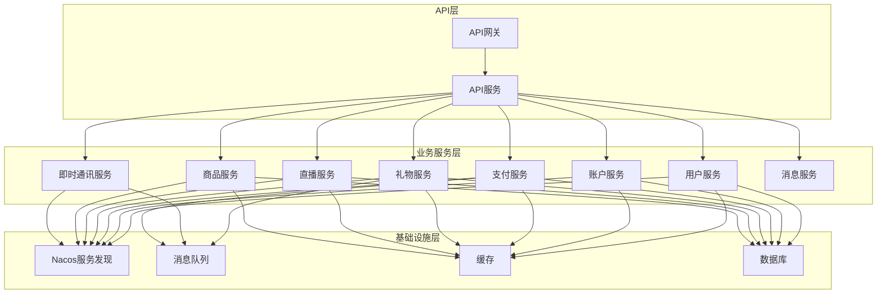
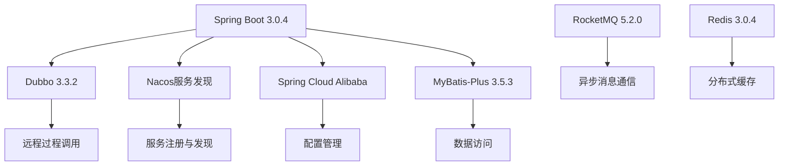
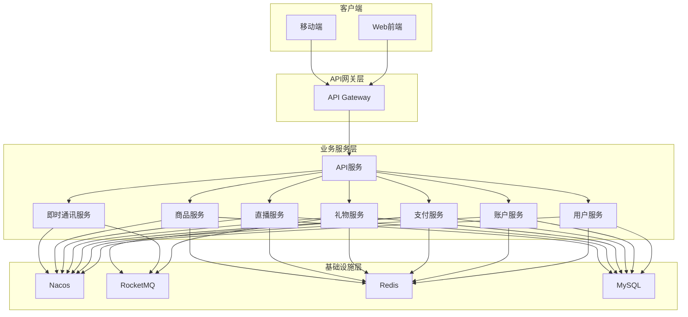
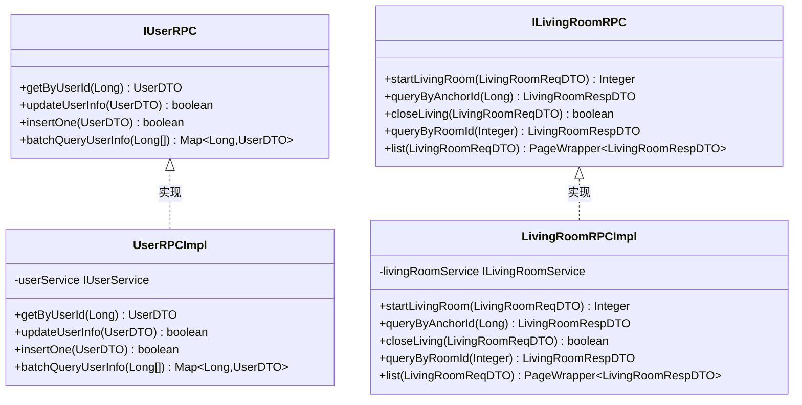
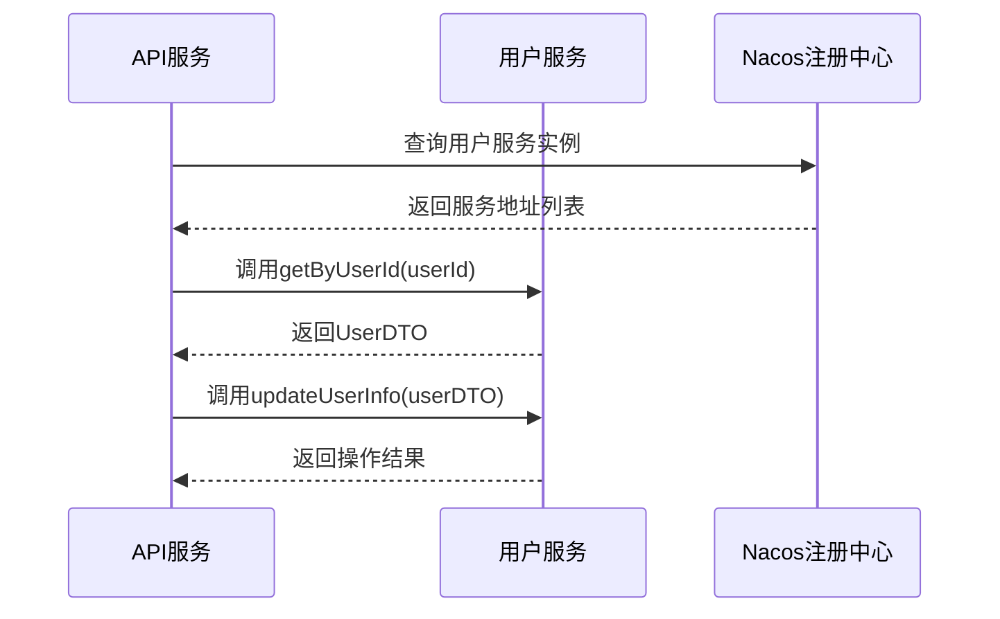
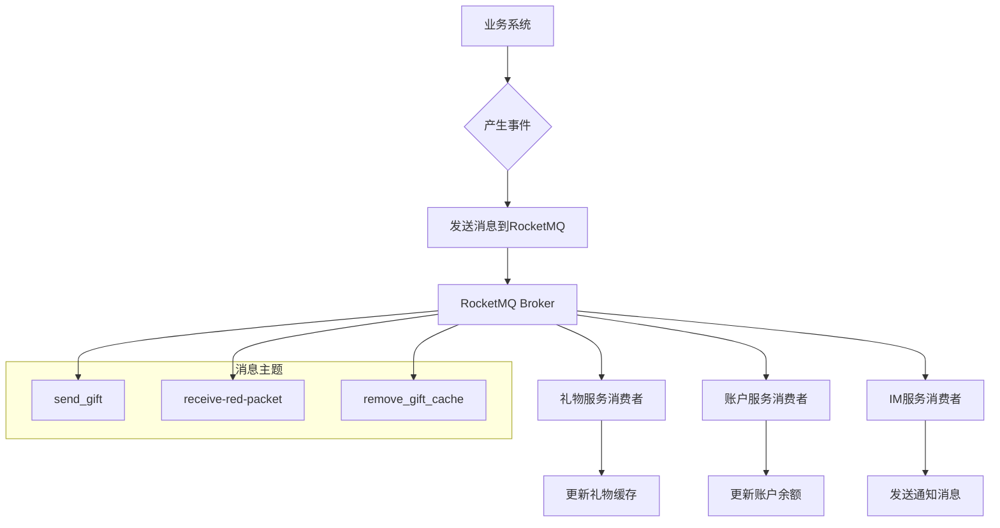
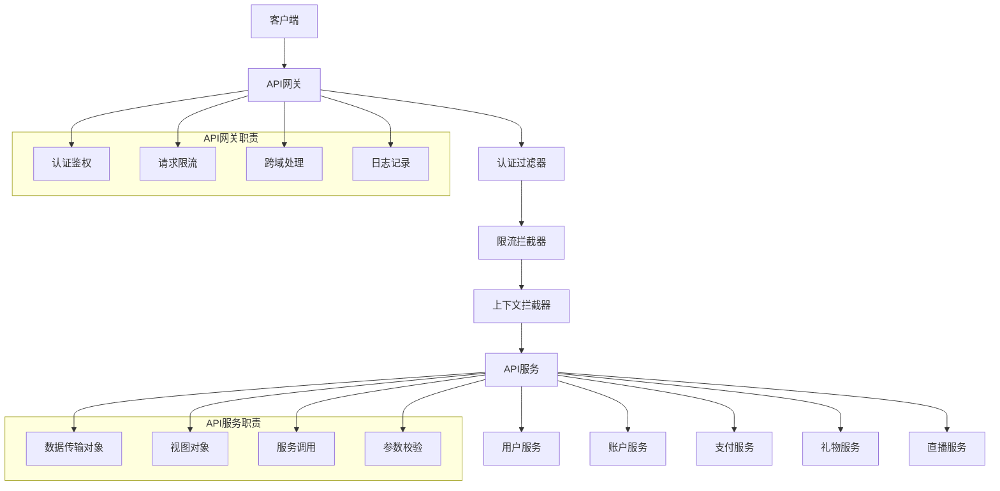
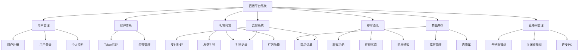
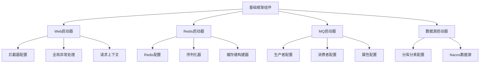

# 项目概述

<cite>
**本文档中引用的文件**  
- [pom.xml](file://pom.xml)
- [live-api/pom.xml](file://live-api/pom.xml)
- [live-gateway/pom.xml](file://live-gateway/pom.xml)
- [live-framework/live-framework-web-starter/pom.xml](file://live-framework/live-framework-web-starter/pom.xml)
- [live-api/src/main/java/com/logilong/live/api/ApiWebApplication.java](file://live-api/src/main/java/com/logilong/live/api/ApiWebApplication.java)
- [live-gateway/src/main/java/com/logilong/live/gateway/GateWayApplication.java](file://live-gateway/src/main/java/com/logilong/live/gateway/GateWayApplication.java)
- [live-framework/live-framework-web-starter/src/main/java/com/logilong/live/web/starter/config/WebConfig.java](file://live-framework/live-framework-web-starter/src/main/java/com/logilong/live/web/starter/config/WebConfig.java)
- [live-framework/live-framework-mq-starter/src/main/java/com/logilong/live/framework/mq/starter/producer/RocketMQProducerConfig.java](file://live-framework/live-framework-mq-starter/src/main/java/com/logilong/live/framework/mq/starter/producer/RocketMQProducerConfig.java)
- [live-framework/live-framework-redis-starter/src/main/java/com/logilong/live/framework/redis/starter/config/RedisConfig.java](file://live-framework/live-framework-redis-starter/src/main/java/com/logilong/live/framework/redis/starter/config/RedisConfig.java)
- [live-user-interface/src/main/java/com/logilong/live/user/interfaces/IUserRPC.java](file://live-user-interface/src/main/java/com/logilong/live/user/interfaces/IUserRPC.java)
- [live-user-provider/src/main/java/com/logilong/live/user/provider/rpc/UserRPCImpl.java](file://live-user-provider/src/main/java/com/logilong/live/user/provider/rpc/UserRPCImpl.java)
- [live-living-provider/src/main/java/com/logilong/live/living/provider/rpc/LivingRoomRPCImpl.java](file://live-living-provider/src/main/java/com/logilong/live/living/provider/rpc/LivingRoomRPCImpl.java)
- [live-common-interface/src/main/java/com/logilong/live/common/interfaces/topic/GiftProviderTopicNames.java](file://live-common-interface/src/main/java/com/logilong/live/common/interfaces/topic/GiftProviderTopicNames.java)
- [live-api/src/main/java/com/logilong/live/api/controller/UserLoginController.java](file://live-api/src/main/java/com/logilong/live/api/controller/UserLoginController.java)
- [live-api/src/main/java/com/logilong/live/api/service/impl/UserLoginServiceImpl.java](file://live-api/src/main/java/com/logilong/live/api/service/impl/UserLoginServiceImpl.java)
</cite>

## 目录
1. [项目结构](#项目结构)
2. [技术栈与依赖管理](#技术栈与依赖管理)
3. [系统架构设计](#系统架构设计)
4. [微服务模块划分](#微服务模块划分)
5. [接口与实现分离设计](#接口与实现分离设计)
6. [服务通信机制](#服务通信机制)
7. [异步消息处理](#异步消息处理)
8. [API网关与业务服务分层](#api网关与业务服务分层)
9. [核心功能模块](#核心功能模块)
10. [公共基础组件](#公共基础组件)

## 项目结构

liveplatform项目采用Maven多模块架构，构建了一个完整的直播生态系统。项目包含多个独立的微服务模块，每个模块负责特定的业务功能。整体结构清晰，遵循微服务设计原则，实现了高内聚、低耦合的系统架构。

**Diagram sources**  
- [pom.xml](file://pom.xml#L17-L45)
- [live-api/pom.xml](file://live-api/pom.xml#L20-L107)

**Section sources**  
- [pom.xml](file://pom.xml#L1-L92)

## 技术栈与依赖管理

项目基于Spring Boot + Dubbo + Nacos + RocketMQ的技术组合构建，形成了一个高并发、可扩展的微服务生态系统。通过Maven的依赖管理机制，确保了各模块间技术栈的一致性。

核心依赖版本信息如下：
- Spring Boot: 3.0.4
- Dubbo: 3.3.2
- Nacos: 通过Spring Cloud Alibaba集成
- RocketMQ: 5.2.0
- Redis: 3.0.4
- MyBatis-Plus: 3.5.3
- Sharding-JDBC: 5.3.2

**Diagram sources**  
- [pom.xml](file://pom.xml#L47-L76)
- [live-api/pom.xml](file://live-api/pom.xml#L20-L38)

**Section sources**  
- [pom.xml](file://pom.xml#L47-L76)

## 系统架构设计

系统采用分层架构设计，分为API网关层、业务服务层和基础设施层。这种设计模式实现了关注点分离，提高了系统的可维护性和可扩展性。

**Diagram sources**  
- [live-gateway/src/main/java/com/logilong/live/gateway/GateWayApplication.java](file://live-gateway/src/main/java/com/logilong/live/gateway/GateWayApplication.java#L8-L16)
- [live-api/src/main/java/com/logilong/live/api/ApiWebApplication.java](file://live-api/src/main/java/com/logilong/live/api/ApiWebApplication.java#L9-L18)

**Section sources**  
- [live-gateway/src/main/java/com/logilong/live/gateway/GateWayApplication.java](file://live-gateway/src/main/java/com/logilong/live/gateway/GateWayApplication.java#L1-L17)
- [live-api/src/main/java/com/logilong/live/api/ApiWebApplication.java](file://live-api/src/main/java/com/logilong/live/api/ApiWebApplication.java#L1-L19)

## 微服务模块划分

项目按照业务领域进行了清晰的微服务划分，每个服务模块都有明确的职责边界：

- **用户服务** (live-user-*): 负责用户管理、账户体系
- **账户服务** (live-account-*): 处理账户相关的token验证等
- **支付服务** (live-bank-*): 管理支付订单、货币账户等
- **礼物服务** (live-gift-*): 处理礼物打赏、红包等功能
- **直播服务** (live-living-*): 管理直播间生命周期
- **商品服务** (live-sku-*): 处理商品库存、购物车等
- **即时通讯服务** (live-im-*): 提供IM核心功能
- **消息服务** (live-msg-*): 负责短信通知等消息发送

这种模块化设计使得各服务可以独立开发、部署和扩展，符合微服务架构的最佳实践。

**Section sources**  
- [pom.xml](file://pom.xml#L17-L45)

## 接口与实现分离设计

项目采用了接口与实现分离的设计理念，通过`*-interface`和`*-provider`模块的分离，实现了服务契约与具体实现的解耦。

**Diagram sources**  
- [live-user-interface/src/main/java/com/logilong/live/user/interfaces/IUserRPC.java](file://live-user-interface/src/main/java/com/logilong/live/user/interfaces/IUserRPC.java#L8-L42)
- [live-user-provider/src/main/java/com/logilong/live/user/provider/rpc/UserRPCImpl.java](file://live-user-provider/src/main/java/com/logilong/live/user/provider/rpc/UserRPCImpl.java#L13-L39)
- [live-living-provider/src/main/java/com/logilong/live/living/provider/rpc/LivingRoomRPCImpl.java](file://live-living-provider/src/main/java/com/logilong/live/living/provider/rpc/LivingRoomRPCImpl.java#L14-L64)

**Section sources**  
- [live-user-interface/src/main/java/com/logilong/live/user/interfaces/IUserRPC.java](file://live-user-interface/src/main/java/com/logilong/live/user/interfaces/IUserRPC.java#L1-L43)
- [live-user-provider/src/main/java/com/logilong/live/user/provider/rpc/UserRPCImpl.java](file://live-user-provider/src/main/java/com/logilong/live/user/provider/rpc/UserRPCImpl.java#L1-L40)
- [live-living-provider/src/main/java/com/logilong/live/living/provider/rpc/LivingRoomRPCImpl.java](file://live-living-provider/src/main/java/com/logilong/live/living/provider/rpc/LivingRoomRPCImpl.java#L1-L65)

## 服务通信机制

系统采用Dubbo作为远程过程调用框架，结合Nacos实现服务发现与配置管理。这种技术组合为微服务间的通信提供了高性能、高可靠的解决方案。

Dubbo服务提供者通过`@DubboService`注解暴露服务，消费者通过`@DubboReference`注解引用服务，实现了服务的自动注册与发现。

**Section sources**  
- [live-user-provider/src/main/java/com/logilong/live/user/provider/rpc/UserRPCImpl.java](file://live-user-provider/src/main/java/com/logilong/live/user/provider/rpc/UserRPCImpl.java#L13-L39)
- [live-api/pom.xml](file://live-api/pom.xml#L21-L25)

## 异步消息处理

系统使用RocketMQ实现异步消息通信，解耦了高并发场景下的业务处理。通过消息队列，实现了最终一致性，提高了系统的响应性能和可靠性。

**Diagram sources**  
- [live-framework/live-framework-mq-starter/src/main/java/com/logilong/live/framework/mq/starter/producer/RocketMQProducerConfig.java](file://live-framework/live-framework-mq-starter/src/main/java/com/logilong/live/framework/mq/starter/producer/RocketMQProducerConfig.java#L19-L52)
- [live-common-interface/src/main/java/com/logilong/live/common/interfaces/topic/GiftProviderTopicNames.java](file://live-common-interface/src/main/java/com/logilong/live/common/interfaces/topic/GiftProviderTopicNames.java#L4-L20)

**Section sources**  
- [live-framework/live-framework-mq-starter/src/main/java/com/logilong/live/framework/mq/starter/producer/RocketMQProducerConfig.java](file://live-framework/live-framework-mq-starter/src/main/java/com/logilong/live/framework/mq/starter/producer/RocketMQProducerConfig.java#L1-L53)
- [live-common-interface/src/main/java/com/logilong/live/common/interfaces/topic/GiftProviderTopicNames.java](file://live-common-interface/src/main/java/com/logilong/live/common/interfaces/topic/GiftProviderTopicNames.java#L1-L21)

## API网关与业务服务分层

系统采用API网关模式，将API服务与业务服务进行分层架构设计。API网关负责请求路由、认证鉴权等横切关注点，而业务服务专注于核心业务逻辑的实现。

**Diagram sources**  
- [live-gateway/src/main/java/com/logilong/live/gateway/GateWayApplication.java](file://live-gateway/src/main/java/com/logilong/live/gateway/GateWayApplication.java#L8-L16)
- [live-api/src/main/java/com/logilong/live/api/ApiWebApplication.java](file://live-api/src/main/java/com/logilong/live/api/ApiWebApplication.java#L9-L18)
- [live-framework/live-framework-web-starter/src/main/java/com/logilong/live/web/starter/config/WebConfig.java](file://live-framework/live-framework-web-starter/src/main/java/com/logilong/live/web/starter/config/WebConfig.java#L10-L28)

**Section sources**  
- [live-gateway/src/main/java/com/logilong/live/gateway/GateWayApplication.java](file://live-gateway/src/main/java/com/logilong/live/gateway/GateWayApplication.java#L1-L17)
- [live-api/src/main/java/com/logilong/live/api/ApiWebApplication.java](file://live-api/src/main/java/com/logilong/live/api/ApiWebApplication.java#L1-L19)
- [live-framework/live-framework-web-starter/src/main/java/com/logilong/live/web/starter/config/WebConfig.java](file://live-framework/live-framework-web-starter/src/main/java/com/logilong/live/web/starter/config/WebConfig.java#L1-L29)

## 核心功能模块

系统涵盖了直播平台的核心业务场景，包括用户管理、账户体系、支付系统、礼物打赏、即时通讯、商品库存等关键功能。

**Section sources**  
- [pom.xml](file://pom.xml#L17-L45)

## 公共基础组件

项目通过`live-framework`模块提供了统一的基础组件支持，包括Web配置、Redis集成、MQ集成等，确保了各服务模块技术实现的一致性。

**Diagram sources**  
- [live-framework/live-framework-web-starter/src/main/java/com/logilong/live/web/starter/config/WebConfig.java](file://live-framework/live-framework-web-starter/src/main/java/com/logilong/live/web/starter/config/WebConfig.java#L10-L28)
- [live-framework/live-framework-redis-starter/src/main/java/com/logilong/live/framework/redis/starter/config/RedisConfig.java](file://live-framework/live-framework-redis-starter/src/main/java/com/logilong/live/framework/redis/starter/config/RedisConfig.java#L12-L27)
- [live-framework/live-framework-mq-starter/src/main/java/com/logilong/live/framework/mq/starter/producer/RocketMQProducerConfig.java](file://live-framework/live-framework-mq-starter/src/main/java/com/logilong/live/framework/mq/starter/producer/RocketMQProducerConfig.java#L19-L52)

**Section sources**  
- [live-framework/live-framework-web-starter/src/main/java/com/logilong/live/web/starter/config/WebConfig.java](file://live-framework/live-framework-web-starter/src/main/java/com/logilong/live/web/starter/config/WebConfig.java#L1-L29)
- [live-framework/live-framework-redis-starter/src/main/java/com/logilong/live/framework/redis/starter/config/RedisConfig.java](file://live-framework/live-framework-redis-starter/src/main/java/com/logilong/live/framework/redis/starter/config/RedisConfig.java#L1-L28)
- [live-framework/live-framework-mq-starter/src/main/java/com/logilong/live/framework/mq/starter/producer/RocketMQProducerConfig.java](file://live-framework/live-framework-mq-starter/src/main/java/com/logilong/live/framework/mq/starter/producer/RocketMQProducerConfig.java#L1-L53)